> 原文:[AI流程编排产品调研&实践](https://mp.weixin.qq.com/s/I6azx3fwbYeN6cUB4OBAvw)

随着AI技术的发展，AI应用和相关的生态也在不断地蓬勃发展，孵化这些AI应用的平台也在这几年也逐渐成熟。大模型应用开发平台像是淘金者必不可少的铲子一样，成为很多云平台厂商和互联网公司必不可少的平台与工具。

提起大模型流程编排或者大模型应用开发平台，让人最多想起来的最多的是一直火热的 LangChain，随着 LangChain 生态的不断繁荣，也诞生了 Flowise 这种开源三方可视化编排工具。除了工具外，还有产品化程度非常高的 Dify 等。今天让我们一起逐个看看这些开源产品的应用和优势吧。


## 1. 相关产品

### 1.1 开源项目 - LangChain

LangChain最核心的设计思想就是乐高架构，也叫可插拔架构。由于有这一套具有强扩展性的架构，使得我们下面介绍的Dify等其他开源项目也参考了这种架构。简单来说就是通过对系统基本Component的合理抽象，找到构造复杂系统的统一规律和可达路径，从而在降低系统实现复杂度的同时，提升系统整体的扩展性。

LangChain的目的是为了开发应用，通过模块组合的方式使用LLM，并与其他模块组合的方式来创造应用。LangChain的Components主要包括：Schema、Models、Prompts、Memory、Chain和Agent等。下面结合源码了解一下各个Component的作用。

#### 1.1.1 Chain

Chain的语义其实非常强，顾名思义Chain就是负责连接一些东西，比如LLM模型和某个具体的能力（如操作数据库），也比如是LLM模型连接一个服务、计算能力等。下面是官网的一个使用示例，通过Chain来实现LLM模型与数据库对象的连接。
```
# 定义个数据库对象
db = SQLDatabase.from_uri("sqlite:///../../../../notebooks/Chinook.db")
# 定义一个LLM的Model
llm = OpenAI(temperature=0)
# 定义一个Chain，连接模型和数据库
db_chain = SQLDatabaseChain.from_llm(llm, db, verbose=True)
db_chain.run("How many employees are there?")
```

#### 1.1.2 Agent

如果流程中需要根据用户的输入信息做一层逻辑功能时，这时Agent则可以派上用场。比如需要根据用户输入的信息先做一个判断，再决定是调用服务还是某个其他能力时，可以通过Agent来实现。
```
llm = OpenAI(temperature=0)
# tools表示Agent再执行任务过程中可以使用的函数，serpapi时调用搜索引擎的api，llm-math是进行计算的
tools = load_tools(["serpapi", "llm-math"], llm=llm)
# 定义Agent，只可以根据description来决定是否使用工具
agent = initialize_agent(tools, llm, agent=AgentType.ZERO_SHOT_REACT_DESCRIPTION, verbose=True)
agent.run("Who is Leo DiCaprio's girlfriend? What is her current age raised to the 0.43 power?")
```

#### 1.1.3 Prompts

对话上下文设置对于AI应用开发者应该是非常熟悉了，这里与LLM模型中的Prompts上下文概念一致，LangChain提供了一些模板和工具，方便生成Prompt。

#### 1.1.4 Model

LangChain中的Model主要分为三种：LLMs、Chat Models、Text Embedding Models。值得注意的是，Chat Models是一个特殊的LLM，Chat Model根据角色区分从而可以更精确地表达。角色（Role）分为System、AI Assistant、Human等。

#### 1.1.5 Memory

Memory主要解决的是Chains 与 Agents 无状态的问题，比如记录所有与AI的交互的文本输入、输出，也可以选择持久化，提供了一些列相关的封装好的工具。

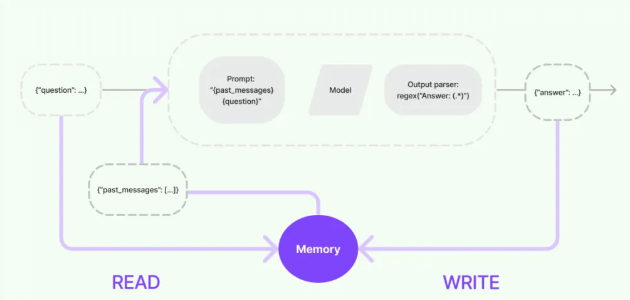

> Memory 在LangChain中的使用示意图

#### 1.1.6 总结

- 优势：
  - 组件化：LangChain受益于高度抽象与扩展性，抽象和封装了大模型领域常用的功能与模式，如统一模型接口、提示词模板和上下文状态存储等，使其在社区的持续收到关注。
  - 开箱即用：LangChain通过灵活的链式编排能力对上述原子组件进行结构化组装，以支持各式各样特定场景的高阶任务，如私有知识库问答、结合外部工具及自主决策行动的智能 Agent等。
- 局限：
  - 比较面向开发者，如前端应用、后端业务逻辑，及应用部署和运维等有额外的工作。


### 1.2 开源项目 - Dify

#### 1.2.1 模型与应用设置

Dify 内置了数十种主流模型提供方，包括 OpenAI，国内的通义千问、文心一言、讯飞星火等。用户可以在界面内配置AccessKey、模型参数等即可接入使用。

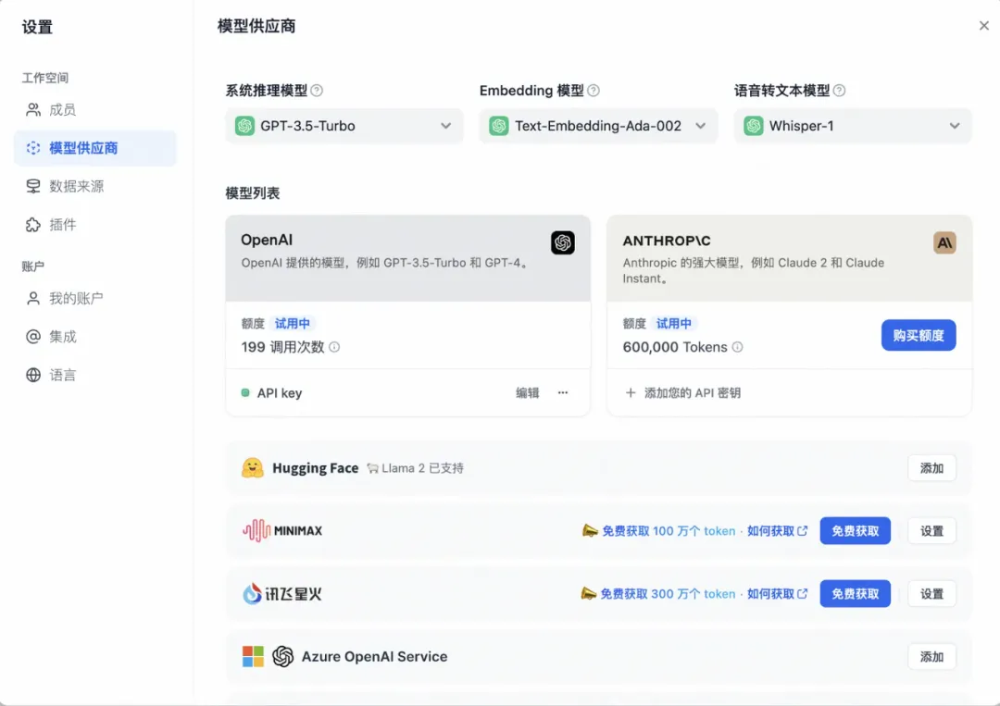

> Dify的模型列表

从大模型本身能力上来看，Dify 参考 LangChain 的框架构建，Dify 的领域抽象能力和组件生态方面其实是站在巨人的肩膀上，因此 Dify 可以在产品易用性上做出差异。下面是这个开源库的一些核心实现代码：
- Core：包括Agent和流程编排的核心实现，其中包含模型、Prompt、工作流等部分。
  - 核心理念：模型提供方和模型是1对N的关系。简单理解就比如OpenAI是模型提供方，提供了LLM模型（推理类模型）、text_embedding（embedding类模型）、tts类模型等。
  - LLM接入：当前已经支持GPT3.5、GPT4、GPT4o模型等。内部模型本地部署接入也是类似方式：继承LargeLanguageModel类实现接入。

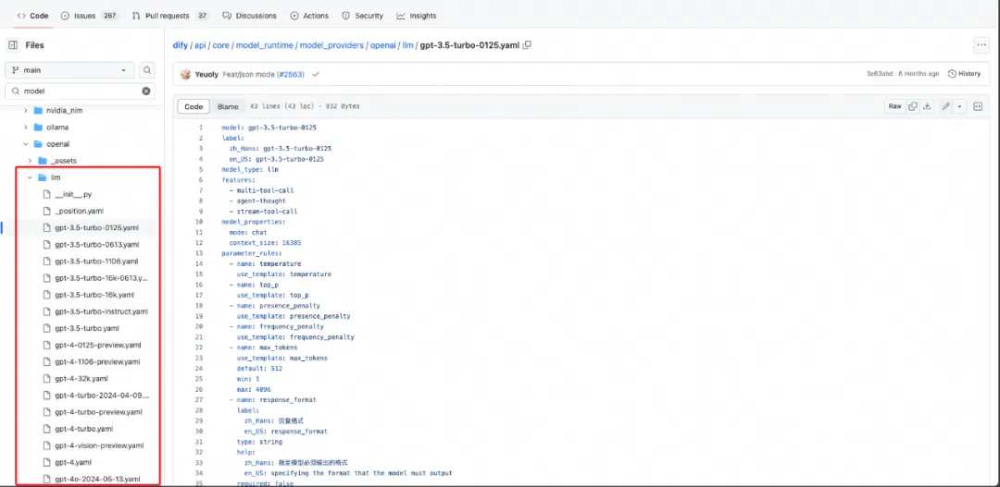

> Dify的模型接入实现

- DataSource：类似的思路，数据库提供方和向量数据库也是1对N关系，继承基类可以进行扩展。
  - 向量数据库接入：Dify 集成了一些常见的向量数据库，如用户想基于三方的开源库实现一个向量数据库，基于他们的 BaseModel 覆写即可。

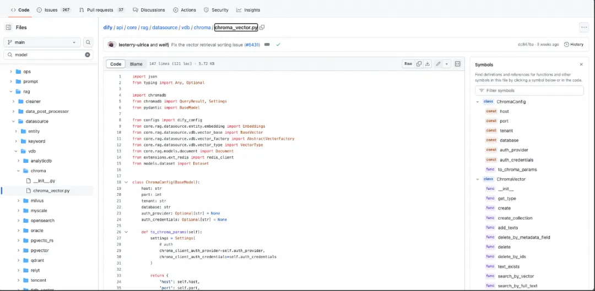

> Dify的向量数据库接入实现


#### 1.2.2 流程编排

类似于 Coze 等其他Agent编排平台，Dify 也具有非常简单易用的可视化编排界面。可以所见即所得地编排和调试提示词。

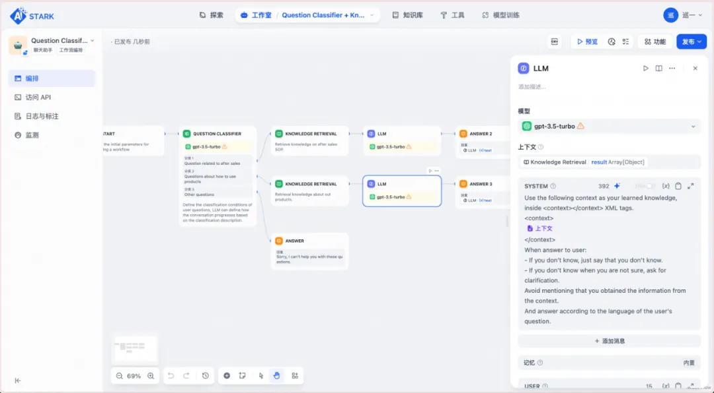

> Dify的流程编排效果

除了一些固定前缀的提示词外，Dify支持用户输入变量、关联用户导入的私有数据集，将其作为上下文嵌入到提示词中，进而实现“私有知识问答”等高阶需求。

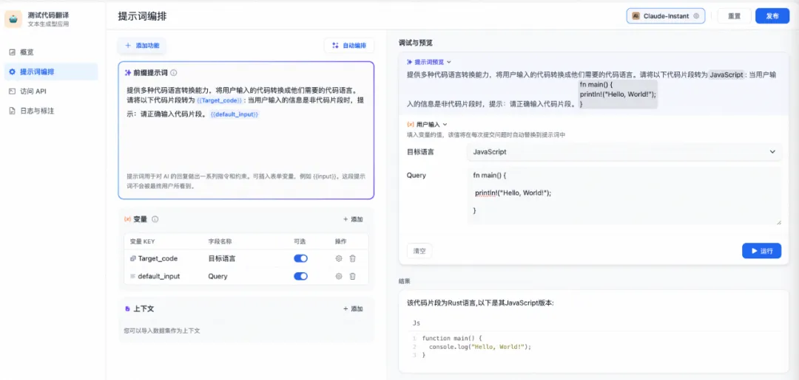

> Dify的用户输入支持变量输入和私有数据集导入


#### 1.2.3 应用发布与集成

Dify的定位是针对大模型场景的低代码应用开发平台。官方文档解释：它是LLMOps（Large Language Model Operations） 的目标是确保高效、可扩展和安全地使用这些强大的 AI 模型来构建和运行实际应用程序。当然涉及到模型训练、部署、监控、更新、安全性和合规性等方面。

Dify支持常规的全栈应用生成，也支持前后端的独立输出。比如Dify应用可以生成并且透出独立的后端API。

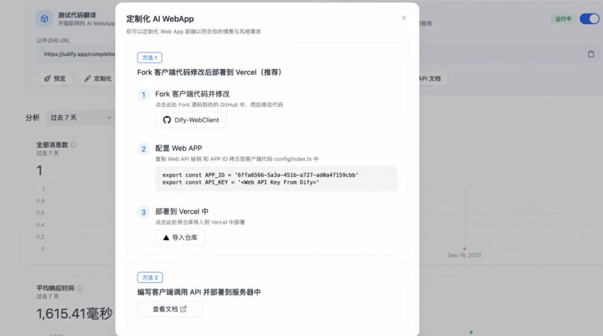

> Dify创建的应用透出

除此之外，Dify还支持发布的应用可以直接嵌入到自己的业务前端网站中，通过iframe标签或者script标签可以直接引入到前端项目中，对于非专业开发者或者低代码开发者非常友好。

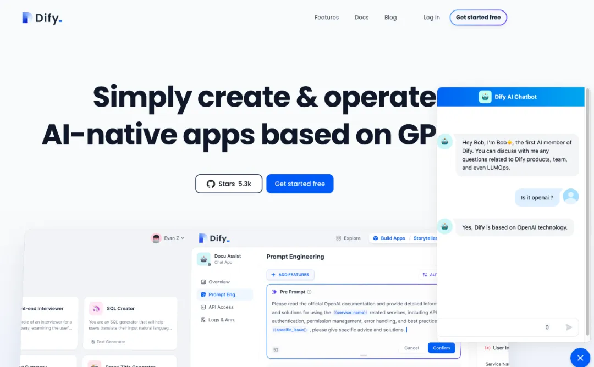

通过标签直接引入的前端组件效果

#### 1.2.4 运维

Dify的定位是一站式开发平台，应用部署发布后也提供了日志、标注和数据统计的能力。除了能够采集和上报每一次用户与 AI 之间的交互行为，Dify 还支持展示用户或运营人员对 AI 响应内容的评价（赞、踩），以及运营人员添加的改进标注（期望的回答样本）。

除日志外，Dify还集成了很多聚合类的数据统计指标，用来观测用户对产品的满意度、粘性等。

#### 1.2.5 总结

总体而言，Dify是一个完成度非常高的一站式大模型应用开发平台。Dify由于其产品化最好，因此社区上也是同类型的开源项目中最活跃的项目。

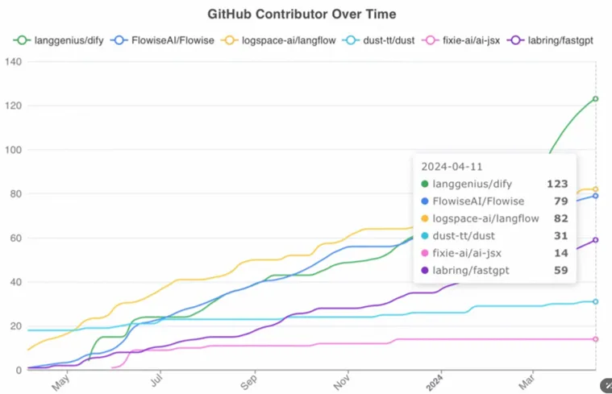

> Dify的社区活跃度情况


- 优势：
  - 可视化：用户可以在全可视化的Web界面中创建、配置、发布和管理应用。降低开发维护成本；
  - 声明式：其中的AI应用，包括Prompt、上下文、插件等都可以通过YAML文件描述；
  - 一站式：相对与LangChain这种模式，用户的开发运维体验更好，也就是“Ops”的核心体现；
  - 集成与扩展：预留了足够的扩展性，不过其他平台也都很好的预留了扩展性。

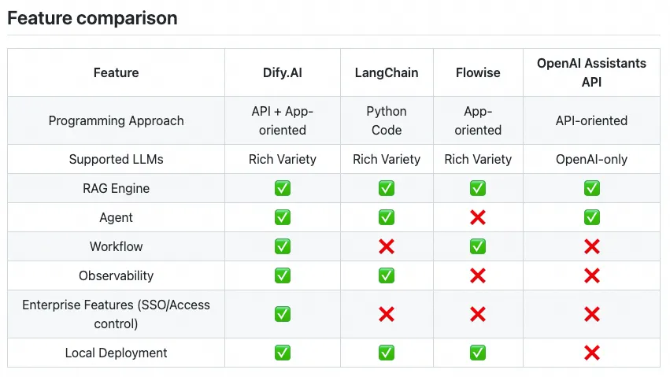

> 网站上和其他产品的对比表格

由于Dify的产品度非常高，也为很多的类似流程编排的系统提供了实现（造轮子）的思路。

### 1.3 开源项目 - Flowise

#### 1.3.1 概述

Flowise也是基于LangChain的第三方可视化编排工具。产品使用上的体验和Dify相似，但是从能力上相对Dify差一点，比如不可观测、没有一些企业级应用能力如权限控制等。

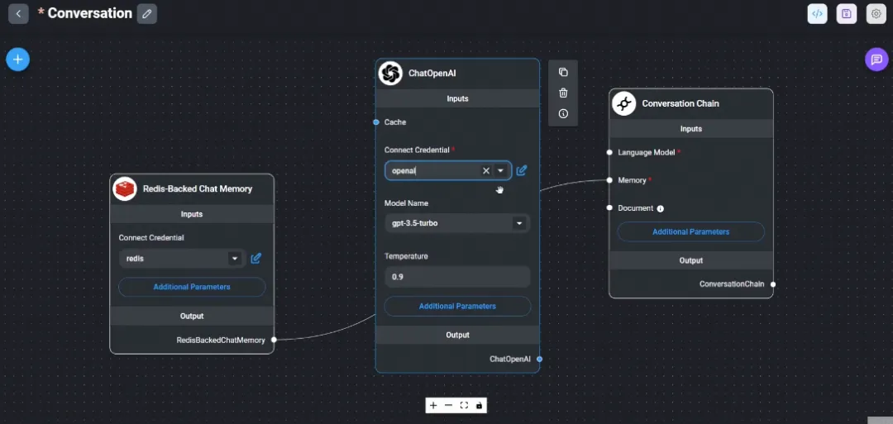

> Flowise效果图

#### 1.3.2 总结

- 优势：相对于Dify和LangChain，看起来造轮子更加简单：本地通过NodeJS的v18版本的指令运行，服务部分可以通过官方提供的镜像通过docker-compose直接部署。

```
#### install & start project ####
npm install -g flowise

npx flowise start

npx flowise start --FLOWISE_USERNAME=user --FLOWISE_PASSWORD=1234

#### build image locally ####
docker build --no-cache -t flowise .

docker run -d --name flowise -p 3000:3000 flowise
```
- 缺点：相对于LangChain，没那么多的可扩展能力，相对于Dify，产品的整体完成度没那么高。

### 1.4 Coze

- 相关地址
- 国内：www.coze.cn
- 海外：www.coze.com

#### 1.4.1 总结

功能上基本对齐，可能是对用户的使用成本更低，比如提供了开放的API接口如获取热榜等、国内发布平台也接入了一些开放平台。

### 1.5 衍生产品

在开源项目的基础上，很多公司已经有不少类似的一站式模型应用开发产品。基于开源功能，各公司丰富了一些垂直的应用功能，包括但不限于：
- 权限：账号权限接入、数据脱敏等；
- 模型接入：大语言模型（各公司自研内部模型、微调模型）、Embedding模型等；
- 开发调用：后端调用的二方包等；
- 向量数据库：开源常见的向量数据库Chroma，接入搜索服务作为向量匹配；
- 业务定制流程：结合业务场景做定制化的流程等。

## 2. 实践：表单开发助手

### 2.1 应用创建

我们通过Dify试用AI流程编排的功能。首先进入应用创建部分，创建适合自己场景的应用。当前看起来内部还新增了工作流这种业务定制化场景。

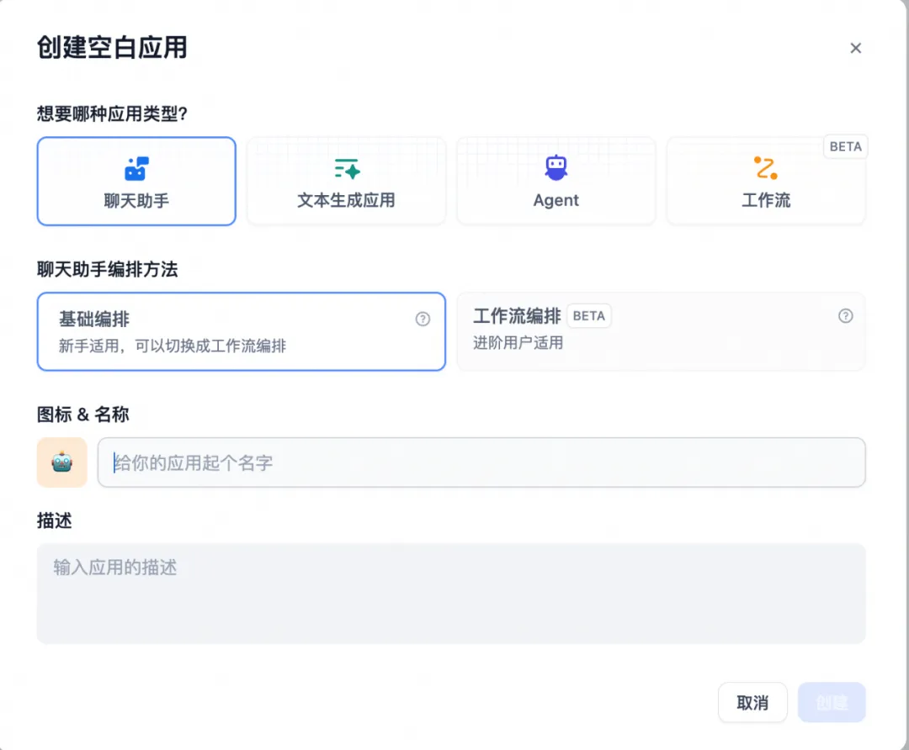

> Dify创建新的应用

### 2.2 数据集准备

由于业务开发中，我们需要参考一些业务组件的文档，我们可以事先导入一些组件的开发文档。比如我们这里可以导入Fromily v2.x 的Linkage部分的文档作为我们的知识库，当然也可以导入所有的文档。

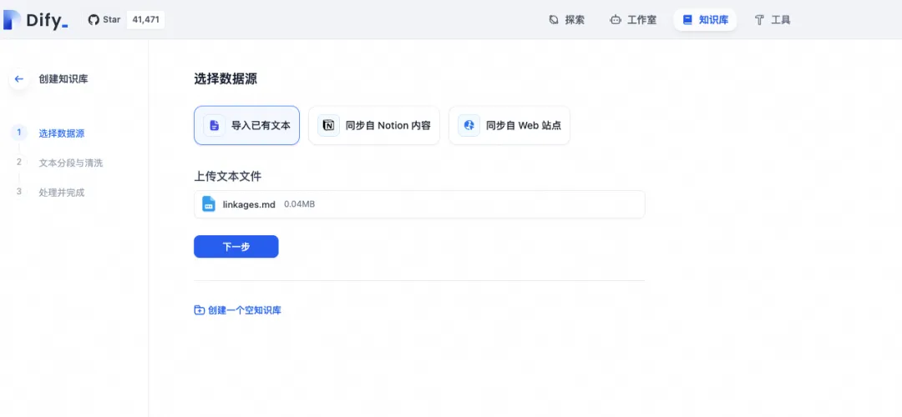

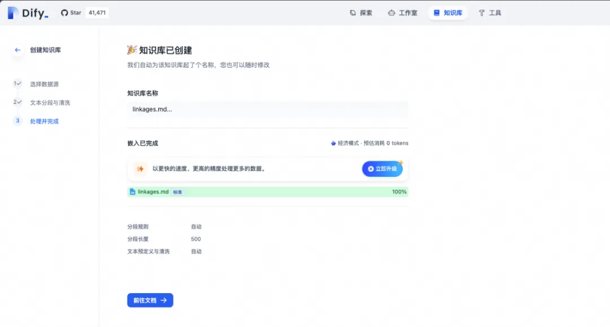

> Dify平台上创建文本知识库

完成文本的分割和向量化后，可以在平台上直接进行召回测试。如下图所示，可以直接按照向量的相似度进行排序。因为实际的使用场景下，开发者可能要不断地实验来评估各种参数，比如Embedding模型、段落Chunk的大小等等，才能找到最适合的配置组合。

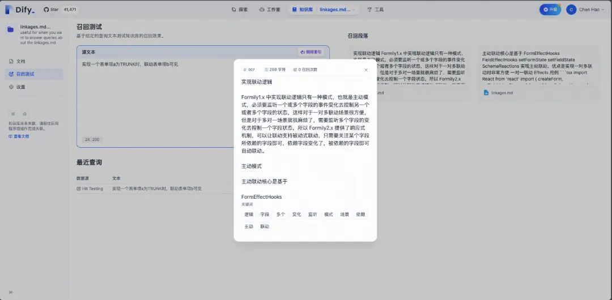

> 召回测试效果实验图

### 2.3 提示词编排

完成相关的数据集准备后，我们进入最核心的提示词编排环节，打开“编排”页面，可以让Dify根据我们场景的描述，自动先生成一段初始版提示词：

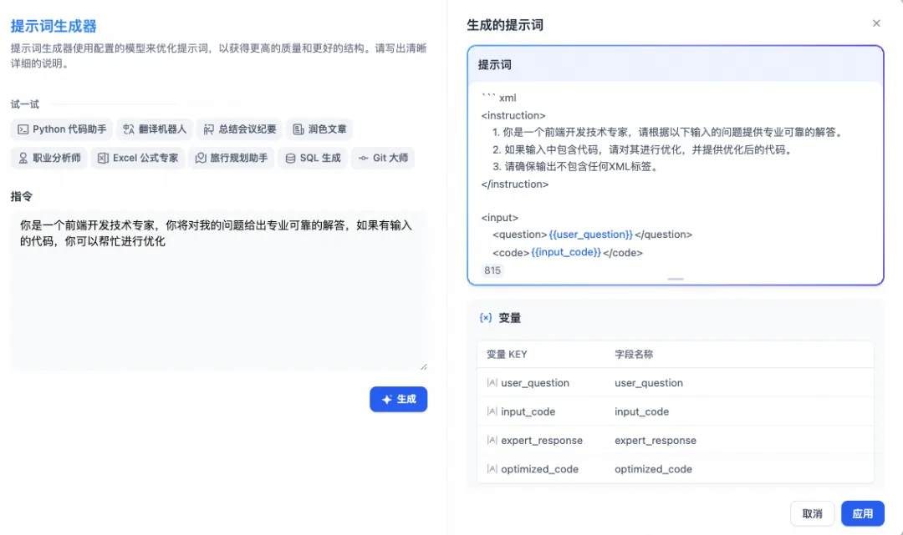

> 提示词编排初始化

我们可以看到，通过提示词生成器生成的提示词质量还是比较可靠的。除此之外，Dify还提供了下一步问题的建议等有用的增强功能。

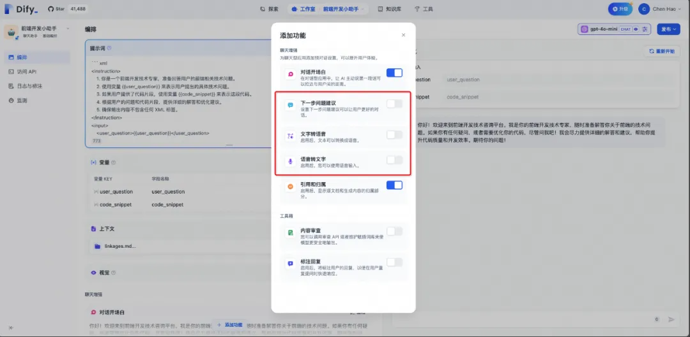

> 其他功能可以按需取用

### 2.4 预览与发布

完成上面的这些配置后，我们可以在右侧对当前的编排节点进行预览测试。为了整体体验流程快速简单，我们没有通过工作流来构建Multi-Agent，通过单个模型测试链路功能与效果。

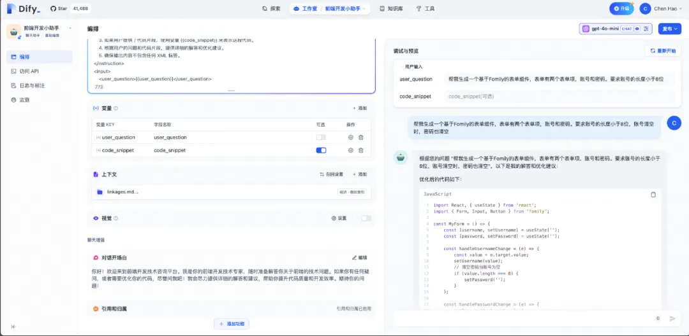

> 对节点进行预览与测试

完成相关的预览与测试后，我们可以将这个基础编排发布为前端组件或者API。
- 前端组件
  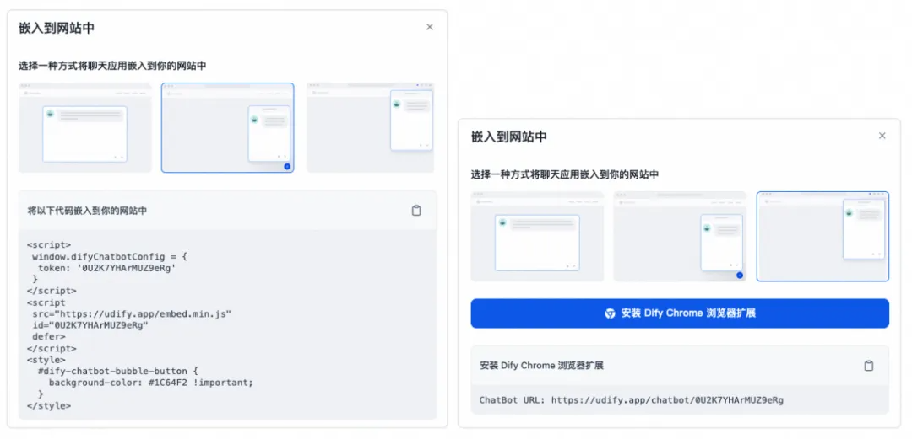

  > 前端接入方式

可以在前端页面中以script方式引入到页面中，甚至可以以Chrome浏览器扩展的形式引用。只能说Dify的产品化做的确实非常好。

那我们试试在业务的仓库中能否可以顺利的接入。比如我们创建一个前端应用仓库，按照这种方式接入到前端页面中。

```
  useEffect(() => {
    window.difyChatbotConfig = {
      token: 'Your Token'
    };
    const script = document.createElement('script');
    script.src = 'https://udify.app/embed.min.js';
    script.id = 'Your Token';
    script.defer = true;
    document.body.appendChild(script);
    return () => {
      document.getElementById('Your Token')?.remove();
    };
  }, []);
```

可以看到，很简单的一段代码就可以在前端页面中注入对话组件，已经内部集成了组件、模型和服务，非常方便。

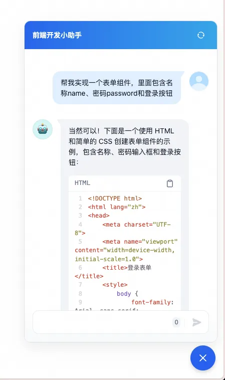

> 前端页面接入


- 后端接口
  - 后端接口直接以API形式透出给用户，同时预留了API的鉴权等基础功能。详细可以参考官方文档（非常详细）。

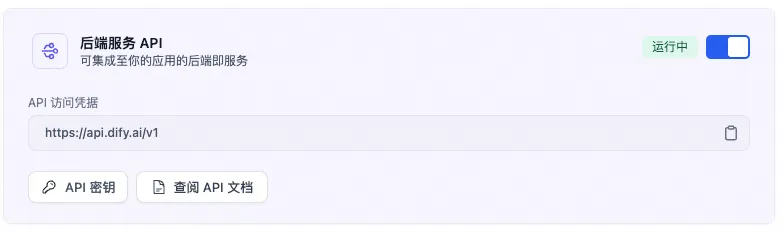

### 2.5 运维与日志

回到系统运维的界面，可以看到用户对话的日志与记录。

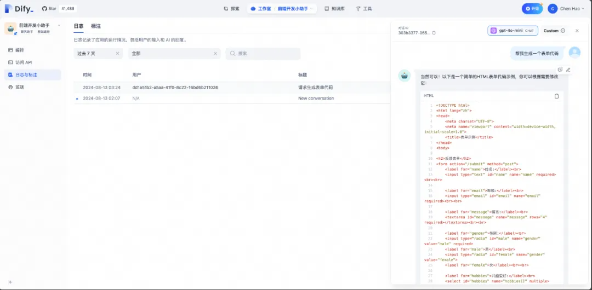

> 用户对话的记录以组件形式直接显示

在监测页面可以看到这个应用的消息数量、活跃用户数和Token输出速度等。由此可以看到，Dify确实是一个产品化非常高的平台。

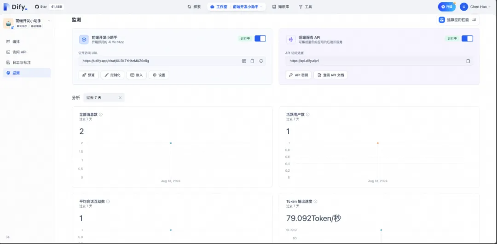

> 监控消息、对话、Token输出

## 3. 结语

随着AI技术的持续演进，大模型应用开发平台正逐步成为推动AI应用创新的关键基础设施。LangChain、Dify等项目的出现，不仅极大地促进了AI技术的普及与应用，更为开发者探索AI赋能的无限可能开辟了新的道路。未来，随着这些平台的不断优化与更多创新项目的涌现，大模型应用的开发将变得更加高效、灵活，进一步加速人工智能技术在各行各业的深度融合与广泛应用。


- 参考资料
  - https://github.com/langchain-ai/langchain
  - https://github.com/langgenius/dify
  - https://github.com/FlowiseAI/Flowise
