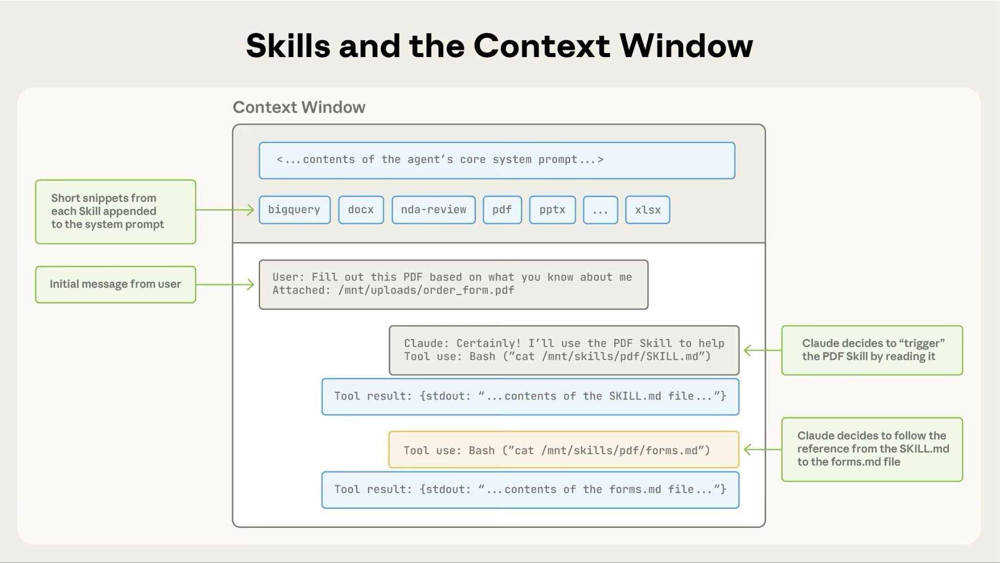

# 1. 什么是 Agent Skills

Agent Skills 是扩展 Claude 功能的模块化能力。每个 Skill 打包了指令、元数据和可选资源（脚本、模板），Claude 会在相关时自动使用它们。

---

## 2. 为什么使用 Skills

Skills 是可重用的、基于文件系统的 **资源**，为 Claude 提供特定领域的专业知识：**工作流程**、**上下文** 和 **最佳实践**，将通用型智能体转变为专家。与提示词 Prompt（用于一次性任务的对话级指令）不同，Skills 按需加载，无需在多次对话中重复提供相同的指导。

**核心优势**：
- **专业化知识**：为特定领域任务定制能力
- **减少重复**：创建一次，自动使用
- **组合能力**：组合 Skills 构建复杂工作流程

> 如需深入了解 Agent Skills 的架构和实际应用，请阅读我们的工程博客：[为智能体装备真实世界的 Agent Skills](https://www.anthropic.com/engineering/equipping-agents-for-the-real-world-with-agent-skills)。

## 3. 如何使用 Skills

Anthropic 为常见文档任务（PowerPoint、Excel、Word、PDF）提供了内置的 Agent Skills，您也可以创建自定义的 Skills。两者的工作方式相同。Claude 会在与您的请求相关时自动使用它们:
- **内置的 Agent Skills** 对 claude.ai 的所有用户以及在 Claude API 可用。请参阅[可用 Skills](https://platform.claude.com/docs/en/agents-and-tools/agent-skills/overview#available-skills) 部分了解完整列表。
- **自定义的 Skills** 让您可以打包领域专业经验以及组织领域知识。它们可在 Claude 的各个产品中使用：在 Claude Code 中创建、通过 API 上传，或在 claude.ai 设置中添加。

> **快速开始：**
- 内置的 Agent Skills：请参阅[快速入门教程](https://platform.claude.com/docs/en/agents-and-tools/agent-skills/quickstart)，在 API 中使用 PowerPoint、Excel、Word 和 PDF skills
- 自定义的 Skills：请参阅 [Agent Skills Cookbook](https://platform.claude.com/cookbook/skills-notebooks-01-skills-introduction)，了解如何创建自己的 Skills

## 4. Skills 的工作原理

Skills 利用 Claude 的虚拟机环境来提供仅靠提示词无法实现的能力。Claude 在具有文件系统访问权限的虚拟机中运行，允许 Skills 以目录形式存在，包含指令、可执行代码和参考资源，其组织方式就像您为新团队成员创建的 **入职指南**。

这种基于文件系统的架构实现了 **渐进式披露**：Claude 根据需要分阶段加载信息，而不是预先消耗上下文。

### 4.1 三种 Skill 内容类型，三层加载结构

Skills 包含三种类型的内容，分别在不同时机进行加载。

### 4.1.1 元数据（总是加载）

**内容类型：指令**。Skill 的 YAML 前置信息提供发现信息：

```yaml
---
name: pdf-processing
description: Extract text and tables from PDF files, fill forms, merge documents. Use when working with PDF files or when the user mentions PDFs, forms, or document extraction.
---
```

Claude 在启动时加载此元数据并将其包含在系统提示词(System Prompt)中。这种轻量级方法意味着您可以安装许多 Skills 而不会产生过多的上下文开销；Claude 只知道每个 Skill 的存在及其使用时机。

### 4.1.2 指令（触发时加载）

**内容类型：指令**。 `SKILL.md` 的主体包含程序性知识：工作流、最佳实践以及指导说明：

````markdown
# PDF Processing

## Quick start

Use pdfplumber to extract text from PDFs:

```python
import pdfplumber

with pdfplumber.open("document.pdf") as pdf:
    text = pdf.pages[0].extract_text()
```

For advanced form filling, see [FORMS.md](FORMS.md).
````

当您的请求与某个 Skill 的描述匹配时，Claude 通过 bash 从文件系统读取 `SKILL.md`。只有在此时，这些内容才会进入上下文窗口。

### 4.1.3 资源和代码（按需加载）

**内容类型：指令、代码和资源**。Skills 可以捆绑额外的资料：

```
pdf-skill/
├── SKILL.md (main instructions)
├── FORMS.md (form-filling guide)
├── REFERENCE.md (detailed API reference)
└── scripts/
    └── fill_form.py (utility script)
```

**指令**：额外的 markdown 文件（FORMS.md、REFERENCE.md），包含专门的指导说明和工作流

**代码**：可执行脚本（fill_form.py、validate.py），Claude 通过 bash 运行；脚本提供确定性操作而不消耗上下文

**资源**：参考材料，如数据库模式、API 文档、模板或示例

Claude 仅在被引用时才访问这些文件。文件系统模型意味着每种内容类型都有不同的优势：指令用于灵活指导，代码用于可靠性，资源用于事实查询。

| 级别 | 加载时机 | Token 开销 | 内容 |
|-------|------------|------------|---------|
| **级别 1：元数据** | 始终（启动时） | 每个 Skill 约 100 tokens | YAML 前置信息中的 `name` 和 `description` |
| **级别 2：指令** | Skill 被触发时 | 5k tokens 以内 | SKILL.md 主体，包含指令和指导说明 |
| **级别 3+：资源** | 按需 | 实际上无限制 | 通过 bash 执行的捆绑文件，无需将内容加载到上下文中 |

渐进式披露确保在任何给定时间只有相关内容占用上下文窗口。

### 4.2 Skills 架构

Skills 在代码执行环境中运行，Claude 在该环境中拥有文件系统访问、bash 命令和代码执行能力。可以这样理解：Skills 作为目录存在于虚拟机上，Claude 使用与您在计算机上浏览文件相同的 bash 命令与它们交互。


**Claude 如何访问 Skill 内容：**

当 Skill 被触发时，Claude 使用 bash 从文件系统读取 `SKILL.md`，将其指令带入上下文窗口。如果这些指令引用了其他文件（如 FORMS.md 或数据库 Schema），Claude 也会使用额外的 bash 命令读取这些文件。当指令提到可执行脚本时，Claude 通过 bash 运行它们并仅接收输出（脚本代码本身永远不会进入上下文）。

**这种架构实现了什么：**
- **按需文件访问**：Claude 只读取每个特定任务所需的文件。一个 Skill 可以包含数十个参考文件，但如果您的任务只需要销售 Schema，Claude 只加载那一个文件。其余文件保留在文件系统上，消耗零 tokens。
- **高效脚本执行**：当 Claude 运行 `validate_form.py` 时，脚本的代码永远不会加载到上下文窗口中。只有脚本的输出（如"验证通过"或特定错误消息）加载到上下文窗口中消耗 tokens。这使得脚本比让 Claude 即时生成等效代码要高效得多。
- **捆绑内容无实际限制**：因为文件在被访问之前不消耗上下文，Skills 可以包含全面的 API 文档、大型数据集、大量示例或您需要的任何参考资料。未使用的捆绑内容不会产生上下文开销。

这种基于文件系统的模型使渐进式披露得以实现。Claude 浏览您的 Skill 就像您查阅入职指南的特定章节一样，精确访问每个任务所需的内容。

### 4.2.1 示例：加载 PDF 处理 skill

以下是 Claude 加载和使用 PDF 处理 skill 的过程：
- 1. **启动**：系统提示词包含：`PDF Processing - Extract text and tables from PDF files, fill forms, merge documents`
- 2. **用户请求**："提取这个 PDF 中的文本并总结"
- 3. **Claude 调用**：`bash: read pdf-skill/SKILL.md` → 指令加载到上下文中
- 4. **Claude 判断**：不需要表单填写，因此不读取 `FORMS.md`
- 5. **Claude 执行**：使用 `SKILL.md` 中的指令完成任务



该图展示了：
- 1. 默认状态，系统提示词和 Skill 元数据已预加载
- 2. Claude 通过 bash 读取 `SKILL.md` 触发 skill
- 3. Claude 根据需要可选地读取额外的捆绑文件，如 `FORMS.md`
- 4. Claude 继续执行任务

这种动态加载确保只有相关的 skill 内容占用上下文窗口。

## 5. Skills 的适用范围

Skills 可在 Claude 的各个 Agent 产品中使用。

### 5.1 Claude API

Claude API 支持内置 Agent Skills 和自定义 Skills。两者的工作方式完全相同：在 `container` 参数中指定相关的 `skill_id`，同时配合代码执行工具使用。

**前提条件**：通过 API 使用 Skills 需要三个 beta 头：
- `code-execution-2025-08-25` - Skills 在代码执行容器中运行
- `skills-2025-10-02` - 启用 Skills 功能
- `files-api-2025-04-14` - 用于向容器上传/下载文件

通过引用 `skill_id`（例如 `pptx`、`xlsx`）使用内置 Agent Skills，或通过 Skills API（`/v1/skills` 端点）创建和上传自己的 Skills。自定义 Skills 在整个组织范围内共享。

要了解更多信息，请参阅[通过 Claude API 使用 Skills](https://platform.claude.com/docs/en/build-with-claude/skills-guide)。

### 5.2 Claude Code

[Claude Code](https://code.claude.com/docs/en/overview) 仅支持自定义 Skills。

**自定义 Skills**：将 Skills 创建为包含 `SKILL.md` 文件的目录。Claude 会自动发现并使用它们。

Claude Code 中的自定义 Skills 基于文件系统，不需要 API 上传。

要了解更多信息，请参阅[在 Claude Code 中使用 Skills](https://code.claude.com/docs/en/skills)。

### 5.3 Claude Agent SDK

[Claude Agent SDK](https://platform.claude.com/docs/en/agent-sdk/overview) 通过基于文件系统的配置支持自定义 Skills。

**自定义 Skills**：在 `.claude/skills/` 中将 Skills 创建为包含 `SKILL.md` 文件的目录。通过在 `allowed_tools` 配置中包含 `"Skill"` 来启用 Skills。

SDK 运行时会自动发现 Skills。

要了解更多信息，请参阅 [Agent SDK 中的 Skills](https://platform.claude.com/docs/en/agent-sdk/skills)。

### 5.4 Claude.ai

[Claude.ai](https://claude.ai) 支持内置 Agent Skills 和自定义 Skills：
- **内置 Agent Skills**：当您创建文档时，这些 Skills 已在后台工作。Claude 无需任何设置即可使用它们。
- **自定义 Skills**：通过`设置 > 功能`以 zip 文件形式上传您自己的 Skills。在启用代码执行的 Pro、Max、Team 和 Enterprise 计划中可用。自定义 Skills 是每个用户独立的；它们不在组织范围内共享，管理员也无法集中管理。

要了解更多关于在 Claude.ai 中使用 Skills 的信息，请参阅 Claude 帮助中心的以下资源：
- [什么是 Skills？](https://support.claude.com/en/articles/12512176-what-are-skills)
- [在 Claude 中使用 Skills](https://support.claude.com/en/articles/12512180-using-skills-in-claude)
- [如何创建自定义 Skills](https://support.claude.com/en/articles/12512198-creating-custom-skills)
- [使用 Skills 教 Claude 您的工作方式](https://support.claude.com/en/articles/12580051-teach-claude-your-way-of-working-using-skills)

## 6. Skill 结构

每个 Skill 都需要一个带有 YAML 前置信息的 `SKILL.md` 文件：

```
---
name: your-skill-name
description: Brief description of what this Skill does and when to use it
---

# Your Skill Name

## Instructions
[Clear, step-by-step guidance for Claude to follow]

## Examples
[Concrete examples of using this Skill]
```

**必填字段**：`name` 和 `description`

**字段要求**：

- `name`：
  - 最多 64 个字符
  - 只能包含小写字母、数字和连字符
  - 不能包含 XML 标签
  - 不能包含保留词："anthropic"、"claude"
- `description`：
  - 不能为空
  - 最多 1024 个字符
  - 不能包含 XML 标签

`description` 应包含 Skill 的功能以及 Claude 应在何时使用它。有关完整的编写指南，请参阅[最佳实践指南](https://platform.claude.com/docs/en/agents-and-tools/agent-skills/best-practices)。

## 7. 可用的 Skills

### 8.1 内置的 Agent Skills

以下内置的 Agent Skills 可立即使用：
- **PowerPoint (pptx)**：创建演示文稿、编辑幻灯片、分析演示内容
- **Excel (xlsx)**：创建电子表格、分析数据、生成带图表的报告
- **Word (docx)**：创建文档、编辑内容、格式化文本
- **PDF (pdf)**：生成格式化的 PDF 文档和报告

这些 Skills 可在 Claude API 和 claude.ai 上使用。请参阅[快速入门教程](https://platform.claude.com/docs/en/agents-and-tools/agent-skills/quickstart)开始在 API 中使用它们。

### 8.2 自定义 Skills 示例

有关自定义 Skills 的完整示例，请参阅 [Skills cookbook](https://platform.claude.com/cookbook/skills-notebooks-01-skills-introduction)。
