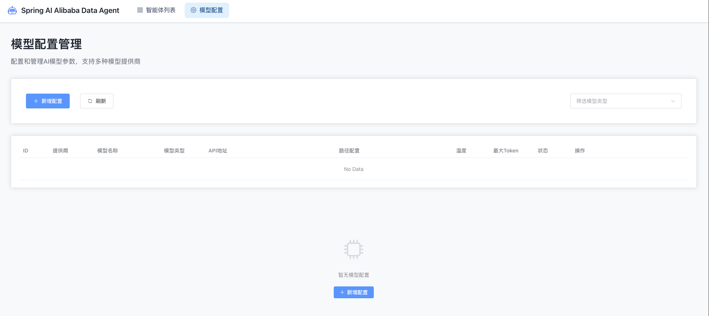
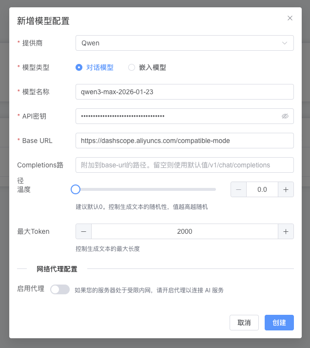
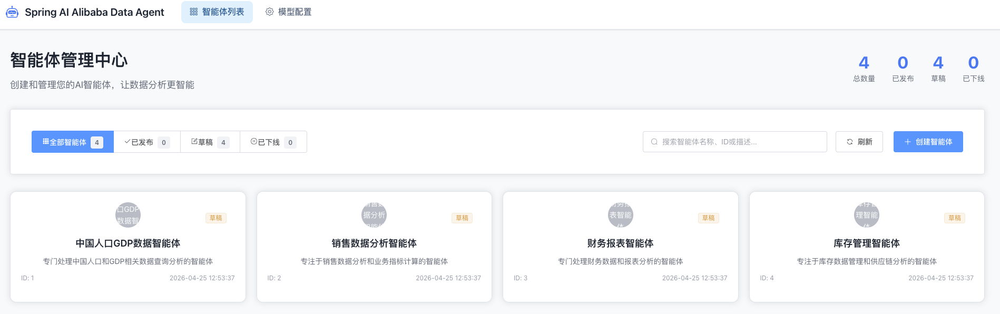

## 1. 项目简介

**DataAgent** 是一个基于 **Spring AI Alibaba Graph** 打造的企业级智能数据分析 Agent。它超越了传统的 Text-to-SQL 工具，进化为一个能够执行 **Python 深度分析**、生成 **多维度图表报告** 的 AI 智能数据分析师。

系统采用高度可扩展的架构设计，**全面兼容 OpenAI 接口规范** 的对话模型与 Embedding 模型，并支持 **灵活挂载任意向量数据库**。无论是私有化部署还是接入主流大模型服务（如 Qwen, Deepseek），都能轻松适配，为企业提供灵活、可控的数据洞察服务。同时，本项目原生支持 **MCP (Model Context Protocol)**，可作为 MCP 服务器无缝集成到 Claude Desktop 等支持 MCP 的生态工具中。

## 1.1 核心特性

| 特性 | 说明 |
| :--- | :--- |
| **智能数据分析** | 基于 StateGraph 的 Text-to-SQL 转换，支持复杂的多表查询和多轮对话意图理解。 |
| **Python 深度分析** | 内置 Docker/Local Python 执行器，自动生成并执行 Python 代码进行统计分析与机器学习预测。 |
| **智能报告生成** | 分析结果自动汇总为包含 ECharts 图表的 HTML/Markdown 报告，所见即所得。 |
| **人工反馈机制** | 独创的 Human-in-the-loop 机制，支持用户在计划生成阶段进行干预和调整。 |
| **RAG 检索增强** | 集成向量数据库，支持对业务元数据、术语库的语义检索，提升 SQL生成准确率。 |
| **多模型调度** | 内置模型注册表，支持运行时动态切换不同的 LLM 和 Embedding 模型。 |
| **MCP 服务器** | 遵循 MCP 协议，支持作为 Tool Server 对外提供 NL2SQL 和 智能体管理能力。 |
| **API Key 管理** | 完善的 API Key 生命周期管理，支持细粒度的权限控制。 |

## 1.2 项目结构


# 2. 环节准备

本文档将指导您完成 DataAgent 的安装、配置和首次运行。

### 2.1 环境要求

- **JDK**: 17 或更高版本
- **MySQL**: 5.7 或更高版本
- **Node.js**: 16 或更高版本
- **Docker**: (可选) 用于Python代码执行
- **向量数据库**: (可选) 默认使用内存向量库

### 2.2 业务数据库准备

可以在项目仓库获取测试表和数据。文件在：`data-agent-management/src/main/resources/sql`，里面有4个文件：
- `schema.sql` - 功能相关的表结构
- `data.sql` - 功能相关的数据
- `product_schema.sql` - 模拟数据表结构
- `product_data.sql` - 模拟数据

将表和数据导入到你的 MySQL 数据库中：
```bash
# 示例：使用 MySQL 命令行导入
mysql -u root -p data_agent < data-agent-management/src/main/resources/sql/schema.sql
mysql -u root -p data_agent < data-agent-management/src/main/resources/sql/data.sql
mysql -u root -p data_agent < data-agent-management/src/main/resources/sql/product_schema.sql
mysql -u root -p data_agent < data-agent-management/src/main/resources/sql/product_data.sql
```
> 首先使用 `create database data_agent` 创建 `data_agent` 数据库

导入完成之后你可以看到如下表：
```
mysql> show tables;
+-------------------------+
| Tables_in_data_agent    |
+-------------------------+
| agent                   |
| agent_datasource        |
| agent_datasource_tables |
| agent_knowledge         |
| agent_preset_question   |
| business_knowledge      |
| categories              |
| chat_message            |
| chat_session            |
| datasource              |
| logical_relation        |
| model_config            |
| order_items             |
| orders                  |
| product_categories      |
| products                |
| semantic_model          |
| user_prompt_config      |
| users                   |
+-------------------------+
19 rows in set (0.00 sec)
```

## 3. 配置

### 2.3.1 配置 management 数据库

在 `data-agent-management/src/main/resources/application.yml` 中配置你的 MySQL 数据库连接信息。

> 初始化行为说明：默认开启自动创建表并插入示例数据（`spring.sql.init.mode: always`）。生产环境建议关闭，避免示例数据回填覆盖你的业务数据。

```
spring:
  datasource:
    url: jdbc:mysql://127.0.0.1:3306/data_agent?useUnicode=true&characterEncoding=utf-8&zeroDateTimeBehavior=convertToNull&transformedBitIsBoolean=true&allowMultiQueries=true&allowPublicKeyRetrieval=true&useSSL=false&serverTimezone=Asia/Shanghai
    username: root
    password: root
    driver-class-name: com.mysql.cj.jdbc.Driver
    type: com.alibaba.druid.pool.DruidDataSource
```

### 2.3.2 数据初始化配置

默认开启自动初始化 (`spring.sql.init.mode: always`)：

| 配置项 | 说明 | 默认值 | 备注 |
|--------|------|--------|------|
| `mode` | 初始化模式 (always/never) | always | "always"会每次启动执行schema.sql和data.sql，建议生产环境设为"never" |
| `schema-locations` | 表结构脚本路径 | classpath:sql/schema.sql | |
| `data-locations` | 数据脚本路径 | classpath:sql/data.sql | |

建议生产环境设为 `never`:
```
spring:
  sql:
    init:
      mode: ${DATA_AGENT_DATASOURCE_SQL_INIT:never}
      schema-locations: classpath:sql/schema.sql
      data-locations: classpath:sql/data.sql
      continue-on-error: true
      separator: ;
      encoding: utf-8
```

### 2.3.3 向量库配置

项目默认使用内存向量库 (SimpleVectorStore)，同时系统提供了对 es 的混合检索支持。若需使用持久化向量库（如 PGVector, Milvus 等），请按照[向量库配置](https://github.com/spring-ai-alibaba/DataAgent/blob/main/docs/DEVELOPER_GUIDE.md#3-%E5%90%91%E9%87%8F%E5%BA%93%E9%85%8D%E7%BD%AE-vector-store)步骤操作。

## 4. 启动服务

### 4.1 启动后端

在 `data-agent-management` 目录下，运行 `DataAgentApplication.java` 类。

```bash
cd data-agent-management
./mvnw spring-boot:run
```

> 或者在 IDE 中直接运行 `DataAgentApplication.java`。

### 4.2 启动前端

> 使用 npm install 命令安装 npm

进入 `data-agent-frontend` 目录运行如下命令：
```
npm install && npm run dev
```

## 5. 系统体验

### 5.1 配置模型

启动成功后，访问地址 http://localhost:3000，如果没有配置模型则会跳转到模型配置页面：



点击模型配置，新增模型填写自己的apikey即可:



### 5.1 数据智能体的创建与配置

模型配置之后可以看到当前项目的智能体列表（默认有四个占位智能体，并没有对接数据，可以删除掉然后创建新的智能体）



点击右上角"创建智能体" ，这里只需要输入智能体名称，其他配置都选默认。


创建成功后，可以看到智能体配置页面。


#### 配置数据源

进入数据源配置页面，配置业务数据库（我们在环境初始化时第一步提供的业务数据库）。


添加完成后，可以在列表页面验证数据源连接是否正常。


对于添加的新数据源，需要选择使用哪些数据表进行数据分析。


之后点击右上角的"初始化数据源"按钮。


#### 配置预设问题

预设问题管理，可以为智能体设置预设问题


#### 配置语义模型

语义模型管理，可以为智能体设置语义模型。
语义模型库定义业务术语到数据库物理结构的精确转换规则，存储的是字段名的映射关系。
例如`customerSatisfactionScore`对应数据库中的`csat_score`字段。


#### 配置业务知识

业务知识管理，可以为智能体设置业务知识。
业务知识定义了业务术语和业务规则，比如GMV= 商品交易总额,包含付款和未付款的订单金额。
业务知识可以设置为召回或者不召回，配置完成后需要点击右上角的"同步到向量库"按钮。


成功后可以点击"前往运行界面"使用智能体进行数据查询。 调试没问题后，可以发布智能体。

> 目前"访问API"在当前版本并没有实现完全，预留着二次开发用的

### 5.2 数据智能体的运行

运行界面


运行界面左侧是历史消息记录，右侧是当前会话记录、输入框以及请求参数配置。

输入框中输入问题，点击"发送"按钮，即可开始查询。


分析报告为HTML格式报告，点击"下载报告"按钮，即可下载最终报告。


#### 运行模式

除了默认的请求模式，智能体运行时还支持"人工反馈"，"仅NL2SQL"，"简洁报告"和"显示SQL运行结果"等模式。

**默认模式**

默认情况不开启人工反馈模式，智能体直接自动生成计划并执行，并对SQL执行结果进行解析，生成报告。

**人工反馈模式**

如果开启人工反馈模式，则智能体会在生成计划后，等待用户确认，然后根据用户选择的反馈结果，更改计划或者执行计划。


**仅NL2SQL模式**

"仅NL2SQL模式"会让智能体只生成SQL和运行获取结果，不会生成报告。


**显示SQL运行结果**

"显示SQL运行结果"会在生成SQL和运行获取结果后，将SQL运行结果展示给用户。


### 2.3.2 配置模型

> 如果涉及手动管理模型依赖（非默认 Starter），请参考 [开发者指南 - 扩展依赖配置](DEVELOPER_GUIDE.md#9-扩展依赖配置-dependency-extension)。

启动项目，点击模型配置，新增模型填写自己的apikey即可。


1. 标准提供商接入 如果您使用的是系统内置支持的 AI 提供商（如 OpenAI, Deepseek 等），通常只需要提供模型名称（Model Name）和 API Key。

2. 自定义及本地模型接入 (Ollama/自建网关) 本系统基于 Spring AI 架构，支持标准的 OpenAI 接口协议。如果您接入的是 Ollama 或其他自定义网关，请注意以下几点：

	- 协议兼容：请参考 Spring AI 官方文档中关于 OpenAI 兼容性的说明，确保您的网关响应格式符合标准。

	- 地址配置：针对自部署模型，请准确填写 base-url（基础地址）和 completions-path（请求路径）。系统会将两者拼接为完整的调用地址，例如：http://localhost:11434/v1/chat/completions

3. 故障排查 如发现配置后无法调用，建议优先使用 Postman 对接您的接口地址进行测试，确认网络连通性及参数格式无误。
