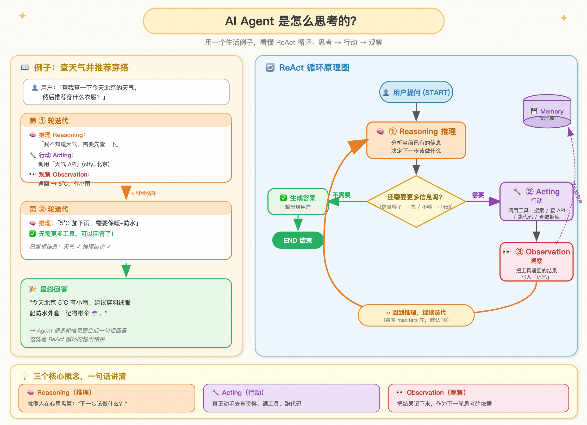
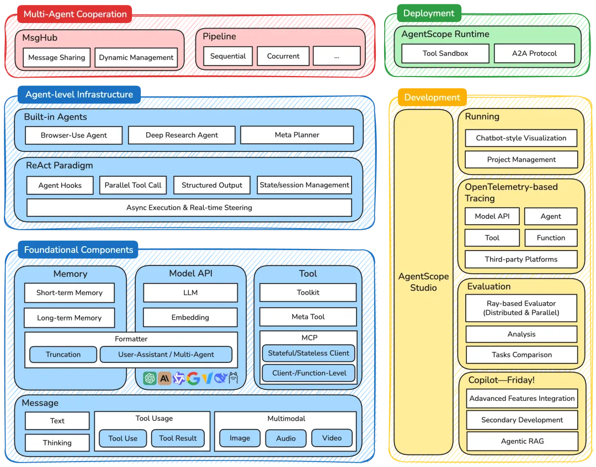

在上一篇[文章](https://smartsi.blog.csdn.net/article/details/160694030)中，我们完成了 AgentScope Java 的安装与环境配置。接下来，我们将创建第一个能思考、能行动的 ReAct 智能体。AgentScope Java 的核心是 ReActAgent——基于 ReAct（Reasoning + Acting） 范式构建的通用智能体。它不是"一问一答"的聊天机器人，而是一个能自主推理、调用工具、观察结果、迭代优化的自主系统。

## 1. ReAct 范式：先想后做，循环逼近

### 1.1 人类是怎么解决问题的？

当你问一个真人"北京现在几点？天气怎么样？"时，他的思考过程是这样的：
```
嗯，用户问了两个问题。时间？我需要看手机。天气？得查天气App。
→ 看手机：下午3点。
→ 查天气App：晴天25°C。
→ 信息够了，告诉用户。
```
### 1.2 ReAct 循环

ReActAgent 模拟的就是上述过程，它的核心工作循环如下：



简单来说，每次 ReAct 循环包含三个步骤：
- **Reasoning（推理）**：基于当前上下文分析问题，决定下一步行动
- **Acting（行动）**：如果需要调用工具，执行工具并将结果写入记忆
- **Observation（观察）**：将工具执行结果加入上下文，为下一轮推理提供信息

如果推理后不需要调用工具，Agent 将直接生成最终回答。

## 2. 快速构建一个智能体

AgentScope 提供了开箱即用的 ReAct 智能体 `ReActAgent` 供开发者使用。它同时支持以下功能：
- **基础功能**
    - 支持围绕 `reasoning` 和 `acting` 的钩子函数（hooks）
    - 支持结构化输出
- **实时介入（Realtime Steering）**
    - 支持用户中断
    - 支持自定义中断处理
- **工具**
    - 支持同步/异步工具函数
    - 支持流式工具响应
    - 支持并行工具调用
    - 支持 MCP 服务器
- **记忆**
    - 支持智能体自主管理长期记忆
    - 支持"静态"的长期记忆管理

通过下面几个步骤可以轻松搭建一个简单的智能体。

### 2.1 Maven

> AgentScope Java 要求 **JDK 17+**

推荐使用 All-in-one 方式，大多数情况下用 all-in-one 一个依赖就可以搞定：
```xml
<dependency>
    <groupId>io.agentscope</groupId>
    <artifactId>agentscope</artifactId>
    <version>1.0.12</version>
</dependency>
```
All-in-one 包默认带如下依赖，不用额外配置：
- DashScope SDK（通义千问系列模型）
- MCP SDK（模型上下文协议）
- Reactor Core、Jackson、SLF4J（基础框架）

> 详细请参考上一篇博文：[AgentScope Java 入门系列：如何安装 AgentScope](https://smartsi.blog.csdn.net/article/details/160694030)

### 2.2 获取 API Key

前往 [阿里云百炼控制台](https://bailian.console.aliyun.com/) 创建 API Key，建议通过环境变量注入：
```bash
export DASHSCOPE_API_KEY="sk-xxxxxxxxxxxxxxxx"
```

### 2.3 创建第一个 ReActAgent

```java
import io.agentscope.core.ReActAgent;
import io.agentscope.core.message.Msg;
import io.agentscope.core.message.MsgRole;
import io.agentscope.core.model.DashScopeChatModel;

public class HelloAgentScope {
    public static void main(String[] args) {
        // 创建 ReActAgent
        ReActAgent agent = ReActAgent.builder()
                .name("Assistant")
                .model(DashScopeChatModel.builder()
                        .apiKey(System.getenv("DASHSCOPE_API_KEY"))
                        .modelName("qwen3-max")
                        .build())
                .build();

        // 调用智能体
        Msg msg = Msg.builder()
                .role(MsgRole.USER)
                .textContent("你好，请介绍一下自己")
                .build();

        Msg response = agent.call(msg).block();
        System.out.println(response.getTextContent());
    }
}
```

> **关于 `.block()`**：AgentScope 基于 [Project Reactor](https://projectreactor.io/) 实现响应式编程，`agent.call()` 返回的是 `Mono<Msg>`（一种异步结果容器），调用 `.block()` 会阻塞当前线程直到获取结果。如果你熟悉 Reactor，也可以使用 `.subscribe()` 等非阻塞方式处理响应。

至此，一个最基础的 Agent 就构建完成了。不过，这个 Agent 还没有工具可用，只能做纯文本对话。接下来我们为它添加工具，让它真正"动手做事"。

### 2.4 为 ReActAgent 添加工具

为了让 ReActAgent 真正可以实现 Acting，需要为它添加对应的工具。这里以一个 Weather Assistant 为例：
```java
import io.agentscope.core.ReActAgent;
import io.agentscope.core.model.DashScopeChatModel;
import io.agentscope.core.message.Msg;
import io.agentscope.core.message.MsgRole;
import io.agentscope.core.message.content.TextBlock;
import io.agentscope.core.tool.Tool;
import io.agentscope.core.tool.ToolParam;
import io.agentscope.core.tool.Toolkit;

// 1. 定义工具类
public class WeatherTools {
    @Tool(description = "获取指定城市的天气信息")
    public String getWeather(
        @ToolParam(name = "city", description = "城市名称") String city) {
        // 实际应用中调用天气 API
        return String.format("%s：晴天，气温 25 ℃", city);
    }
}

// 2. 注册工具
Toolkit toolkit = new Toolkit();
toolkit.registerTool(new WeatherTools());

// 3. 构建带工具的 ReActAgent
ReActAgent agent = ReActAgent.builder()
    .name("WeatherAssistant")
    .sysPrompt("你是一个天气助手，可以查询城市天气信息。")
    .model(DashScopeChatModel.builder()
        .apiKey(System.getenv("DASHSCOPE_API_KEY"))
        .modelName("qwen3-max")
        .build())
    .toolkit(toolkit)
    .build();

// 4. 调用智能体
Msg response = agent.call(
    Msg.builder()
        .role(MsgRole.USER)
        .content(TextBlock.builder()
                .text("北京今天天气如何？")
                .build())
        .build()
).block();
System.out.println(response.getTextContent());
```

> **重要**：`@ToolParam` 必须显式指定 `name` 属性，因为 Java 运行时不保留方法参数名。如果省略 `name`，AgentScope 将无法正确识别参数。

执行流程：
```
用户问题：北京今天天气如何？
    ↓
[推理] 需要查天气，决定调用 getWeather("北京")
    ↓
[行动] 执行工具 → "北京：晴天，气温 25℃"
    ↓
[观察] 将工具结果加入上下文
    ↓
[推理] 已获取信息，生成回答
    ↓
回答：根据查询结果，北京今天晴天，气温 25℃
```

## 3. 架构概览

和 Python 版本类似，AgentScope Java 采用分层架构。Java 版本在架构设计和 API 风格上与 Python 版保持一致，核心概念（ReActAgent、Msg、Toolkit、Pipeline 等）完全对应，但底层实现基于 Java 生态（Reactor 响应式、GraalVM 原生镜像等），更适合企业级生产部署。



### 3.1 基础组件层（Foundational Components）

- Message：统一的消息抽象对象，通过一套数据结构支持文本、图像、音频、视频。
- Model API：支持 DashScope、OpenAI 等主流模型提供商。通过 Formatter 机制屏蔽不同模型提供商的格式差异。
- Tool：允许用户定义工具给 LLM 使用，支持同步/异步、流式/非流式等 API 风格。

### 3.2 智能体基础设施层（Agent-level Infrastructure）

- ReAct 范式：核心 Agentic 实现，通过推理（Reasoning）再行动（Acting）的迭代循环。
- Agent Hooks：运行于 ReActAgent 内部，允许用户对 Agent 执行的过程进行监测、修改。
- 状态管理：会话持久化组件，支持用户对话状态的保存和恢复。

### 3.3 多智能体协作层（Multi-Agent Cooperation）

- MsgHub：支持多个 Agent 之间共享消息，实现多 Agent 沟通协作的工具。
- Pipeline：组合多个 Agent 按照特定（顺序、并行等）策略执行的工具。

### 3.4 部署层（Deployment）

- AgentScope Runtime：解决分布式部署与安全隔离问题的企业级运行时基础设施，提供工具运行沙箱、A2A 协议、远程部署等能力。
- AgentScope Studio：提供开发阶段到运行阶段的可视化调试、观测能力，为开发者从 0 到 1 的开发提速。

## 4. ReActAgent 核心特性

除了基础的 Reasoning 和 Acting 能力，AgentScope 的 ReActAgent 还具备多个特性。

### 4.1 多模态消息支持

ReActAgent 可以处理多模态输入，不限于纯文本：
```java
import io.agentscope.core.message.content.ImageBlock;
import io.agentscope.core.message.content.URLSource;
import java.util.List;

// 创建支持视觉的 ReActAgent（使用视觉模型）
ReActAgent visionAgent = ReActAgent.builder()
    .name("VisionAssistant")
    .model(DashScopeChatModel.builder()
        .apiKey(System.getenv("DASHSCOPE_API_KEY"))
        .modelName("qwen3-vl-plus")  // 视觉模型
        .build())
    .build();
// 发送包含图片的消息
Msg response = visionAgent.call(
    Msg.builder()
        .role(MsgRole.USER)
        .content(List.of(
            TextBlock.builder().text("请分析这张图片的内容").build(),
            ImageBlock.builder().source(URLSource.builder().url("https://example.com/image.jpg").build()).build()
        ))
        .build()
).block();
```
支持的多模态内容类型：TextBlock、ImageBlock、AudioBlock、VideoBlock。

### 4.2 钩子机制

为 ReActAgent 添加钩子，可以监控和干预其推理与执行过程。以下示例为 WeatherAssistant 添加调试钩子，实时观察智能体的思考和执行过程：
```java
import io.agentscope.core.hook.Hook;
import io.agentscope.core.hook.HookEvent;
import io.agentscope.core.hook.PreReasoningEvent;
import io.agentscope.core.hook.PostReasoningEvent;
import io.agentscope.core.hook.PostActingEvent;
import io.agentscope.core.hook.PostCallEvent;
import com.fasterxml.jackson.databind.ObjectMapper;
import com.fasterxml.jackson.core.JsonProcessingException;
import reactor.core.publisher.Mono;

// 定义调试钩子，显示完整的 ReAct 执行过程
Hook debugHook = new Hook() {
    private final ObjectMapper mapper = new ObjectMapper();

    @Override
    public <T extends HookEvent> Mono<T> onEvent(T event) {
        try {
            switch (event) {
                case PreReasoningEvent e -> {
                    System.out.println("\n[推理] 智能体开始思考...");
                }
                case PostReasoningEvent e -> {
                    System.out.println("[推理] 推理结果：" + mapper.writeValueAsString(e.getReasoningMessage()));
                }
                case PostActingEvent e -> {
                    System.out.println("[行动] 执行工具 → " + mapper.writeValueAsString(e.getToolResult()));
                }
                case PostCallEvent e -> {
                    System.out.println("[完成] 已获取信息，生成回答");
                    System.out.println("回答：" + e.getFinalMessage().getTextContent());
                }
                default -> {}
            }
        } catch (JsonProcessingException ex) {
            System.err.println("序列化钩子事件失败: " + ex.getMessage());
        }
        return Mono.just(event);
    }
};

// 将钩子添加到 WeatherAssistant
ReActAgent weatherAgent = ReActAgent.builder()
    .name("WeatherAssistant")
    .sysPrompt("你是一个天气助手，可以查询城市天气信息。")
    .model(DashScopeChatModel.builder()
           .apiKey(System.getenv("DASHSCOPE_API_KEY"))
           .modelName("qwen3-max")
           .build())
    .toolkit(toolkit) // 前文中定义的 Toolkit
    .hook(debugHook)  // 添加调试钩子
    .build();

// 查询天气
Msg response = weatherAgent.call(
    Msg.builder()
    .role(MsgRole.USER)
    .content(TextBlock.builder()
             .text("北京今天天气如何？")
             .build())
    .build()
).block();
```

输出示例：
```
[推理] 智能体开始思考...
[推理] 推理结果：{"id":"xxx","name":"WeatherAssistant","role":"ASSISTANT","content":[{"type":"tool_use","id":"call_xxx","name":"getWeather","input":{"city":"北京"},"content":null}],"metadata":null,"timestamp":"xxx"}
[行动] 执行工具 → {"type":"tool_result","id":"call_xxx","name":"getWeather","output":[{"type":"text","text":"\"北京：晴天，气温 25 ℃\""}],"metadata":{}}
[推理] 智能体开始思考...
[推理] 推理结果：{"id":"xxx","name":"WeatherAssistant","role":"ASSISTANT","content":[{"type":"text","text":"北京今天天气晴朗，气温为25℃。建议外出时注意防晒，祝您拥有愉快的一天！"}],"metadata":null,"timestamp":"xxx"}
[完成] 已获取信息，生成回答
回答：北京今天天气晴朗，气温为25℃。建议外出时注意防晒，祝您拥有愉快的一天！
```

> **进阶阅读**：钩子机制支持更多事件类型（如可修改事件，允许你在关键节点干预 Agent 行为），详见 [Hook 钩子机制——透视与干预 Agent 的每一拍心跳](#)。

### 4.3 会话持久化

保存和恢复 ReActAgent 的状态：
```java
import io.agentscope.core.memory.InMemoryMemory;
import io.agentscope.core.state.SessionManager;
import java.nio.file.Path;

// 创建 ReActAgent
ReActAgent agent = ReActAgent.builder()
    .name("PersistentAgent")
    .model(DashScopeChatModel.builder()
        .apiKey(System.getenv("DASHSCOPE_API_KEY"))
        .modelName("qwen3-max")
        .build())
    .memory(new InMemoryMemory())
    .build();

// 保存会话
SessionManager.forSessionId("session-001")
    .withJsonSession(Path.of("./sessions"))
    .addComponent(agent)
    .saveSession();

// 下次启动时恢复
SessionManager.forSessionId("session-001")
    .withJsonSession(Path.of("./sessions"))
    .addComponent(agent)
    .loadIfExists();

// agent 现在恢复到了之前的状态，可以继续对话
```

### 4.4 结构化输出

让 ReActAgent 返回类型安全的结构化数据：
```java
// 定义输出结构
public class WeatherReport {
    public String city;
    public int temperature;
    public String condition;
    public List<String> suggestions;
}

// ReActAgent 调用时指定输出类型
Msg response = agent.call(
    Msg.builder()
        .role(MsgRole.USER)
        .content(TextBlock.builder()
                .text("分析北京的天气并给出建议")
                .build())
        .build(),
    WeatherReport.class  // 指定结构化输出类型
).block();

// 提取结构化数据
WeatherReport report = response.getStructuredData(WeatherReport.class);
System.out.println("城市: " + report.city);
System.out.println("温度: " + report.temperature);
```
避免了文本解析的不确定性，编译期就能发现类型错误。

### 4.5 多智能体协作

多个 ReActAgent 可以通过 Pipeline 协作：
```java
import io.agentscope.core.pipeline.Pipelines;

// 创建模型配置
DashScopeChatModel model = DashScopeChatModel.builder()
    .apiKey(System.getenv("DASHSCOPE_API_KEY"))
    .modelName("qwen3-max")
    .build();

// 创建多个 ReActAgent
ReActAgent dataCollector = ReActAgent.builder()
    .name("DataCollector")
    .model(model)
    .build();
ReActAgent dataAnalyzer = ReActAgent.builder()
    .name("DataAnalyzer")
    .model(model)
    .build();
ReActAgent reportGenerator = ReActAgent.builder()
    .name("ReportGenerator")
    .model(model)
    .build();

// 构造输入消息
Msg inputMsg = Msg.builder()
    .role(MsgRole.USER)
    .content(TextBlock.builder().text("请分析最近一周的销售数据并生成报告").build())
    .build();

// 顺序执行：智能体依次处理
Msg result = Pipelines.sequential(
    List.of(dataCollector, dataAnalyzer, reportGenerator),
    inputMsg
).block();

// 并行执行：多个智能体同时处理
List<Msg> results = Pipelines.fanout(
    List.of(dataCollector, dataAnalyzer, reportGenerator),
    inputMsg
).block();
```

> **进阶阅读**：多智能体协作支持更丰富的模式（顺序、并行、循环等），详见 [通过 Pipeline 管道部署多智能体](#)。

## 5. ReActAgent 构建参数全解

ReActAgent.builder() 支持的完整配置参数如下：

| 参数 | 是否必填 | 描述 |
|------|-----------|------|
| `name` | 必需 | 智能体的名称 |
| `model` | 必需 | 智能体用于生成响应的模型 |
| `sysPrompt` | 建议设置 | 智能体的系统提示 |
| `toolkit` | 否 | 用于注册/调用工具函数的工具模块 |
| `memory` | 否 | 用于存储对话历史的短期记忆 |
| `description` | 否 | 智能体的描述信息 |
| `generateOptions` | 否 | LLM 生成参数（temperature、topP、maxTokens 等） |
| `toolExecutionContext` | 否 | 工具执行上下文，用于向工具注入依赖 |
| `planNotebook` | 否 | 计划管理器 |
| `longTermMemory` | 否 | 长期记忆 |
| `longTermMemoryMode` | 否 | 长期记忆的管理模式：`AGENT_CONTROL`（智能体自主控制）、`STATIC_CONTROL`（静态管理）、`BOTH`（两者皆有） |
| `maxIters` | 否 | 智能体生成响应的最大迭代次数（默认：10）。简单问答场景默认值足够；涉及多工具调用、复杂推理的场景建议设为 15-20；配合 PlanNotebook 使用时建议设为 20+ |
| `hooks` | 否 | 用于自定义智能体行为的事件钩子 |
| `modelExecutionConfig` | 否 | 模型调用的超时/重试配置 |
| `toolExecutionConfig` | 否 | 工具调用的超时/重试配置 |

## 6. 核心配置详解

### 6.1 超时与重试

```java
import java.time.Duration;
import io.agentscope.core.model.ExecutionConfig;

// 模型调用：网络波动时自动重试
ExecutionConfig modelConfig = ExecutionConfig.builder()
        .timeout(Duration.ofMinutes(2))   // 单次 LLM 调用最多等 2 分钟
        .maxAttempts(3)                   // 失败重试 3 次
        .build();

// 工具调用：外部 API 超时控制
ExecutionConfig toolConfig = ExecutionConfig.builder()
        .timeout(Duration.ofSeconds(30))  // 单次工具最多等 30 秒
        .maxAttempts(1)                   // 工具一般不重试
        .build();
```

### 6.2 工具执行上下文

将业务数据注入到工具中，不暴露给 LLM。工具方法中不加 `@ToolParam` 的参数会自动从上下文中注入：
```java
// 注册上下文
ToolExecutionContext context = ToolExecutionContext.builder()
        .register(new UserContext("user-123"))
        .build();

// 工具中自动注入（UserContext 无需加 @ToolParam）
@Tool(name = "query", description = "查询数据")
public String query(
        @ToolParam(name = "sql") String sql,
        UserContext ctx  // 自动注入
) {
    return "用户 " + ctx.getUserId() + " 的查询结果";
}
```

### 6.3 计划管理

启用 PlanNotebook 让 Agent 能拆解复杂任务：
```java
// 方式 1：快速启用（使用默认配置）
ReActAgent agent = ReActAgent.builder()
        .enablePlan()
        .build();

// 方式 2：自定义配置
PlanNotebook planNotebook = PlanNotebook.builder()
        .maxSubtasks(15)
        .build();

ReActAgent agent = ReActAgent.builder()
        .planNotebook(planNotebook)
        .build();
```

> **进阶阅读**：PlanNotebook 的详细用法请参考 [PlanNotebook——让智能体学会"先规划，后执行"](#)。

---

## 系列文章导航

| 篇目 | 主题 |
|------|------|
| 一 | [AgentScope Java 入门 1：用 Java 构建生产级 AI 智能体的全新范式](https://smartsi.blog.csdn.net/article/details/158778778) |
| 二 | [AgentScope Java 入门 2：Spring AI Alibaba 与 AgentScope 的定位与区别](https://smartsi.blog.csdn.net/article/details/160955593) |
| 三 | [AgentScope Java 入门 3：如何安装 AgentScope](https://smartsi.blog.csdn.net/article/details/160694030) |
| 四 | [AgentScope Java 入门 4：搭建第一个 ReAct 智能体](https://smartsi.blog.csdn.net/article/details/161203988) |
| 五 | [AgentScope Java 入门5：如何使用 DashScopeChatModel 集成百练模型](https://smartsi.blog.csdn.net/article/details/161300535) |
| 六 | [AgentScope Java 入门6：如何使用 OpenAIChatModel 集成兼容 OpenAI 协议模型](https://smartsi.blog.csdn.net/article/details/161324334) |
