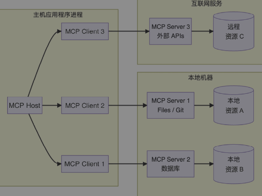

MCP（Model Context Protocol）是 2024 年底崛起的一项技术，它正迅速成为 AI 开发领域的“万能插座”。无论你是 AI 应用开发者，还是想要将自己的服务接入 AI 生态的 Java 工程师，理解 MCP 都将成为一项核心技能。

这篇文章会帮你搞懂 MCP 是什么、为什么需要它、它能干什么，以及它的核心架构和通信原理。

## 1. 为什么你需要 MCP？从 AI 的“手脚”问题说起

现在的 AI 大模型都很聪明，但它们有一个巨大的短板：**它们是与世隔绝的**，即它们只能动脑，无法动手。

想象一下，你让聪明的 AI 助手帮你订一张去北京的机票。它就算知道所有航班信息，也没法操作——因为它进不了你的日历（看你哪天有空），也连不上航司 App（查票订票），更无法调用支付接口来付钱。在 MCP 出现之前，要让 AI 做这些事，开发者主要有两种方式：
- 插件系统
  - 每个 AI 平台（ChatGPT、Claude、文心一言）都定义了自己的插件规范，开发者需要为每个平台单独开发插件。这意味着一个天气服务如果想同时接入ChatGPT、Claude、文心一言，就要开发三套不同的插件。这对服务提供者来说是巨大的重复劳动。
- 函数调用（Function Calling）
  - OpenAI 等模型提供了函数调用能力，允许模型输出结构化的调用请求。但这只是“半程”方案——开发者仍然需要自己编写代码来接收模型发出的调用请求，然后手动去调用真实的 API，再把结果返回给模型。接入的服务一多，代码就乱成一团麻。

**MCP 就是来解决这些问题的**。它定义了一个统一的协议层，让 AI 应用和服务之间能用同一种“语言”沟通。这样一来：
- **一次开发，到处可用**：只要开发一个 MCP Server 服务器，就能被任何支持 MCP 的 AI 应用程序使用。
- **标准化的交互方式**：通过 MCP Client 客户端，能自动发现并调用任意 MCP Server 服务器提供的工具和数据。
- **双向安全通信**：AI 不直接碰原始 API，而是通过 MCP Server 服务器进行受控访问，安全边界清晰。

你可以把 MCP 理解为 AI 世界的 **“USB-C接口”**。无论你插的是硬盘、显示器还是手机，只要接口标准统一，就能即插即用。简单来说，**MCP（模型上下文协议）就是一个开放的、通用的、有共识的协议标准，让 AI 应用能够通过统一的“语言”轻松连接任何符合该标准的工具服务**。

## 2. MCP 的诞生与应用场景

2023 年底，Anthropic 公司首次提出了 MCP 的概念，旨在为大模型提供标准化的上下文获取协议。2024 年初，MCP 的第一个规范版本发布，定义了基于 JSON-RPC 2.0 的通信格式和核心功能。随后，MCP 迅速获得了包括 OpenAI、Google、Microsoft 等头部 AI 企业的支持，成为行业内广泛采用的标准协议。2025年，MCP 已经成为行业标准，并建立起完善的 SDK 生态系统，形成了完整的技术闭环。它不是一个远在天边的概念，而是已经可以实实在在解决问题的技术。来看看 MCP 能做什么：
- **生活服务**：AI 连接高德或百度地图，帮你规划复杂的多地点路线，并估算耗时。
- **代码托管**：AI 连接 GitHub，直接根据你的指令创建仓库、提交代码，甚至管理整个项目。
- **数据操作**：AI 连接数据库（如 MySQL、Redis），你只需用自然语言问“上个月销量最好的产品是什么？”，它就能自动查询并给出答案。
- **信息搜索**：AI 连接搜索引擎或网页操作工具（如 Puppeteer），为你抓取最新的网络信息，打破知识的时间限制。

## 3. MCP 的架构

MCP 采用经典的“客户端-服务器”架构，由MCP Host 主机、MCP Client 客户端和 MCP Server 服务器三大组件组成:

**一个经典的 MCP 工作流程是这样的：** 例如，你在 MCP Host 里说：“帮我查一下北京的天气，并把结果写成一首诗。”
-  **MCP Host（主机）** 分析需求，发现需要“天气数据”。
-  **MCP Client（客户端）** 根据指令，找到能提供天气功能的 MCP Server。
-  **MCP Server（服务器）** 收到请求，调用真实的天气API，获取数据（“晴，24度”）。
-  数据原路返回：**Server → Client → Host**。
-  **Host** 拿到数据后，发挥其写作特长，生成一首诗呈现给你。

这种分工明确的架构，让 AI 应用开发者可以专注于“智能”和“用户体验”，而工具提供者只需专注于将自己的服务包装成标准的 MCP Server，双方通过 MCP 协议这个“通用语言”高效协作。

### 3.1 MCP Host：直接对话的那个“AI应用”

MCP Host（主机） 是你直接打交道的 AI 应用程序，本质上是一个集成了 LLM 能力的应用环境，比如 Claude Desktop、各种 AI 插件或你正在开发的智能应用。它的核心目标是负责整体用户体验并协调和管理一个或多个 MCP Client 客户端。

> 理解这一区别很重要：MCP Host 主机是用户交互的应用程序，而 MCP Client 客户端是实现 MCP Server 服务器连接的协议级组件。

MCP Host 主机功能主要包括如下几个方面：
- 它负责初始化和管理 MCP Client 客户端，确保与相应 MCP Server 服务器建立稳定可靠的连接。
- MCP Host 主机提供了用户与系统交互的前端界面。这不仅仅是简单的输入框和输出区域，而是一个精心设计的交互环境，它需要清晰展示系统能力，引导用户有效使用，并提供即时反馈。
- MCP Host 主机承担着信息转换的关键职责。它需要将各种形式的输入（文本、语音、图像等）转化为规范的 MCP 请求格式，同时将模型返回的结构化数据转换为用户友好的呈现形式。作为 MCP Client 客户端与 MCP Server 服务器之间的协调者，MCP Host 主机需要管理复杂的数据流动。这包括请求排队、并发控制、响应处理等多个环节。

### 3.2 MCP Client：默默干活的“通信员”

在 MCP 架构中，MCP Client 客户端不仅是连接 MCP Host 主机应用程序与 MCP Server 服务器的桥梁，更是驱动双方信息交换的引擎。MCP Client 客户端由 MCP Host 主机应用程序负责实例化和管理，是深度嵌入在 MCP Host 主机环境中的一个动态组件。负责与 MCP Server 服务器保持一对一的连接，得以让 MCP Host 主机应用程序调用外部模型、数据和工具等能力。

具体来说，MCP Client 客户端的功能主要包括如下几个方面：
- 负责建立、维护与目标 MCP Server 服务器的连接。
- 作为交互过程的发起端，MCP Client 客户端将来自 MCP Host 主机应用程序的需求（包括数据请求、工具调用、提示词获取等）封装为符合协议规范的 MCP 请求格式，发送至目标 MCP Server 服务器，并对返回的响应进行解析与处理。
- 能够动态识别 MCP Server 服务器暴露的资源，并根据需求读取资源内容，持续为 MCP Host 主机应用程序提供上下文信息。
- 支持调用 MCP Server 服务器提供的工具，实现外部系统功能与 MCP Host 主机应用程序工作流的无缝集成。

### 3.3 MCP Server：暴露能力的“工具包”

MCP Server 服务器本质上是通过 MCP 标准化协议接口向 AI 应用展示特定能力的程序。MCP Server 服务器作为连接 LLM 与现实世界的关键桥梁，不仅仅是一个简单的数据中转站，更是赋予 AI 智能体“动手能力”的核心组件。通过 MCP 标准协议提供统一的接口，MCP Server 服务器使 LLM 能够安全、可控地获取实时数据、访问外部 API、执行自动化操作，甚至调用复杂的业务工具，从而大幅拓展了 AI 智能体的边界，使其能够在真实场景中有效解决实际问题。

MCP Server 服务器主要提供以下三大核心能力：
- 资源管理：为 LLM 提供结构化的数据访问能力，如知识库检索、数据库查询、文件存储等。
- 工具集成：向 LLM 暴露一组可用的外部工具，例如自动化脚本、计算引擎、第三方 API 等，支持模型通过工具执行具体任务。
- 提示词模板：针对特定场景，预置高效的提示词模板，提升 LLM 的指令理解与任务完成能力。

## 4. MCP 的传输类型：如何“通话”？

MCP 服务器与客户端之间的通信主要有三种方式。

### 4.1 标准输入/输出 STDIO：本地轻量级通信

标准输入输出 STDIO 传输方式是 MCP 最基本的传输实现方式。使用标准输入/输出流实现同一机器上本地进程之间的直接进程通信，提供最佳性能且无网络开销。

- **原理**：
  - 进程创建：MCP Client 客户端作为子进程启动 MCP Server 服务器。
  - 通信机制：
    - MCP Server 服务器从标准输入（stdin）读取 JSON-RPC 消息，并将消息发送到标准输出（stdout）。
    - 标准错误（stderr）用于日志和错误信息
- **优点**：
  - 简单可靠，无需网络配置
  - 适合本地部署场景
  - 进程隔离，安全性好
- **缺点**：
  - 仅支持单机部署
  - 不支持跨网络访问
  - 每个客户端需要独立启动服务器进程
- **适用场景**：这对于本地集成和命令行工具特别有用。在以下情况使用 STDIO：
  - 构建命令行工具
  - 实现本地集成
  - 需要简单的进程通信
  - 使用 SHELL 脚本

### 4.2 服务器发送事件 SSE：远程服务调用

> 后续会被 Streamable HTTP 传输类型取代

 服务器发送事件 SSE（Server-Sent Events）传输方式是基于 HTTP 的单向通信机制，专门用于服务器向客户端推送数据。

- **原理**：SSE 传输支持服务器到客户端的流式传输，同时使用 HTTP POST 请求进行客户端到服务器的通信。服务器作为一个独立的服务部署，客户端通过网络远程连接。
- **特点**：可远程访问，能够同时服务多个客户端。
- **适用场景**：当你把一个服务（如企业内部的知识库查询）部署在服务器上，供多个 AI 应用调用时。在以下情况使用 SSE：
  - 只需要服务器到客户端的流式传输
  - 在受限网络环境中工作
  - 实现简单的更新

### 4.3 Streamable HTTP：更高效的流式通信

> MCP 官方引入了全新的 Streamable HTTP 传输层，对原有 HTTP+SSE 传输机制有重大改进。

- **原理**：
  - 这是一种基于 HTTP/1.1 和 HTTP/2 的增强型流式传输模式。它在 SSE 的基础上进行了优化，支持客户端和服务端的双向流式通信，允许服务端主动推送数据，同时保持 HTTP 的无状态特性。
  - 在 Streamable HTTP 传输中，MCP Server 服务器作为一个独立进程运行，可以处理多个 MCP Client 客户端连接。
  - MCP Server 服务器可以选择性地使用服务器发送事件 SSE 用于流式传输多条服务器消息。
- **特点**：兼具 SSE 的简单性和 WebSocket 的双向能力，但无需升级协议。它利用 HTTP 分块传输编码（chunked transfer encoding）实现持续的数据流，非常适合需要实时更新或长连接交互的场景。此外，Streamable HTTP 模式通常兼容现有的 HTTP 基础设施（如负载均衡、防火墙），易于部署。
- **适用场景**：
  - 需要服务端实时推送进度或结果的长时间任务（如数据处理、文件转换）。
  - 聊天机器人场景中，服务器需要分批次返回思考过程或中间结果。
  - 任何希望复用现有HTTP组件，同时又需要流式交互的远程服务。

## 5. 总结

MCP 正在重新定义 AI 应用与外部世界的交互方式。它通过一个统一的协议，打破了数据与工具的孤岛，让AI从“大脑”进化成了拥有“手脚”的智能体。
