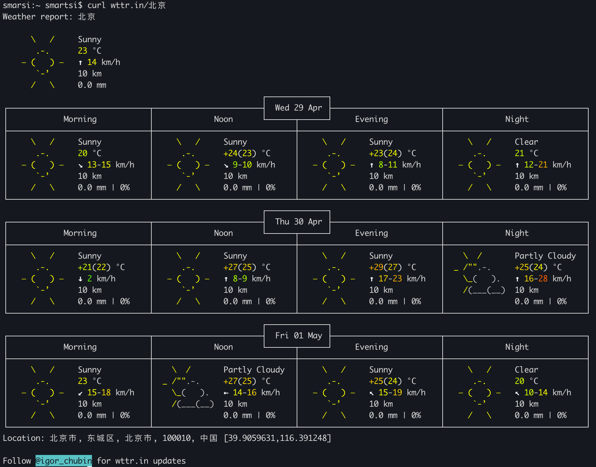

## 1. 引言：为什么你的 AI 需要"看天气"

想象一下，你正在开发一个智能出行助手。用户问："我明天去北京出差，需要带伞吗？" 大模型本身没有实时数据，它的知识截止于训练日期，无法知道明天的天气预报。这时候，你的 AI 需要一个 **工具（Tool）** 来获取实时天气。

但传统的函数调用方式是碎片化的：每个框架有自己的定义格式，每个模型有自己的调用规范。**MCP（Model Context Protocol）** 的出现改变了这一切。它就像 AI 世界的"USB-C"接口，为模型与外部工具、数据源之间的通信提供了统一标准。

> MCP 请详细阅读[MCP 入门：什么是 MCP 模型上下文协议](https://smartsi.blog.csdn.net/article/details/158430845)

本文将带你从零开始，使用 **Spring AI** 框架和免费的 **wttr.in** 天气服务，构建一个生产可用的天气 MCP Server。

---

## 2. wttr.in：命令行时代的天气神器

`wttr.in` 是一个面向开发者的免费天气服务。你可以在终端里如下使用：
```bash
curl wttr.in/北京
```

它会返回一张精美的 ASCII 艺术天气图：



但对我们做 API 集成来说，更重要的是它的 **JSON 输出模式**：
```bash
curl "https://wttr.in/北京?format=j1"
```
返回的结构化数据如下（简化）：
```json
{
  "current_condition": [
    {
      "FeelsLikeC": "23",
      "FeelsLikeF": "73",
      "cloudcover": "0",
      "humidity": "17",
      "localObsDateTime": "2026-04-29 07:01 PM",
      "observation_time": "11:01 AM",
      "precipInches": "0.0",
      "precipMM": "0.0",
      "pressure": "1014",
      "pressureInches": "30",
      "temp_C": "23",
      "temp_F": "74",
      "uvIndex": "0",
      "visibility": "10",
      "visibilityMiles": "6",
      "weatherCode": "113",
      "weatherDesc": [
        {
          "value": "Sunny"
        }
      ],
      "weatherIconUrl": [
        {
          "value": "https://cdn.worldweatheronline.com/images/wsymbols01_png_64/wsymbol_0001_sunny.png"
        }
      ],
      "winddir16Point": "SSW",
      "winddirDegree": "200",
      "windspeedKmph": "14",
      "windspeedMiles": "9"
    }
  ],
  "nearest_area": [...],
  "weather": [...]
}
```

关键字段说明：

| 字段 | 含义 |
|------|------|
| `temp_C` | 摄氏温度 |
| `humidity` | 湿度百分比 |
| `pressure` | 气压（毫巴）|
| `weatherDesc` | 天气描述（如 Sunny、Partly cloudy）|
| `windspeedKmph` | 风速（公里/小时）|
| `winddir16Point` | 风向（16方位）|
| `localObsDateTime` | 观测时间 |

> **注意**：`current_condition` 是一个数组，`weatherDesc` 也是数组，取值时记得取第一个元素。

---

## 3. 实战：手把手实现天气 MCP Server

我们将使用 **Spring Boot 4**、**Spring AI 1.0.0** 和 **JDK 17+** 来构建这个项目。

### 4.1 项目依赖

在 `pom.xml` 中引入 Spring Boot 核心依赖，通常由父 POM 管理：
```xml
<parent>
    <groupId>org.springframework.boot</groupId>
    <artifactId>spring-boot-starter-parent</artifactId>
    <version>4.0.0</version>
    <relativePath />
</parent>
```
引入 Spring AI 配置：
```xml
<dependencyManagement>
    <dependencies>
        <dependency>
            <groupId>org.springframework.ai</groupId>
            <artifactId>spring-ai-bom</artifactId>
            <version>${spring-ai.version}</version>
            <type>pom</type>
            <scope>import</scope>
        </dependency>
    </dependencies>
</dependencyManagement>
```
统一管理 Spring AI 生态下所有组件的版本，你在 dependencies 中引入具体模块时无需再写版本号。

> Spring AI 是一个多模块项目，包含：spring-ai-core、spring-ai-openai、spring-ai-mcp-server-webmvc 等。这些模块之间有严格的版本兼容关系。如果没有 BOM，你需要手动确保每个模块版本一致，容易出错。

Spring AI MCP Server 提供多种传输模式：**STDIO**（标准输入输出，适合本地进程通信）和 **SSE**（Server-Sent Events，适合远程服务）。我们选择 **WebFlux SSE 模式**（也可以用 WebMVC）：

```xml
<dependencies>
    <!-- Spring AI MCP Server Webflux Starter -->
    <dependency>
        <groupId>org.springframework.ai</groupId>
        <artifactId>spring-ai-starter-mcp-server-webflux</artifactId>
    </dependency>
</dependencies>
```


### 4.2 数据模型

根据 wttr.in 的 JSON 结构，定义三个 POJO：

```java
@Data
public class Weather {
    @JsonProperty(value = "current_condition")
    private List<CurrentCondition> currentConditions;
}

@Data
public class CurrentCondition {
    @JsonProperty(value = "FeelsLikeC")
    private String feelsLikeC;
    private String humidity;
    private String localObsDateTime;
    private String precipMM;
    private String pressure;
    @JsonProperty(value = "temp_C")
    private String tempC;
    private String uvIndex;
    private String visibility;
    @JsonProperty(value = "lang_zh")
    private List<WeatherLangZh> langZh;
    private String winddir16Point;
    private String windspeedKmph;
}

@Data
public class WeatherLangZh {
    private String value;
}
```

### 4.3 核心：WeatherService

这是整个 MCP Server 的灵魂。我们用 `@Tool` 注解标记方法，让 Spring AI 自动将其暴露为 MCP Tool：

```java
import org.springframework.ai.tool.annotation.Tool;
import org.springframework.stereotype.Service;
import org.springframework.web.client.RestClient;

@Service
public class WeatherService {

    private static final String BASE_URL = "https://wttr.in";

    private final RestClient restClient;

    public WeatherService() {
        this.restClient = RestClient.builder()
            .baseUrl(BASE_URL)
            .defaultHeader("Accept", "application/json")
            .defaultHeader("User-Agent", "Spring-AI-MCP-Weather/1.0")
            .build();
    }

    @Tool(description = """
        获取指定中国城市的当前天气信息。
        输入为城市中文名（如 北京、上海、杭州）或拼音（如 Beijing）。
        返回包含温度、湿度、天气状况、风速等信息的格式化字符串。
        """)
    public String getCurrentWeather(String cityName) {
        try {
            WeatherResponse response = restClient.get()
                .uri("/{city}?format=j1", cityName)
                .retrieve()
                .body(WeatherResponse.class);

            if (response == null
                || response.current_condition() == null
                || response.current_condition().isEmpty()) {
                return "无法获取天气信息，请检查城市名称是否正确。";
            }

            CurrentCondition cc = response.current_condition().get(0);
            String weather = cc.weatherDesc().get(0).value();

            return String.format("""
                📍 城市：%s
                🌤  天气：%s
                🌡  温度：%s°C（体感 %s°C）
                💧 湿度：%s%%
                📊 气压：%s mb
                💨 风速：%s km/h（%s）
                🌧 降水量：%s mm
                👁 能见度：%s km
                ☀️ 紫外线指数：%s
                🕐 观测时间：%s
                """,
                cityName,
                weather,
                cc.temp_C(), cc.feelsLikeC(),
                cc.humidity(),
                cc.pressure(),
                cc.windspeedKmph(), cc.winddir16Point(),
                cc.precipMM(),
                cc.visibility(),
                cc.uvIndex(),
                cc.localObsDateTime()
            );
        } catch (Exception e) {
            return "获取天气时发生错误：" + e.getMessage();
        }
    }
}
```

代码要点解析：

1. **`@Tool` 注解**：这是 Spring AI 暴露 MCP Tool 的关键。`description` 会被大模型读取，直接影响模型"是否调用"以及"如何调用"这个工具。**描述一定要清晰、包含示例**。
2. **`RestClient`**：Spring 6.1+ 引入的同步 HTTP 客户端，比 `RestTemplate` 更现代。
3. **容错处理**：wttr.in 是免费服务，可能偶发不可用。捕获异常并返回友好错误信息，避免 MCP 调用链断裂。

### 4.4 主应用类：注册 Tool

```java
import org.springframework.ai.tool.ToolCallback;
import org.springframework.ai.tool.ToolCallbacks;
import org.springframework.boot.SpringApplication;
import org.springframework.boot.autoconfigure.SpringBootApplication;
import org.springframework.context.annotation.Bean;

import java.util.List;

@SpringBootApplication
public class WeatherMcpServerApplication {

    public static void main(String[] args) {
        SpringApplication.run(WeatherMcpServerApplication.class, args);
    }

    @Bean
    public List<ToolCallback> weatherTools(WeatherService weatherService) {
        return ToolCallbacks.from(weatherService);
    }
}
```

`ToolCallbacks.from(weatherService)` 会自动扫描 `WeatherService` 中所有带 `@Tool` 注解的方法，并注册为 MCP Tools。你也可以注册多个 Service，框架会自动合并。

### 4.5 配置文件

**SSE 模式**（`application.yml`）：

```yaml
server:
  port: 8080

spring:
  application:
    name: weather-mcp-server
  ai:
    mcp:
      server:
        name: weather-server
        version: 1.0.0
```

**STDIO 模式**（用于 Claude Desktop 等）：

```properties
spring.main.web-application-type=none
spring.main.banner-mode=off
logging.pattern.console=

spring.ai.mcp.server.name=weather-server
spring.ai.mcp.server.version=1.0.0
spring.ai.mcp.server.stdio=true
```

STDIO 模式的三个关键配置：
- `web-application-type=none`：关闭 Web 容器
- `banner-mode=off`：关闭启动 Banner，避免污染 stdout
- `logging.pattern.console=`：清空控制台日志格式，确保 stdout 只有 MCP 协议数据

---

## 五、运行与测试

### 5.1 启动 Server

```bash
./mvnw spring-boot:run
```

SSE 模式下，服务会监听 `http://localhost:8080`。

### 5.2 用 MCP Inspector 测试

MCP 官方提供了 [Inspector](https://modelcontextprotocol.io/docs/tools/inspector) 工具，可以可视化调试 MCP Server。

对于 SSE 模式，启动 Inspector 并指向你的服务：

```bash
npx @modelcontextprotocol/inspector http://localhost:8080
```

在 Inspector 界面中，你应该能看到 `getCurrentWeather` 这个 Tool，输入"北京"即可测试。

### 5.3 接入 Claude Desktop（STDIO 模式）

在 Claude Desktop 的配置文件（`~/Library/Application Support/Claude/claude_desktop_config.json`）中添加：

```json
{
  "mcpServers": {
    "weather": {
      "command": "java",
      "args": [
        "-Dspring.ai.mcp.server.stdio=true",
        "-Dspring.main.web-application-type=none",
        "-Dspring.main.banner-mode=off",
        "-Dlogging.pattern.console=",
        "-jar",
        "/absolute/path/to/weather-mcp-server.jar"
      ]
    }
  }
}
```

重启 Claude Desktop 后，在对话中问"北京今天天气怎么样"，Claude 就会自动调用你的 MCP Server 获取实时天气。

### 5.4 接入 Cherry Studio / Cursor

对于 SSE 模式，在 Cherry Studio 等支持 MCP 的客户端中：
1. 添加 MCP Server
2. 选择 SSE 类型
3. 填入 `http://localhost:8080`
4. 在对话中启用该服务

---

## 六、STDIO vs SSE：怎么选？

| 维度 | STDIO | SSE |
|------|-------|-----|
| **通信方式** | 标准输入输出 | HTTP Server-Sent Events |
| **部署形态** | 本地子进程 | 独立远程服务 |
| **适用场景** | 桌面 AI 客户端（Claude Desktop、Cursor）| 云端服务、多客户端共享 |
| **并发能力** | 单客户端 | 多客户端同时连接 |
| **运维复杂度** | 低（本地 Jar）| 中（需要部署、网络配置）|

**建议**：
- 开发调试和个人使用时，STDIO 最简单
- 团队共享或微服务架构中，SSE 更灵活

---

## 七、进阶思考：从天气到万物

这个天气 MCP Server 虽然简单，但它展示了一个通用的范式：

```
┌──────────────┐     HTTP/API      ┌──────────────┐     MCP      ┌──────────────┐
│  外部数据源   │  ◄────────────►  │  Spring Boot  │  ◄────────► │   AI 客户端   │
│ (wttr.in/    │                  │  MCP Server   │             │(Claude/Cursor│
│  数据库/内部API)│                 │               │             │  /自研应用)   │
└──────────────┘                  └──────────────┘             └──────────────┘
```

你可以用同样的模式封装：
- 企业内部知识库（RAG + MCP Resource）
- 订单查询系统（数据库 + MCP Tool）
- 代码审查助手（Git API + MCP Tool + Prompt）

MCP 的美妙之处在于**解耦**：数据源的开发者不需要懂 AI，AI 应用的开发者不需要懂数据源，双方通过标准协议协作。

---

## 八、总结

本文我们完成了：
1. 理解 MCP 协议的核心价值——AI 世界的"USB-C"
2. 掌握 wttr.in 的 JSON API 使用方式
3. 用 Spring AI 的 `@Tool` 注解实现 MCP Tool
4. 配置 STDIO 和 SSE 两种传输模式
5. 将服务接入 Claude Desktop 等 AI 客户端

完整代码结构：

```
src/
├── main/
│   ├── java/com/example/weather/
│   │   ├── WeatherMcpServerApplication.java
│   │   ├── WeatherService.java
│   │   └── model/
│   │       ├── WeatherResponse.java
│   │       ├── CurrentCondition.java
│   │       └── WeatherDesc.java
│   └── resources/
│       └── application.yml
└── pom.xml
```

Spring AI 对 MCP 的支持让 Java 开发者可以用最熟悉的范式（注解、Spring Boot Starter、自动配置）进入 AI 工程化领域。而对于已经拥有成熟 Java 后端的企业来说，这意味着现有系统可以极低代价地"AI 化"——只需添加一个 `@Tool` 注解，你的业务 API 就变成了大模型可调用的智能工具。

---

*本文技术栈：Spring Boot 3.3+ / Spring AI 1.0.0 / JDK 17+ / wttr.in*

希望这篇博文对你有所帮助！如果需要补充 STDIO 模式的完整启动脚本、或者加入多城市批量查询等进阶功能，请告诉我。
