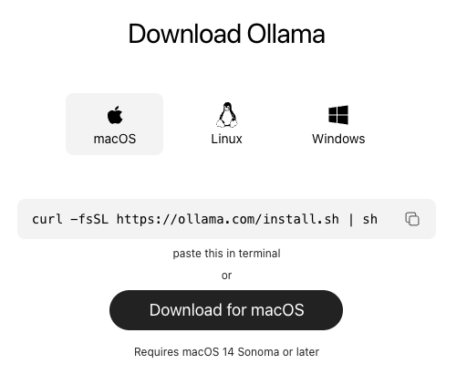
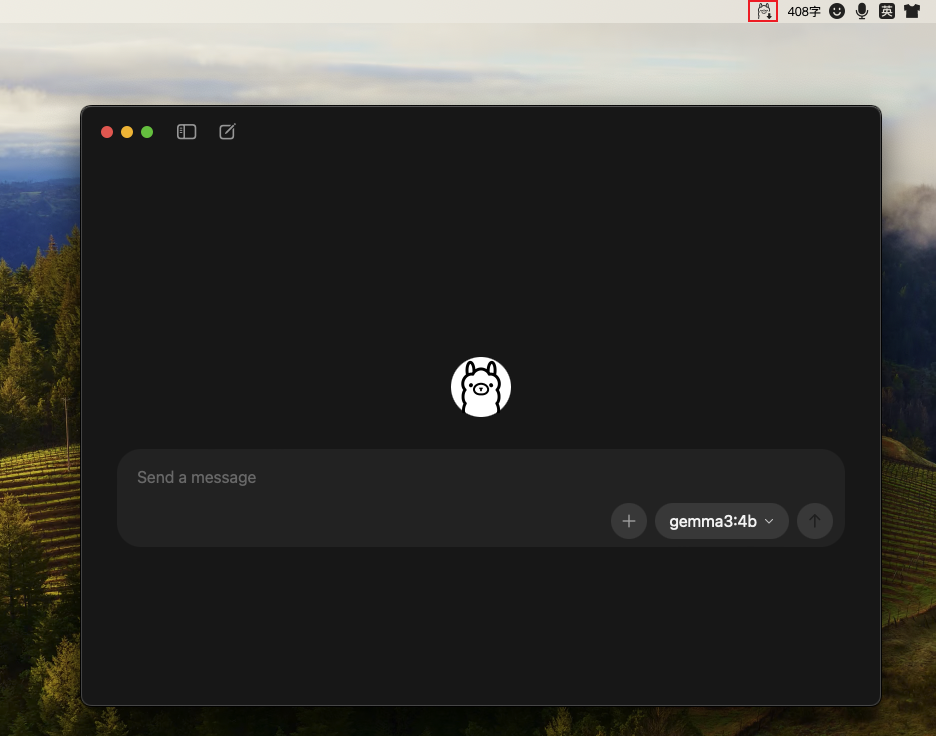
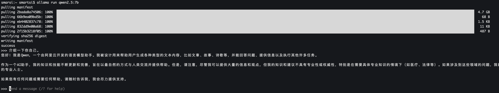

> Mac 环境

随着大语言模型（LLM）的爆发式增长，越来越多的开发者希望在自己的机器上本地运行这些强大的模型，以保护隐私、降低成本或进行离线实验。然而，直接部署像 Llama 3、Mistral 或 Qwen 这样的模型往往涉及复杂的依赖、模型格式转换和 GPU 配置，对新手并不友好。

**Ollama** 的出现极大地简化了这一过程。它是一个开源的、轻量级的工具，将模型权重、配置和依赖打包成一个统一的包（Modelfile），让你可以通过简单的命令行快速启动和运行 LLM，并自动利用 GPU 加速。无论是 macOS、Linux 还是 Windows，Ollama 都提供了简洁的安装方式，并内置了 OpenAI 风格的 API 服务。

本文将手把手带你完成 Ollama 的安装、模型下载、运行以及将其作为服务部署的完整流程。

---

## 1. 先决条件

在开始之前，请确保你的硬件满足基本要求：

- **操作系统**：macOS（11+ Big Sur 或更新）、Linux（支持 x86_64 或 ARM64）、Windows（Windows 10/11，需 WSL2 或通过官方 exe 安装）。
- **内存**：至少 8GB RAM，推荐 16GB+ 以流畅运行 7B 参数的模型。
- **显卡（可选但推荐）**：NVIDIA GPU（支持 CUDA）或 Apple Silicon（M1/M2/M3）可大幅加速推理。
- **磁盘空间**：模型文件通常很大（例如 Llama 3 8B 约 4.7GB），请预留足够空间。

---

## 2. 安装 Ollama

Ollama 为三大主流操作系统提供了便捷的安装方式:



> https://ollama.com/download

### 2.1 macOS

- **直接下载**：从 [Ollama 官网](https://ollama.com/download) 下载 macOS 版本的安装包。
- **Homebrew**：使用 Homebrew 一键安装
  ```bash
  brew install ollama
  ```
- **脚本安装**：
  ```
  curl -fsSL https://ollama.com/install.sh | sh
  ```

> 在这选择直接下载的方式

### 2.2 Linux

Linux 支持通过脚本自动安装:
- **脚本安装**：
  ```bash
  curl -fsSL https://ollama.com/install.sh | sh
  ```

### 2.3 Windows

- **官方 exe 安装**：访问 [Ollama 官网下载页](https://ollama.com/download/windows)，下载 `.exe` 安装包并运行。
- **脚本安装**：
  ```
  irm https://ollama.com/install.ps1 | iex
  ```

### 2.4 验证安装

双击运行可以看到:



但作为工程师，我们更习惯与终端打交道。打开终端（或命令行提示符），运行：
```bash
smarsi:~ smartsi$ ollama --version
ollama version is 0.16.2
```
如果输出版本号（例如 `ollama version is 0.16.2`），则说明安装成功。

---

## 3. 下载并运行第一个模型

### 3.1 下载模型

Ollama 安装完毕，我们还需要下载相应的 AI 模型才可以使用，可输入如下命令来下载相关模型。例如，运行阿里通义千问的 Qwen 2.5 7B 模型：
```bash
ollama run qwen2.5:7b
```
> Ollama 的核心命令是 `ollama run <模型名>`，它会自动从官方仓库下载模型（若本地不存在）并进入交互式对话界面。

首次运行会下载模型文件（约 4.7GB），耐心等待下载完成后，你将看到 `>>>` 提示符，此时即可输入问题与模型对话：
```
>>> 介绍一下你自己。
您好！我是Qwen，一个由阿里云开发的语言模型助手。我被设计用来帮助用户生成各种类型的文本内容，比如文章、故事、诗歌等，并能回答问题、提供信息以及执行其他许多任务。

作为一个AI助手，我的知识和技能不断更新和完善，旨在以最自然的方式与人类交流并提供帮助。但是，请注意，尽管我可以提供大量的信息和观点，但我的知识和建议不具有专业性或权威性，特别是在需要具体专业知识的情境下（如医疗、法律等）。如果涉及到这些领域的问题，我建议您咨询相关领域
的专业人士。

如果您有任何问题或需要任何帮助，请随时告诉我，我会尽力提供支持。
```



如果想一次性下载模型而不进入对话，可以使用 `ollama pull`：
```bash
ollama pull qwen2.5:7b
```

### 3.2 查看常用模型

你可以在 [Ollama 模型库](https://ollama.com/library) 浏览所有可用模型及其标签。你可以根据你的系统配置来下载其它 AI 模型，这是 Ollama 官方列出的模型，里面也列出了相应的下载命令：

| 模型  | 说明 | 参数 | 大小 | 下载指令 |
| :------------- | :------------- | :------------- | :------------- | :------------- |
| DeepSeek-R1 | 深度求索推出的推理模型，擅长逻辑推理。 | 8b | 5.2GB | ollama run deepseek-r1:8b |
| DeepSeek-R1 | 深度求索推出的推理模型，擅长逻辑推理。 | 671B | 404GB | ollama run deepseek-r1:671b |
| Llama 3.1 | Meta 开发的高性能通用模型，指令跟随能力强。 | 8B | 4.9GB | ollama run llama3.1:8b |
| Llama 3.2 | Meta 开发的高性能通用模型，指令跟随能力强。 | 3B | 2.0GB | ollama run llama3.2:3b |
| Qwen 2.5 | 阿里云开发的通义千问多语言模型，中文支持优秀。 | 7b | 4.7GB | ollama run qwen2.5:7b |
| Qwen 3 | 阿里云开发的通义千问多语言模型，中文支持优秀。 | 8b | 5.2GB | ollama run qwen3:8b |
| Gemma 3 | Google 开发的轻量级模型，基于 Gemini 技术。 | 4b | 3.3GB | ollama run gemma3:4b |
| Gemma 2 | Google 开发的轻量级模型，基于 Gemini 技术。 | 9b | 5.4GB | ollama run gemma2:9b |

---

## 4. 部署为 API 服务

Ollama 内置了一个 HTTP 服务器，默认监听 `127.0.0.1:11434`，提供与 OpenAI 兼容的 API 接口。这意味着你可以用任何支持 OpenAI API 的客户端（如 LangChain、Continue、Open WebUI）来连接本地模型。

### 4.1 启动服务

通常 Ollama 安装后服务已自动运行。如需手动启动或重启，可以：
```bash
ollama serve
```
该命令会以前台方式运行服务，日志将直接输出。若想后台运行，可以使用系统服务（Linux/macOS）或 Windows 服务。

### 4.2 调用 API 示例

使用 `curl` 发送聊天补全请求：
```bash
curl http://localhost:11434/v1/chat/completions \
  -H "Content-Type: application/json" \
  -d '{
    "model": "qwen2.5:7b",
    "messages": [{"role": "user", "content": "介绍一下你自己。"}]
  }'
```

返回的 JSON 结构与 OpenAI 类似，包含了模型生成的回复:
```json
{
  "id": "chatcmpl-792",
  "object": "chat.completion",
  "created": 1771645685,
  "model": "qwen2.5:7b",
  "system_fingerprint": "fp_ollama",
  "choices": [
    {
      "index": 0,
      "message": {
        "role": "assistant",
        "content": "您好！我是Qwen，一个由阿里云开发的语言模型助手。我的主要功能是在各种领域提供帮助，包括但不限于生成文本、解答问题、提供建议等。无论是日常生活的咨询，还是学习工作中的难题，我都在这里为您提供支持和帮助。如果您有任何需要回答或者讨论的问题，请随时告诉我！"
      },
      "finish_reason": "stop"
    }
  ],
  "usage": {
    "prompt_tokens": 32,
    "completion_tokens": 69,
    "total_tokens": 101
  }
}
```

你也可以使用 Python 的 `openai` 库调用：
```python
from openai import OpenAI

client = OpenAI(
    base_url="http://localhost:11434/v1",
    api_key="ollama"  # 可以随便填，但必须存在
)

response = client.chat.completions.create(
    model="qwen2.5:7b",
    messages=[{"role": "user", "content": "介绍一下你自己。"}]
)
print(response.choices[0].message.content)
```

---

## 5. 总结

Ollama 凭借其简洁的安装流程、强大的模型管理和内置 API 服务，已成为本地运行大语言模型的首选工具之一。无论是个人实验、原型开发还是生产部署，Ollama 都能大幅降低门槛，让你专注于业务逻辑而非底层依赖。

通过本文，你学会了：
- 在三大操作系统上安装 Ollama。
- 下载并运行热门模型，进行交互式对话。
- 将 Ollama 部署为 API 服务，供其他应用调用。

现在，去探索更多模型，打造属于你自己的 AI 应用吧！
