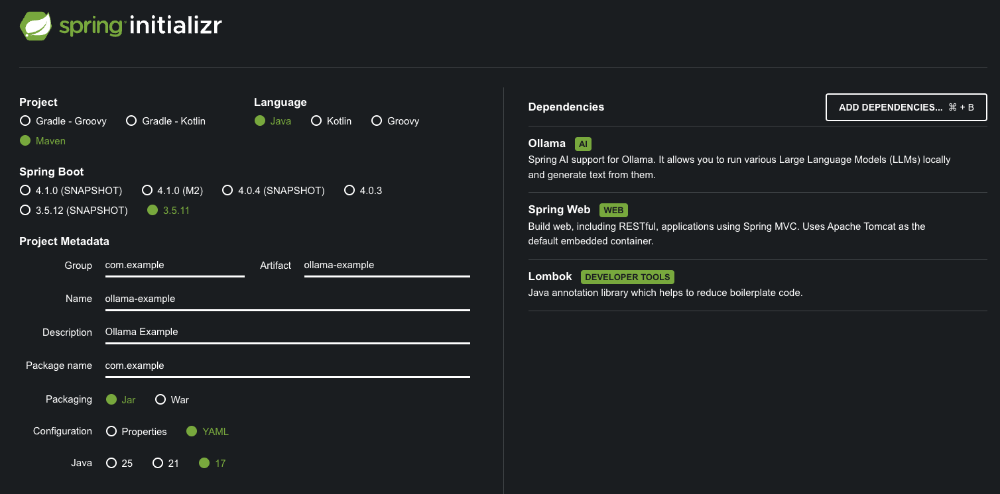

随着大语言模型（LLM）的爆发式增长，越来越多的开发者希望将 AI 能力集成到自己的应用中。而将模型部署在本地运行（如通过 Ollama等）不仅能够保护数据隐私，还能降低 API 调用成本。Spring AI 作为 Spring 生态中针对 AI 工程化的全新项目，极大地简化了与各类 AI 模型（包括本地模型）的集成工作。

本文将带你从零开始，使用 Spring AI 快速搭建一个能与本地 Ollama 模型对话的 REST 服务。

---

## 1. 什么是 Spring AI？

Spring AI 是 Spring 社区推出的一个旨在简化 AI 应用开发的框架。它提供了一套统一的 API，用于与各类 AI 模型（如 OpenAI、Azure OpenAI、Hugging Face、Ollama 等）进行交互。核心特性包括：
- **ChatClient**：统一的聊天 Completion 接口。
- **Prompt Template**：基于 Mustache 的提示词模板引擎。
- **OutputParser**：将模型输出解析为 Java 对象。
- **跨模型支持**：只需切换依赖和配置，即可快速更换模型提供商。

借助 Spring AI，我们可以像使用 JdbcTemplate 一样自然地调用 AI 模型。

---

## 2. 什么是 Ollama？

Ollama 是一个轻量级、可扩展的本地大模型运行框架。它支持众多开源模型，如 Qwen、Llama 3、Mistral、Phi 等，并提供简单的命令行工具进行模型下载和运行。它的优势在于：
- **完全本地**：数据不出域，隐私安全。
- **简单易用**：一条命令即可启动模型服务。
- **兼容 OpenAI API 格式**：可通过 HTTP 接口调用。

Spring AI 通过 `spring-ai-ollama` 模块提供了对 Ollama 的原生支持。

---

## 3. 准备工作

### 3.1 安装 Ollama 并下载模型

> Ollama安装详细参阅: [Ollama 实战：从零开始本地运行大语言开源模型](https://smartsi.blog.csdn.net/article/details/158265330)

首先，根据你的操作系统从 [Ollama 官网](https://ollama.com/) 下载安装包并完成安装。安装完成后，在终端中拉取一个模型，例如阿里的 Qwen2.5（7B 版本）：
```bash
ollama pull qwen2.5:7b
```
Ollama 服务通常安装后会自动作为后台服务运行 ，默认监听地址为 `http://localhost:11434`。可以通过如下方式验证服务是否正常：
```bash
curl http://localhost:11434/api/generate -d '{
  "model": "qwen2.5:7b",
  "prompt": "你好"
}'
```
如果返回包含 `response` 字段的 JSON，则说明 Ollama 服务已就绪:
```
{"model":"qwen2.5:7b","created_at":"2026-02-21T12:54:25.607678Z","response":"你好","done":false}
{"model":"qwen2.5:7b","created_at":"2026-02-21T12:54:25.688191Z","response":"！","done":false}
{"model":"qwen2.5:7b","created_at":"2026-02-21T12:54:25.767817Z","response":"有什么","done":false}
{"model":"qwen2.5:7b","created_at":"2026-02-21T12:54:25.850402Z","response":"问题","done":false}
{"model":"qwen2.5:7b","created_at":"2026-02-21T12:54:25.930818Z","response":"或","done":false}
{"model":"qwen2.5:7b","created_at":"2026-02-21T12:54:26.008596Z","response":"需要","done":false}
{"model":"qwen2.5:7b","created_at":"2026-02-21T12:54:26.089164Z","response":"帮助","done":false}
{"model":"qwen2.5:7b","created_at":"2026-02-21T12:54:26.168982Z","response":"的","done":false}
{"model":"qwen2.5:7b","created_at":"2026-02-21T12:54:26.248761Z","response":"吗","done":false}
{"model":"qwen2.5:7b","created_at":"2026-02-21T12:54:26.329942Z","response":"？","done":false}
{"model":"qwen2.5:7b","created_at":"2026-02-21T12:54:26.410815Z","response":"","done":true,"done_reason":"stop","context":[151644,8948,198,2610,525,1207,16948,11,3465,553,54364,14817,13,1446,525,264,10950,17847,13,151645,198,151644,872,198,108386,151645,198,151644,77091,198,108386,6313,104139,86119,57191,85106,100364,9370,101037,11319],"total_duration":2102056208,"load_duration":120583708,"prompt_eval_count":30,"prompt_eval_duration":1168475500,"eval_count":11,"eval_duration":773265374}
```

### 3.2 创建 Spring Boot 项目

使用 [Spring Initializr](https://start.spring.io/) 或 IDE 创建一个新的 Spring Boot 项目，选择：
- 版本
  - SpringBoot: 3.5.11  
  - Spring AI: 1.1.2
  - Java 版本：17 或 21
- 依赖
  - Ollama
  - Spring Web
  - Lombok



---

## 4. 添加依赖

Spring AI 为 Ollama 集成提供 Spring Boot auto-configuration。要启用它，请将如下依赖项添加到项目的 Maven pom.xml 中：
```xml
<dependency>
   <groupId>org.springframework.ai</groupId>
   <artifactId>spring-ai-starter-model-ollama</artifactId>
</dependency>
```

需要注意的是 Spring AI 发布的 1.0.0-M7 版本对模块结构进行了重要调整，特别是将原先的 `spring-ai-ollama-spring-boot-starter` 模块更名为 `spring-ai-starter-model-ollama`。

> 在 Spring AI 的演进过程中，模块命名的规范化是一个值得关注的技术细节。新版本采用 `starter-model-` 前缀的命名方式，更清晰地表达了该模块的功能定位——作为 Ollama 模型集成的 Spring Boot 启动器。这种命名规范的变化不仅提升了代码的可读性，也为未来可能的模型扩展预留了命名空间。

Spring AI BOM 声明了 Spring AI 指定版本所有依赖的推荐版本。此 BOM 仅包含依赖管理，不涉及插件声明或 Spring/Spring Boot 直接引用。可使用 Spring Boot 父 POM 或 Spring Boot BOM (spring-boot-dependencies) 管理 Spring Boot 版本。添加 BOM 至项目：
```xml
<dependencyManagement>
    <dependencies>
        <dependency>
            <groupId>org.springframework.ai</groupId>
            <artifactId>spring-ai-bom</artifactId>
            <version>1.1.2</version>
            <type>pom</type>
            <scope>import</scope>
        </dependency>
    </dependencies>
</dependencyManagement>
```

完整 pom.xml 如下所示:
```xml
<project xmlns="http://maven.apache.org/POM/4.0.0" xmlns:xsi="http://www.w3.org/2001/XMLSchema-instance"
         xsi:schemaLocation="http://maven.apache.org/POM/4.0.0 http://maven.apache.org/xsd/maven-4.0.0.xsd">
    <modelVersion>4.0.0</modelVersion>
    <parent>
  		<groupId>org.springframework.boot</groupId>
  		<artifactId>spring-boot-starter-parent</artifactId>
  		<version>3.5.11</version>
  		<relativePath/> <!-- lookup parent from repository -->
  	</parent>

    <groupId>com.example</groupId>
    <artifactId>ollama-example</artifactId>
    <version>1.0</version>
    <name>ollama-example</name>
    <description>Ollama Example</description>

    <properties>
        <java.version>17</java.version>
        <spring-ai.version>1.1.2</spring-ai.version>
    </properties>

    <dependencies>
        <!-- Web -->
        <dependency>
            <groupId>org.springframework.boot</groupId>
            <artifactId>spring-boot-starter-web</artifactId>
        </dependency>

        <!-- Ollama -->
        <dependency>
            <groupId>org.springframework.ai</groupId>
            <artifactId>spring-ai-starter-model-ollama</artifactId>
        </dependency>

        <!-- Lombok -->
        <dependency>
            <groupId>org.projectlombok</groupId>
            <artifactId>lombok</artifactId>
            <optional>true</optional>
        </dependency>

        <!-- 测试 -->
        <dependency>
            <groupId>org.springframework.boot</groupId>
            <artifactId>spring-boot-starter-test</artifactId>
            <scope>test</scope>
        </dependency>
    </dependencies>

    <dependencyManagement>
        <dependencies>
            <dependency>
                <groupId>org.springframework.ai</groupId>
                <artifactId>spring-ai-bom</artifactId>
                <version>${spring-ai.version}</version>
                <type>pom</type>
                <scope>import</scope>
            </dependency>
        </dependencies>
    </dependencyManagement>

    <build>
        <plugins>
            <plugin>
                <groupId>org.apache.maven.plugins</groupId>
                <artifactId>maven-compiler-plugin</artifactId>
                <configuration>
                    <annotationProcessorPaths>
                        <path>
                            <groupId>org.projectlombok</groupId>
                            <artifactId>lombok</artifactId>
                        </path>
                    </annotationProcessorPaths>
                </configuration>
            </plugin>
            <plugin>
                <groupId>org.springframework.boot</groupId>
                <artifactId>spring-boot-maven-plugin</artifactId>
                <configuration>
                    <excludes>
                        <exclude>
                            <groupId>org.projectlombok</groupId>
                            <artifactId>lombok</artifactId>
                        </exclude>
                    </excludes>
                </configuration>
            </plugin>
        </plugins>
    </build>
</project>
```
---

## 5. 配置文件

在 `application.yml` 中添加 Ollama 相关配置：
```yaml
server:
  port: 8888

spring:
  application:
    name: ollama-example
  ai:
    ollama:
      base-url: http://localhost:11434
      chat:
        options:
          model: qwen2.5:7b             # 改这里就切换模型
          temperature: 0.75
          top-p: 0.9
          max-tokens: 4096
```
这里我们指定了聊天模型为 `qwen2.5:7b`，你可以根据需要更改为其他已下载的模型。

前缀 `spring.ai.ollama` 是用于配置与 Ollama 连接的属性前缀：

| 属性  | 说明 | 默认值 |
| :------------- | :------------- | :------------- |
| spring.ai.ollama.base-url  | Ollama API 服务器运行的 Base URL。 | `http://localhost:11434` |

前缀 `spring.ai.ollama.chat.options` 是用于配置 Ollama chat model 的属性前缀:

| 属性  | 说明 | 默认值 |
| :------------- | :------------- | :------------- |
| spring.ai.ollama.chat.options.model  | 要使用的模型名称。 | `mistral` |
| spring.ai.ollama.chat.options.format | 返回响应的格式。目前，唯一接受的值是 json | |
| spring.ai.ollama.chat.options.top-k | 减少生成无意义的可能性。较高的值（例如，100）将提供更多样化的答案，而较低的值（例如，10）将更加保守。 | 40 |
| spring.ai.ollama.chat.options.temperature | 模型的 temperature。增加 temperature 将使模型回答更具创造性。| 0.8 |

> 所有前缀为 spring.ai.ollama.chat.options 的属性都可以通过在 Prompt 调用中添加请求特定的 chat-options 在运行时覆盖。

---

## 6. 编写代码

调用大模型有两种输出类型:
- 非流式输出 call：等待大模型把回答结果全部生成后输出给用户；
- 流式输出 stream：逐个字符输出，一方面符合大模型生成方式的本质，另一方面当模型推理效率不是很高时，流式输出比起全部生成后再输出大大提高用户体验。

### 6.1 创建简单的 Controller

创建一个 REST 控制器，通过构造器注入 Spring AI 提供的 `OllamaChatModel`（它实现了 `ChatModel` 接口）:
```java
@Slf4j
@RestController
@RequestMapping("/api/ollama")
public class ChatController {
    @Autowired
    private OllamaChatModel ollamaChatModel;

    @GetMapping("/chat")
    public String chat(@RequestParam(value = "message", defaultValue = "你是谁") String message) {
        // String response = this.ollamaChatModel.call(message);
        Prompt prompt = new Prompt(new UserMessage(message));
        String response = ollamaChatModel.call(prompt).getResult().getOutput().getText();
        log.info("response : {}", response);
        return response;
    }
}
```

### 6.2 流式响应（Streaming）

对于需要实时输出的场景（如打字机效果），可以使用流式 API。创建一个新的端点：
```java
@GetMapping(value = "/chat/stream", produces = "text/plain;charset=UTF-8")
public Flux<String> chatStream(@RequestParam(value = "message", defaultValue = "你是谁") String message) {
    Prompt prompt = new Prompt(new UserMessage(message));
    // 使用 stream 方法返回 Flux<ChatResponse>
    return ollamaChatModel.stream(prompt)
            .map(response -> response.getResult().getOutput().getText());
}
```
注意返回类型为 `Flux<String>`，MediaType 设置为 `text/plain` 以便浏览器直接显示流式文本。

> [完整代码](https://github.com/sjf0115/spring-ai-example/tree/main/ollama-example)

---

## 7. 运行测试

启动 Spring Boot 应用，默认端口 `8080`，在这自定义为 `8888`。打开浏览器测试：

```bash
# 非流式调用
http://localhost:8888/api/ollama/chat?message=介绍一下自己

# 流式调用
http://localhost:8888/api/ollama/chat/stream?message=介绍一下自己
```

你将看到 Ollama 模型实时生成并返回的回答。

---

## 9. 总结

通过本文，你已经学会了如何：
- 安装并运行 Ollama 本地模型。
- 创建一个 Spring Boot 项目并集成 Spring AI Ollama。
- 实现同步和流式聊天接口。

Spring AI 让 Java 开发者能够以极低的成本接入 AI 能力，无论是调用云端 API 还是本地模型。结合 Ollama，你可以在完全掌控数据的情况下，为应用注入智能对话、文本生成等能力。

未来，随着更多模型和功能的支持（如多模态、嵌入向量等），Spring AI 将成为 Java AI 应用开发的事实标准。快动手试试吧！
