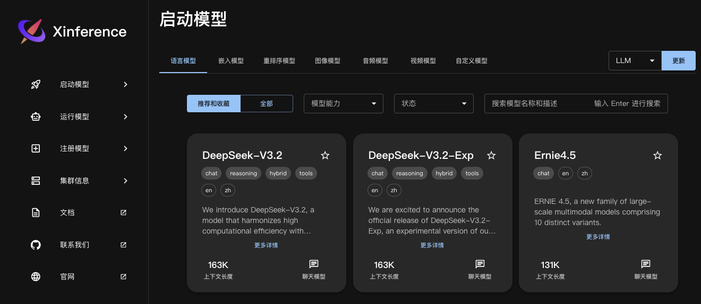

在人工智能快速发展的今天，大语言模型（LLM）已成为自然语言处理领域的重要工具。然而，将那些动辄数十亿参数的大模型从云端或 GPU 服务器高效地迁移到本地环境，并构建稳定可靠的推理服务，一直是众多开发者面临的挑战。

如果你正在寻找一种能够统一管理各种大模型、支持异构硬件、并提供 OpenAI 兼容接口的解决方案，那么 Xinference 绝对值得你投入时间研究。今天，我将带你深入这一强大的工具，从基础概念到复杂的离线部署实战，手把手教你成为 Xinference 的部署专家。

## 1. 初识 Xinference：不只是又一个模型启动器

Xinference 是一款开源模型推理平台，除了支持 LLM，它还可以部署 Embedding 和 ReRank 模型，这在企业级 RAG 构建中非常关键。同时，Xinference 还提供 Function Calling 等高级功能。还支持分布式部署，也就是说，随着未来应用调用量的增长，它可以进行水平扩展。


Xinference（全称 Xorbits Inference）是一个专为大规模模型推理任务设计的开源分布式推理框架。它不仅仅是一个模型启动器，更是一个功能全面的推理平台。它的核心优势在于：
- **统一接口，多模型支持**：它不仅支持大语言模型（LLM），还能无缝部署 Embedding 模型和 Rerank 模型。这对于构建企业级的检索增强生成（RAG）系统至关重要。
- **强大的后端集成**：它像一个“胶水”层，底层集成了目前最火的推理引擎，如 **vLLM、SGLang、llama.cpp、Transformers 和 MLX**。这意味着你可以根据不同的模型和硬件场景，选择最高效的执行后端。
- **异构硬件与分布式能力**：无论你是在搭载 Apple Silicon 的 MacBook 上跑量化模型，还是在拥有多张 NVIDIA GPU 的服务器上进行高并发推理，Xinference 都能游刃有余。其分布式架构支持水平扩展，以应对未来的流量增长。
- **OpenAI 兼容的 API**：它提供了与 OpenAI 协议兼容的 RESTful API，这意味着你可以像调用 OpenAI 接口一样调用本地模型，轻松集成到现有的应用如 FastGPT、Dify 或 LangChain 中。
- **可视化界面**：它提供了一个简洁的 WebUI，让你可以通过点点鼠标就能完成模型的下载、启动和管理，极大地降低了使用门槛。

## 2. Docker 镜像部署

对于希望隔离环境或需要进行离线部署的场景，Docker 是最佳选择。Xinference 官方镜像已发布在 DockerHub 上的 `xprobe/xinference` 仓库中。当前可用的标签包括：
- `nightly-main`: 这个镜像会每天从 GitHub main 分支更新制作，不保证稳定可靠。
- `v<release version>`: 这个镜像会在 Xinference 每次发布的时候制作，通常可以认为是稳定可靠的。
- `latest`: 这个镜像会在 Xinference 发布时指向最新的发布版本

> 需要注意的是对于 CPU 版本，增加 `-cpu` 后缀，如 `nightly-main-cpu`，`v0.10.3-cpu` 或者 `latest-cpu`。

你可以使用如下方式在容器内启动 Xinference，同时，并且，也可以指定需要的环境变量:
```
docker run -d \
  --name xinference \
  -e XINFERENCE_MODEL_SRC=modelscope \
  -p 9997:9997 \
  --gpus all \
  xprobe/xinference:<your_version> \
  xinference-local -H 0.0.0.0 --log-level debug
```

参数说明：
- `-p 9997:9997` 将 9997 端口映射到宿主机的 9998 端口。
- `xprobe/xinference:<your_version>` 将 `<your_version>` 替换为 Xinference 的版本，比如 v0.10.3，可以用 latest 来用于最新版本。
- `--gpus` 必须指定，镜像必须运行在有 GPU 的机器上，否则会出现错误。
- `-H 0.0.0.0` 也是必须指定的，否则在容器外无法连接到 Xinference 服务。
- `--log-level debug` 来配置 Xinference 集群的日志等级，指定日志级别为 DEBUG。
- 可以指定多个 `-e` 选项赋值多个环境变量:
  - `XINFERENCE_MODEL_SRC`：配置模型下载仓库。默认下载源是 `huggingface`，也可以设置为 `modelscope` 作为下载源。


启动容器默认情况下，镜像中不包含任何模型文件，使用过程中会在容器内下载模型。Xinference 默认使用 `<HOME>/.xinference` 作为默认目录来存储模型以及日志等必要的文件，其中 `<HOME>` 是当前用户的主目录。如果需要使用已经下载好的模型，需要将宿主机的目录挂载到容器内。可以通过配置 `XINFERENCE_HOME` 环境变量来修改默认目录。这种情况下，需要在运行容器时指定本地卷，并且为 Xinference 配置环境变量:
```
docker run -d \
  --name xinference \
  -e XINFERENCE_HOME=/opt/workspace/xinference \
  -e XINFERENCE_MODEL_SRC=modelscope \
  -p 9997:9997 \
  --gpus all \
  xprobe/xinference:latest \
  xinference-local -H 0.0.0.0 --log-level debug
```
上述命令的原理是将主机上指定的目录挂载到容器中，并设置 `XINFERENCE_HOME` 环境变量指向容器内的该目录。这样，所有下载的模型文件将存储在您在主机上指定的目录中。您无需担心在 Docker 容器停止时丢失这些文件，下次运行容器时，您可以直接使用现有的模型，无需重复下载。

如果你在宿主机使用的默认路径下载的模型，由于 xinference cache 目录是用的软链的方式存储模型，需要将原文件所在的目录也挂载到容器内。例如你使用 huggingface 和 modelscope 作为模型仓库，那么需要将这两个对应的目录挂载到容器内，一般对应的 cache 目录分别在 `<home_path>/.cache/huggingface` 和 `<home_path>/.cache/modelscope`，使用的命令如下：
```
docker run -d \
  --name xinference \
  -v /opt/workspace/xinference/data/.xinference:/root/.xinference \
  -v /opt/workspace/xinference/data/.cache/huggingface:/root/.cache/huggingface \
  -v /opt/workspace/xinference/data/.cache/modelscope:/root/.cache/modelscope \
  -e XINFERENCE_HOME=/opt/workspace/xinference \
  -e XINFERENCE_MODEL_SRC=modelscope \
  -p 9997:9997 \
  --gpus all \
  xprobe/xinference:latest \
  xinference-local -H 0.0.0.0 --log-level debug
```

所有的日志存储在 `<HOME>/.xinference/logs` 目录中。Xinference 支持滚动日志文件。默认情况下，当单个日志文件达到 100MB 时会生成新的日志备份文件，系统会保留最近的30份日志备份。

> 创建一个 /opt/workspace/xinference/data 目录，用于存放 xinference 缓存文件和日志文件。

Xinference 启动之后，在浏览器中输入: http://127.0.0.1:9997，我们可以访问到本地 Xinference 的 Web UI:



> CPU 版本
```
docker run -d \
  --name xinference \
  -v /opt/workspace/xinference/data/.xinference:/root/.xinference \
  -v /opt/workspace/xinference/data/.cache/huggingface:/root/.cache/huggingface \
  -v /opt/workspace/xinference/data/.cache/modelscope:/root/.cache/modelscope \
  -e XINFERENCE_HOME=/opt/workspace/xinference \
  -e XINFERENCE_MODEL_SRC=modelscope \
  -p 9997:9997 \
  xprobe/xinference:latest-cpu \
  xinference-local -H 0.0.0.0 --log-level debug
```

## 3. Xinference 本地运行大模型

### 3.1 WebUI 方式启动模型

打开“Launch Model”标签，搜索到 qwen-chat，选择模型启动的相关参数，然后点击模型卡片左下方的小火箭🚀按钮，就可以部署该模型到 Xinference。 默认 Model UID 是 qwen-chat（后续通过将通过这个 ID 来访问模型）。


## 4. Xinference 启动嵌入和重排模型


https://doc.fastgpt.cn/zh-CN/docs/self-host/custom-models/xinference
https://inference.readthedocs.io/zh-cn/latest/getting_started/installation.html
