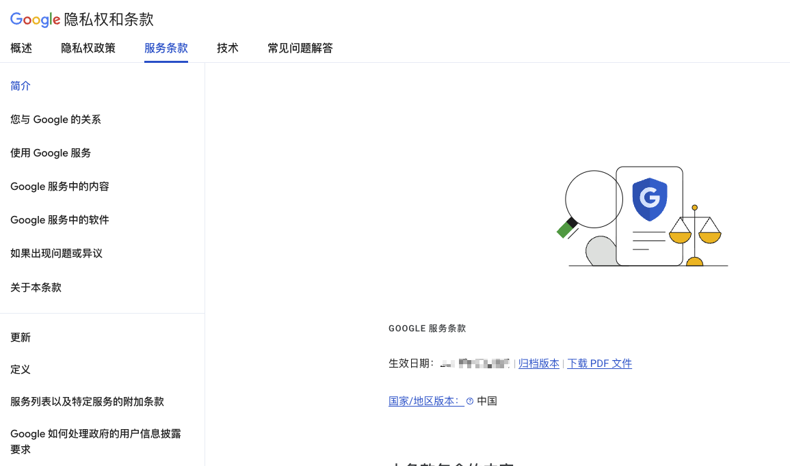

## 引言：当AI学会“为你所用”

在AI技术日新月异的今天，我们习惯了向ChatGPT或Claude提问，然后获取一个由全网数据拼凑而成的答案。然而，这种模式始终存在两个痛点：**信息的不可追溯性**（它到底参考了哪篇文章？）和**AI的幻觉问题**（它是不是在胡编乱造？）。

就在大家以为AI对话产品形态已经固化的2024至2025年，谷歌旗下的一款产品悄然完成逆袭，被OpenAI创始成员Andrej Karpathy誉为带来了当年的“ChatGPT时刻” 。这款产品，就是 **NotebookLM**。

有人说它是“笔记软件的终极形态”，有人说它是“播客生成器”，但在资深使用者眼中，NotebookLM远不止于此。它本质上是一个**以你的私有知识库为核心，能驱动多模态内容生产的工作流引擎**。本文将带你从技术原理、核心功能到高阶玩法，重新认识这个“第二大脑”操作系统。

## 一、什么是NotebookLM？—— 一场关于“信源”的变革

NotebookLM 是由 Google Labs 出品的一款 AI 驱动的研究及学习助理，旨在帮助您提炼想法、整理思路。它的名字本身就揭示了其核心逻辑：**Notebook（笔记本）+ LM（语言模型）**。借助 NotebookLM，您可以：
- 轻松上传 PDF 文件、网站、YouTube 视频、音频文件、Google 文档、Google 幻灯片，或者探索新的来源。
- 体验 Gemini 的高级推理和交互功能，通过文本、图表、图片、音频等不同方式，运用多种语言展开交流。
- 与笔记本聊天，基于来源获取有依据的信息以及清晰的文内引用，确保内容的准确性、透明度和可信度。
- 将来源转换为易于理解的格式，例如学习指南、简报、音频概览、思维导图等。


与传统的 AI 聊天机器人不同，NotebookLM 最根本的差异在于其 **“以信源为中心”的架构**。当你新建一个笔记本时，做的第一件事不是输入问题，而是 **投喂资料** 。

你可以上传几乎任何格式的内容：PDF、TXT、Markdown、网页链接、YouTube视频（自动转录文字）、Google Drive文件，甚至是会议录音。目前免费版支持每个笔记本最多上传50个信源（Pro版支持300个），上下文窗口高达**100万tokens**，相当于可以一次性读完《指环王》三部曲的体量 。

**技术精髓：** 这种设计彻底解决了传统RAG（检索增强生成）应用的两个顽疾。第一，**杜绝幻觉**：AI的回答必须严格基于你给的材料，如果库里没有相关信息，它会直接告诉你“答不了” 。第二，**答案可溯源**：AI生成的每一句话，背后都标注了具体的引用来源（引用编号），你可以一键定位到原始文档的具体位置 。


## 2. 核心功能拆解：为什么它被称为“生产力神器”

NotebookLM的强大并非因为它发明了某种全新的AI技术，而在于它将现有的AI能力（文本、音频、图像）以一种极致的“产品化”思路进行了整合 。

### 1. 多模态知识摄入与发现
- **智能信源收集**：利用“Discover Sources”功能，你只需描述感兴趣的主题（如“了解RAG技术”），NotebookLM可以自动联网搜索，并根据你的要求过滤信源类型——比如限定只从Reddit找新手经验贴，或只从官方文档找PDF 。
- **跨文档分析**：上传多份文件后，AI会自动识别它们之间的关联与矛盾，生成跨文档的综述，这在梳理文献或对比不同版本合同时极其有用 。

### 2. 互动式深度研究
- **引导式提问**：面对一堆复杂文档不知从何问起？NotebookLM会自动生成一系列高质量问题悬浮在输入框下，引导你深入探索 。
- **心智图**：这是近期上线的重磅功能。NotebookLM能将你所有的信源和笔记转化为一张互动的**可视化知识图谱** 。你可以直观地看到概念之间的层级与联系，点击任意节点还能展开细节或发起提问，让“厘清关系”这件事变得无比简单 。

### 3. “出圈”利器：音频概览
这是NotebookLM最令人惊艳的功能。基于你的信源，AI可以生成一段由两位AI主持人进行的**播客式对话** 。

你可能会觉得这不过是TTS（文本转语音）的进阶版，但实际体验远超预期。两位主持人会采用“热情讲述者 + 冷静分析者”的双声部模式 。他们不仅音色逼真，还会在关键数据上加重语气，甚至会互相调侃、打断、总结，仿佛你真的在听一档深度播客。用户可以在播放时随时“加入对话”，打断AI进行追问 。

### 4. 内容生产流水线
谷歌正在将NotebookLM从一个阅读工具，变成一个**创作工具** 。
- **PPT生成**：输入提示词（如“科技感风格”），NotebookLM能根据你的资料直接生成逻辑完整、排版精美的PPTX文件，支持二次编辑 。
- **视频导览**：结合Google强大的Veo系列视频模型，NotebookLM可以根据文档内容自动生成带画面的讲解视频，将枯燥的文字变成纪录片式的短片 。
- **学习指南与闪卡**：一键生成考试重点、FAQ、时间线，甚至抽认卡，极大降低了学生的备考门槛 。

## 3. 应用场景：从个人学习到团队协作

### 场景一：深度学习新领域（如编程、法律、医学）
以一个真实的案例为例：一位想学习LangChain（一种开发框架）但看不懂官方文档的用户，是如何用NotebookLM学习的？他首先定制搜索，从Reddit找到“新手避坑指南”，从YouTube找到视频教程，最后才是官方PDF 。AI根据这些材料生成了分层次的学习报告（从新手到专家），并生成了播客，让他在通勤时“听完”了晦涩的技术概念 。

### 场景二：处理家庭繁琐事务
有用户将家里的所有电器说明书（空气净化器、咖啡机、扫地机器人）全部上传，建立了一个“智能家居小帮手”笔记本 。当洗衣机出现故障代码时，不需要翻箱倒柜找说明书，直接问NotebookLM，它会给出详细的故障排除步骤 。甚至可以根据现有的厨电，让AI推荐一套晚餐菜谱 。

### 场景三：团队知识库共享
对于中小企业或研究团队，NotebookLM支持笔记本级别的**实时共享与协作** 。新员工入职时，面对的不再是几十个G的混乱文件夹，而是一个清晰的知识库，可以向它提问关于公司流程、历史项目的任何问题，且每个答案都有据可查。

## 4. 如何使用

### 4.1 前置准备

- 梯子
- Google 账号

需要注意的是 Google 账号必须是在 NotebookLM 已经开通的地区的，目前推出 [180 多个地区](https://support.google.com/gemini/answer/13575153?sjid=6081433443369299781-NC)，但是中国大陆和中国香港不行，点击适用会出现跳转到如下链接：
```
https://notebooklm.google/?location=unsupported
```

解决方案：
- 需要通过查看 Google 账号的服务条款或者直接访问 `https://policies.google.com/terms` 来查看自己的 Google 账号所在地
  - 
- 如果是中国大陆或者香港，则需要修改 Google 账号所在地。访问 `https://policies.google.com/country-association-form` 链接，发送账号关联地区更改请求。


### 4.2 使用


https://notebooklm.google.com
