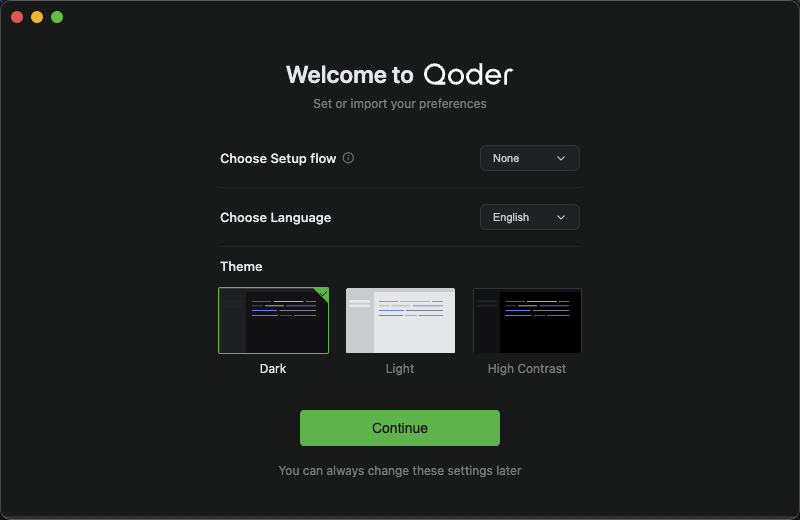
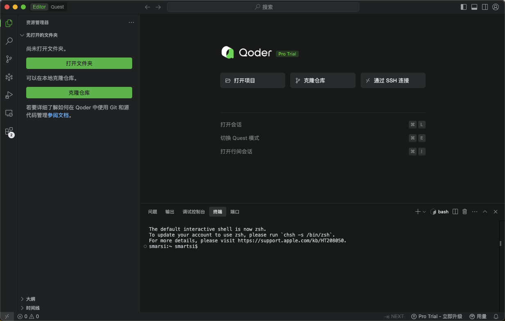

Qoder 是一款面向真实软件开发的 Agentic 编码平台。通过增强上下文工程与智能体无缝结合，全面理解你的代码库，并以系统化方式推进开发任务。它提供代码智能生成、智能问答、多文件修改、编程智能体等能力，思考更深入、编码更高效、构建更出色，为开发者带来高效、流畅的编码体验。

## 1. 下载并安装 Qoder

从 https://qoder.com/download 下载安装程序。安装比较简单，只需要双击文件即可:

安装完之后，双击 Qoder IDE 图标即可启动 Qoder，进入 Qoder 的配置页面:

选择编程语言为中文、主题。此外如果本地安装了 VS Code 或者 Cursor，可以选择从 VS Code 或者 Cursor 导入配置。点击继续之后可以选择编辑器模式。最后启动如下所示:

## 2. 
