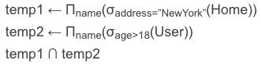

关系代数是一种过程化查询语言。它包括一个运算的集合，这些运算以一个或两个关系为输入，产生一个新的关系作为结果。关系代数的基本运算有：

| 名称 | 英文名称 | 符号 |
| :------------- | :------------- | :------------- |
| 选择 | select	| σ |
| 投影 | project | Π |
| 并 | union | ∪ |
| 集合差	| set-difference | - |
| 笛卡儿积 | Cartesian-product | × |
| 更名 | rename	| ρ |

除了上面的6种基本运算之外，还有一些其他运算，其他运算是可以用基本运算来表示的。但是在实际中，我们为了方便使用，单独建立了一种运算来表示，其他运算有：

| 名称 | 英文名称 | 符号 |
| :------------- | :------------- | :------------- |
| 集合交	| intersection | ∩ |
| 自然连接 | natural join	| ⋈ |
| 赋值 | assignment |	← |

### 1. 选择

- 英文： select
- 字符： σ
- 读音： sigma
- 作用：选择运算在关系中选择出能够满足给定谓词的元组。将那些不满足谓词的元组剔除，组成一个新的关系。在σ后面小写谓词代表查询条件，括号中写要操作的关系。可以使用=，≠，＞，＜，≤，≥来进行谓词的判断。另外，也可以使用and(∧)or(∨)not(﹁)将多个谓词组合成一个较大的谓词。

示例:

(1) 在User关系中查找出年龄大于18的所有元组并返回这些元组组成的关系

(2) 在User关系中查找出年龄大于20并且工资高于10000的所有元组并返回这些元组组成的关系

### 2. 投影

- 英文： project
- 字符： Π
- 读音： pi（是希腊字母π的大写形式）
- 作用：如果我们只对一个关系中的某些属性感兴趣而不是所有，那么我们使用投影关系来选择出我们想要的属性，投影关系返回一个仅含有这些属性的关系。因为关系是集合，所以将返回的关系中所有重复的元组将被剔除。

示例:

在User关系中查找出年龄大于18的所有元组并返回这些元组的姓名name组成的关系。

### 3. 并

- 英文： union
- 字符： ∪
- 作用：有时我们需要把两个关系中的内容联系起来，或者一个关系经过不同的查询，我们希望把结果联系在一起。这就要使用并运算。没有什么不同的，和集合中的并很相似。需要注意的是，并运算处理的两个关系必须具有相同的属性，否则并运算将没有意义。

示例:

在User关系中找出所有年龄大于18的姓名，在Home关系中找出所有家在NewYork的人的姓名，将这两个关系取并集，得到一个并关系。

### 4. 差

- 英文： set-difference
- 字符： -
- 作用：我们用一个关系A差运算另个一个关系B，表示剩下A中有但是B中没有的元组组成的关系。和并运算相同的，我们必须保证-运算在相容的关系之间进行。

示例:

在User关系中找出所有年龄大于18的姓名，在Home关系中找出所有家在NewYork的人的姓名，得到User中存在而Home中不存在的人的姓名的关系。

### 5. 笛卡儿积

- 英文： Cartesian-product
- 字符： ×
- 作用：有时我们需要把两个不相关的关系连接起来，但是这两个关系之中的属性却各不相同。对于这种不相容的情况我们不能使用交并差运算。笛卡儿乘积，用第一个关系A中的一个元组和第二个关系B中的所有元组结合，创造出一条包含着所有属性的新元组（如果在两个关系中有同名属性c，则在新关系中用A.c和B.c分别来表示）。这样得到的新关系中一共有A的元组数乘以B的元组数条信息。

示例:

将User关系和Home关系做笛卡儿乘积运算

### 6. 更名

- 英文： rename
- 字符： ρ
- 读音： rho
- 作用：关系表达式的结果没有给我们能够引用的名字。如果想要引用一个产生的关系，最基础的就是把这句语句再写一遍，但是这种方法不是很好的。我们可以通过ρ表示更名或是命名，为一个关系起个名。

示例:

将User关系中所有年龄大于18的人的姓名取出作为一个新的关系，并把这个关系起名为adult。

### 7. 交

- 英文： intersection
- 字符： ∩
- 作用：集合交运算表示出在A和B两个关系中都存在的元组的新关系。A和B两个元组应该是属性相同的。交运算是其他运算而不是基础运算。我们可以通过 A-(A-B) 得到A∩B。

示例:

在User关系中找出所有年龄大于18的姓名，在Home关系中找出所有家在NewYork的人的姓名，将这两个关系中都存在的姓名取出作为新的关系。

### 8. 自然连接

- 英文： natural join
- 字符： ⋈
- 作用：有的时候我们需要把两个属性并不是完全相同的关系连接在一起，就像笛卡儿积做的那样。但是我们又不想直接使用笛卡儿积，因为这种方法实在是耗时耗力，我们希望得到更为简练有效的数据。这时我们就需要自然连接。自然连接将两个关系A和B的共同属性作为根本，将两个表中这些共同属性的值都相同元组拼接在一起作为一个新的元组，而将剩下不能拼接的部分全部舍弃，这样得到一个新的关系。

自然连接也是一个其他运算。我们可以先将A和B关系做笛卡儿积，然后基于两个关系中相同的属性做相等性判断，去掉不等的元组，最后将属性简化，得到自然连接的结果。

示例:

将User关系和Home关系做自然连接

### 9. 赋值

- 英文： assignment
- 字符： ←
- 作用：实际上，赋值和更名很像，只不过赋值可以单独的写在一句话中，下面可以使用箭头左侧的名字作为右边关系的表示。

示例:

在User关系中找出所有年龄大于18的姓名，在Home关系中找出所有家在NewYork的人的姓名，将这两个关系中都存在的姓名取出作为新的关系。

