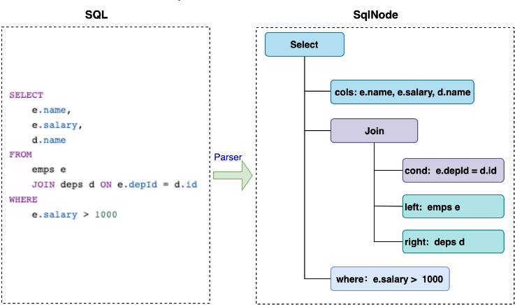

## 1. 实现思路

Apache Calcite 是一款开源的动态数据管理框架，它提供了标准的 SQL 语言、多种查询优化和连接各种数据源的能力，但不包括数据存储、处理数据的算法和存储元数据的存储库。



我们可以借助 Calcite SqlParser 解析器分析 SQL 并生成 AST 语法树，并通过访问 AST 的各个节点获取到我们想要的信息。

## 2. 具体实现

构建 Calcite SqlParser 解析器解析 SQL 并生成 AST 语法树:
```java
@Test
void test() {
    String sql = "insert into ... select ...";
    // 在解析前可以对 SQL 语句进行预处理，比如将不支持的 && 替换为 AND， != 替换为 <>
    SqlParser.Config config =
            SqlParser.configBuilder()
                    .setParserFactory(FlinkSqlParserImpl.FACTORY)
                    .setLex(Lex.JAVA)
                    .setIdentifierMaxLength(256)
                    .build();
    // 创建解析器
    SqlParser sqlParser = SqlParser
            .create(sql, config);
    // 生成 AST 语法树
    SqlNode sqlNode;
    try {
        sqlNode = sqlParser.parseStmt();
    } catch (SqlParseException e) {
        throw new RuntimeException("使用 Calcite 进行语法分析发生了异常", e);
    }
  	SqlBloodRes res = new SqlBloodRes();
    // 递归遍历语法树
    getDependencies(sqlNode, res, false);
}
```
此处笔者参考了 [从 SQL 语句中解析出源表和结果表 - JR's Blog](https://blog.jrwang.me/2018/parse-table-in-sql/) 所提供的思路。在 Calcite 解析出来的 AST 是以 SqlNode 的形式表现的，一个 SqlNode 即是 AST 中的一个节点。SqlNode 有许多类型，我们关注的 Source 和 Sink 表表名在 AST 中会是一个 SqlIdentifier 的叶子结点。（注意：并非所有 SqlIdentifier 叶子结点都对应表名，列名也对应 SqlIdentifier）

在一条 SQL 中，最终出现表的引用的情况归结于以下两种情况：
- SELECT 语句的 FROM clause 中的直接引用
- JOIN 语句中 LEFT 和 RIGHT clause 中的直接引用

嵌套子查询的 SQL 语句中，最终进入到子查询的 AST 子树中，只要出现了对表的引用，一定会分解出以上两种结构。因此，对于一个 SqlIdentifier 类型的叶子节点，在以下两种情况下，该叶子结点就是一个表的引用：
- 父节点是 SqlSelect，且当前节点是父节点的 FROM 子句派生出的子节点
- 父节点是 SqlJoin（如果是 Lookup join 则节点为 SNAPSHOT 类型，需继续深入子节点）

另外，一种特殊的情况需要加以考虑。在 SQL 中 AS 常用作起别名，因而可能 SqlIdentifier 的父节点是 AS，而 AS 的父节点是 SELECT 或 JOIN。这种情况下，我们可以将 AS 看作一种 “转发” 结点，即 AS 的父节点和子节点忽略掉 AS 结点，直接构成父子关系。

从根结点开始遍历 AST，解析所有的子查询，找到符合上述两种情况的子结构，就可以提取出所有对表的引用。
```java
private SqlBloodRes getDependencies(SqlNode sqlNode, SqlBloodRes res, Boolean fromOrJoin) {
    if (sqlNode.getKind() == JOIN) {
        SqlJoin sqlKind = (SqlJoin) sqlNode;
        getDependencies(sqlKind.getLeft(), res, true);
        getDependencies(sqlKind.getRight(), res, true);
    } else if (sqlNode.getKind() == IDENTIFIER) {
        if (fromOrJoin) {
            // 获取 source 表名
            res.getSourceTables().put(sqlNode.toString(), sqlNode.toString());
        }
    } else if (sqlNode.getKind() == AS) {
        SqlBasicCall sqlKind = (SqlBasicCall) sqlNode;
        if (sqlKind.getOperandList().size() >= 2) {
            getDependencies(sqlKind.getOperandList().get(0), res, fromOrJoin);
        }
    } else if (sqlNode.getKind() == INSERT) {
        SqlInsert sqlKind = (SqlInsert) sqlNode;
        // 获取 sink 表名
        res.setSinkTable(sqlKind.getTargetTable().toString());
        getDependencies(sqlKind.getSource(), res, false);
    } else if (sqlNode.getKind() == SELECT) {
        SqlSelect sqlKind = (SqlSelect) sqlNode;
        List<SqlNode> list = sqlKind.getSelectList().getList();
        for (SqlNode i : list) {
            getDependencies(i, res, false);
        }
        getDependencies(sqlKind.getFrom(), res, true);
    } else if (sqlNode.getKind() == SNAPSHOT) {
        // 处理 Lookup join 的情况
        SqlSnapshot sqlKind = (SqlSnapshot) sqlNode;
        getDependencies(sqlKind.getTableRef(), res, true);
    }   else {
        // TODO 这里可根据需求拓展处理其他类型的 sqlNode
    }
    return res;
}
```
结果封装:
```java
@Data
public class SqlBloodRes {

    private Map<String, String> sourceTables = new HashMap<>();

    private String sinkTable;
}
```

## 3. 最后

上面就是使用 Calcite 解析 SQL 获取源表和结果表的思路，Demo 实现比较粗糙，各位可以根据实际场景及自身需求进行优化丰富。

> 原文:[使用 Calcite 解析 SQL 获取源表和结果表](https://www.toutiao.com/article/7137180267675943435)
