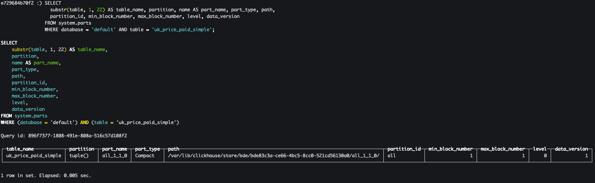

在 ClickHouse 的世界里，数据分片 Part 是一个核心概念，它直接影响到系统的存储效率、查询性能和数据管理方式。理解数据分片 Part 的工作原理，对于优化 ClickHouse 集群的性能至关重要。本文将从基础概念出发，逐步深入探讨 Part 的各个方面。

## 1. 什么是数据分片 Part

在 ClickHouse 中，每个使用 MergeTree 表引擎家族的表时，其数据在磁盘上都被组织成一组不可变的数据分片 Part。为说明这一点，我们使用这张表（改编自 UK property prices dataset），用于追踪英国已售房产的成交日期、城镇、街道和价格：
```sql
CREATE TABLE uk_price_paid_simple (
    date Date,
    town LowCardinality(String),
    street LowCardinality(String),
    price UInt32
)
ENGINE = MergeTree
ORDER BY (town, street);
```
每当有一组行被插入到表中时，就会创建一个数据分片 Part。
```sql
INSERT INTO TABLE uk_price_paid_simple VALUES
  ('2020-12-19', 'LONDON','ABBEY LANE', 850000),
  ('2020-12-19', 'LONDON','EGHAM ROAD', 420000),
  ('2020-12-19', 'MALTON','NORTH ROAD', 160000),
  ('2020-12-19', 'OXFORD','EDEN DRIVE', 960000);
```

当 ClickHouse 服务器处理上面包含 4 行的插入操作时，将执行以下几个步骤：


- ① 排序：根据表的 **排序键(town, street)** 对行进行排序，并为排序后的行生成稀疏主索引。
- ② 拆分：将排序后的数据按列拆分。
- ③ 压缩：对每一列进行压缩。
- ④ 写入磁盘：将压缩后的列作为二进制列文件保存在一个新目录中，该目录代表此次插入产生的数据分片 Part。同时，稀疏主索引也会被压缩并存储在同一目录中。

> 根据表所使用的具体引擎，在排序的同时可能还会进行其他处理。

## 2. Part 内部结构

数据分片 Part 包含了解释其内容所需的全部元数据。除了稀疏主索引之外，数据分片 Part 还包含其他元数据，例如二级数据跳过索引、列统计信息、校验和、最小-最大索引（如果使用了分区），以及更多信息。你可以通过 `system.parts` 系统表查询到数据分片 Part 的实际存储位置、分片名称、分区信息（如果有的话）以及其他一些有用的信息：
```sql
SELECT
  substr(table, 1, 22) AS table_name, partition, name AS part_name, part_type, path,
  partition_id, min_block_number, max_block_number, level, data_version
FROM system.parts
WHERE database = 'default' AND table = 'uk_price_paid_simple';
```



如上所示，`default` 数据库中的 `uk_price_paid_simple` 表只包含 1 个数据分片 Part。每个数据分片 Part 都有其独立的目录，在这里的这个数据分片 Part 对应的目录名称为 `all_1_1_0`：
- `all` 表示分区标识，对应 `partition_id` 列。如果没有分区则固定为 `all`。
- 第一个 `1` 表示数据分片 `Part` 所包含数据块的最小编号，对应 `min_block_number` 列；
- 第二个 `1` 表示数据分片 `Part` 所包含数据块的最大编号，对应 `max_block_number` 列；
- `0` 表示合并层级，即数据分片 `Part` 由合并树的第几层生成，对应 `level` 列；

此外，`part_type` 字段中的 `Compact` 则表示所有列都存储在同一个文件中，如果是 `Wide` 则表示每列在文件系统中以单独的文件形式存储。在 `partition` 列中，`tuple()` 表示该表未进行分区。

如前所述，数据分片 Part 是磁盘上的物理文件。默认情况下，所有与数据相关的文件都位于 `/var/lib/clickhouse` 目录下。ClickHouse 中的每个 MergeTree 表都有一个唯一目录路径来存储数据分片 Part。通过 `path` 列可以知道数据分片 Part 实际存储的独立目录为 `/var/lib/clickhouse/store/bde/bde83c3a-ce66-4bc5-8cc0-521cd56130a0/all_1_1_0/`。你也可以在目录 `/var/lib/clickhouse/data/<DB_NAME>/<TABLE_NAME>/<PART_NAME>` 中查看表的数据分片 Part。数据分片的完整存储结构如下所示：
```shell
root@e729684b70f2:/var/lib/clickhouse/data/default/uk_price_paid_simple/all_1_1_0# ls -al
total 36
drwxr-x--- 2 clickhouse clickhouse 4096 Jan 24 03:28 .
drwxr-x--- 4 clickhouse clickhouse 4096 Jan 24 03:28 ..
-rw-r----- 1 clickhouse clickhouse  188 Jan 24 03:28 checksums.txt
-rw-r----- 1 clickhouse clickhouse  126 Jan 24 03:28 columns.txt
-rw-r----- 1 clickhouse clickhouse    1 Jan 24 03:28 count.txt
-rw-r----- 1 clickhouse clickhouse  244 Jan 24 03:28 data.bin
-rw-r----- 1 clickhouse clickhouse  144 Jan 24 03:28 data.mrk3
-rw-r----- 1 clickhouse clickhouse   10 Jan 24 03:28 default_compression_codec.txt
-rw-r----- 1 clickhouse clickhouse   36 Jan 24 03:28 primary.idx
```
下面介绍一下各个文件的用途：
- `checksums.txt`：校验文件，使用二进制格式存储
  - 它保存了余下各类文件（primary.idx、count.txt等） 的 size 大小及 size 的哈希值，用于快速校验文件的完整性和正确性。
- `columns.txt`：列信息文件，使用明文格式存储
  - 用于保存此数据分区下的列字段信息
  ```
  columns format version: 1
  4 columns:
  `date` Date
  `town` LowCardinality(String)
  `street` LowCardinality(String)
  `price` UInt32
  ```
- `count.txt`：计数文件，使用明文格式存储
  - 用于记录当前数据分区目录下数据的总行数
- `data.bin`：数据文件，使用压缩格式存储，默认为LZ4压缩格式。
  - 由于MergeTree采用列式存储，所以每一个列字段都拥有独立的.bin数据文件，并以列字段名称命名 （例如CounterID.bin、EventDate.bin等）。更多关于数据存储的细节会在6.5节阐述。
- `primary.idx`：一级索引文件，使用二进制格式存储
  - 用于存放稀疏索引，一张 MergeTree 表只能声明一次一级索引(通过ORDER BY或者PRIMARY KEY)。借助稀疏索引，在数据查询的时能够排除主键条件范围之外的数据文件，从而有效减少数据扫描范围，加速查询速度。
- `data.mrk3`：列字段标记文件，使用二进制格式存储。

> 从上面的 part_type 可以知道这是一个 Compact 格式 的 Part。对于 Wide 格式 的 Part 文件会有不一样的文件。

## 3. Part 合并

为了管理每个表中的数据分片 Part 数量，后台合并任务会定期将较小的数据分片 Part 合并成更大的数据分片 Part，直到它们达到一个可配置的压缩大小（通常约为 150 GB）。经过合并的数据分片 Part 会被标记为非活跃，并在可配置的时间间隔后删除。随着时间推移，这一过程会形成一个由合并数据分片 Part 组成的分层结构，这也是该表引擎被称为 MergeTree 表的原因：


为尽量减少初始数据分片 Part 的数量以及合并带来的开销，数据库客户端建议要么批量插入，例如一次插入 20,000 行，要么使用异步插入模式。在异步模式下，ClickHouse 会将来自多个针对同一张表的 INSERT 语句的行缓存在一起，仅当缓冲区大小超过可配置阈值或超时时，才创建一个新的数据分片 Part。

## 4. 监控表的分片

你可以使用虚拟列` _part` 来查询示例表当前所有处于活跃状态的数据分片 Part 列表：


上面的查询会检索磁盘上的目录名称，每个目录都代表该表的一个活跃的数据分片 Part。
