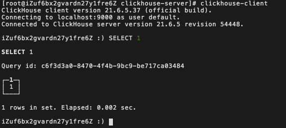

> CentOS  8.3 64位

> ClickHouse  21.6.5.37

### 1. 系统要求

ClickHouse 可以在任何具有 x86_64、AArch64 或 PowerPC64LE CPU 架构的 Linux、FreeBSD 或 Mac OS X 上运行。官方预构建的二进制文件通常针对 x86_64 进行编译并利用 SSE 4.2 指令集。如下命令检查当前 CPU 是否支持 SSE 4.2：
```
grep -q sse4_2 /proc/cpuinfo && echo "SSE 4.2 supported" || echo "SSE 4.2 not supported"
```
如果支持会输出 SSE 4.2 supported 信息。

> 要在不支持 SSE 4.2 或不具有 AArch64、PowerPC64LE 架构的处理器上运行 ClickHouse，需要编译源代码构建 ClickHouse。

### 2. 安装

#### 2.1 使用 RPM 包

> 我们的系统是 CentOS，所以在这使用 RPM 包方式安装 ClickHouse

对于 CentOS、RedHat 和所有其他基于 rpm 的 Linux 发行版，建议使用官方预编译的 rpm 包。首先，您需要添加官方存储库：
```
sudo yum install yum-utils
sudo rpm --import https://repo.clickhouse.tech/CLICKHOUSE-KEY.GPG
sudo yum-config-manager --add-repo https://repo.clickhouse.tech/rpm/stable/x86_64
```
然后运行如下命令来安装软件包：
```
sudo yum install clickhouse-server clickhouse-client
```
我们还可以从[这里](https://repo.yandex.ru/clickhouse/rpm/stable/x86_64/)手动下载和安装软件包。


除此之外，还可以通过使用DEB包、Tgz包以及Docker镜像的方式安装。下面还会简单介绍如何使用DEB包、Tgz包进行安装。

#### 2.2 使用DEB包

Debian 或 Ubuntu 系统建议使用官方预编译的 deb 包进行安装。运行这些命令来安装软件包：
```
sudo apt-get install apt-transport-https ca-certificates dirmngr
sudo apt-key adv --keyserver hkp://keyserver.ubuntu.com:80 --recv E0C56BD4

echo "deb https://repo.clickhouse.tech/deb/stable/ main/" | sudo tee \
    /etc/apt/sources.list.d/clickhouse.list
sudo apt-get update

sudo apt-get install -y clickhouse-server clickhouse-client

sudo service clickhouse-server start
clickhouse-client
```
> 如果您想使用最新版本，请将 stable 替换为 testing（适合测试环境）。

我们还可以从[这里](https://repo.clickhouse.tech/deb/stable/main/)手动下载和安装软件包。

#### 2.3 使用Tgz包

对于无法安装 deb 或 rpm 软件包的所有 Linux 发行版，建议使用官方预编译的 tgz 包。可以使用 curl 或 wget 从[存储仓库](https://repo.clickhouse.tech/tgz/)下载所需的版本。最新版本示例：
```
export LATEST_VERSION=`curl https://api.github.com/repos/ClickHouse/ClickHouse/tags 2>/dev/null | grep -Eo '[0-9]+\.[0-9]+\.[0-9]+\.[0-9]+' | head -n 1`
curl -O https://repo.clickhouse.tech/tgz/clickhouse-common-static-$LATEST_VERSION.tgz
curl -O https://repo.clickhouse.tech/tgz/clickhouse-common-static-dbg-$LATEST_VERSION.tgz
curl -O https://repo.clickhouse.tech/tgz/clickhouse-server-$LATEST_VERSION.tgz
curl -O https://repo.clickhouse.tech/tgz/clickhouse-client-$LATEST_VERSION.tgz

tar -xzvf clickhouse-common-static-$LATEST_VERSION.tgz
sudo clickhouse-common-static-$LATEST_VERSION/install/doinst.sh

tar -xzvf clickhouse-common-static-dbg-$LATEST_VERSION.tgz
sudo clickhouse-common-static-dbg-$LATEST_VERSION/install/doinst.sh

tar -xzvf clickhouse-server-$LATEST_VERSION.tgz
sudo clickhouse-server-$LATEST_VERSION/install/doinst.sh
sudo /etc/init.d/clickhouse-server start

tar -xzvf clickhouse-client-$LATEST_VERSION.tgz
sudo clickhouse-client-$LATEST_VERSION/install/doinst.sh
```

### 3. 启动

有两种方式可以启动 ClickHouse，一种使用 service 方式启动，一种使用 systemctl 方式启动。如下使用 service 方式以守护进程方式启动：
```
sudo service clickhouse-server start
```
> 如果您没有 service 命令，可以运行 sudo /etc/init.d/clickhouse-server start 命令。


若 service 启动过程报 Init script is already running 错误，运行 clickhouse-client 命令报 Connection refused 错误，则使用 systemctl 方式启动：
```
sudo systemctl start clickhouse-server
```


> 可以使用 sudo systemctl stop clickhouse-server 命令停止服务。

通过上图我们可以看出在 /var/log/clickhouse-server/ 目录下查看日志。

此外，我们还可以从控制台手动启动服务器：
```
sudo -u clickhouse  clickhouse-server --config-file=/etc/clickhouse-server/config.xml
```
在这种情况下，日志会打印到控制台，方便开发时使用：


如果配置文件在当前目录下，则不需要指定 --config-file 参数。默认情况下，使用 ./config.xml。ClickHouse 支持访问限制设置，可以修改 users.xml 文件。默认情况下，允许默认用户从任何地方访问，无需密码。

### 4. 运行

启动服务器后，我们可以使用命令行客户端连接到它：
```
clickhouse-client
```
默认情况下，表示用户默认连接到 localhost:9000，无需密码。还可用于使用 --host 参数连接到远程服务器。



欢迎关注我的公众号和博客：


原文:[Installation](https://clickhouse.tech/docs/en/getting-started/install/)
