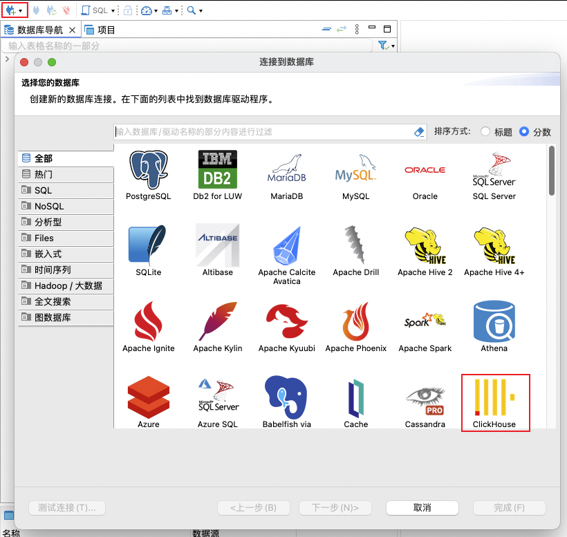
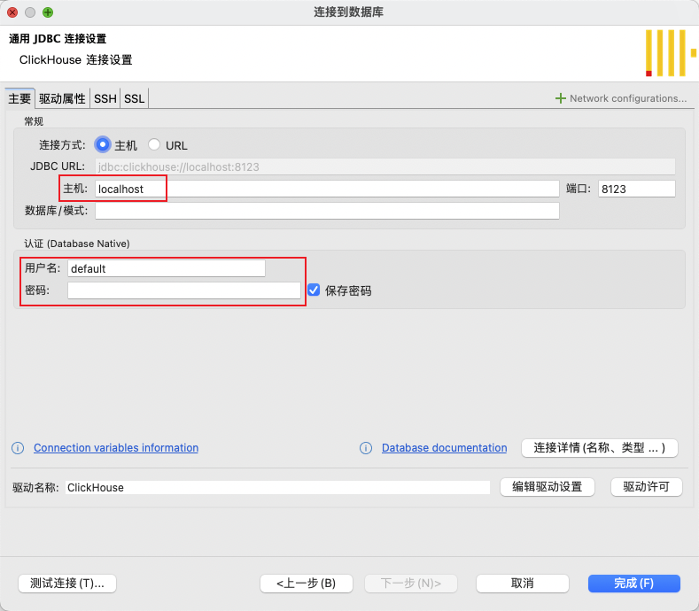
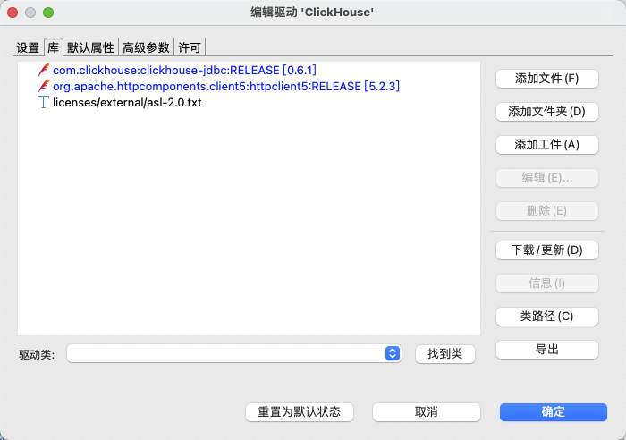
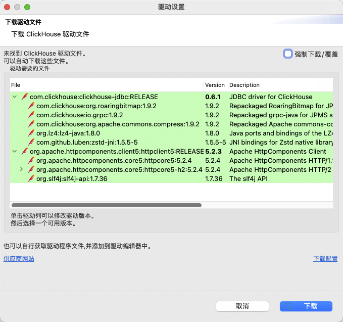
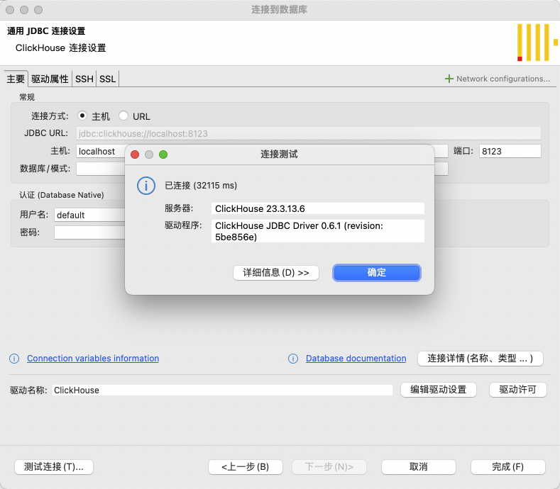
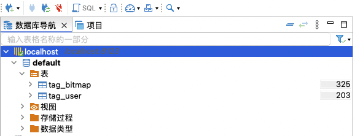
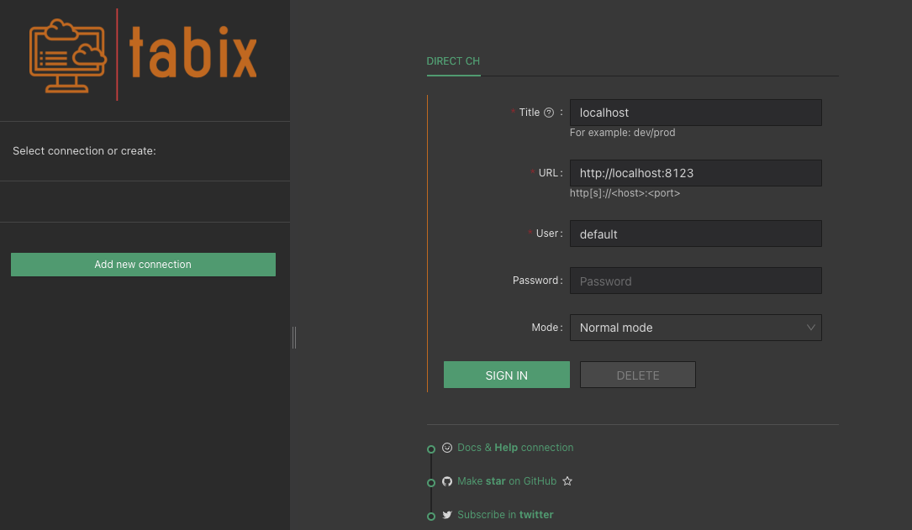
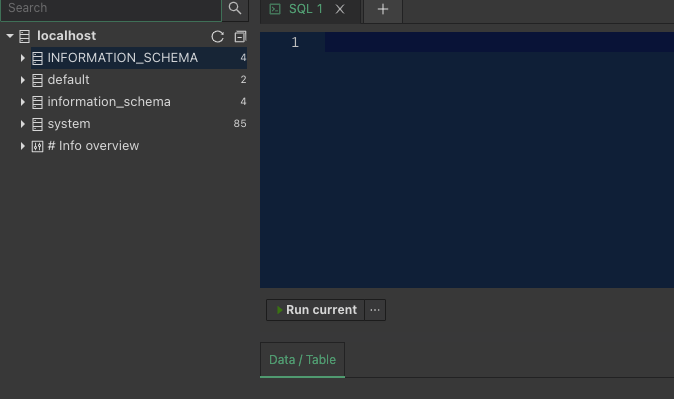

## 1. DBeaver

DBeaver 是一个 SQL 客户端和数据库管理工具。对于关系数据库，它使用 JDBC API 通过 JDBC 驱动程序与数据库交互。对于其他数据库 NoSQL，它使用专有数据库驱动程序。DBeaver 支持非常丰富的数据库,开箱即用,支持的数据库产品主要包含：MySQL、MariaDB、PostgreSQL、Microsoft SQL Server、Oracle、DB2、Greenplum、Teradata、PrestoDB、ClickHouse、Vertica、MongoDB、Redshift、Apache Hive、Apache Phoenix、Apache Impala、InfluxDB、Apache Cassandra、Redis、Neo4j、Elasticsearch、Solr等。

### 1.1 DBeaver下载安装

DBeaver支持在 Window、MacOS 和 Linux 上安装，这里基于 Mac 安装演示。

DBeaver下载地址：Download | DBeaver Community

### 1.2 DBeaver连接ClickHouse配置

### 1.2.1 新建连接

新建连接, 选择 ClickHouse 数据库：

### 1.2.2 设置参数

点击"下一步"，设置 JDBC 连接，配置主机，用户名和密码：

> 如果没有提供用户名和密码，默认尝试以 default 用户进行连接，密码默认为空。

### 1.2.3 驱动设置

可以点击下载/更新按钮进行更新:

### 1.2.4 测试链接

配置参数之后可以测试连接 ClickHouse 是否连通：

点击确定之后即可完成连接的创建：

## 2. Tabix

Tabix 是一个无需安装的在线应用，只需通过浏览器访问 `http://dash.tabix.io/` 即可立即开始使用。对于需要本地部署的情况，Tabix 也提供了详尽的安装指南，使您能够快速上手。

功能：
- 直接从浏览器与 ClickHouse 交互，无需安装额外的软件。
- 带语法高亮的查询编辑器。
- 命令自动完成。
- 查询执行的图形分析工具。
- 颜色方案选项。

### 2.1 新建连接

> 连接 ClickHouse 的用户名默认为 default，这里密码默认为空。访问 ClickHouse 端口默认为 8123。

点击 `SIGN IN` 即可完成创建：

### 2.2 编写SQL进行查询

在 SQL 编辑器窗口编写 SQL 点击 `RUN CURRENT` 即可运行当前 SQL：

