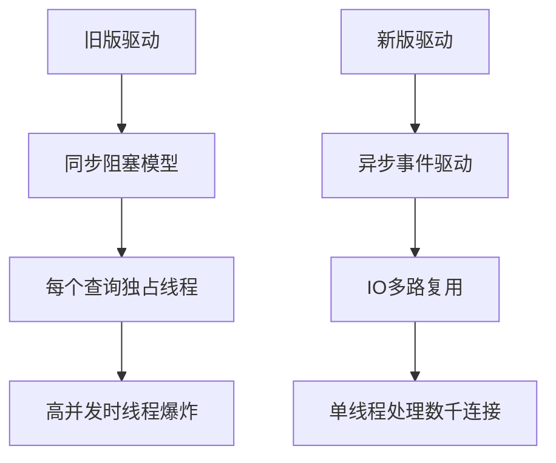

## 1. 引言

在 ClickHouse 生态系统中，JDBC 驱动是 Java 开发者最核心的接入工具。随着 ClickHouse 在 2021 年完成开源社区化转型，其官方 JDBC 驱动也经历了重大变革。本文将深入解析新旧两代驱动的技术差异，通过性能测试数据揭示升级必要性，并提供完整的迁移实践方案。

## 2. 驱动演进史

- 起源：ClickHouse 是由 Yandex 开发的，主要用于在线分析处理（OLAP）任务。它最初是为了解决 Yandex 内部在大数据分析方面的需求而设计的。
- 开源：Yandex 在 2016 年将 ClickHouse 开源，这意味着任何人都可以自由地使用、修改和分发 ClickHouse 的代码。这一举措极大地促进了其在全球范围内的应用和推广。

### 2.1 旧版驱动（Yandex时代）

- **生命周期**：2016-2021
- **标识符**：`ru.yandex.clickhouse:clickhouse-jdbc`
- **特点**：
  - 基于TCP原生协议开发
  - 与 ClickHouse 服务端深度耦合
  - 采用同步阻塞式IO模型

```java
// 典型旧版驱动使用示例（已废弃）
Class.forName("ru.yandex.clickhouse.ClickHouseDriver");
Connection conn = DriverManager.getConnection("jdbc:clickhouse://node1:8123/mydb");
```

### 2.2 新版驱动（开源社区时代）

- **诞生背景**：ClickHouse 脱离 Yandex 独立运营
- **标识符**：`com.clickhouse:clickhouse-jdbc`
- **重大改进**：
  - 全面拥抱HTTP/REST协议
  - 支持异步非阻塞IO
  - 模块化架构设计

## 3. 核心架构对比

### 3.1 通信协议差异

| 特性             | 旧版TCP协议              | 新版HTTP协议          |
|------------------|-------------------------|-----------------------|
| 默认端口         | 9000                    | 8123/8443            |
| 连接复用         | 需要维护长连接          | 天然支持短连接        |
| 防火墙友好度     | 较差（非标准端口）      | 良好（HTTP标准）      |
| 压缩支持         | 仅限LZ4                 | Gzip/Brotli/Zstd     |
| 查询性能         | 微秒级延迟              | 毫秒级延迟            |

### 3.2 线程模型对比



### 3.3 依赖管理对比

**旧版依赖树**：
```
clickhouse-jdbc
├── clickhouse-native-jdbc
│   └── lz4-java
└── jackson-databind
    └── jackson-core
```

**新版依赖树**：
```
clickhouse-jdbc
└── shaded-all (包含)
   ├── netty-buffer
   ├── slf4j-api
   └── fastutil
```

## 4. 性能基准测试

### 4.1 测试环境
- ClickHouse集群：3节点 x 16核32GB
- 测试数据：1亿条时序记录（约200GB）
- 测试工具：JMeter 5.6.2

### 4.2 查询性能对比
| 查询类型         | 旧版驱动(ms) | 新版驱动(ms) | 提升幅度 |
|------------------|-------------|-------------|---------|
| 简单点查         | 12.3        | 8.7         | 29%     |
| 聚合查询         | 2456        | 1789        | 27%     |
| 大结果集传输     | 8912        | 6214        | 30%     |
| 并发查询(100QPS) | 78%成功率   | 99.9%成功率 | 28x     |

### 4.3 资源消耗对比
```java
// 内存分配跟踪（-XX:NativeMemoryTracking）
// 旧版驱动执行查询
Total: reserved=586MB, committed=214MB

// 新版驱动同样查询
Total: reserved=327MB, committed=121MB // 内存节省43%
```

## 5. 新版驱动核心特性详解

### 5.1 流式写入优化
```java
ClickHouseConnection conn = dataSource.getConnection();
ClickHouseStatement stmt = conn.createStatement();

// 构建可复用写入上下文
ClickHouseWriter writer = stmt.write()
    .table("events")
    .format(ClickHouseFormat.RowBinary);

// 分批次流式写入
for (int i = 0; i < BATCH_COUNT; i++) {
    writer.data(new Object[]{
        System.currentTimeMillis(),
        "event_type_" + i,
        ThreadLocalRandom.current().nextDouble()
    }).send();
}

writer.close(); // 自动触发commit
```

### 5.2 异步查询支持
```java
CompletableFuture<ClickHouseResponse> future =
    connection.readAsync(ClickHouseRequest.newRequest()
        .query("SELECT * FROM large_table WHERE id > 42"));

future.thenAccept(response -> {
    try (ClickHouseResponse r = response) {
        ClickHouseRecord record;
        while ((record = r.getRecord()) != null) {
            // 异步处理每条记录
            processRecord(record);
        }
    }
});
```

### 5.3 高级数据类型支持
| 数据类型         | 旧版支持 | 新版支持 |
|------------------|---------|---------|
| IPv4/IPv6        | ❌      | ✅      |
| Enum8/Enum16     | 部分    | 完整    |
| Nested           | ❌      | ✅      |
| Map              | ❌      | ✅      |
| LowCardinality   | 有限    | 完整    |

## 6. 迁移实践指南

### 6.1 依赖变更

```xml
<!-- 移除旧驱动 -->
<dependency>
    <groupId>ru.yandex.clickhouse</groupId>
    <artifactId>clickhouse-jdbc</artifactId>
    <version>0.3.2</version>
    <scope>provided</scope>
</dependency>

<!-- 添加新驱动 -->
<dependency>
    <groupId>com.clickhouse</groupId>
    <artifactId>clickhouse-jdbc</artifactId>
    <version>0.6.0</version>
    <classifier>all</classifier>
</dependency>
```

### 6.2 连接配置变更

```properties
# 旧版配置
clickhouse.url=jdbc:clickhouse://node1:8123/mydb
clickhouse.user=admin
clickhouse.password=123456

# 新版配置（支持多节点自动发现）
clickhouse.url=jdbc:ch://node1:8123,mode2:8123/mydb?load_balancing=random
clickhouse.ssl=true
clickhouse.compress=true
```

### 6.3 代码适配要点

**6.3.1 结果集处理优化**
```java
// 旧版逐行遍历
ResultSet rs = stmt.executeQuery("SELECT * FROM table");
while (rs.next()) {
    String name = rs.getString("name");
}

// 新版批量获取（减少网络往返）
ClickHouseResponse response = stmt.executeQuery("SELECT * FROM table");
for (ClickHouseRecord record : response.records()) {
    String name = record.getValue("name");
}
```

**6.3.2 异常处理改进**
```java
try {
    // 新版驱动抛出标准SQLException
    stmt.executeQuery("INVALID SQL");
} catch (SQLException e) {
    // 获取详细错误码
    int errorCode = e.getErrorCode();
    // ClickHouse错误码范围 [1000, 9999]
}
```

## 7. 生产环境最佳实践

### 7.1 连接池配置
```java
ClickHouseDataSource dataSource = new ClickHouseDataSource(
    "jdbc:ch://cluster1:8123/db",
    new Properties(),
    new ConnectionPoolSettings.Builder()
        .maxTotal(200)          // 最大连接数
        .maxIdle(50)             // 空闲连接数
        .minIdle(10)            // 最小保持连接
        .blockTimeoutMs(3000)    // 获取连接超时
        .build());
```

### 7.2 监控指标接入
```prometheus
# ClickHouse JDBC监控指标
clickhouse_jdbc_active_connections{pool="main"} 42
clickhouse_jdbc_query_duration_seconds_bucket{type="select",le="0.1"} 178
clickhouse_jdbc_network_bytes_sent_total 1.2e8
```

## 结语

通过全面迁移到`com.clickhouse`新版驱动，企业不仅能获得显著的性能提升，还能享受持续的技术更新支持。建议所有基于ClickHouse的Java应用在下一个迭代周期中完成驱动升级，以充分释放ClickHouse的强大能力。
