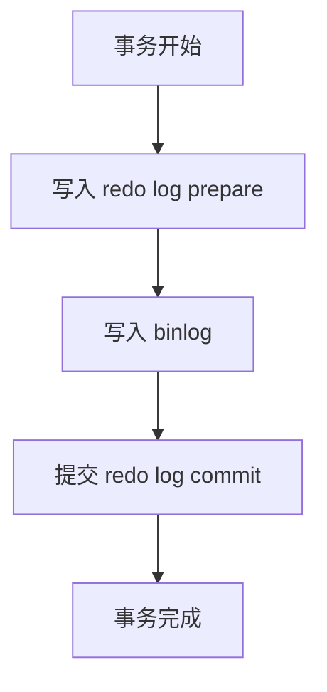

在 MySQL 数据库生态中，二进制日志（Binary Log，简称 binlog）扮演着至关重要的角色。作为 MySQL 的核心组件之一，binlog 不仅实现了主从复制的基础架构，还为数据恢复、审计追踪等关键功能提供了技术支撑。本文将深入剖析 binlog 的工作原理、配置管理和实际应用场景。

## 1. 什么是 Binlog？

MySQL binlog 是一种二进制格式的日志文件，用于记录所有对数据库执行的数据变更操作（DDL 和 DML），但不包括 SELECT 和 SHOW 这类不修改数据的查询语句。

### 核心特性
- **二进制格式**：紧凑高效的存储形式
- **事务安全**：支持事务的 ACID 特性
- **顺序写入**：保证操作的时间顺序
- **可配置格式**：支持多种日志记录格式

## 2. 如何开启 Binlog

通常情况 MySQL 是默认关闭 Binlog 的。登录之后使用 `SHOW VARIABLES LIKE 'log_bin%';` 命令查看是否开启 Binlog：
```
mysql> SHOW VARIABLES LIKE '%log_bin%';
+---------------------------------+------------------------------------+
| Variable_name                   | Value                              |
+---------------------------------+------------------------------------+
| log_bin                         | ON                                 |
| log_bin_basename                | /usr/local/mysql/data/binlog       |
| log_bin_index                   | /usr/local/mysql/data/binlog.index |
| log_bin_trust_function_creators | OFF                                |
| log_bin_use_v1_row_events       | OFF                                |
| sql_log_bin                     | ON                                 |
+---------------------------------+------------------------------------+
6 rows in set (0.01 sec)
```
> MySQL 版本：8.0.43，默认开启

如果看到 log_bin 变量是 OFF，表示还没有开启 Binlog，需要我们手动启动；如果是 ON 表示已经开启。

?????

如果没有开启，需要在 MySQL 配置文件 `my.cnf` 或 `my.ini` 中的 `[mysqld]` 标签下增加如下内容：
```
[mysqld]
# server-id 比较大的随机值
server-id = 85744
# Binlog 文件的前缀
log-bin = mysql-bin
# 必须为ROW
binlog_format = ROW
```

Mac my.cnf 配置路径请查阅 [Location of my.cnf file on macOS](https://stackoverflow.com/questions/10757169/location-of-my-cnf-file-on-macos)，我的是在 /etc/ 目录下配置。

配置好之后重启 MySQL 服务，再次使用上述命令查看是否开启 Binlog：


从上面可知 Binlog 的存储路径为 /usr/local/mysql/data/:


## 2. Binlog 的三种格式

### 2.1 Statement

```sql
-- binlog 中记录的原始 SQL 语句
UPDATE users SET status = 'active' WHERE last_login > '2023-01-01';
```

**优点：**
- 日志文件体积小
- 可读性较强
- 备份恢复相对简单

**缺点：**
- 非确定性函数可能导致主从不一致
- 需要更多的行级锁

### 2.2 Row

```sql
-- binlog 中记录的是行的实际变化
### UPDATE test.users
### WHERE
###   @1=1 /* INT meta=0 nullable=0 is_null=0 */
###   @2='old_value' /* VARSTRING(80) meta=80 nullable=1 is_null=0 */
### SET
###   @1=1 /* INT meta=0 nullable=0 is_null=0 */
###   @2='new_value' /* VARSTRING(80) meta=80 nullable=1 is_null=0 */
```

**优点：**
- 数据一致性更高
- 减少主从复制冲突
- 支持并行复制

**缺点：**
- 日志文件体积较大
- 可读性较差

### 2.3 Mixed

混合模式，MySQL 自动在 Statement 和 Row 之间选择最优方案。

## 3. Binlog 配置详解

### 3.1 基本配置参数
```ini
[mysqld]
# 启用 binlog
log-bin = mysql-bin
# 设置 binlog 格式
binlog-format = ROW
# 设置过期时间（秒）
binlog_expire_logs_seconds = 2592000
# 单个 binlog 文件大小
max_binlog_size = 100M
# 缓存大小
binlog_cache_size = 1M
```

### 3.2 重要配置说明
```sql
-- 查看当前 binlog 配置
SHOW VARIABLES LIKE '%binlog%';

-- 查看 binlog 文件列表
SHOW BINARY LOGS;

-- 查看当前正在写入的 binlog 文件
SHOW MASTER STATUS;
```

## 4. Binlog 的工作机制

### 写入流程
1. **客户端提交事务**
2. **Server 层生成 binlog 事件**
3. **存储引擎提交事务（InnoDB redo log）**
4. **binlog 刷盘持久化**
5. **返回客户端提交结果**

### 两阶段提交
为了保证数据一致性，MySQL 采用两阶段提交协议：


## 5. Binlog 事件结构

### 事件类型概览
```sql
-- 常见事件类型
- QUERY_EVENT      : DDL 语句
- TABLE_MAP_EVENT  : 表映射信息
- WRITE_ROWS_EVENT : 插入操作
- UPDATE_ROWS_EVENT: 更新操作
- DELETE_ROWS_EVENT: 删除操作
- XID_EVENT        : 事务提交
```

### 事件格式示例
```
+=====================================+
| Event Header | Event Data | Checksum |
+=====================================+
```

## 6. 实际应用场景

### 6.1 数据恢复实战
```bash
# 恢复到指定时间点
mysqlbinlog \
  --start-datetime="2023-10-01 09:00:00" \
  --stop-datetime="2023-10-01 10:00:00" \
  mysql-bin.000001 | mysql -u root -p

# 跳过误操作恢复
mysqlbinlog \
  --stop-position=123456 \
  mysql-bin.000001 | mysql -u root -p
```

### 6.2 主从复制配置
```sql
-- 主库配置
CREATE USER 'repl'@'%' IDENTIFIED BY 'password';
GRANT REPLICATION SLAVE ON *.* TO 'repl'@'%';

-- 从库配置
CHANGE MASTER TO
  MASTER_HOST='master_host',
  MASTER_USER='repl',
  MASTER_PASSWORD='password',
  MASTER_LOG_FILE='mysql-bin.000001',
  MASTER_LOG_POS=107;

START SLAVE;
```

### 6.3 数据审计实现
```sql
-- 使用 mysqlbinlog 解析操作日志
mysqlbinlog --base64-output=decode-rows -v mysql-bin.000001

-- 提取特定表的变更
mysqlbinlog --base64-output=decode-rows -v \
  --database=test_db \
  --table=users \
  mysql-bin.000001
```

## 总结

MySQL binlog 作为数据库生态系统的核心组件，其重要性不言而喻。通过深入了解 binlog 的工作原理、配置优化和实际应用，数据库管理员可以更好地构建高可用、可扩展的数据库架构，同时确保数据的安全性和一致性。

在实际生产环境中，建议根据业务需求合理选择 binlog 格式，制定完善的监控和维护策略，充分发挥 binlog 在数据复制、恢复和审计方面的强大能力。

---

**注意**：本文涉及的操作命令在生产环境中执行前，请务必在测试环境充分验证，并确保有完整的数据备份。


### 2.


...
