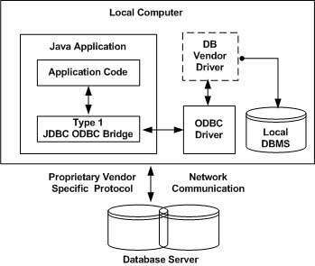
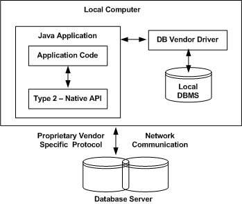
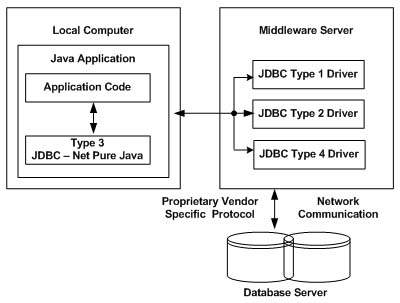
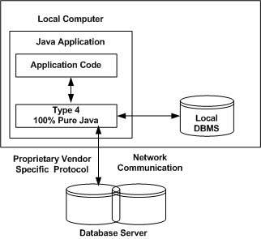

### 1. 简介

Java Database Connectivity（JDBC）是Java语言的应用程序编程接口（API），它定义了客户端如何访问任何类型的表格数据，尤其是关系数据库。它充当了 Java 应用程序和数据库之间的中间层接口。

JDBC 类包含在 Java `java.sql` 和 `javax.sql` 包中。JDBC 帮助你编写管理下面三种编程场景的Java应用程序:
- 连接到数据源，如数据库。
- 将查询和更新语句发送到数据库。
- 检索并处理从数据库接收的结果以回答你的查询。

JDBC 驱动程序是客户端适配器（安装在客户端计算机上，而不是安装在服务器上），用于将Java程序的请求转换为 DBMS 可以理解的协议。有4种类型的 JDBC 驱动程序:
- Type-1 驱动程序(JDBC-ODBC桥驱动程序)。
- Type-2 驱动程序(Native-API驱动程序)。
- Type-3 驱动程序(网络协议驱动程序)。
- Type-4 驱动程序(本机协议驱动程序)。

### 2. Type-1 driver

Type-1 驱动程序(JDBC-ODBC桥驱动程序)使用 ODBC 驱动程序连接到数据库。JDBC-ODBC 桥驱动程序将 JDBC 方法调用转换为 ODBC 函数调用。Type-1 驱动程序也称为通用驱动程序，因为它可用于连接任何数据库。
- 作为通用驱动程序是为了与不同数据库进行交互，因此通过此驱动程序传输的数据不那么安全。
- 需要在各个客户端计算机上安装 ODBC 桥驱动程序。
- Type-1 驱动程序不是用 Java 编写的，这就是它不是便携式驱动程序的原因。

### 3. Type-2 driver

Native API 驱动程序使用客户端的数据库类库。此驱动程序将 JDBC 方法调用转换为数据库 API 的本地调用。为了与不同的数据库进行交互，这个驱动程序需要它们的本地 API，这就是为什么数据传输比 Type-1 驱动程序更安全的原因。
- 驱动程序需要单独安装在各个客户端计算机上。
- Vendor客户端库需要安装在客户端计算机上。
- Type-2 驱动程序不是用 Java编写的，这也是它不是便携式驱动程序的原因。

### 4. Type-3 driver

网络协议驱动程序使用三层方法访问数据库。JDBC客户端使用标准网络套接字与中间件应用程序服务器进行通信。套接字信息随后由中间件应用服务器转换成DBMS所需的调用格式，并转发到数据库服务器。这里所有数据库连接驱动程序都存在于每个服务器中，因此无需单独在客户端上安装。
- Type-3 驱动程序完全用 Java 编写，因此它们是便携式驱动程序。
- 由于应用程序服务器可以执行许多任务，如审计，负载平衡，日志记录等，因此不需要客户端库。
- 客户端计算机上需要网络支持。
- 维护网络协议驱动程序的代价非常昂贵，因为它需要在中间层中完成特定于数据库的编码。

### 5. Type-4 driver

Type-4 驱动程序也称为本机协议驱动程序。此驱动程序直接与数据库交互。它不需要任何本地数据库类库，这就是它也被称为瘦驱动程序的原因。这是数据库可用的最高性能驱动程序，通常由供应商自己提供。
- 不需要任何本地类库和中间件服务器，因此不需要在客户端或服务器上安装特殊的软件。此外，这些驱动程序可以动态下载。
- 它完全用 Java 语言编写，因此它们是便携式的驱动程序。

> MySQL Connector/J驱动程序是类型4驱动程序。

### 6. 该使用哪种驱动程序？

- 如果你正在访问一个数据库，如 Oracle，Sybase 或 IBM，首选的驱动程序是 Type-4。
- 如果你的 Java 应用程序同时访问多个数据库类型，Type-3 是首选的驱动程序。
- Type-2 驱动程序是在你的数据库没有提供 Type-3 或 Type-4 驱动程序时使用的。
- Type-1 驱动程序不被认为是生产级的驱动程序，它存在的目的通常仅用于开发和测试。

原文:[JDBC Drivers](https://www.geeksforgeeks.org/jdbc-drivers/)
