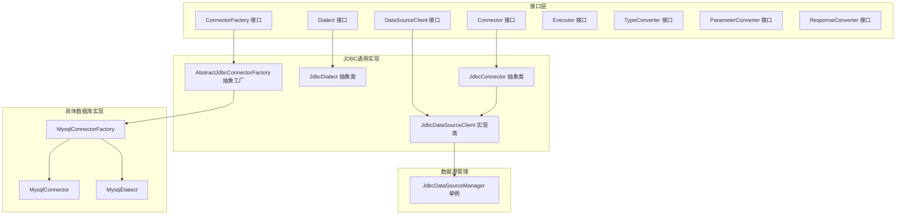
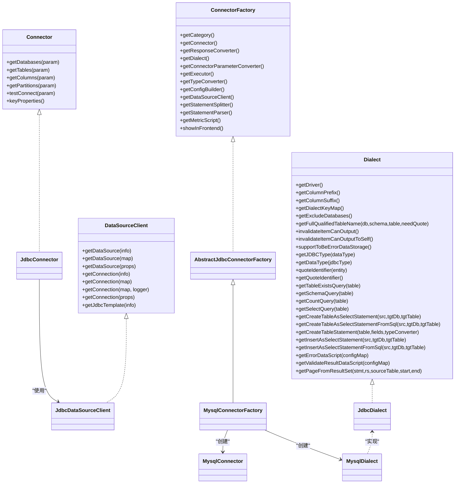
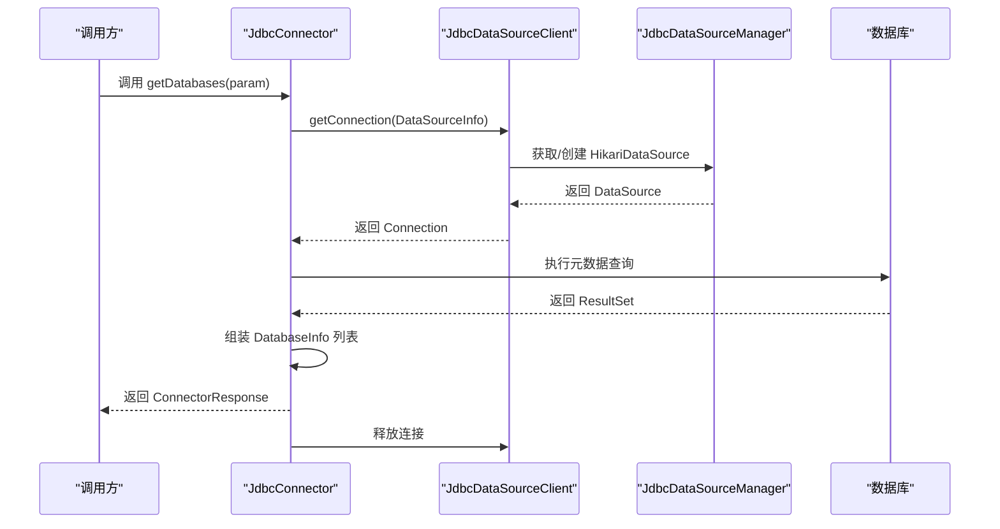
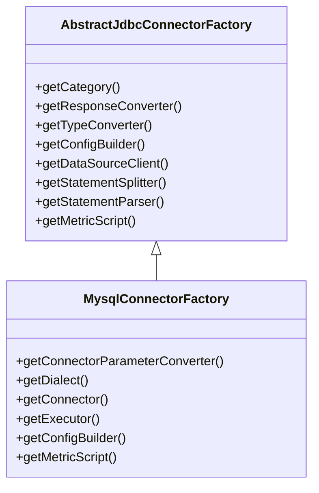
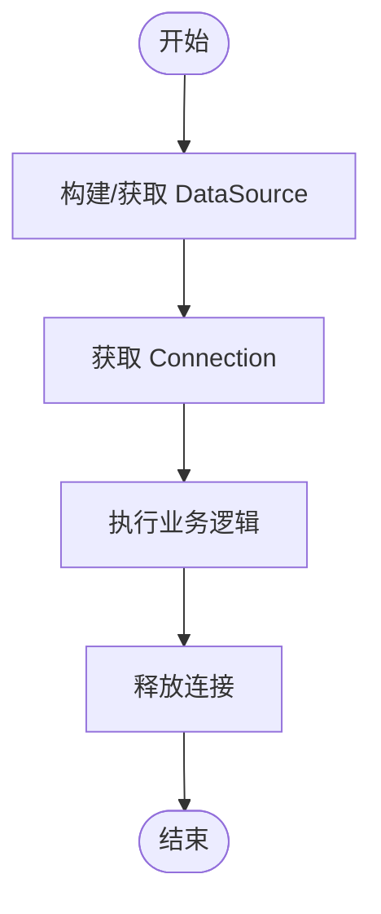
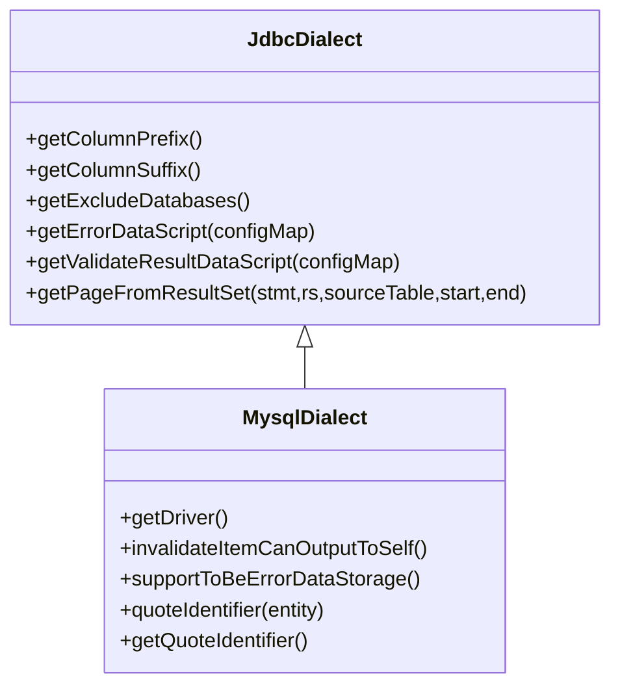
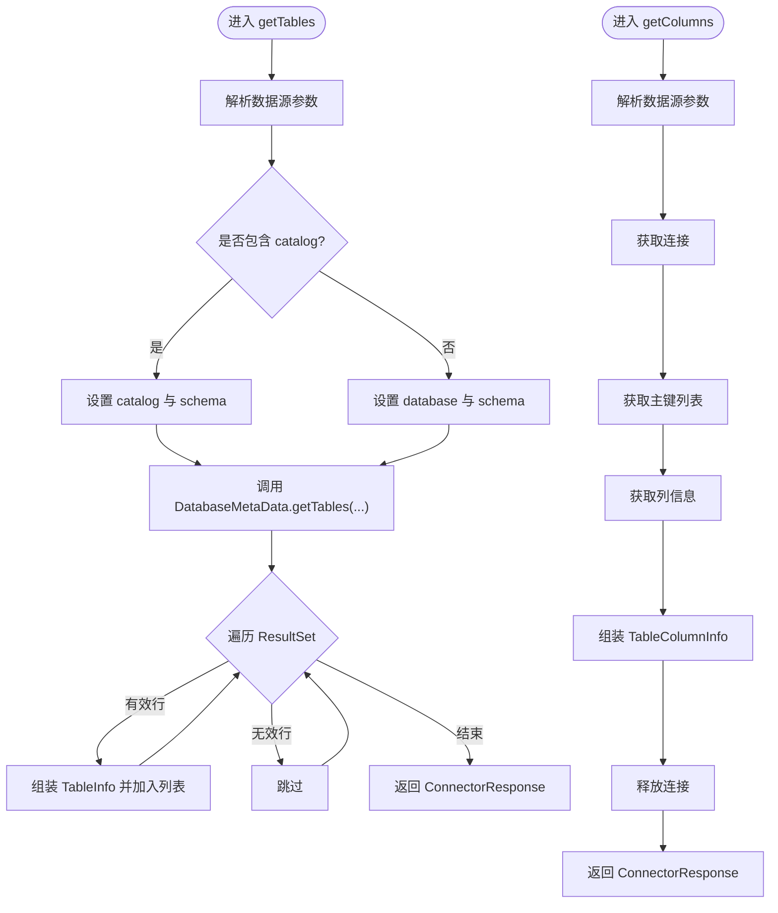
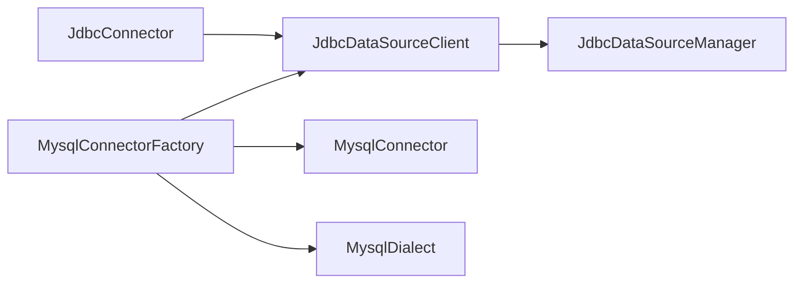

## 引言

本技术文档围绕 DataVines 连接器接口设计进行系统化梳理，重点解析以下方面：
- Connector 接口的设计理念与核心元数据获取方法（getDatabases、getTables、getColumns）的实现原理与调用流程
- ConnectorFactory工厂模式的实现机制，包括连接器实例化、配置管理与生命周期控制
- DataSourceClient数据源客户端的设计架构，涵盖连接管理、事务处理与资源释放策略
- Dialect方言接口的作用，包括SQL方言适配、类型转换与数据库特定功能支持
- 提供接口使用示例路径（以“代码片段路径”形式给出），并总结最佳实践与扩展指南

## 项目结构

DataVines采用分层与插件化的架构组织连接器相关代码：
- 接口层：位于datavines-connector-api模块，定义了Connector、ConnectorFactory、DataSourceClient、Dialect等核心接口
- JDBC通用实现：位于datavines-connector-jdbc插件，提供JdbcConnector、JdbcDataSourceClient、JdbcDialect等抽象与默认实现
- 具体数据库实现：位于各数据库插件（如MySQL、PostgreSQL等），继承或组合通用实现，覆盖差异化行为
- 数据源管理：位于datavines-common模块，提供基于HikariCP的数据源池化管理

图表来源
- [Connector.java](file://datavines-connector/datavines-connector-api/src/main/java/io/datavines/connector/api/Connector.java#L24-L72)
- [ConnectorFactory.java](file://datavines-connector/datavines-connector-api/src/main/java/io/datavines/connector/api/ConnectorFactory.java#L21-L51)
- [DataSourceClient.java](file://datavines-connector/datavines-connector-api/src/main/java/io/datavines/connector/api/DataSourceClient.java#L30-L47)
- [Dialect.java](file://datavines-connector/datavines-connector-api/src/main/java/io/datavines/connector/api/Dialect.java#L33-L150)
- [Executor.java](file://datavines-connector/datavines-connector-api/src/main/java/io/datavines/connector/api/Executor.java#L24-L46)
- [TypeConverter.java](file://datavines-connector/datavines-connector-api/src/main/java/io/datavines/connector/api/TypeConverter.java#L21-L26)
- [ParameterConverter.java](file://datavines-connector/datavines-connector-api/src/main/java/io/datavines/connector/api/ParameterConverter.java#L25-L37)
- [ResponseConverter.java](file://datavines-connector/datavines-connector-api/src/main/java/io/datavines/connector/api/ResponseConverter.java#L19-L20)
- [JdbcConnector.java](file://datavines-connector/datavines-connector-plugins/datavines-connector-jdbc/src/main/java/io/datavines/connector/plugin/JdbcConnector.java#L42-L286)
- [JdbcDataSourceClient.java](file://datavines-connector/datavines-connector-plugins/datavines-connector-jdbc/src/main/java/io/datavines/connector/plugin/JdbcDataSourceClient.java#L32-L88)
- [JdbcDialect.java](file://datavines-connector/datavines-connector-plugins/datavines-connector-jdbc/src/main/java/io/datavines/connector/plugin/JdbcDialect.java#L33-L75)
- [AbstractJdbcConnectorFactory.java](file://datavines-connector/datavines-connector-plugins/datavines-connector-jdbc/src/main/java/io/datavines/connector/plugin/AbstractJdbcConnectorFactory.java#L21-L62)
- [MysqlConnector.java](file://datavines-connector/datavines-connector-plugins/datavines-connector-mysql/src/main/java/io/datavines/connector/plugin/MysqlConnector.java#L28-L45)
- [MysqlDialect.java](file://datavines-connector/datavines-connector-plugins/datavines-connector-mysql/src/main/java/io/datavines/connector/plugin/MysqlDialect.java#L23-L49)
- [MysqlConnectorFactory.java](file://datavines-connector/datavines-connector-plugins/datavines-connector-mysql/src/main/java/io/datavines/connector/plugin/MysqlConnectorFactory.java#L21-L52)
- [JdbcDataSourceManager.java](file://datavines-common/src/main/java/io/datavines/common/datasource/jdbc/JdbcDataSourceManager.java#L32-L143)

章节来源
- [Connector.java](file://datavines-connector/datavines-connector-api/src/main/java/io/datavines/connector/api/Connector.java#L24-L72)
- [ConnectorFactory.java](file://datavines-connector/datavines-connector-api/src/main/java/io/datavines/connector/api/ConnectorFactory.java#L21-L51)
- [JdbcConnector.java](file://datavines-connector/datavines-connector-plugins/datavines-connector-jdbc/src/main/java/io/datavines/connector/plugin/JdbcConnector.java#L42-L286)

## 核心组件
- Connector接口：定义统一的元数据获取能力（数据库、表、列、分区、连接测试）以及关键属性键集合，便于上层统一调度与参数校验
- ConnectorFactory接口：通过SPI注解暴露工厂能力，负责产出连接器、方言、参数转换器、类型转换器、执行器、配置构建器、数据源客户端、语句拆分器与解析器、度量脚本等组件
- DataSourceClient接口：封装数据源与连接获取，提供多种重载以适配不同配置输入，并提供JdbcTemplate便捷访问
- Dialect接口：抽象SQL方言能力，包括标识符转义、表名拼装、常用查询模板、类型映射、错误数据与结果验证脚本生成、分页读取等
- Executor接口：定义查询与删除等执行能力，为上层指标计算与数据操作提供统一入口
- TypeConverter/ParameterConverter/ResponseConverter：分别负责类型转换、参数归一化与响应转换的扩展点

章节来源
- [Connector.java](file://datavines-connector/datavines-connector-api/src/main/java/io/datavines/connector/api/Connector.java#L24-L72)
- [ConnectorFactory.java](file://datavines-connector/datavines-connector-api/src/main/java/io/datavines/connector/api/ConnectorFactory.java#L21-L51)
- [DataSourceClient.java](file://datavines-connector/datavines-connector-api/src/main/java/io/datavines/connector/api/DataSourceClient.java#L30-L47)
- [Dialect.java](file://datavines-connector/datavines-connector-api/src/main/java/io/datavines/connector/api/Dialect.java#L33-L150)
- [Executor.java](file://datavines-connector/datavines-connector-api/src/main/java/io/datavines/connector/api/Executor.java#L24-L46)
- [TypeConverter.java](file://datavines-connector/datavines-connector-api/src/main/java/io/datavines/connector/api/TypeConverter.java#L21-L26)
- [ParameterConverter.java](file://datavines-connector/datavines-connector-api/src/main/java/io/datavines/connector/api/ParameterConverter.java#L25-L37)
- [ResponseConverter.java](file://datavines-connector/datavines-connector-api/src/main/java/io/datavines/connector/api/ResponseConverter.java#L19-L20)

## 架构总览
下图展示了从接口到具体实现的层次关系与交互：

图表来源
- [Connector.java](file://datavines-connector/datavines-connector-api/src/main/java/io/datavines/connector/api/Connector.java#L24-L72)
- [ConnectorFactory.java](file://datavines-connector/datavines-connector-api/src/main/java/io/datavines/connector/api/ConnectorFactory.java#L21-L51)
- [DataSourceClient.java](file://datavines-connector/datavines-connector-api/src/main/java/io/datavines/connector/api/DataSourceClient.java#L30-L47)
- [Dialect.java](file://datavines-connector/datavines-connector-api/src/main/java/io/datavines/connector/api/Dialect.java#L33-L150)
- [JdbcConnector.java](file://datavines-connector/datavines-connector-plugins/datavines-connector-jdbc/src/main/java/io/datavines/connector/plugin/JdbcConnector.java#L42-L286)
- [JdbcDataSourceClient.java](file://datavines-connector/datavines-connector-plugins/datavines-connector-jdbc/src/main/java/io/datavines/connector/plugin/JdbcDataSourceClient.java#L32-L88)
- [JdbcDialect.java](file://datavines-connector/datavines-connector-plugins/datavines-connector-jdbc/src/main/java/io/datavines/connector/plugin/JdbcDialect.java#L33-L75)
- [AbstractJdbcConnectorFactory.java](file://datavines-connector/datavines-connector-plugins/datavines-connector-jdbc/src/main/java/io/datavines/connector/plugin/AbstractJdbcConnectorFactory.java#L21-L62)
- [MysqlConnector.java](file://datavines-connector/datavines-connector-plugins/datavines-connector-mysql/src/main/java/io/datavines/connector/plugin/MysqlConnector.java#L28-L45)
- [MysqlDialect.java](file://datavines-connector/datavines-connector-plugins/datavines-connector-mysql/src/main/java/io/datavines/connector/plugin/MysqlDialect.java#L23-L49)
- [MysqlConnectorFactory.java](file://datavines-connector/datavines-connector-plugins/datavines-connector-mysql/src/main/java/io/datavines/connector/plugin/MysqlConnectorFactory.java#L21-L52)

## 详细组件分析

### Connector接口与元数据获取流程
- 设计理念：统一抽象不同数据库的元数据访问能力，屏蔽底层差异；通过参数对象与返回对象标准化数据交换
- 核心方法：
  - getDatabases：根据数据源参数解析数据库列表，支持直接指定数据库或枚举所有库
  - getTables：根据catalog/schema/数据库参数获取表清单，兼容视图与表类型
  - getColumns：按表获取列信息与主键集合，确保列归属正确性
  - getPartitions/testConnect：提供分区元数据与连通性测试能力
  - keyProperties：声明连接器的关键属性键，用于参数校验与前端渲染
- 实现要点：
  - 使用JdbcConnector作为JDBC通用实现基类，复用连接获取、元数据查询与资源释放逻辑
  - 通过JdbcDataSourceClient与JdbcDataSourceManager实现连接池化与连接复用
  - 对异常进行捕获与包装，保证返回结构一致

图表来源
- [JdbcConnector.java](file://datavines-connector/datavines-connector-plugins/datavines-connector-jdbc/src/main/java/io/datavines/connector/plugin/JdbcConnector.java#L67-L91)
- [JdbcDataSourceClient.java](file://datavines-connector/datavines-connector-plugins/datavines-connector-jdbc/src/main/java/io/datavines/connector/plugin/JdbcDataSourceClient.java#L50-L75)
- [JdbcDataSourceManager.java](file://datavines-common/src/main/java/io/datavines/common/datasource/jdbc/JdbcDataSourceManager.java#L45-L69)

章节来源
- [Connector.java](file://datavines-connector/datavines-connector-api/src/main/java/io/datavines/connector/api/Connector.java#L24-L72)
- [JdbcConnector.java](file://datavines-connector/datavines-connector-plugins/datavines-connector-jdbc/src/main/java/io/datavines/connector/plugin/JdbcConnector.java#L67-L188)
- [JdbcDataSourceClient.java](file://datavines-connector/datavines-connector-plugins/datavines-connector-jdbc/src/main/java/io/datavines/connector/plugin/JdbcDataSourceClient.java#L32-L88)
- [JdbcDataSourceManager.java](file://datavines-common/src/main/java/io/datavines/common/datasource/jdbc/JdbcDataSourceManager.java#L32-L143)

### ConnectorFactory工厂模式与生命周期
- 工厂职责：
  - getCategory：声明连接器类别（如jdbc）
  - getConnector/getDialect/getExecutor/getTypeConverter/getConfigBuilder/getDataSourceClient/getStatementSplitter/getStatementParser/getMetricScript：统一产出各组件实例
  - 参数转换与前端展示开关：提供ParameterConverter与showInFrontend
- 生命周期控制：
  - 通过JdbcDataSourceManager单例维护HikariDataSource池，避免重复创建
  - 连接在使用后由JdbcConnector统一释放，确保资源不泄露
- 扩展方式：
  - 新增数据库时，继承AbstractJdbcConnectorFactory并实现具体连接器与方言类

图表来源
- [AbstractJdbcConnectorFactory.java](file://datavines-connector/datavines-connector-plugins/datavines-connector-jdbc/src/main/java/io/datavines/connector/plugin/AbstractJdbcConnectorFactory.java#L21-L62)
- [MysqlConnectorFactory.java](file://datavines-connector/datavines-connector-plugins/datavines-connector-mysql/src/main/java/io/datavines/connector/plugin/MysqlConnectorFactory.java#L21-L52)

章节来源
- [ConnectorFactory.java](file://datavines-connector/datavines-connector-api/src/main/java/io/datavines/connector/api/ConnectorFactory.java#L21-L51)
- [AbstractJdbcConnectorFactory.java](file://datavines-connector/datavines-connector-plugins/datavines-connector-jdbc/src/main/java/io/datavines/connector/plugin/AbstractJdbcConnectorFactory.java#L21-L62)
- [MysqlConnectorFactory.java](file://datavines-connector/datavines-connector-plugins/datavines-connector-mysql/src/main/java/io/datavines/connector/plugin/MysqlConnectorFactory.java#L21-L52)

### DataSourceClient数据源客户端架构
- 职责边界：
  - 统一数据源创建：支持BaseJdbcDataSourceInfo、Map、Properties三种配置输入
  - 连接获取：提供带日志记录的连接获取方法，异常统一包装为DataVinesException
  - JdbcTemplate支持：设置合理的fetchSize提升大数据量读取性能
- 资源管理：
  - 借助JdbcDataSourceManager实现连接池化与唯一键缓存
  - 连接释放由上层调用者负责（JdbcConnector中统一释放）

图表来源
- [JdbcDataSourceClient.java](file://datavines-connector/datavines-connector-plugins/datavines-connector-jdbc/src/main/java/io/datavines/connector/plugin/JdbcDataSourceClient.java#L32-L88)
- [JdbcDataSourceManager.java](file://datavines-common/src/main/java/io/datavines/common/datasource/jdbc/JdbcDataSourceManager.java#L45-L131)

章节来源
- [DataSourceClient.java](file://datavines-connector/datavines-connector-api/src/main/java/io/datavines/connector/api/DataSourceClient.java#L30-L47)
- [JdbcDataSourceClient.java](file://datavines-connector/datavines-connector-plugins/datavines-connector-jdbc/src/main/java/io/datavines/connector/plugin/JdbcDataSourceClient.java#L32-L88)
- [JdbcDataSourceManager.java](file://datavines-common/src/main/java/io/datavines/common/datasource/jdbc/JdbcDataSourceManager.java#L32-L143)

### Dialect方言接口与SQL适配
- 方言职责：
  - 标识符转义与引号策略（column prefix/suffix、quoteIdentifier）
  - 表名拼装与全限定名生成
  - 常用查询模板（存在性检查、计数、全量查询等）
  - 类型映射（JDBC类型与内部类型互转）
  - 错误数据与结果验证脚本生成
  - 分页读取ResultSet的能力
- MySQL方言示例：
  - 驱动类名、自引用输出能力、错误数据存储支持、反引号标识符策略

图表来源
- [JdbcDialect.java](file://datavines-connector/datavines-connector-plugins/datavines-connector-jdbc/src/main/java/io/datavines/connector/plugin/JdbcDialect.java#L33-L75)
- [MysqlDialect.java](file://datavines-connector/datavines-connector-plugins/datavines-connector-mysql/src/main/java/io/datavines/connector/plugin/MysqlDialect.java#L23-L49)

章节来源
- [Dialect.java](file://datavines-connector/datavines-connector-api/src/main/java/io/datavines/connector/api/Dialect.java#L33-L150)
- [JdbcDialect.java](file://datavines-connector/datavines-connector-plugins/datavines-connector-jdbc/src/main/java/io/datavines/connector/plugin/JdbcDialect.java#L33-L75)
- [MysqlDialect.java](file://datavines-connector/datavines-connector-plugins/datavines-connector-mysql/src/main/java/io/datavines/connector/plugin/MysqlDialect.java#L23-L49)

### 元数据获取算法流程
以下流程图展示JdbcConnector中getTables与getColumns的典型执行路径与分支判断：

图表来源
- [JdbcConnector.java](file://datavines-connector/datavines-connector-plugins/datavines-connector-jdbc/src/main/java/io/datavines/connector/plugin/JdbcConnector.java#L94-L148)
- [JdbcConnector.java](file://datavines-connector/datavines-connector-plugins/datavines-connector-jdbc/src/main/java/io/datavines/connector/plugin/JdbcConnector.java#L150-L188)

章节来源
- [JdbcConnector.java](file://datavines-connector/datavines-connector-plugins/datavines-connector-jdbc/src/main/java/io/datavines/connector/plugin/JdbcConnector.java#L94-L188)

## 依赖分析
- 组件耦合：
  - JdbcConnector强依赖DataSourceClient，用于连接获取与释放
  - MysqlConnectorFactory依赖JdbcDataSourceClient、MysqlConnector、MysqlDialect等具体实现
  - JdbcDataSourceManager作为全局单例，被JdbcDataSourceClient与JdbcConnector间接使用
- 外部依赖：
  - HikariCP连接池：提供高性能连接池化能力
  - Spring JdbcTemplate：简化JDBC访问与批量读取
- 潜在循环依赖：
  - 当前结构未发现直接循环依赖；工厂与实现通过接口解耦

图表来源
- [JdbcConnector.java](file://datavines-connector/datavines-connector-plugins/datavines-connector-jdbc/src/main/java/io/datavines/connector/plugin/JdbcConnector.java#L56-L60)
- [JdbcDataSourceClient.java](file://datavines-connector/datavines-connector-plugins/datavines-connector-jdbc/src/main/java/io/datavines/connector/plugin/JdbcDataSourceClient.java#L32-L88)
- [JdbcDataSourceManager.java](file://datavines-common/src/main/java/io/datavines/common/datasource/jdbc/JdbcDataSourceManager.java#L32-L143)
- [MysqlConnectorFactory.java](file://datavines-connector/datavines-connector-plugins/datavines-connector-mysql/src/main/java/io/datavines/connector/plugin/MysqlConnectorFactory.java#L21-L52)

章节来源
- [JdbcConnector.java](file://datavines-connector/datavines-connector-plugins/datavines-connector-jdbc/src/main/java/io/datavines/connector/plugin/JdbcConnector.java#L42-L286)
- [JdbcDataSourceClient.java](file://datavines-connector/datavines-connector-plugins/datavines-connector-jdbc/src/main/java/io/datavines/connector/plugin/JdbcDataSourceClient.java#L32-L88)
- [JdbcDataSourceManager.java](file://datavines-common/src/main/java/io/datavines/common/datasource/jdbc/JdbcDataSourceManager.java#L32-L143)
- [MysqlConnectorFactory.java](file://datavines-connector/datavines-connector-plugins/datavines-connector-mysql/src/main/java/io/datavines/connector/plugin/MysqlConnectorFactory.java#L21-L52)

## 性能考虑
- 连接池化：JdbcDataSourceManager使用HikariCP，默认最大池大小为10，建议结合业务并发与数据库承载能力调整
- 批量读取：JdbcDataSourceClient为JdbcTemplate设置合理fetchSize，有助于提升大数据量分页读取性能
- 资源释放：JdbcConnector在finally块中统一释放连接与结果集，避免内存泄漏
- SQL模板：Dialect提供常用查询模板，减少动态拼接带来的开销与错误

## 故障排查指南
- 连接失败：
  - 检查数据源参数（URL、用户名、密码、驱动类）是否正确
  - 查看JdbcDataSourceClient日志输出，定位获取连接阶段异常
- 元数据为空：
  - 确认catalog/schema/database参数是否匹配实际环境
  - 检查JdbcConnector中对表名大小写敏感场景的过滤逻辑
- 类型转换异常：
  - 核对Dialect与TypeConverter的映射关系，确保JDBC类型与内部类型一致
- 资源泄露：
  - 确保每次调用后均释放连接与结果集；关注finally块执行情况

章节来源
- [JdbcConnector.java](file://datavines-connector/datavines-connector-plugins/datavines-connector-jdbc/src/main/java/io/datavines/connector/plugin/JdbcConnector.java#L141-L145)
- [JdbcConnector.java](file://datavines-connector/datavines-connector-plugins/datavines-connector-jdbc/src/main/java/io/datavines/connector/plugin/JdbcConnector.java#L181-L185)
- [JdbcDataSourceClient.java](file://datavines-connector/datavines-connector-plugins/datavines-connector-jdbc/src/main/java/io/datavines/connector/plugin/JdbcDataSourceClient.java#L60-L75)

## 结论
DataVines连接器接口设计通过清晰的接口分层与工厂模式，实现了对多数据库的统一抽象与灵活扩展。JDBC通用实现与具体数据库实现分离，既保证了通用能力，又允许针对差异进行定制。配合连接池化与资源释放策略，整体具备良好的可维护性与性能表现。

## 附录：接口使用示例与最佳实践
- 使用示例（以“代码片段路径”形式给出）：
  - 获取数据库列表：参考 [JdbcConnector.getDatabases(...)](file://datavines-connector/datavines-connector-plugins/datavines-connector-jdbc/src/main/java/io/datavines/connector/plugin/JdbcConnector.java#L67-L91)
  - 获取表列表：参考 [JdbcConnector.getTables(...)](file://datavines-connector/datavines-connector-plugins/datavines-connector-jdbc/src/main/java/io/datavines/connector/plugin/JdbcConnector.java#L94-L148)
  - 获取列信息：参考 [JdbcConnector.getColumns(...)](file://datavines-connector/datavines-connector-plugins/datavines-connector-jdbc/src/main/java/io/datavines/connector/plugin/JdbcConnector.java#L150-L188)
  - 测试连接：参考 [JdbcConnector.testConnect(...)](file://datavines-connector/datavines-connector-plugins/datavines-connector-jdbc/src/main/java/io/datavines/connector/plugin/JdbcConnector.java#L196-L215)
  - 获取数据源连接：参考 [JdbcDataSourceClient.getConnection(...)](file://datavines-connector/datavines-connector-plugins/datavines-connector-jdbc/src/main/java/io/datavines/connector/plugin/JdbcDataSourceClient.java#L50-L75)
  - 获取方言能力：参考 [MysqlDialect.quoteIdentifier(...)](file://datavines-connector/datavines-connector-plugins/datavines-connector-mysql/src/main/java/io/datavines/connector/plugin/MysqlDialect.java#L41-L43)
  - 工厂创建连接器：参考 [MysqlConnectorFactory.getConnector()](file://datavines-connector/datavines-connector-plugins/datavines-connector-mysql/src/main/java/io/datavines/connector/plugin/MysqlConnectorFactory.java#L34-L36)
- 最佳实践：
  - 参数校验：优先使用Connector.keyProperties()进行关键字段校验
  - 异常处理：对外统一返回ConnectorResponse，内部捕获并记录日志
  - 资源管理：遵循“谁获取谁释放”的原则，确保finally块中释放连接
  - 扩展新数据库：继承AbstractJdbcConnectorFactory，实现对应Connector/Dialect/Executor等组件
  - 性能优化：合理设置连接池大小与JdbcTemplate fetchSize，避免大结果集阻塞
