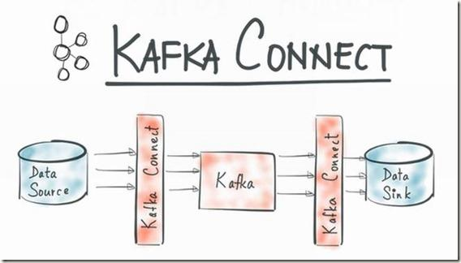
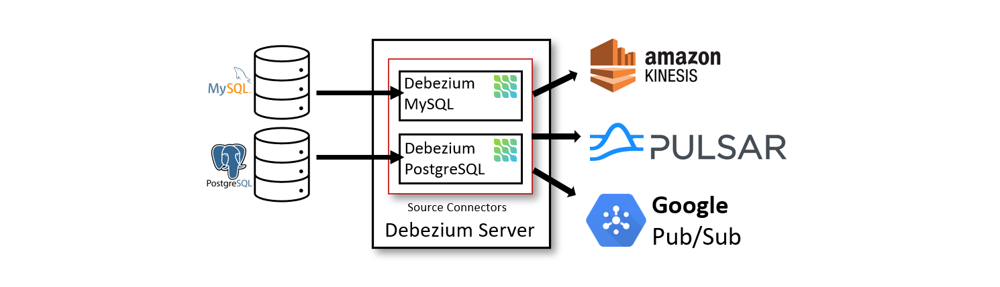

> Debezium 版本：1.6

在研究 Flink CDC 时，其中涉及了 Debezium，便决定研究一下 Debezium。这篇文章简单介绍了 Debezium 是什么，以及它的架构和特性。后续文章中会后续介绍其功能特性以及如何使用。

### 1. Debezium 是什么

Debezium 是一个分布式平台，可将您现有的数据库转换为事件流，因此应用程序可以感知到数据库中的每个行级更改并对此做出立即响应。

Debezium 构建在 Apache Kafka 之上，并提供与 [Kafka Connect](https://kafka.apache.org/documentation.html#connect) 兼容的 Connector 以便监控指定的数据库管理系统。从您的应用程序开始使用数据库的时候，Debezium 就会在 Kafka Log 中记录它们数据变更的历史记录。这会使您的应用程序可以轻松消费所有正确且完整的事件。即使您的应用程序意外停止，它也不会丢失任何事件：当应用程序重新启动时，会继续从上次它停止的位置重新消费。

### 2. 架构

#### 2.1 基于 Kafka Connect

最常见的架构是通过 Apache Kafka Connect 部署 Debezium。Kafka Connect 为 Kafka 和外部存储系统之间系统数据提供了一种可靠且可伸缩性的方式。它为 Connector 插件提供了一组 API 和一个运行时：Connect 负责运行这些插件，插件则负责移动数据。通过 Kafka Connect 可以快速实现 Source Connector 和 Sink Connector 进行交互构造一个低延迟的数据 Pipeline：

- Source Connector（例如，Debezium）：将记录发送到 Kafka
- Sink Connector：将 Kafka Topic 中的记录发送到其他系统

下图展示了基于 Debezium 的变更数据捕获 Pipeline 架构：

如上图所示，部署了 MySQL 和 PostgresSQL 的 Debezium Connector 以捕获这两种类型数据库的变更。每个 Debezium Connector 都会与其源数据库建立连接：
- MySQL Connector 使用客户端库来访问 binlog。
- PostgreSQL Connector 从逻辑副本流中读取数据。

除了 Kafka Broker 之外，Kafka Connect 也作为一个单独的服务运行。默认情况下，数据库表的变更会写入名称与表名称对应的 Kafka Topic 中。如果需要，您可以通过配置 Debezium 的 Topic 路由转换来调整目标 Topic 名称。例如，您可以：
- 将记录路由到名称与表名不同的 Topic 中
- 将多个表的变更事件记录流式传输到一个 Topic 中

变更事件记录在 Apache Kafka 中后，Kafka Connect 生态系统中的不同 Sink Connector 可以将记录流式传输到其他系统、数据库，例如 Elasticsearch、数据仓库、分析系统或者缓存（例如 Infinispan）。

#### 2.2 Debezium Server

另一种部署 Debezium 的方法是使用 [Debezium Server](https://debezium.io/documentation/reference/1.6/operations/debezium-server.html)。Debezium Server 是一个可配置的、随时可用的应用程序，可以将变更事件从源数据库流式传输到各种消息中间件上。

下图展示了基于 Debezium Server 的变更数据捕获 Pipeline 架构：

Debezium Server 配置使用 Debezium Source Connector 来捕获源数据库中的变更。变更事件可以序列化为不同的格式，例如 JSON 或 Apache Avro，然后发送到各种消息中间件，例如 Amazon Kinesis、Google Cloud Pub/Sub 或 Apache Pulsar。

#### 2.3 嵌入式引擎

使用 Debezium Connector 的另一种方法是[嵌入式引擎](https://debezium.io/documentation/reference/1.6/operations/embedded.html)。在这种情况下，Debezium 不会通过 Kafka Connect 运行，而是作为嵌入到您自定义 Java 应用程序中的库运行。这对于在您的应用程序本身内获取变更事件非常有帮助，无需部署完整的 Kafka 和 Kafka Connect 集群，也不用将变更流式传输到 Amazon Kinesis 等消息中间件上。

### 3. 特性

Debezium 是一组用于 Apache Kafka Connect 的 Source Connector。每个 Connector 都通过使用该数据库的变更数据捕获 (CDC) 功能从不同的数据库中获取变更。与其他方法（例如轮询或双重写入）不同，Debezium 的实现基于日志的 [CDC](https://smartsi.blog.csdn.net/article/details/120675143)：
- 确保捕获所有的数据变更。
- 以极低的延迟生成变更事件，同时避免因为频繁轮询导致 CPU 使用率增加。例如，对于 MySQL 或 PostgreSQL，延迟在毫秒范围内。
- 不需要更改您的数据模型，例如 'Last Updated' 列。
- 可以捕获删除操作。
- 可以捕获旧记录状态以及其他元数据，例如，事务 ID，具体取决于数据库的功能和配置。

Debezium Connector 可以通过一系列相关功能和参数来捕获数据变化：
- 快照：当 Connector 启动时，并非所有的日志都存在，我们可以选择性的对数据库当前所有状态进行一次初始化快照。通常，当数据库运行了一段时间并丢弃了不再需要进行事务恢复或复制的事务日志时，就会出现这种情况。
- 过滤器：可以通过包含/排除列表过滤器来配置捕获 Schema、表以及列。
- 屏蔽：可以屏蔽指定列的值，例如，某列包含敏感数据时。
- 监控：大多数 Connector 都可以使用 JMX 进行监控。
- 开箱即用的消息转换：
  - [消息路由](https://debezium.io/documentation/reference/1.6/configuration/topic-routing.html)
  - [基于内容的路由](https://debezium.io/documentation/reference/1.6/configuration/content-based-routing.html)
  - [为关系型 Connector 以及 MongoDB Connector 提取新记录状态](https://debezium.io/documentation/reference/1.6/configuration/event-flattening.html)
  - [过滤](https://debezium.io/documentation/reference/1.6/configuration/filtering.html)

参考：[Debezium Architecture](https://debezium.io/documentation/reference/1.6/architecture.html)
