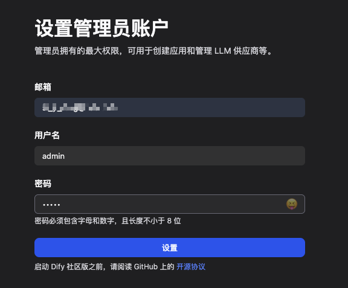
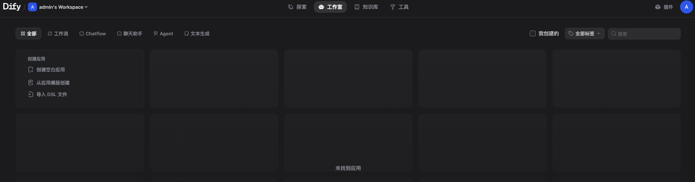

## 1. 前提条件

安装 Dify 之前, 请确保你的机器已满足最低安装要求：
- CPU >= 2 Core
- RAM >= 4 GiB


| 操作系统 | 软件 | 描述 |
| :------------- | :------------- | :------------- |
| macOS 10.14 及以上版本 | Docker Desktop  | 为 Docker 虚拟机（VM）至少分配 2 个虚拟 CPU(vCPU) 和 8GB 初始内存，否则安装可能会失败。安装请参考[使用 Docker Desktop 在 MacOS 上安装 Docker](https://smartsi.blog.csdn.net/article/details/138279554)。|
| Linux platforms | Docker 19.03 及以上版本; Docker Compose 1.28 及以上版本 | 请参阅安装 [Docker](https://docs.docker.com/engine/install/) 和安装 [Docker Compose](https://docs.docker.com/compose/install/) 以获取更多信息。|
| Windows with WSL 2 enabled | Docker Desktop | 我们建议将源代码和其他数据绑定到 Linux 容器中时，将其存储在 Linux 文件系统中，而不是 Windows 文件系统中。有关更多信息，请参阅使用 WSL 2 后端在 Windows 上安装 [Docker Desktop](https://docs.docker.com/desktop/windows/install/#wsl-2-backend)。 |


## 2. 克隆 Dify 代码仓库

克隆 Dify 源代码至本地环境：
```
# 使用 1.9.1 版本
git clone https://github.com/langgenius/dify.git --branch 1.9.1
```

## 3. 启动 Dify

进入 Dify 源代码的 Docker 目录:
```
cd dify/docker
```
复制环境配置文件:
```
cp .env.example .env
```
启动 Docker 容器
```
// 如果版本是 Docker Compose V2
docker compose up -d
// 如果版本是 Docker Compose V1
docker-compose up -d
```
> 根据你系统上的 Docker Compose 版本，选择合适的命令来启动容器。你可以通过 $ docker compose version 命令检查版本

运行命令后，你应该会看到类似以下的输出，显示所有容器的状态和端口映射：
```
smarsi:docker smartsi$ docker compose up -d
[+] Running 83/83
 ✔ ssrf_proxy Pulled                                                                            87.2s
 ✔ plugin_daemon Pulled                                                                         438.5s
 ✔ worker Pulled                                                                                162.4s
 ✔ nginx Pulled                                                                                 93.3s
 ✔ sandbox Pulled                                                                               116.5s
 ✔ api Pulled                                                                                   162.4s
 ✔ db Pulled                                                                                    113.7s
 ✔ weaviate Pulled                                                                              93.3s
 ✔ worker_beat Pulled                                                                           162.4s
 ✔ redis Pulled                                                                                 113.6s
 ✔ web Pulled                                                                                   193.0s
[+] Running 13/13
 ✔ Network docker_ssrf_proxy_network  Created                                                   0.0s
 ✔ Network docker_default             Created                                                   0.0s
 ✔ Container docker-redis-1           Started                                                   1.0s
 ✔ Container docker-web-1             Started                                                   0.8s
 ✔ Container docker-ssrf_proxy-1      Started                                                   1.0s
 ✔ Container docker-sandbox-1         Started                                                   1.0s
 ✔ Container docker-db-1              Healthy                                                   5.5s
 ✔ Container docker-weaviate-1        Started                                                   0.9s
 ✔ Container docker-plugin_daemon-1   Started                                                   5.3s
 ✔ Container docker-api-1             Started                                                   5.3s
 ✔ Container docker-worker_beat-1     Started                                                   5.3s
 ✔ Container docker-worker-1          Started                                                   5.3s
 ✔ Container docker-nginx-1           Started                                                   5.5s
smarsi:docker smartsi$
```
最后检查是否所有容器都正常运行：
```
docker compose ps
```
在这个输出中，你应该可以看到包括 3 个业务服务 api / worker / web，以及 6 个基础组件 weaviate / db / redis / nginx / ssrf_proxy / sandbox:
```
smarsi:docker smartsi$ docker compose ps
NAME                     IMAGE                                       COMMAND                   SERVICE         CREATED          STATUS                    PORTS
docker-api-1             langgenius/dify-api:1.9.1                   "/bin/bash /entrypoi…"   api             17 minutes ago   Up 17 minutes             5001/tcp
docker-db-1              postgres:15-alpine                          "docker-entrypoint.s…"   db              17 minutes ago   Up 17 minutes (healthy)   5432/tcp
docker-nginx-1           nginx:latest                                "sh -c 'cp /docker-e…"   nginx           17 minutes ago   Up 17 minutes             0.0.0.0:80->80/tcp, [::]:80->80/tcp, 0.0.0.0:443->443/tcp, [::]:443->443/tcp
docker-plugin_daemon-1   langgenius/dify-plugin-daemon:0.3.0-local   "/bin/bash -c /app/e…"   plugin_daemon   17 minutes ago   Up 17 minutes             0.0.0.0:5003->5003/tcp, [::]:5003->5003/tcp
docker-redis-1           redis:6-alpine                              "docker-entrypoint.s…"   redis           17 minutes ago   Up 17 minutes (healthy)   6379/tcp
docker-sandbox-1         langgenius/dify-sandbox:0.2.12              "/main"                   sandbox         17 minutes ago   Up 17 minutes (healthy)
docker-ssrf_proxy-1      ubuntu/squid:latest                         "sh -c 'cp /docker-e…"   ssrf_proxy      17 minutes ago   Up 17 minutes             3128/tcp
docker-weaviate-1        semitechnologies/weaviate:1.19.0            "/bin/weaviate --hos…"   weaviate        17 minutes ago   Up 17 minutes
docker-web-1             langgenius/dify-web:1.9.1                   "/bin/sh ./entrypoin…"   web             17 minutes ago   Up 17 minutes             3000/tcp
docker-worker-1          langgenius/dify-api:1.9.1                   "/bin/bash /entrypoi…"   worker          17 minutes ago   Up 17 minutes             5001/tcp
docker-worker_beat-1     langgenius/dify-api:1.9.1                   "/bin/bash /entrypoi…"   worker_beat     17 minutes ago   Up 17 minutes             5001/tcp
```
通过这些步骤，你可以在本地成功安装 Dify。

## 4. 访问 Dify

你可以先前往管理员初始化页面设置设置管理员账户：
```
# 本地环境
http://localhost/install

# 服务器环境
http://your_server_ip/install
```


通过 `http://localhost` 或者 `http://your_server_ip` 进入 Dify 主页面：


