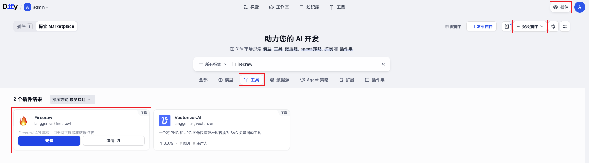
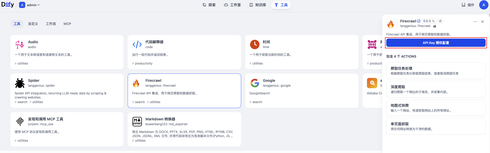
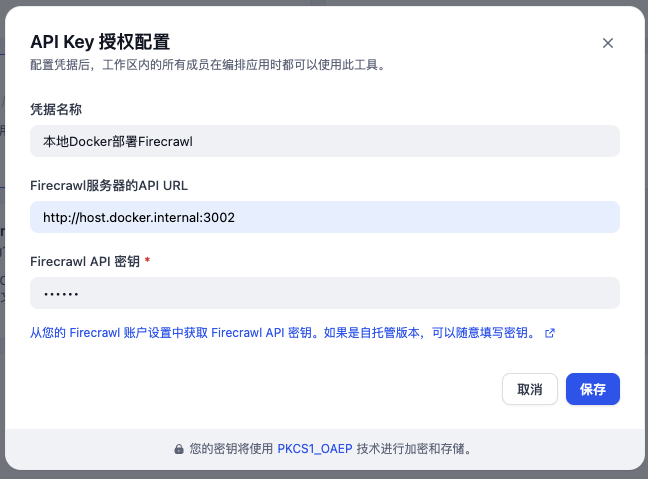
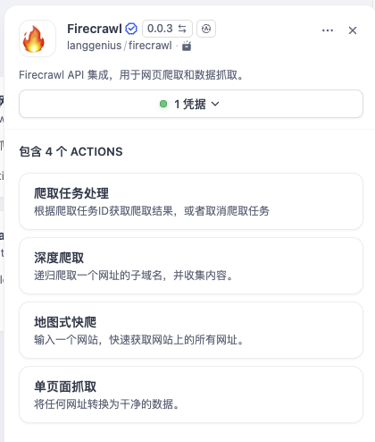
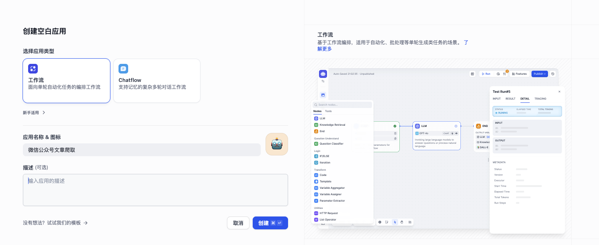
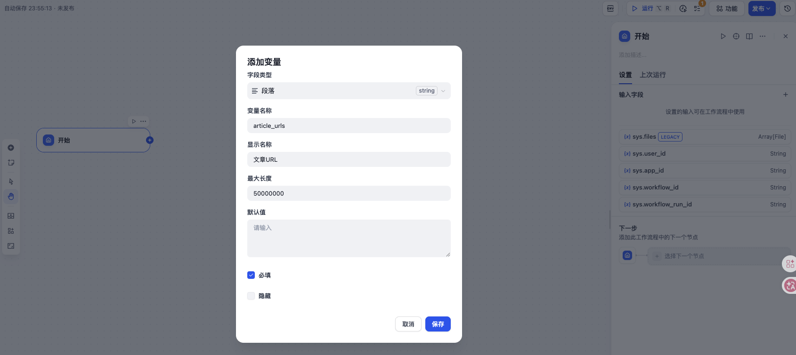
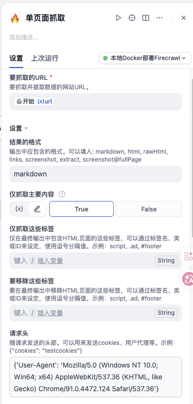
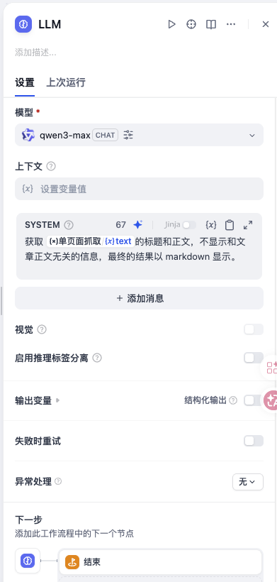
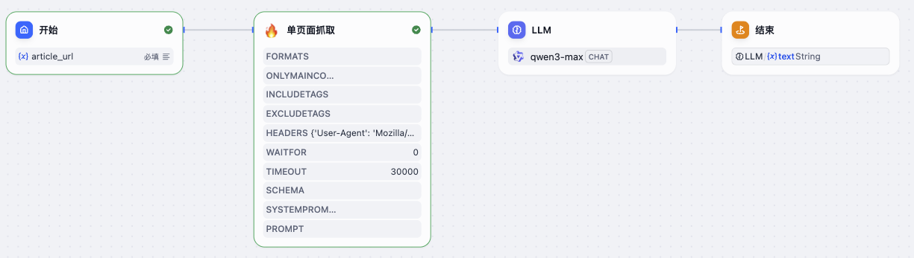
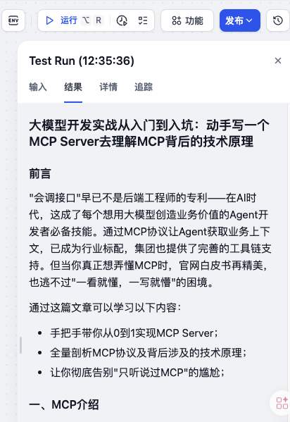

微信公众号作为中国最重要的内容创作与分发平台之一，蕴藏着海量的高质量文章。对于开发者、数据分析师或 AI 应用构建者来说，如何自动化地获取这些文章内容，并进一步用于训练模型、构建知识库或进行内容分析，成为一个常见的需求。

传统的爬虫方案往往需要处理复杂的登录态、动态渲染、反爬机制以及内容提取的通用性问题。而如今，借助 **Dify** 这个强大的 LLM 应用开发平台，结合 **Firecrawl** 这一智能网页爬取插件，我们可以用极低的代码成本，构建一个稳定、可扩展的微信公众号文章采集与处理流水线。

本文将介绍如何利用 **Dify** 的可视化工作流和 **Firecrawl** 的网页解析能力，实现微信公众号文章的自动化爬取、清洗和结构化存储。

## 1. 工具简介

### 1.1 Dify – 开源的 LLM 应用开发平台

**Dify** 是一个集成了模型管理、Prompt 编排、RAG 管道、Agent 和工作流等多种功能的开源平台。它允许开发者通过可视化的方式快速构建基于大语言模型的应用程序，而无需从零开始搭建后端服务。Dify 提供了丰富的插件生态，可以轻松接入外部工具和数据处理能力。

### 1.2 Firecrawl – 智能网页爬取与转换工具

**Dify** 团队在 0.6.11 版本中与 **Firecrawl** 达成合作，为知识库引入了同步 Web 站点数据的全新功能。这一更新不仅丰富了知识库的数据来源，还为用户提供了更加便捷、高效的信息获取方式，大大提升了用户体验。

**Firecrawl**（由 Mendable.ai 开源）是一个专门为 AI 应用设计的网页爬取和转换工具，它可以将任何网站的内容提取并转换为干净、结构化的 Markdown 格式，非常适合用于 LLM 的上下文输入。**Firecrawl** 自动处理了反爬、动态内容加载、内容提取等难题，开发者只需提供 URL 即可获得易于处理的文本内容。

**Dify** 官方提供了 **Firecrawl** 插件，可以直接在工作流中调用 **Firecrawl** 的能力，将网页爬取变为一个简单的节点操作。

## 2. 环境准备

在开始之前，我们需要完成以下准备工作。

### 2.1 部署 Dify

如果你希望本地部署，可以参考 [Dify 实战：使用 Docker Compose 部署 Dify](https://smartsi.blog.csdn.net/article/details/157618071)。  

### 2.2 部署 Firecrawl

**Firecrawl** 提供了云服务（[firecrawl.dev](https://www.firecrawl.dev/)），注册后可获得 API 密钥。你也可以自托管 **Firecrawl**，可以参考[Firecrawl 实战：使用 Docker compose 本地化部署 Firecrawl](https://smartsi.blog.csdn.net/article/details/155142512)。在这我们使用自托管 **Firecrawl**。

### 2.3  在 Dify 中安装 Firecrawl 插件

登录 **Dify** 控制台，进入「插件」页面。点击 「安装插件」，并选择 「Marketplace」 安装源。搜索「Firecrawl」并点击安装：  



插件安装完成后，需要进行 API Key 授权配置：



添加 FireCrawl 的 API 配置，确保 Base URL 设置为 `http://host.docker.internal:3002`，密钥可以随意填写:

> 当你需要在 Docker 容器中访问运行在宿主机上的服务时，可以使用 host.docker.internal 代替直接使用宿主机的 IP 地址或者主机名。这样做的好处是，它使得配置更加灵活，尤其是在开发环境中，因为你可以不必担心宿主机的具体 IP 地址是否会变化。



> 从您的 Firecrawl 账户设置中获取 Firecrawl API 密钥。如果是自托管版本，可以随意填写密钥。1



当看到上面界面表示安装 **Firecrawl** 插件已经完成。

## 3. 创建微信公众号文章爬取工作流

接下来，我们将一步步构建一个能够自动爬取微信公众号文章的工作流。在这我们将以单篇文章爬取为例，假设我们已经有了目标文章的 URL。

### 3.1 新建工作流

在 **Dify** 中，进入「工作室」→「工作流」，点击「创建空白工作流」，命名为「微信公众号文章爬取」。



### 3.2 添加开始节点

我们需要让工作流能够接收一篇文章 URL 作为输入。添加一个「开始」节点，并定义一个输入变量 `article_url`，类型为字符串。



### 3.3 添加 Firecrawl 节点

在工作流画布中，点击「+」添加节点，选择「工具」→「Firecrawl」 →「单页面抓取」。配置该节点：
- **输入**：将「开始」节点的 `article_url` 变量传入 **Firecrawl** 的 `url` 参数。
- **爬取模式**：这里我们选择 `单页面抓取`，只爬取单个页面。
- **附加选项**：
  - 结果的格式：最后输出格式。可以填入 `markdown`, `html` 等，在这选择 `markdown`。
  - 仅抓取主要内容：设置为 `true`，只提取文章正文，过滤掉导航、广告等噪音。
  - 请求头设置：公众号有反爬措施，正常爬取会被识别成机器人，需要请添加求头，伪装成正常的浏览器 `{'User-Agent': 'Mozilla/5.0 (Windows NT 10.0; Win64; x64) AppleWebKit/537.36 (KHTML, like Gecko) Chrome/91.0.4472.124 Safari/537.36'}`



> Firecrawl 支持一次爬取多个 URL（数组形式），因此需要将多行文本转换为数组。可以使用 Dify 内置的 Code 节点进行转换，或者直接在 Firecrawl 节点中用表达式处理（如 `split(\n)`）。

### 3.4 LLM节点

在工作流画布 **Firecrawl** 节点上，点击「+」添加节点，选择「节点」→「LLM」。配置该节点：
- 模型：选择具有强大结构化输出能力的模型。在这选择 `qwen3-max`
- SYSTEM：编写清晰的指令，描述要提取什么信息以及如何格式化。
```
获取 {前面一个节点的输出参数} 的标题和正文，不显示和文章正文无关的信息，最终的结果以 markdown 显示。
```



### 3.5 结束节点

在输出节点中，你可以通过添加输出变量（例如 LLM 的响应）来定义应从工作流返回给用户的数据。必须至少指定一个输出变量；否则，不会返回任何内容。

### 4. 测试运行

保存工作流之后，整体流程如下所示：



点击「运行」，输入一个微信公众号文章的 URL（例如 `https://mp.weixin.qq.com/s/2GvezWeCw9muGfKVEdstGA`），观察 **Firecrawl** 节点是否成功返回内容，并检查格式化结果是否正确。



## 5. 总结

通过 **Dify** 和 **Firecrawl** 插件的组合，我们可以在不编写复杂爬虫代码的情况下，快速搭建一个微信公众号文章采集与处理流水线。**Dify** 的可视化工作流让整个过程变得直观且易于维护，而 **Firecrawl** 强大的网页解析能力则保证了内容提取的质量。无论是用于构建个人知识库、训练专属模型，还是进行内容聚合分析，这套方案都能大幅提升开发效率。

---
