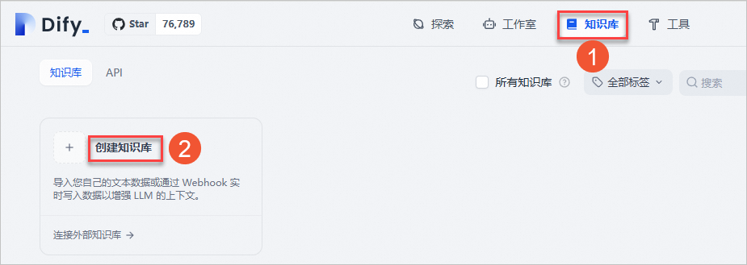
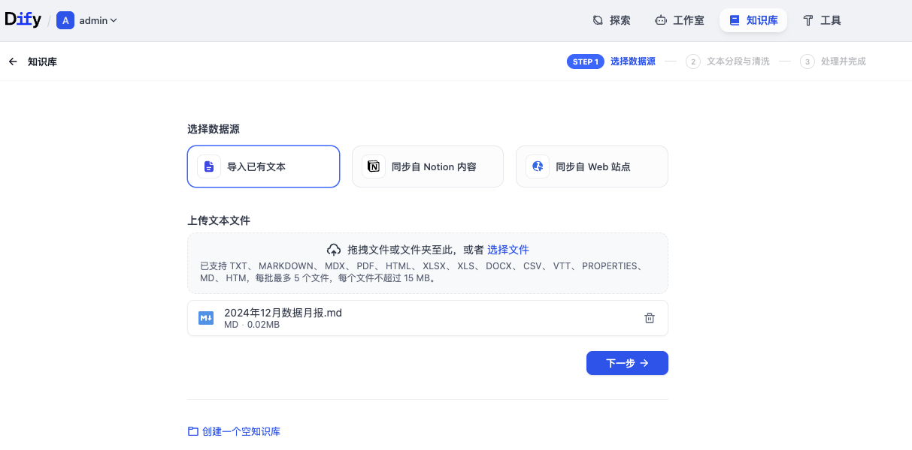
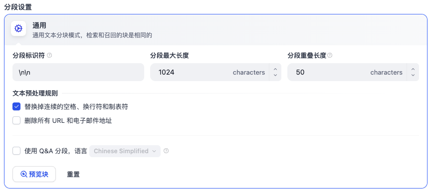
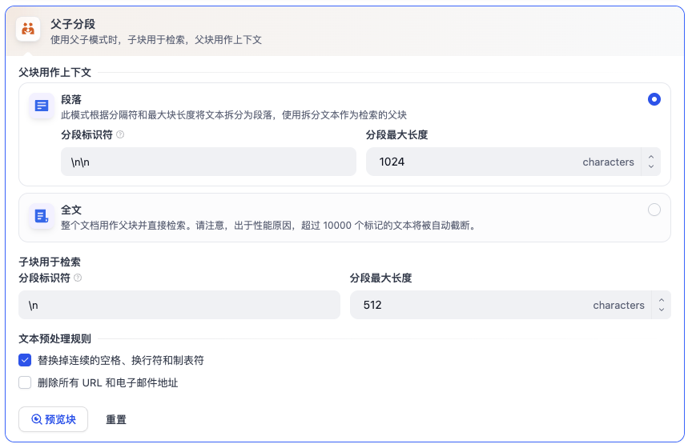
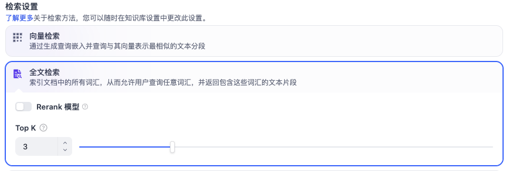
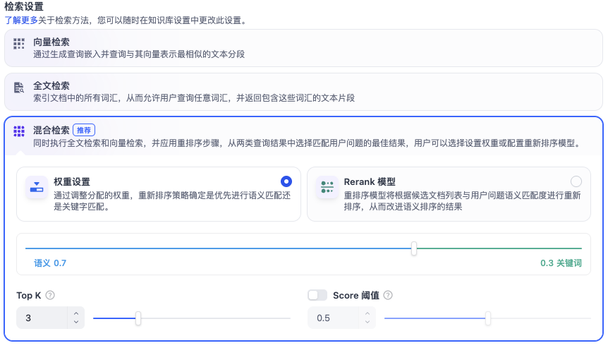

在信息爆炸的时代，企业最大的痛点往往不是“没有数据”，而是“无法快速从数据中找到答案”。无论是产品手册、技术文档还是法律条文，传统的文档管理方式让检索变得低效。而大语言模型（LLM）的出现为解决这个问题提供了新思路，但通用模型并不了解你的私有数据。

Dify 作为一个开源的 LLM 应用开发平台，通过其强大的知识库功能，完美地搭建了私有数据与大模型之间的桥梁。本文将手把手带你深入 Dify 知识库的构建全过程，从基础概念到高阶调优，助你打造一个“懂业务”的 AI 问答专家。

## 1. 简介

在开始动手之前，我们先要理解知识库的核心价值。在 Dify 中，你可以将自有数据作为「知识」集成到 AI 应用中。通过为大语言模型 LLM 提供特定领域的上下文信息，知识能够让 LLM 的回复更加准确、相关，并显著减少幻觉。Dify 的知识库本质上是一个检索增强 RAG 生成的最佳实践工具。其核心在于：LLM 不再只依赖预训练的公开数据，还会将你的自定义知识作为额外的事实来源：
- 检索：处理用户提问时，系统会先从已集成的知识库中 检索最相关的信息。
- 增强：检索到的信息会与用户的原始问题打包，作为 增强的上下文 发送给 LLM。
- 生成：LLM 基于这些上下文 生成更精准的答案。

知识存储在知识库中。你可以创建多个知识库，分别适配不同领域、场景或数据源，并按需集成到应用中。

那为什么选择 Dify 知识库呢？Dify 知识库带来了三大核心优势：
- 零代码友好：提供可视化界面，无需编程基础即可完成从文档上传到应用搭建的全流程。
- 成本可控：基于开源架构，可部署在本地或私有云，结合 DeepSeek 等开源模型甚至可以实现零成本构建。
- 精准可靠：通过检索私域数据生成回答，有效避免大模型的“幻觉”问题，让 AI 真正成为行业专家。

## 2. 应用场景

借助 Dify 知识库，你可以打造基于自有数据和特定领域知识的 AI 应用。常见场景包括：
- 智能客服机器人：让问答机器人基于最新的产品文档、FAQ 和故障排查指南，智能回复客户问题。
- 企业内部知识门户：为员工构建 AI 搜索与问答系统，快速查询公司政策与流程。
- 内容生成工具：根据特定背景资料，智能生成报告、文章或邮件。
- 科研与分析应用：检索和总结学术论文、市场报告、法律文档等专业知识，辅助研究与分析。

## 3. 手把手创建你的第一个知识库

一切准备就绪，现在我们进入核心环节——创建知识库。

### 3.1 创建知识库选择数据源

在 Dify 首页的顶部菜单，单击知识库，然后单击创建知识库：

在创建知识库页面，配置参数。创建知识库有导入已有文本、同步自 Notion 内容、同步自 Web 站点三种方式，也可以创建一个空的知识库。本示例选择导入已有文本，并上传文本文件：

> Dify 支持 TXT、MD、PDF、DOCX 等多种常见格式。

单击下一步后，您可根据页面引导，进行文本分段与清洗。

### 3.2 文本分段与清洗

导入知识库的文档会被拆分为较小的片段，称为分段。分段的概念类似于将一本大书整理成章节和段落——你无法在一大块文本中快速找到特定信息，但组织良好的章节能使检索变得高效。
当用户提出问题时，系统会在这些分段中搜索相关信息，并将其作为上下文提供给 LLM。如果没有分段，每次查询都需要处理整个文档，这将既缓慢又低效。

#### 3.2.1 分段模式

该阶段是内容的预处理与数据结构化过程，长文本将会被划分为多个内容分段。你可以在此环节预览文本的分段效果。再介绍分段模式之前先介绍一下分段的几个重要参数：
- 分隔符：文本被拆分的字符或字符序列。例如，`\n\n` 在段落换行处拆分，`\n` 在行换行处拆分。
  - 需要注意的是分隔符在分段过程中会被移除。例如，使用 `A` 作为分隔符会将 `CBACD` 拆分为 `CB` 和 `CD`。为避免信息丢失，请使用文档中不会自然出现的非内容字符。
  - 默认是 `\n\n`，即按段落切分。如果你的文档是 Markdown 格式，可以尝试用 `##` 作为标识符，按章节切分。
- 分段最大长度：每个分段的最大字符数。超过此限制的文本将被强制拆分，无论分隔符设置如何。
- 分段重叠长度：分段重叠长度来指定相邻分段之间重叠的字符数。这有助于保持语义连接，防止重要信息被拆分到不同的分段边界。
  - 建议设置为最大长度的 5%-10%。这能确保关键信息（如段尾的结论和段首的引言）不会因被切断而丢失
  - 例如，设置 50 个字符的重叠，一个分段的最后 50 个字符也会出现在下一个分段的前 50 个字符中。

下面详细介绍一下 Dify 提供的两种模式：通用分段 和 父子分段。

| 维度 | 通用模式 | 父子模式 |
| :------------- | :------------- | :------------- |
| 分段策略  | 单层：所有分段使用相同设置 | 双层：父分段和子分段分别设置 |
| 检索流程	| 匹配的分段直接返回	| 子分段用于匹配查询；父分段返回以提供更广泛的上下文 |
| 兼容的索引方式	| 高质量、经济	| 仅高质量 |
| 最佳适用场景 | 简单、独立的内容，如术语表或常见问题	| 信息密集型文档，如技术手册或研究论文，上下文很重要 |

##### 3.2.1.1 通用分段

通用分段是最常用的模式，文本被均匀切块。适合大多数技术文档、操作手册：

在通用模式下，所有分段共享相同的设置。匹配的分段将直接作为检索结果返回。通用模式分段设置可以设置分隔符、分段最大长度以及分段重叠长度。此外分段前需要进行文本预处理：在将文本拆分为分段之前，你可以清理无关内容以提高检索质量：
- 替换连续的空格、换行符和制表符
  - 三个或更多连续换行符 → 两个换行符  
  - 多个空格 → 单个空格
  - 制表符、换页符和特殊 Unicode 空格 → 普通空格
- 删除所有 URL 和电子邮件地址

##### 3.2.1.2 父子分段

父子分段是一种高级策略，使用小颗粒度的子分段检索，返回包含更多上下文的父分段。兼顾精度与上下文完整性。

在父子模式下，文本被拆分为两层：较小的 **子分段** 和较大的 **父分段**。当查询匹配到子分段时(子分段用于检索)，其整个父分段将作为检索结果返回(父分段用作上下文)。这解决了一个常见的检索困境：较小的分段能够实现精确的查询匹配但缺乏上下文，而较大的分段提供丰富的上下文但降低了检索准确性。父子模式兼顾两者——以精准检索，以上下文响应。

父分段可以在段落或全文模式下创建:
- 段落模式:
  - 文档根据指定的分隔符和分段最大长度被拆分为多个父分段。
  - 适用于结构良好的长文档，其中每个部分都能独立提供有意义的上下文。
  
- 全文模式
  - 整个文档作为单个父分段。
  - 适用于小型、内容紧密的文档，其中完整的上下文对于理解任何具体细节都是必要的。
  

> 父分段设置

每个父分段会使用其自己的分隔符和分段最大长度设置进一步拆分为子分段。避免为父分段和子分段使用互为子集的分隔符，因为这可能导致意外的分段行为。例如，推荐使用 `??` 和 `##`，而不是 `??` 和 `?`。

> 子分段设置

#### 3.2.2 索引方式

> 知识库在接收到用户查询问题后，按照预设的检索方式在已有的文档内查找相关内容，提取出高度相关的信息片段供语言模型生成高质量答案。

选定内容的分段模式后，接下来设定对于结构化内容的索引方式。正如搜索引擎通过高效的索引算法匹配与用户问题最相关的网页内容，索引方式是否合理将直接影响 LLM 对知识库内容的检索效率以及回答的准确性。Dify 提供了 高质量 与 经济 两种索引方式，其中分别提供不同的检索设置选项。

##### 3.2.2.1 高质量索引

高质量索引方式是推荐的一种方式，可以调用嵌入模型处理文档以实现更精确的检索，可以帮助 LLM 生成高质量的答案。高质量索引方式使用嵌入模型将内容分段转化为数字向量，这一过程称为嵌入或向量化。这些向量可理解为多维空间中的坐标点——两个点越接近，它们的语义越相似。这使得系统能够基于语义相似度（而不仅仅是关键词匹配）找到相关信息。

高质量索引方式支持三种检索策略：向量检索、全文检索或混合检索。下面会详细介绍检索策略。

> 一旦以高质量型索引方式创建知识库，后续无法切换为经济型索引。

##### 3.2.2.2 经济索引

在经济索引模式下，每个区块内使用 10 个关键词进行检索，降低了准确度但无需消耗 Token。对于检索到的区块，仅提供倒排索引方式选择最相关的区块。

> 如果经济型索引方式的效果不符合预期，可以在知识库设置页中升级为高质量索引方式。

#### 3.2.3 检索方式

在高质量索引方式下，Dify 提供三种检索方式：向量检索、全文检索和混合检索：
- 向量检索：基于向量相似度的语义检索
  - 向量化用户输入的问题并生成查询向量，然后将其与知识库中对应的文本向量进行比较，找到最相邻的分段。
  - Rerank 模型：
    - 默认关闭。开启后将使用第三方 Rerank 模型对向量检索返回的文本分段进行重新排序，以优化结果。这有助于 LLM 获取更精确的信息并提升输出质量。
    - 开启该功能后，将消耗 Rerank 模型的 Token。
  - TopK：
    - 用于确定检索与用户问题相似度最高的文本分段数量。
    - 系统同时会根据选用模型上下文窗口大小动态调整分段数量。默认值为 3，数值越高，预期被召回的文本分段数量越多。
  - Score 阈值：
    - 用于设置文本分段被检索所需的最低相似度分数。只有超过该分数的分段才会被检索。
    - 默认值为 0.5。阈值越高，对相似度要求越高，因此被检索的分段数量越少。
  
- 全文检索(关键词)：索引文档中的所有词汇，从而允许用户查询任意词汇，并返回包含这些词汇的文本片段
  - 也可以设置 Rerank 模型并调节 TopK 值。
  
- 混合检索：同时执行全文检索和向量检索，并应用重排序步骤，从两类查询结果中选择匹配用户问题的最佳结果。
  - 用户可以选择设置权重或配置重排序模型两种模式。
  - 设置权重：此功能允许用户为语义优先和关键词优先设置自定义权重。关键词检索指的是在知识库内进行全文检索，语义检索指的是在知识库内进行向量检索。
    - 语义值设为 1 则为仅启用语义检索模式；关键词值设为 1 则为仅启用关键词检索模式。
    - 权重设置和 Rerank 模型两种方式均支持 TopK 和 Score 阈值选项。
  - 重排序模型：开启后将使用第三方 Rerank 模型对混合检索返回的文本分段进行重新排序，以优化结果。
    - 默认关闭。
  

Dify 的知识库支持这三种检索方式。强烈推荐开启混合检索（同时检索向量和关键词），并结合 Rerank 模型进行精排，效果最为稳定。

在经济索引模式下，仅提供倒排索引方式。倒排索引是一种用于快速检索文档中关键词的数据结构，常用于在线搜索引擎。倒排索引仅支持 TopK 设置。
