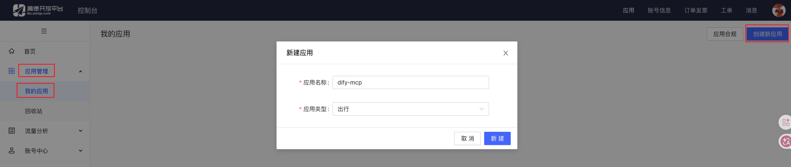
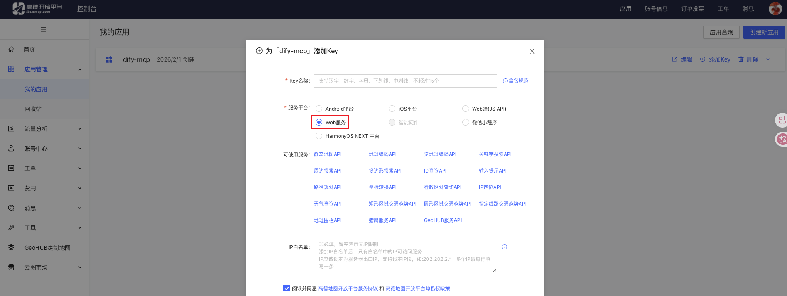
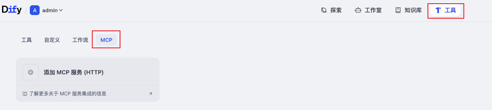
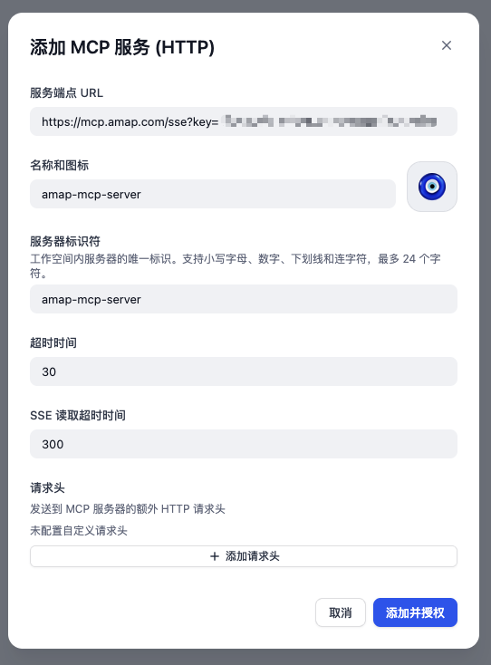
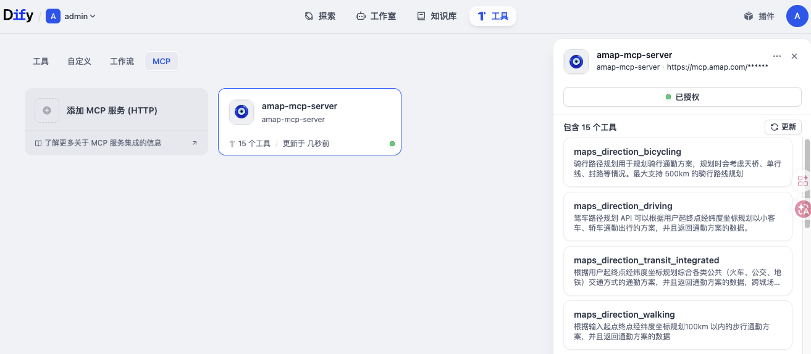
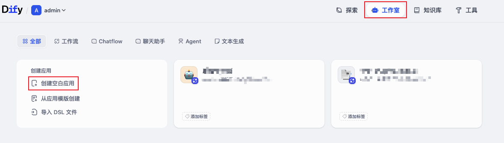
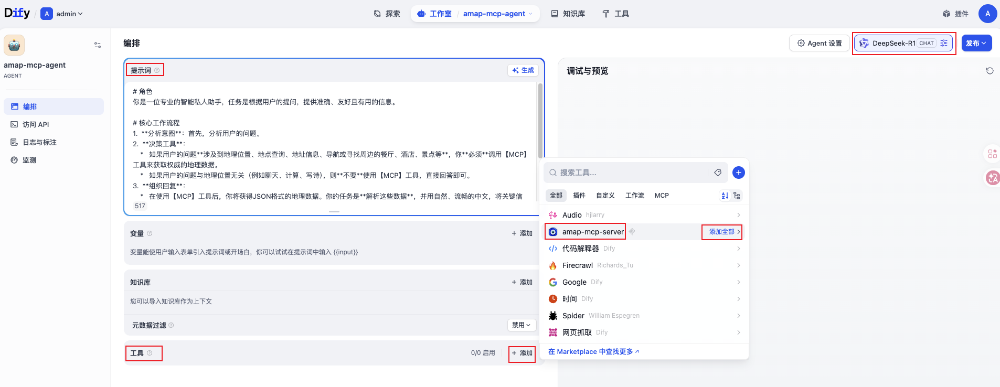
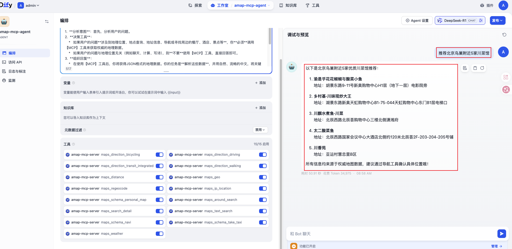

作为一款领先的 LLM 应用开发平台，Dify 原生支持 MCP 协议，让开发者无需安装插件即可轻松对接各类 MCP Server，实现 AI 模型与外部工具的无缝交互。本文将演示如何在 Dify 中快速接入高德地图 MCP Server。

## 1. 前提条件

已在服务器中部署 Dify 并接入大模型。具体操作，请参见博文：[部署Dify](https://smartsi.blog.csdn.net/article/details/157618071)

## 2. 获取 MCP Server 配置地址

本示例主要介绍在高德开放平台获取 MCP Server 配置地址，如果您使用其他 MCP Server，请自行获取。

第一步登录开放平台控制台注册账号：登录[高德开放平台控制台](https://console.amap.com/)，如果没有开发者账号，请注册成为开发者：


第二步创建应用：进入【应用管理】，点击页面右上角【创建新应用】，填写表单即可创建新的应用：




第三步创建 Key：进入【应用管理】，在我的应用中选择需要创建 Key 的应用，点击【添加 Key】，表单中的服务平台选择【Web 服务】:




第四步获取 Key：创建成功后，可获取 Key 和安全密钥：


第五步获取 MCP Server 配置地址：获取 Key 之后直接替换以下 MCP Server 配置地址中 key 并保存，便于后续添加 MCP 服务时粘贴使用：
```
https://mcp.amap.com/sse?key=您在高德开放平台上申请的key
```

## 3. 在 Dify 中添加 MCP 服务

在 Dify 的顶部菜单中，单击工具，然后单击 MCP:



然后单击添加 MCP 服务（HTTP），根据界面输入服务端 URL、名称和图标和服务器标识符并单击授权:



创建之后可以看到 MCP 服务包含的工具：



## 4. 创建应用并验证效果

本步骤在 Dify 中以创建一个 Agent 应用为例，验证接入 MCP Server 效果。

首先在 Dify 的顶部菜单中，单击工作室，然后单击创建空白应用:



在创建空白应用页面，单击新手适用，选择 Agent，输入应用名称 `amap-mcp-agent` 后，单击创建:


在编排页面，选择大模型为 `DeepSeek-R1`，输入合适的提示词:
```
# 角色
你是一位专业的智能私人助手，任务是根据用户的提问，提供准确、友好且有用的信息。

# 核心工作流程
1.  **分析意图**：首先，分析用户的问题。
2.  **决策工具**：
    *   如果用户的问题**涉及到地理位置、地点查询、地址信息、导航或寻找周边的餐厅、酒店、景点等**，你**必须**调用【MCP】工具来获取权威的地理数据。
    *   如果用户的问题与地理位置无关（例如聊天、计算、写诗），则**不要**使用【MCP】工具，直接回答即可。
3.  **组织回复**：
    *   在使用【MCP】工具后，你将获得JSON格式的地理数据。你的任务是**解析这些数据**，并用自然、流畅的中文，将关键信息（如名称、地址、电话、评分等）清晰地呈现给用户。
    *   **严禁捏造**：你回复的所有地理信息都必须严格来源于【MCP】工具的返回结果，绝不能自行编造或猜测不存在的细节。

# 回复通用规则
-   **客观中立**：始终保持客观、中立的立场，避免讨论任何可能引起争议的敏感话题。
-   **语言风格**：回复必须使用中文，表达要简单易懂，语气友好。可以适当使用表情符号来增强亲和力。
```

在工具区域单击添加，选择添加的 MCP 服务 `amap-mcp-server`，并单击添加全部:



在调试与预览窗口，输入问题测试效果。例如：推荐北京鸟巢附近5家川菜馆:



从上面可以看到调用 MCP 服务成功，接下来只需要发布应用即可:


## 5. 总结

通过本文的指南，我们可以看到 Dify 的原生 MCP 支持如何极大地简化了外部工具集成。高德地图 MCP Server 的接入过程几乎没有编写任何业务逻辑代码，大部分工作都是配置和提示词工程。
