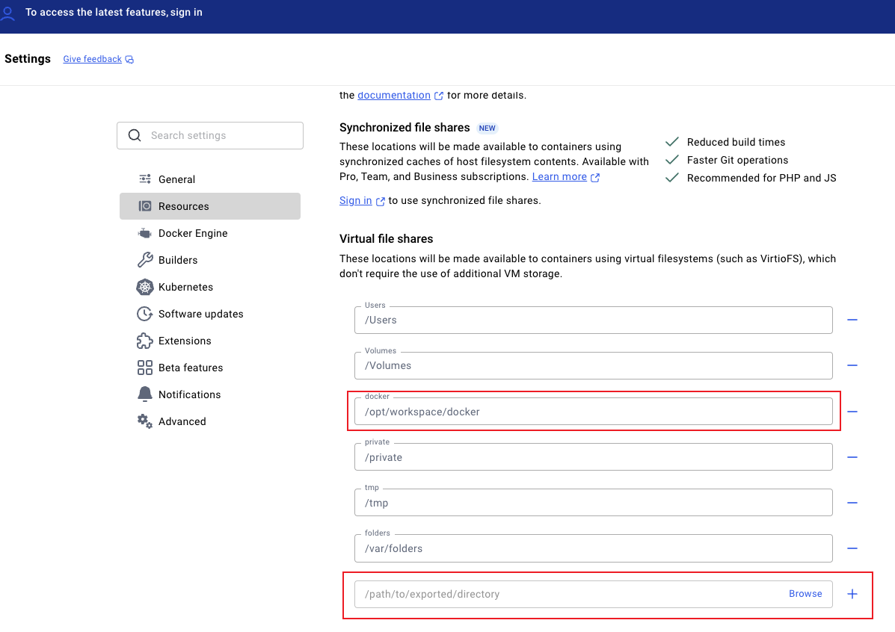

## 1. 问题

使用 `docker compose up -d` 启动容器时出现如下异常：
```
Error response from daemon: mounts denied:
The path /opt/workspace/docker/clickhouse/conf/config.d is not shared from the host and is not known to Docker.
You can configure shared paths from Docker -> Preferences... -> Resources -> File Sharing.
See https://docs.docker.com/go/mac-file-sharing/ for more info.
```

## 2. 解决方案

这个错误表明 Docker 试图访问在宿主机上挂载为 `/opt/workspace/docker/clickhouse/conf/config.d` 的一个路径，但是这个路径并没有被正确地共享给 Docker 容器。我们要确保文件路径在 Docker 守护程序的共享目录中。Docker 守护程序有一个默认的共享目录，需要把文件路径添加到共享目录下。可以通过 `Docker -> Preferences... -> Resources -> File Sharing` 路径完成配置。


