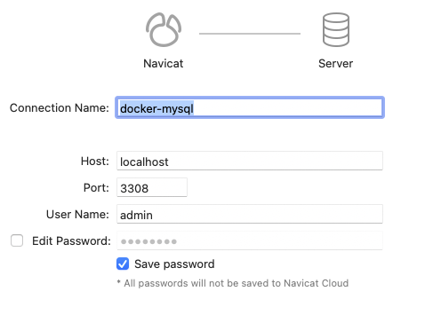

在现代软件开发的众多环节中，容器化技术已经成为了加速开发、简化部署的关键工具。Docker 作为市场上最流行的容器平台之一，提供了一种高效的方式来打包、分发和管理应用。在这片博文中，我们将探索如何利用 Docker Compose 来部署一个 MySQL 数据库。MySQL 是广泛使用的开源关系数据库之一，它可以为各种应用程序提供数据库服务。在开发环境中，使用 Docker Compose 部署 MySQL 不仅能够保证环境的一致性，还允许开发者快速部署和撤销实例，极大地提高了开发效率。

## 1. Docker Compose 简介

Docker Compose 是一个用于定义和运行多容器 Docker 应用程序的工具。通过 Compose，您可以通过一个 YAML 文件来配置您的应用的服务。然后，使用一个简单的命令，就可以创建并启动所有配置中的服务。这让组织和管理容器变成了一件轻而易举的事情。

在开始之前，首先需要确保已经安装了 Docker Compose，如果没有安装或者不熟悉 Compose 的具体查阅 [Docker 实战：使用 Docker Compose 实现高效的多容器部署](https://smartsi.blog.csdn.net/article/details/138414972)。

## 2. Docker Compose 部署 MySQL

接下来，我们将一步步通过 Docker Compose 来部署 MySQL 数据库。

### 2.1 创建项目目录

首先为项目创建一个目录。在这里，在我们的工作目录 `/opt/workspace/docker`下创建一个名为 `mysql` 的项目 ：

```shell
smartsi@localhost docker % mkdir mysql
smartsi@localhost docker % cd mysql
```

> 该目录是应用程序镜像的上下文。该目录应该只包含用于构建该镜像的资源。

### 2.2 构建Compose 文件

Docker Compose 简化了对整个应用程序堆栈的控制，使得在一个易于理解的 YAML 配置文件中轻松管理服务、网络和数据卷。要使用 Docker Compose 部署 MySQL，首先需创建一个`docker-compose.yml`文件，如下所示：

```yml
services:  # 定义你需要运行的服务
  mysql_db:  # 服务名称
    image: mysql:8.4  # 指定镜像及其版本
    container_name: docker_mysql # 指定容器的名称
    environment:  # 定义环境变量
      MYSQL_ROOT_PASSWORD: root  # 设置 MySQL 的 root 用户密码
      MYSQL_DATABASE: default  # 创建一个初始数据库
      MYSQL_USER: admin  # 创建一个MySQL用户
      MYSQL_PASSWORD: admin  # 为新用户设置密码
    ports: # 端口映射
      - "3308:3306"
    volumes:  # 数据持久化的配置
      - data:/var/lib/mysql  # 将命名数据卷挂载到容器内的指定目录
      - log:/var/log/mysql
    networks:  # 网络配置
      - pub-network  # 加入到 pub-network 网络

volumes:  # 数据卷
  data:
  log:

networks:  # 网络
  pub-network:
      external: true
```
`services` 配置用于定义不同的应用服务。上边的例子只定义了一个服务：`mysql_db`。`networks` 配置用于声明服务要连接的网络 `pub-network`。`external: true` 表示网络是在 Docker Compose 配置文件之外定义的，即它已经存在了，Docker Compose 不需要尝试创建它。只要加入这个网络的服务就能够实现项目容器间以及跨项目通信。具体可以查阅 [Docker 实战：使用 Docker Compose 部署实现跨项目网络访问](https://smartsi.blog.csdn.net/article/details/138734487)。`volumes` 用于声明 Docker Compose 创建新的数据卷 `data`、`log`。我们只负责声明，不需要手动创建，Docker Compose 会自动管理。默认情况下，在容器删除之后容器中的数据也将会丢失。为了解决这个问题，我们需要 `mysql_db` 服务使用声明中的数据卷来将数据保存在宿主机上。

> Docker Compose 默认使用 `{项目名}_{数据卷名}` 的格式来命名数据卷，以此避免不同项目间的数据卷名冲突。在这创建的两个数据卷为 `mysql_data` 和 `mysql_log`。

`mysql` 的服务定义中，包含如下指令：
- `image`：指定了要使用的 Docker 镜像及其版本。在这里，我们使用了官方的 MySQL 8.4 版本镜像。
- `container_name`：自定义的容器名称 `docker_mysql`，便于识别。
- `environment`：提供环境变量以配置 MySQL 实例。通过环境变量，我们能以无交互的方式初始化数据库配置。设置MySQL的环境变量，包括root密码、初始数据库及其用户和密码。
- `ports`：用来将容器的端口映射到宿主机的端口，使得宿主机能够与集群进行通信。通常，只有服务需要直接从宿主机的网络访问时，我们才会映射端口。将容器的 3306 端口映射到宿主机的 3308 端口，使外部可访问 MySQL。在这，由于宿主机上 3306 已经被占用，所以使用 3308 端口。
- `volumes`：实现数据持久化的关键部分。MySQL 存储数据在 `/var/lib/mysql` 路径，日志存储在 `/var/log/mysql` 路径。`mysql_db` 服务将这两个路径映射到宿主机的数据卷的 `data` 和 `log` 的数据卷上。这意味着即使容器被删除，存储在这两个数据卷上的数据也不会丢失，实现了数据的持久化。
- `networks`: 将服务连接到 `pub-network` 网络上。这个网络在 `networks` 一级 key 中声明已经创建，Docker Compose 不需要尝试创建它。加入这个网络之后，不同服务就可以通过服务名 `mysql_db` 找到并实现容器间以及跨项目的网络访问。

> 出于演示目的，我们直接在`docker-compose.yml`文件中硬编码了环境变量如密码等。在生产环境中，考虑使用更安全的方法来管理这些敏感数据，如 Docker 秘钥管理。

这个`docker-compose.yml`文件是 MySQL 部署的基础模板，它涵盖了启动、配置和持久化 MySQL 实例的基本方面，同时还考虑了服务间网络连接的需求。根据具体需求，可能需要对配置进行调整（比如，环境变量的值或者镜像版本）。

### 2.3 部署

在有了`docker-compose.yml`文件后，您需要在包含此文件的目录中运行如下命令启动服务：
```shell
(base) localhost:mysql wy$ docker compose up -d
[+] Running 3/3
 ✔ Volume "mysql_log"      Created                                              0.0s
 ✔ Volume "mysql_data"     Created                                              0.0s
 ✔ Container docker_mysql  Started                                              0.1s
```
这将以守护进程模式启动 MySQL 服务。

### 2.4. 验证

部署后，使用以下命令检查容器状态：
```shell
(base) localhost:mysql wy$ docker compose ps
NAME           IMAGE       COMMAND                  SERVICE    CREATED          STATUS          PORTS
docker_mysql   mysql:8.4   "docker-entrypoint.s…"   mysql_db   27 minutes ago   Up 27 minutes   33060/tcp, 0.0.0.0:3308->3306/tcp
```
从上面可以看到 MySQL 容器正在运行中。可以有两种方式来验证我们部署的 MySQL 数据库是否有问题。

第一种方式你可以从宿主机上访问，即装有 Docker 的机器上访问 MySQL，通常需要使用 localhost 作为主机名（host），并指定你在 docker-compose.yml 文件中映射给宿主机的端口号。上面例子中将容器的 3306 端口映射到了宿主机的 3308 端口，那么你可以使用 localhost:3308 来连接到 MySQL。你可以使用 Navicat 来访问数据库，具体连接信息配置如下：
- 主机：localhost
- 端口：3308
- 用户名：admin（在`docker-compose.yml`中设置）
- 密码：admin（在`docker-compose.yml`中设置）



第二种方式从 Docker 容器中访问 MySQL。在这种情况下，你可以使用服务名 `mysql_db` 作为主机名来连接到 MySQL，而不需指定端口，因为网络是内部的，端口是开放的。

你可以先通过 `docker exec` 命令进入容器：
```shell
(base) localhost:mysql wy$ docker exec -it docker_mysql mysql -h mysql_db -u admin -p
Enter password:
Welcome to the MySQL monitor.  Commands end with ; or \g.
Your MySQL connection id is 13
Server version: 8.4.0 MySQL Community Server - GPL

Copyright (c) 2000, 2024, Oracle and/or its affiliates.

Oracle is a registered trademark of Oracle Corporation and/or its
affiliates. Other names may be trademarks of their respective
owners.

Type 'help;' or '\h' for help. Type '\c' to clear the current input statement.

mysql>
```
