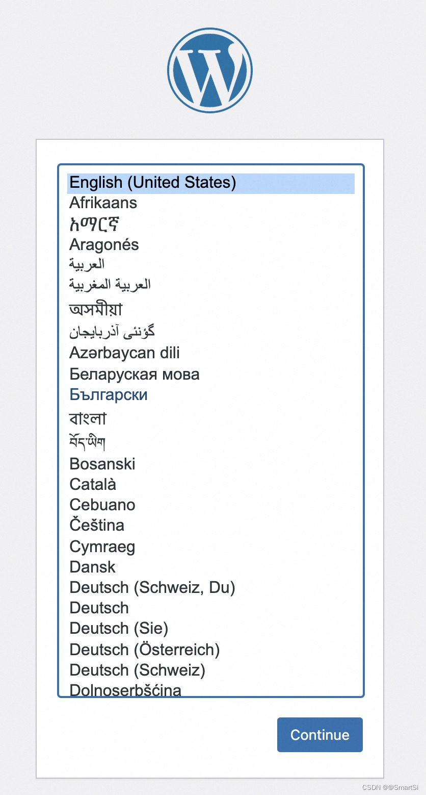

  在现代软件开发的众多环节中，容器化技术已经成为了加速开发、简化部署的关键工具。Docker 作为市场上最流行的容器平台之一，提供了一种高效的方式来打包、分发和管理应用。在这片博文中，我们将探索如何利用 Docker Compose 来部署一个 WordPress 个人站点博客，数据存储在 MySQL 中。在开发环境中，使用 Docker Compose 部署 WordPress 不仅能够保证环境的一致性，还允许开发者快速部署和撤销实例，极大地提高了开发效率。

  ## 1. WordPress 简介

  WordPress是世界上最受欢迎的内容管理系统（CMS）之一，特别是对于个人博客来说。自2003 年首次发布以来，它已经从一个简单的博客平台发展成为一个功能丰富的网站建设工具。WordPress 作为个人博客平台提供了无与伦比的简便性、灵活性和功能性，使其成为全球数百万博主的首选。

  ## 2. Docker Compose 简介

  Docker Compose 是一个用于定义和运行多容器 Docker 应用程序的工具。通过 Compose，您可以通过一个 YAML 文件来配置您的应用的服务。然后，使用一个简单的命令，就可以创建并启动所有配置中的服务。这让组织和管理容器变成了一件轻而易举的事情。

  在开始之前，首先需要确保已经安装了 Docker Compose，如果没有安装或者不熟悉 Compose 的具体查阅 [Docker 实战：使用 Docker Compose 实现高效的多容器部署](https://smartsi.blog.csdn.net/article/details/138414972)。

  ## 3. Docker Compose 部署 MySQL

  接下来，我们将一步步通过 Docker Compose 来部署 WordPress 博客站点 以及依赖的 MySQL 数据库。

  ### 3.1 创建项目目录

  首先为项目创建一个目录。在这里，在我们的工作目录 `/opt/workspace/docker`下创建一个名为 `wordpress_db` 的项目 ：

  ```shell
  smartsi@localhost docker % mkdir wordpress_db
  smartsi@localhost docker % cd wordpress_db
  ```

  > 该目录是应用程序镜像的上下文。该目录应该只包含用于构建该镜像的资源。

  ### 3.2 构建Compose 文件

  Docker Compose 简化了对整个应用程序堆栈的控制，使得在一个易于理解的 YAML 配置文件中轻松管理服务、网络和数据卷。要使用 Docker Compose 部署，首先需创建一个`docker-compose.yml`文件，如下所示：

  ```shell
  services:
    mysql:  # MySQL 服务
      image: mysql:8.4  # 指定镜像及其版本
      container_name: wordpress_db_mysql # 指定容器的名称
      environment:  # 定义环境变量
        MYSQL_ROOT_PASSWORD: root  # 设置 MySQL 的 root 用户密码
        MYSQL_DATABASE: wordpress  # 创建一个初始数据库
        MYSQL_USER: admin  # 创建一个MySQL用户
        MYSQL_PASSWORD: admin  # 为新用户设置密码    
      ports: # 端口映射
        - "3308:3306"
      volumes:  # 数据持久化的配置
        - mysql_data:/var/lib/mysql  # 将命名数据卷挂载到容器内的指定目录
        - mysql_log:/var/log/mysql
      networks:  # 网络配置
        - wordpress-network  # 加入到 wordpress-network 网络
    wordpress: # wordpress 服务
      depends_on: # 服务依赖
        - mysql
      image: wordpress:latest # 指定镜像及其版本
      container_name: wordpress_db_wordpress # 指定容器的名称
      volumes: # 数据持久化的配置
        - wordpress_data:/var/www/html
      networks: # 网络配置
        - wordpress-network # 加入到 wordpress-network 网络
      ports: # 端口映射
        - 8000:80
      environment: # 定义环境变量
        - WORDPRESS_DB_HOST=mysql
        - WORDPRESS_DB_USER=admin
        - WORDPRESS_DB_PASSWORD=admin
        - WORDPRESS_DB_NAME=wordpress
  volumes:
    mysql_data:
    mysql_log:
    wordpress_data:

  networks:
    wordpress-network:
  ```

  > 可以为使用 `.yml` 或 `.yaml` 扩展名

  services 用于定义不同的应用服务。上边的例子定义了两个服务：一个名为 `mysql` 的 MySQL 数据库服务以及一个名为 `wordpress` 的博客站点服务。Docker Compose 会将每个服务部署在各自的容器中。在这里我们自定义了容器名称，因此 Docker Compose 会部署两个名为 `wordpress_db_mysql` 和 `wordpress_db_wordpress` 的容器。

  > wordpress_db 为项目名称

  networks 用于声明 Docker Compose 创建新的网络 `wordpress-network`。我们只负责声明，不需要手动创建，Docker Compose 会自动管理。为了实现 `mysql` 服务和 `wordpress` 服务之间的通信，需要这两个服务都加入到这两个网络。在使用 Docker Compose 部署应用时，定义`networks`并不是必须的，但却是一个好的习惯。如果不显式定义和指定网络，Docker Compose 默认会为你的应用创建一个单独的网络，并且所有在`docker-compose.yml`文件中定义的服务都将自动加入这个网络。这意味着，即使你没有明确定义网络，服务之间也能够相互通信。

  volumes 用于声明 Docker Compose 创建新的数据卷 `mysql_data`、`mysql_log`、以及 `wordpress_data`。我们只负责声明，不需要手动创建，Docker Compose 会自动管理。默认情况下，在容器删除之后，MySQL 容器和 WordPress 容器中的数据将丢失。为了解决这个问题，我们需要 `mysql` 服务 和 `wordpress` 服务分别使用声明中的数据卷来将数据保存在宿主机上。

  ### 3.2.1 mysql 服务

  `mysql` 的服务定义中，包含如下指令：
  - `image`：指定了要使用的 Docker 镜像及其版本。在这里，我们使用了官方的 MySQL 8.4 版本镜像。
  - `container_name`：自定义的容器名称 `wordpress_db_mysql`，便于识别。
  - `environment`：提供环境变量以配置 MySQL 实例。通过环境变量，我们能以无交互的方式初始化数据库配置。设置MySQL的环境变量，包括root密码、初始数据库及其用户和密码。
  - `ports`：将容器的`3306`端口映射到宿主机的`3308`端口，使外部可访问 MySQL 服务。宿主机上 3306 已经被占用，所以使用 3308 端口。
  - `volumes`：实现数据持久化的关键部分。MySQL 存储数据在`/var/lib/mysql`路径，日志在 `/var/log/mysql` 路径。`mysql` 服务将这两个路径映射到宿主机的数据卷的 `mysql_data` 和 `mysql_log` 的数据卷上。这意味着即使容器被删除，存储在这两个数据卷上的数据也不会丢失，实现了数据的持久化。
  - `networks`: 将 `mysql` 服务连接到 `wordpress-network`网络上。这个网络在 `networks` 一级key中声明。将 `mysql` 服务加入这个网络，允许 `wordpress` 服务（也会连接到`wordpress-network`网络）可以通过服务名（`mysql`）找到并连接到 MySQL 服务，从而实现容器间的网络访问。

  ### 3.2.2 wordpress 服务

  `wordpress` 的服务定义中，包含如下指令：
  - `depends_on`：表示 WordPress 服务依赖于 MySQL 服务（`mysql`），确保 MySQL 先启动。    
  - `image`：指定了要使用的 Docker 镜像及其版本。在这里，我们使用了官方的 latest 版本镜像。
  - `container_name`：自定义的容器名称 `wordpress_db_wordpress`，便于识别。
  - `environment`：配置 WordPress 连接数据库的环境变量，包括数据库主机（对应服务名 `mysql`），数据库用户名、密码和数据库名。
  - `ports`：将宿主机的`8000`端口映射到容器的`80`端口，可以通过 `http://localhost:8000` 访问 WordPress。
  - `volumes`：将 `/var/www/html`（WordPress安装目录）映射到名为 `wordpress_data` 的数据卷，实现数据持久化。
  - `networks`: 将 `wordpress` 服务也连接到 `wordpress-network`网络。这样 `wordpress` 服务可以通过服务名（`mysql`）找到并连接到 MySQL 服务，从而实现容器间的网络访问。

  > 出于演示目的，我们直接在`docker-compose.yml`文件中硬编码了环境变量如密码等。在生产环境中，考虑使用更安全的方法来管理这些敏感数据，如 Docker 秘钥管理。

  这个`docker-compose.yml`文件是 WordPress 部署的基础模板，它涵盖了启动、配置和持久化的基本方面，同时还考虑了服务间网络连接的需求。根据具体需求，可能需要对配置进行调整（比如，环境变量的值或者镜像版本）。

  ### 3.3 部署

  在有了`docker-compose.yml`文件后，您需要在包含此文件的目录中运行如下命令启动服务：

  ```shell
  (base) localhost:wordpress_db wy$ docker compose up -d
  [+] Running 6/6
   ✔ Network wordpress_db_wordpress-network  Created                                                         0.1s
   ✔ Volume "wordpress_db_mysql_data"        Created                                                         0.0s
   ✔ Volume "wordpress_db_mysql_log"         Created                                                         0.0s
   ✔ Volume "wordpress_db_wordpress_data"    Created                                                         0.0s
   ✔ Container wordpress_db_mysql            Started                                                         0.1s
   ✔ Container wordpress_db_wordpress        Started                                                         0.0s
  ```

  上述命令会在后台启动 WordPress 和 MySQL 服务。

  ### 3.4. 验证

  部署后，使用以下命令检查服务状态：
  ```shell
  (base) localhost:wordpress_db wy$ docker compose ps
  NAME                     IMAGE              COMMAND                  SERVICE     CREATED         STATUS         PORTS
  wordpress_db_mysql       mysql:8.4          "docker-entrypoint.s…"   mysql       5 minutes ago   Up 5 minutes   33060/tcp, 0.0.0.0:3308->3306/tcp
  wordpress_db_wordpress   wordpress:latest   "docker-entrypoint.s…"   wordpress   5 minutes ago   Up 5 minutes   0.0.0.0:8000->80/tcp
  ```
  可以看到有两个 `wordpress_db_mysql` 和 `wordpress_db_wordpress` 服务容器已经启动成功。

### 3.5 访问 WordPress

服务成功启动后，您可以通过浏览器访问您的 WordPress 站点。因为我们将 WordPress 的 80 端口映射到了宿主机的 8000 端口，您可以打开浏览器并访问 `http://localhost:8000` 来配置 WordPress。按照页面提示完成安装即可。



完成安装之后即可登录了：


参考：[wordpress-sample](https://github.com/docker/awesome-compose/tree/master/official-documentation-samples/wordpress/)
