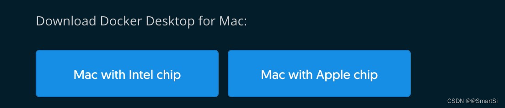
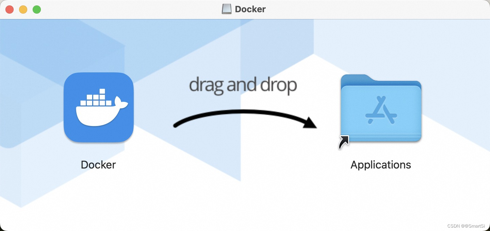
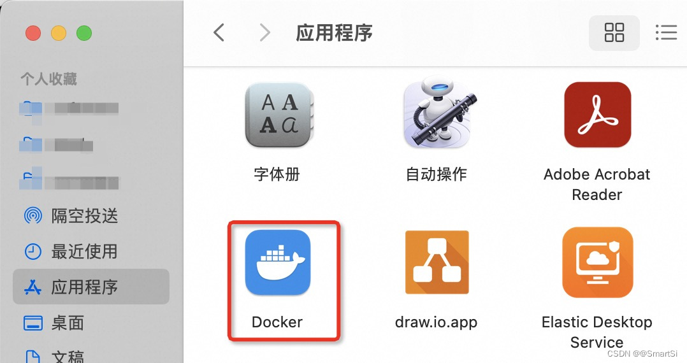
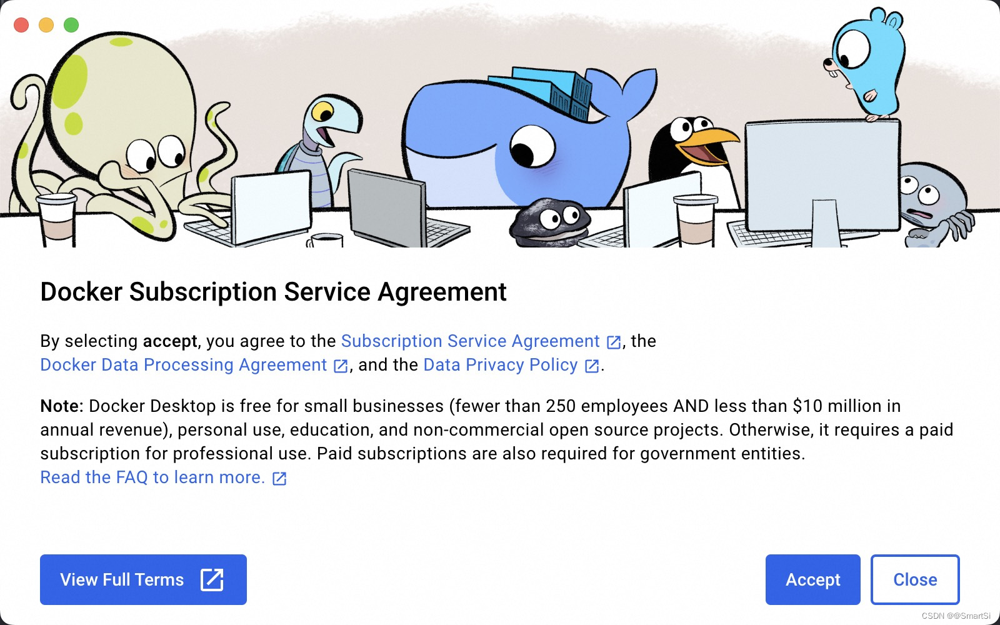
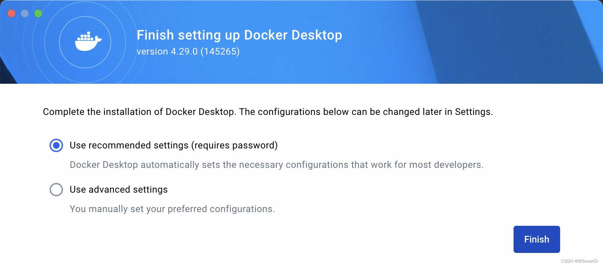
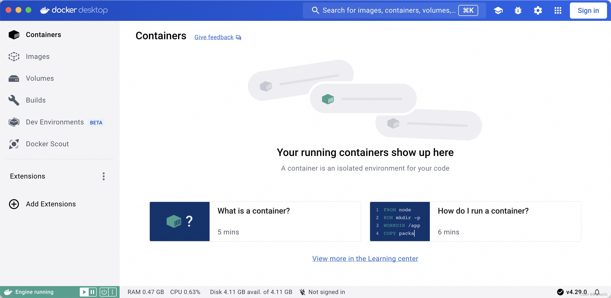
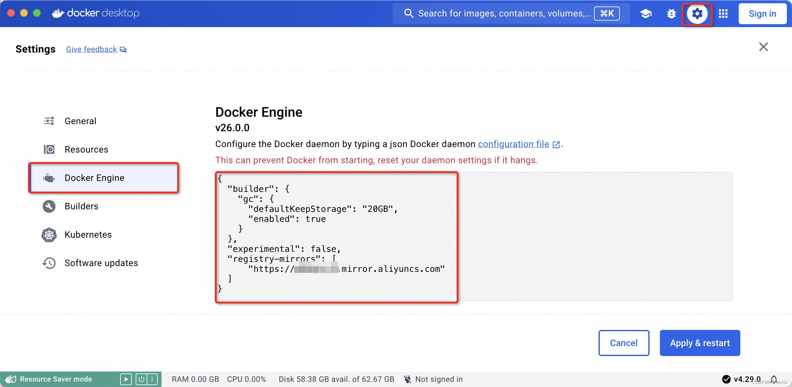
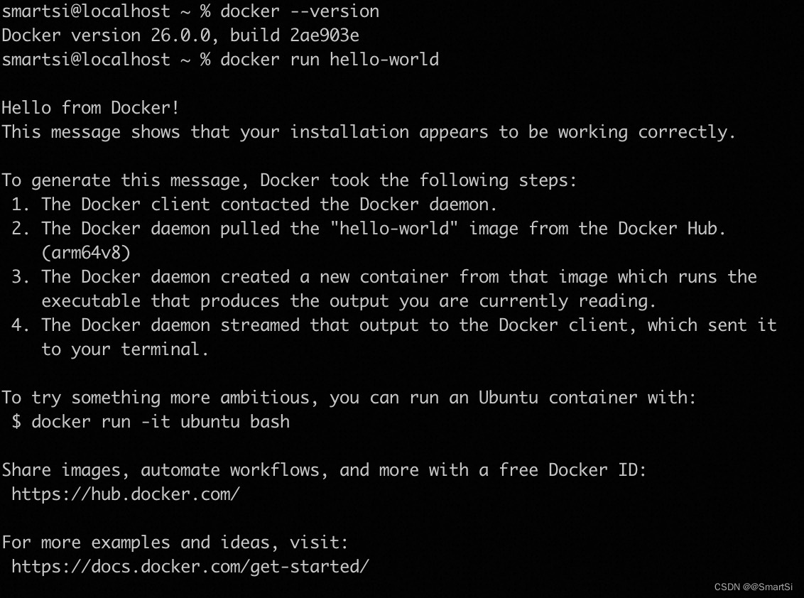

## 1. Docker Desktop
### 1.1 简介

在这采用 Docker Desktop 在 Mac 上来安装 Docker。Docker Desktop 是 Docker 的管理桌面 IDE，提供了一个直观的GUI(图形用户界面)，允许您直接在本机上管理容器、应用程序以及镜像。适用于 Mac、Linux 以及 Windows 环境，允许您构建、共享和运行容器化应用程序和微服务。

Docker Desktop 可以大大降低在复杂配置上的时间，因此您可以专注于编写代码。它负责端口映射、文件系统问题和其他默认设置，并定期更新 Bug 修复和安全更新。

### 1.2 Docker Desktop 关键组件

- [Docker Engine](https://docs.docker.com/engine/)
- Docker CLI client
- [Docker Scout](https://docs.docker.com/scout/) (additional subscription may apply)
- [Docker Build](https://docs.docker.com/build/)
- [Docker Extensions](https://docs.docker.com/desktop/extensions/)
- [Docker Compose](https://docs.docker.com/compose/)
- [Docker Content Trust](https://docs.docker.com/engine/security/trust/)
- [Kubernetes](https://github.com/kubernetes/kubernetes/)
- [Credential Helper](https://github.com/docker/docker-credential-helpers/)

## 2. 安装
### 2.1 系统要求

Docker 支持在 macOS 的最新版本上使用 Docker Desktop。具体来说，就是当前版本以及之前的两个版本的 macOS。每当 macOS 发布新的主要版本时，Docker 会停止支持最旧的版本，并开始支持最新的以及之前的两个版本。最新的三个版本如下所示：

| macOS     | 版本 |
| :------------- | :------------- |
| macOS Sonoma  | 14.4.1  |
| macOS Ventura  | 13.6.6  |
| macOS Monterey  | 12.7.4  |

所以截止到目前应用程序要求 macOS 12.0 或更高版本。建议升级到最新版本的 macOS。

> 具体如何确定是否是最新版本以及进行升级，具体可以查阅[确定你的 Mac 使用的是哪个 macOS 版本](https://support.apple.com/zh-cn/109033)

除此之外还要求有至少 4GB 的RAM。

### 2.2 下载

根据搭载的芯片架构，选择苹果芯片 Apple Silicon 或因特尔芯片 Intel chip 的安装包下载。请点击链接进行下载 [Install Docker Desktop on Mac](https://docs.docker.com/docker-for-mac/install/) 。



我的 Mac 配置：
- 操作系统 MacOS Sonoma  14.4.1
- 芯片 Apple M1
- 系统内存 16GB

在这我们选用的是 Docker Desktop for Mac with Apple silicon。

### 2.3 安装

如同 macOS 其它软件一样，安装也非常简单，双击下载的 `.dmg` 文件，然后将鲸鱼图标拖拽到 Application 文件夹即可。



默认情况下，Docker Desktop 安装在在 `/Applications/Docker.app`。在 Applications 文件夹下从应用中找到 Docker 图标并点击运行。可能会询问 macOS 的登陆密码，输入即可。



Docker 菜单显示 Docker 订阅服务协议：



> 需要注意的是，如果您不同意这些条款，Docker Desktop 不会运行。

选择 Accept 继续，最后一项是完成配置，从安装窗口中选择其中一个，默认推荐使用推荐配置，当然后续也可以再修改。



至此我们完成了 Docker Desktop 的安装。



Docker Desktop 版本为 4.29.0。

## 3. 配置 Docker 镜像加速

国内从 Docker Hub 拉取镜像有时会遇到困难，此时可以配置镜像加速器。国内很多云服务商以及大学都提供了国内加速器服务，例如：
- [阿里云加速器](https://cr.console.aliyun.com/cn-hangzhou/instances)
  - 点击管理控制台 -> 登录账号 -> 左侧镜像工具 -> 镜像加速器 -> 复制加速器地址
- 网易云加速器：https://hub-mirror.c.163.com
- 百度云加速器：https://mirror.baidubce.com
- 清华大学 TUNA 协会 镜像源地址：https://docker.mirrors.tuna.tsinghua.edu.cn
- 中国科学技术大学 镜像源地址：https://docker.mirrors.ustc.edu.cn
- 北京理工大学 镜像源地址：https://dockerhub.azk8s.cn
- 浙江大学 镜像源地址：https://mirrors.zju.edu.cn/dockerhub/

在这我们使用的是阿里云的镜像服务为例进行介绍。在 Docker Desktop 应用程序中，点击菜单栏设置按钮，然后选择 Docker Dengine，在配置文件只需要添加 "registry-mirrors" 配置即可：
```json
{
  "builder": {
    "gc": {
      "defaultKeepStorage": "20GB",
      "enabled": true
    }
  },
  "experimental": false,
  "registry-mirrors": [
      "https://xxx.mirror.aliyuncs.com"
  ]
}
```
> 地址替换为你你申请的加速器地址




检验加速器是否配置成功，只需要执行 `docker info` 命令查看返回结果中是否包含配置的镜像源地址即可。

## 4. 测试 & 验证

打开一个命令行窗口，输入如下命令，没有报错就是安装成功了：
```
# 查看版本
docker --version
# 下载demo镜像并启动容器
docker run hello-world
```

