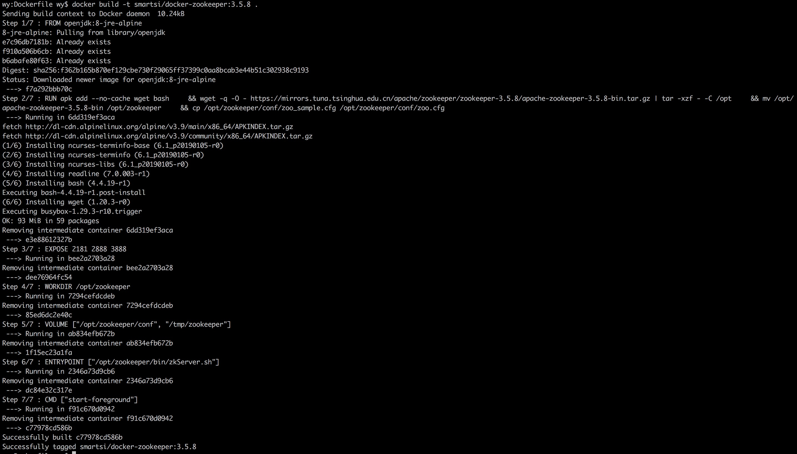
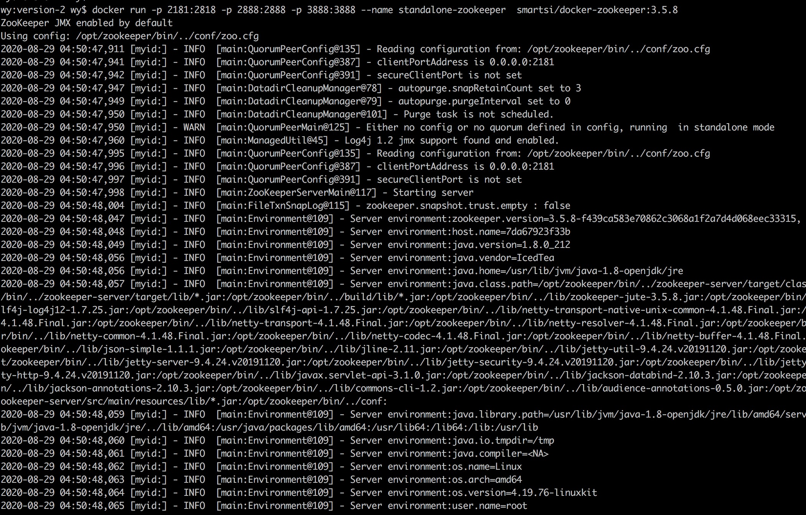
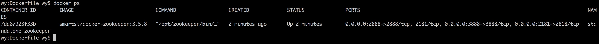
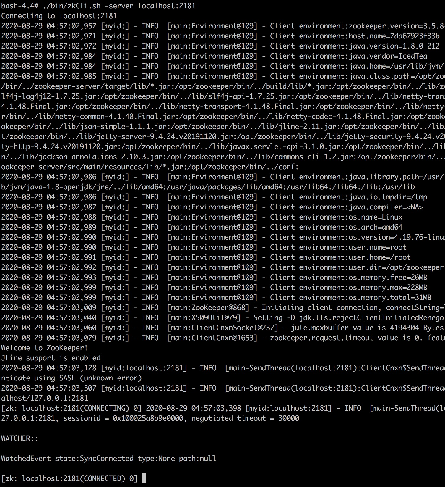

这篇文章中我们将使用 Docker 创建 Zookeeper 镜像，包括如何将 Zookeeper 安装到容器，如何配置 ZooKeeper 应用程序以及如何在宿主机和容器之间共享数据卷。本教程利用 Dockerfile 来指定容器的内容。如果您需要有关编写 Dockerfile 的更多信息，请参阅[官方文档](https://docs.docker.com/engine/reference/builder/)。

### 1. 指定基础镜像

Docker 容器基于基础 Linux 镜像构建而成。这些镜像提供了容器的核心功能，并使用 FROM 命令来指定。FROM 命令允许我们同时指定镜像以及 Tag，其中 Tag 标记了镜像的版本。在下面 Dockerfile 中，我们使用 openjdk 镜像构建容器：
```shell
FROM openjdk:8-jre-alpine
```

> 使用jdk镜像就不用我们自己安装jdk，操作比较方便。

上述命令足以构建我们的 Docker 镜像，使用如下命令构建 docker-zookeeper 镜像：
```shell
wy:Dockerfile wy$ docker build -f Dockerfile-jdk -t smartsi/docker-jdk .
Sending build context to Docker daemon  10.24kB
Step 1/1 : FROM openjdk:8-jre-alpine
8-jre-alpine: Pulling from library/openjdk
e7c96db7181b: Already exists
f910a506b6cb: Already exists
b6abafe80f63: Already exists
Digest: sha256:f362b165b870ef129cbe730f29065ff37399c0aa8bcab3e44b51c302938c9193
Status: Downloaded newer image for openjdk:8-jre-alpine
 ---> f7a292bbb70c
Successfully built f7a292bbb70c
Successfully tagged smartsi/docker-jdk:latest
```

### 2. 安装 ZooKeeper

现在我们有了基础镜像，我们可以使用 RUN 命令在基础镜像上安装 Zookeeper。RUN 允许我们在镜像上执行任意命令。在此示例中，我们将 3.5.8 版本的 Zookeeper 安装到 `/opt/zookeeper` 目录下：
```
FROM openjdk:8-jre-alpine

# 安装bash
RUN apk add --no-cache wget bash

# 安装zookeeper
RUN wget -q -O - https://mirrors.tuna.tsinghua.edu.cn/apache/zookeeper/zookeeper-3.5.8/apache-zookeeper-3.5.8-bin.tar.gz
RUN tar -xzf - -C /opt
RUN mv /opt/apache-zookeeper-3.5.8-bin /opt/zookeeper \
RUN cp /opt/zookeeper/conf/zoo_sample.cfg /opt/zookeeper/conf/zoo.cfg
```

在 Dockerfile 中执行的每个命令都会创建一个额外的镜像层。每层都复制它前一层的内容，因此每一层都会增加 Docker 镜像的大小。因此，通过组合 Dockerfile 中的语句来最大程度地减少层数是一种最佳方法。我们需要在可读性和性能之间取得一个平衡，并根据需要调整 Dockerfile。
```shell
FROM openjdk:8-jre-alpine

RUN apk add --no-cache wget bash \
    && wget -q -O - https://mirrors.tuna.tsinghua.edu.cn/apache/zookeeper/zookeeper-3.5.8/apache-zookeeper-3.5.8-bin.tar.gz | tar -xzf - -C /opt \
    && mv /opt/apache-zookeeper-3.5.8-bin /opt/zookeeper \
    && cp /opt/zookeeper/conf/zoo_sample.cfg /opt/zookeeper/conf/zoo.cfg
```

### 3. 公开端口

Zookeeper 需要打开多个端口才能与其他 Zookeeper 节点和客户端进行通信。我们可以使用 EXPOSE 关键字告诉容器需要侦听的网络端口：
```shell
FROM openjdk:8-jre-alpine

RUN apk add --no-cache wget bash \
    && wget -q -O - https://mirrors.tuna.tsinghua.edu.cn/apache/zookeeper/zookeeper-3.5.8/apache-zookeeper-3.5.8-bin.tar.gz | tar -xzf - -C /opt \
    && mv /opt/apache-zookeeper-3.5.8-bin /opt/zookeeper \
    && cp /opt/zookeeper/conf/zoo_sample.cfg /opt/zookeeper/conf/zoo.cfg

EXPOSE 2181 2888 3888
```
如果要将主机端口映射到容器的端口上，可以使用 `-p` 命令运行容器。例如，公开容器中的端口并将宿主机端口映射到容器的端口上，我们可以指定要绑定到的多个端口：
```shell
docker run -d -p 2181:2181 -p 2888:2888 -p 3888:3888 smartsi/docker-zookeeper:test
```
### 4. 设置工作目录

我们将 Zookeeper 安装到 `/opt/zookeeper` 目录下。由于我们在这个容器上仅运行 Zookeeper，因此将我们的安装目录 `/opt/zookeeper` 设置为工作目录是最便捷的。这可以通过 WORKDIR 关键字来完成：
```shell
FROM openjdk:8-jre-alpine

RUN apk add --no-cache wget bash \
    && wget -q -O - https://mirrors.tuna.tsinghua.edu.cn/apache/zookeeper/zookeeper-3.5.8/apache-zookeeper-3.5.8-bin.tar.gz | tar -xzf - -C /opt \
    && mv /opt/apache-zookeeper-3.5.8-bin /opt/zookeeper \
    && cp /opt/zookeeper/conf/zoo_sample.cfg /opt/zookeeper/conf/zoo.cfg

EXPOSE 2181 2888 3888

WORKDIR /opt/zookeeper
```

### 5. 设置配置文件

VOLUME 关键字可以将数据挂载到 Docker 容器上。如果要配置 Zookeeper 实例，我们可以在本地声明我们的配置文件，并让 Docker 使用 VOLUME 命令指定的挂载数据卷读取这些配置文件：
```shell
FROM openjdk:8-jre-alpine

RUN apk add --no-cache wget bash \
    && wget -q -O - https://mirrors.tuna.tsinghua.edu.cn/apache/zookeeper/zookeeper-3.5.8/apache-zookeeper-3.5.8-bin.tar.gz | tar -xzf - -C /opt \
    && mv /opt/apache-zookeeper-3.5.8-bin /opt/zookeeper \
    && cp /opt/zookeeper/conf/zoo_sample.cfg /opt/zookeeper/conf/zoo.cfg

EXPOSE 2181 2888 3888

WORKDIR /opt/zookeeper

VOLUME ["/opt/zookeeper/conf"]
```
如果要将本地目录映射到我们创建的数据卷上，可以使用 docker run 命令的 `-v` 选项运行容器。在以下示例中，`./conf` 目录中的所有文件都被映射到容器上的 `/opt/zookeeper/conf` 目录中：
```shell
docker run -it -v conf:/opt/zookeeper/conf smartsi/docker-zookeeper:test /bin/bash
```
OS X 用户需要使用完整路径而不是相对目录来限定本地目录。

### 6. 共享数据

Zookeeper 数据默认保存在 `/tmp/zookeeper` 目录下。我们可以通过 Docker 挂载数据卷将数据保存在宿主机上，从而达到宿主机与容器共享数据：
```shell
FROM openjdk:8-jre-alpine

RUN apk add --no-cache wget bash \
    && wget -q -O - https://mirrors.tuna.tsinghua.edu.cn/apache/zookeeper/zookeeper-3.5.8/apache-zookeeper-3.5.8-bin.tar.gz | tar -xzf - -C /opt \
    && mv /opt/apache-zookeeper-3.5.8-bin /opt/zookeeper \
    && cp /opt/zookeeper/conf/zoo_sample.cfg /opt/zookeeper/conf/zoo.cfg

EXPOSE 2181 2888 3888

WORKDIR /opt/zookeeper

VOLUME ["/opt/zookeeper/conf", "/tmp/zookeeper"]
```
如果我们的 Zookeeper 配置与默认配置不同，请为数据卷使用恰当的挂载点。

### 7. 运行 Zookeeper

此时，我们的 Dockerfile 将会安装 Zookeeper，将端口暴露给宿主机，并为配置和数据文件进行挂载。我们需要的做的最后一件事就是运行 Zookeeper。为此，我们使用 ENTRYPOINT 和 CMD 关键字：
```shell
FROM openjdk:8-jre-alpine

RUN apk add --no-cache wget bash \
    && wget -q -O - https://mirrors.tuna.tsinghua.edu.cn/apache/zookeeper/zookeeper-3.5.8/apache-zookeeper-3.5.8-bin.tar.gz | tar -xzf - -C /opt \
    && mv /opt/apache-zookeeper-3.5.8-bin /opt/zookeeper \
    && cp /opt/zookeeper/conf/zoo_sample.cfg /opt/zookeeper/conf/zoo.cfg

EXPOSE 2181 2888 3888

WORKDIR /opt/zookeeper

VOLUME ["/opt/zookeeper/conf", "/tmp/zookeeper"]

ENTRYPOINT ["/opt/zookeeper/bin/zkServer.sh"]
CMD ["start-foreground"]
```
ENTRYPOINT 和 CMD 关键字提供了默认可执行文件，默认可执行文件在启动容器时会执行。在此示例中，我们以前台方式启动 Zookeeper 服务器。

### 8. 构建容器

至此，我们有了一个有效的 Dockerfile，用于构建 Docker 镜像来运行 Zookeeper 实例。要构建 Docker 镜像，需要运行如下命令：
```shell
docker build -t smartsi/docker-zookeeper:3.5.8 .
```
> 使用默认Dockerfile文件




### 9. 运行

构建镜像之后运行如下命令启动容器以及 Zookeeper：
```
docker run -p 2181:2818 -p 2888:2888 -p 3888:3888 --name standalone-zookeeper  smartsi/docker-zookeeper:3.5.8
```


上述命令启动一个名为 `standalone-zookeeper` 的容器。通过 `docker ps` 命令查看运行中的 Zookeeper 容器：



通过如下命令进入容器：
```shell
docker exec -it standalone-zookeeper /bin/bash
```
可以通过 `zkServer.sh status` 命令查看 ZooKeeper 服务状态：
```shell
bash-4.4# ./bin/zkServer.sh status
ZooKeeper JMX enabled by default
Using config: /opt/zookeeper/bin/../conf/zoo.cfg
Client port found: 2181. Client address: localhost.
Mode: standalone
```
通过如下命令连接 ZooKeeper 服务：
```shell
./bin/zkCli.sh -server localhost:2181
```



参考：[Docker Step By Step: Containerizing Zookeeper](https://sookocheff.com/post/docker/containerizing-zookeeper-a-guided-tour/)
