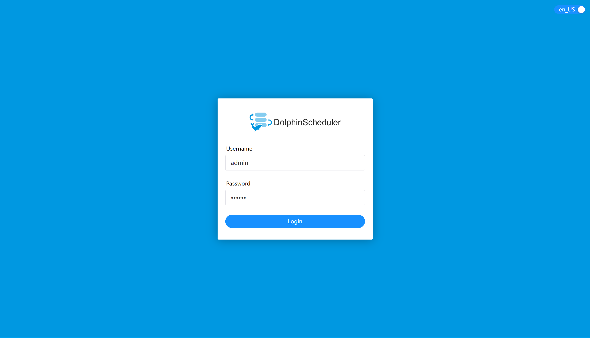

本文将详细介绍如何使用 Docker Compose 部署 `Apache DolphinScheduler`。如果你已经有在运行中的数据库或者 `ZooKeeper` 且不想启动新的服务，可以使用这个方案在沿用已有的 `PostgreSQL` 和 `ZooKeeper` 服务前提下来启动 `DolphinScheduler` 各服务。本文将从配置文件解析、部署步骤、部署后验证等方面展开，帮助您快速上手 DolphinScheduler。

## 1. DolphinScheduler 简介

`Apache DolphinScheduler` 是一个分布式、易扩展的可视化工作流任务调度系统，支持多种任务类型（如 Shell、SQL、Spark 等），具有高可用、易运维等特点。通过 Docker Compose 部署，可以快速搭建一套完整的 `DolphinScheduler` 环境。

---

## 2. 部署前提

在开始部署之前，请确保满足以下条件：
- 已有服务：
  - `PostgreSQL`：作为 `DolphinScheduler` 的元数据库。通过 Docker 部署 PostgresSQL 请查阅[PostgresSQL 实战：使用 Docker Compose 部署 PostgreSQL](https://smartsi.blog.csdn.net/article/details/139390099)
  - `ZooKeeper`：用于服务注册与发现。通过 Docker 部署 `ZooKeeper` 请查阅[ZooKeeper 实战：使用 Docker Compose 部署 ZooKeeper 集群](https://smartsi.blog.csdn.net/article/details/138471015)
- 安装 Docker：确保 Docker 已经安装并运行在你的机器上。可以通过以下命令验证 Docker 是否安装：
   ```bash
   docker --version
   ```
- 安装 Docker Compose：确保 Docker Compose 已经安装并配置完成。可以通过以下命令验证 Docker Compose 是否安装：
   ```bash
   docker-compose --version
   ```
- 网络配置：
  - `DolphinScheduler` 的容器能够访问已有的 `PostgreSQL` 和 `ZooKeeper` 服务。

---

## 3. 配置文件

Docker Compose 简化了对整个应用程序堆栈的控制，使得在一个易于理解的 YAML 配置文件中轻松管理服务、网络和数据卷。要使用 Docker Compose 部署，首先需创建一个`docker-compose.yml`文件，通过[下载页面](https://dolphinscheduler.apache.org/en-us/download)下载对应版本源码包来获取官方配置文件，去掉 `PostgreSQL` 和 `ZooKeeper` 服务部分(沿用已有的 PostgreSQL 和 ZooKeeper 服务)，其它按照自己的需求修改即可。在这我们的配置如下所示：
```yaml
services:
  dolphinscheduler-master:
    image: apache/dolphinscheduler-master:3.1.9
    container_name: dolphinscheduler-master
    environment:
      - DATABASE=postgresql
      - SPRING_DATASOURCE_URL=jdbc:postgresql://docker_postgres:5432/dolphinscheduler
      - SPRING_DATASOURCE_USERNAME=postgres
      - SPRING_DATASOURCE_PASSWORD=root
      - REGISTRY_ZOOKEEPER_CONNECT_STRING=docker_zk1:2181
    volumes:
      - dolphinscheduler-logs:/opt/dolphinscheduler/logs
      - dolphinscheduler-shared-local:/opt/soft
    networks:
      - pub-network

  dolphinscheduler-worker:
    image: apache/dolphinscheduler-worker:3.1.9
    container_name: dolphinscheduler-worker
    environment:
      - DATABASE=postgresql
      - SPRING_DATASOURCE_URL=jdbc:postgresql://docker_postgres:5432/dolphinscheduler
      - SPRING_DATASOURCE_USERNAME=postgres
      - SPRING_DATASOURCE_PASSWORD=root
      - REGISTRY_ZOOKEEPER_CONNECT_STRING=docker_zk1:2181
    volumes:
      - dolphinscheduler-worker-data:/tmp/dolphinscheduler
      - dolphinscheduler-logs:/opt/dolphinscheduler/logs
      - dolphinscheduler-shared-local:/opt/soft
      - dolphinscheduler-resource-local:/dolphinscheduler
    networks:
      - pub-network

  dolphinscheduler-api:
    image: apache/dolphinscheduler-api:3.1.9
    container_name: dolphinscheduler-api
    ports:
      - "12345:12345"
      - "25333:25333"
    environment:
      - DATABASE=postgresql
      - SPRING_DATASOURCE_URL=jdbc:postgresql://docker_postgres:5432/dolphinscheduler
      - SPRING_DATASOURCE_USERNAME=postgres
      - SPRING_DATASOURCE_PASSWORD=root
      - REGISTRY_ZOOKEEPER_CONNECT_STRING=docker_zk1:2181
    volumes:
      - dolphinscheduler-logs:/opt/dolphinscheduler/logs
      - dolphinscheduler-shared-local:/opt/soft
      - dolphinscheduler-resource-local:/dolphinscheduler
    networks:
      - pub-network

  dolphinscheduler-alert:
    image: apache/dolphinscheduler-alert-server:3.1.9
    container_name: dolphinscheduler-alert
    environment:
      - DATABASE=postgresql
      - SPRING_DATASOURCE_URL=jdbc:postgresql://docker_postgres:5432/dolphinscheduler
      - SPRING_DATASOURCE_USERNAME=postgres
      - SPRING_DATASOURCE_PASSWORD=root
      - REGISTRY_ZOOKEEPER_CONNECT_STRING=docker_zk1:2181
    volumes:
      - dolphinscheduler-logs:/opt/dolphinscheduler/logs
    networks:
      - pub-network

volumes:
  dolphinscheduler-worker-data:
  dolphinscheduler-logs:
  dolphinscheduler-shared-local:
  dolphinscheduler-resource-local:

networks:  # 网络
  pub-network:
      external: true
```

---

### 3.1 服务定义

`services` 是 `docker-compose.yml` 的核心部分，定义了多个容器服务。每个服务对应一个 `DolphinScheduler` 组件。上面的配置定义了4个服务：
- `dolphinscheduler-master`：负责任务调度和分发。
- `dolphinscheduler-worker`：负责任务执行。
- `dolphinscheduler-api`：提供 RESTful API 接口。
- `dolphinscheduler-alert`：负责告警通知。

Docker Compose 会将每个服务部署在各自的容器中，在这里我们自定义了与服务名称一致的容器名称，因此 Docker Compose 会部署4个名为 `dolphinscheduler-master`、`dolphinscheduler-worker`、`dolphinscheduler-api` 以及 `dolphinscheduler-alert` 的容器。

####  3.1.1 Master 服务

```yaml
dolphinscheduler-master:
  image: apache/dolphinscheduler-master:3.1.9
  container_name: dolphinscheduler-master
  environment:
    - DATABASE=postgresql
    - SPRING_DATASOURCE_URL=jdbc:postgresql://docker_postgres:5432/dolphinscheduler
    - SPRING_DATASOURCE_USERNAME=postgres
    - SPRING_DATASOURCE_PASSWORD=root
    - REGISTRY_ZOOKEEPER_CONNECT_STRING=docker_zk1:2181
  volumes:
    - dolphinscheduler-logs:/opt/dolphinscheduler/logs
    - dolphinscheduler-shared-local:/opt/soft
  networks:
    - pub-network
```
核心配置：
- `image`: 使用 3.1.9 版本 `apache/dolphinscheduler-master` 镜像部署 `Master` 服务。
- `container_name`：容器名称固定为 `dolphinscheduler-master`，便于其他服务引用。
- `environment`：设置环境变量，配置 `Master` 服务的运行参数
  - `DATABASE`: 指定数据库类型为 `PostgreSQL`。
  - `SPRING_DATASOURCE_URL`: 数据库连接 URL，指向 `PostgreSQL` 服务。`docker_postgres` 是 `PostgreSQL` 容器名称。
  - `SPRING_DATASOURCE_USERNAME`: 数据库用户名。
  - `SPRING_DATASOURCE_PASSWORD`: 数据库密码。
  - `REGISTRY_ZOOKEEPER_CONNECT_STRING`: `Zookeeper` 连接地址，用于服务注册与发现。`docker_zk1` 是 `Zookeeper` 一个节点的容器名称。
- `networks`：服务连接到 `pub-network` 网络上，确保容器间通信。
- `volumes`：挂载数据卷
  - 将容器内的 `/opt/dolphinscheduler/logs` 日志目录挂载到 `dolphinscheduler-logs` 数据卷，持久化存储日志数据。
  - 将容器内的 `/opt/soft` 共享目录挂载到 `dolphinscheduler-shared-local` 数据卷，用于存储临时文件或共享数据。
- `healthcheck`: 定义健康检查机制，在这没有配置(根据需要添加)
  ```yaml
  healthcheck:
    test: [ "CMD", "curl", "http://localhost:5679/actuator/health" ]
    interval: 30s
    timeout: 5s
    retries: 3
  ```
  - `test`: 通过 `curl` 检查 `Master` 服务的健康状态。
  - `interval`: 每 30 秒检查一次。
  - `timeout`: 每次检查超时时间为 5 秒。
  - `retries`: 失败重试 3 次。

---

#### 3.1.2 Woker 服务

```yaml
dolphinscheduler-worker:
  image: apache/dolphinscheduler-worker:3.1.9
  container_name: dolphinscheduler-worker
  environment:
    - DATABASE=postgresql
    - SPRING_DATASOURCE_URL=jdbc:postgresql://docker_postgres:5432/dolphinscheduler
    - SPRING_DATASOURCE_USERNAME=postgres
    - SPRING_DATASOURCE_PASSWORD=root
    - REGISTRY_ZOOKEEPER_CONNECT_STRING=docker_zk1:2181
  volumes:
    - dolphinscheduler-worker-data:/tmp/dolphinscheduler
    - dolphinscheduler-logs:/opt/dolphinscheduler/logs
    - dolphinscheduler-shared-local:/opt/soft
    - dolphinscheduler-resource-local:/dolphinscheduler
  networks:
    - pub-network
```
核心配置：
- `image`: 使用 3.1.9 版本 `apache/dolphinscheduler-worker` 镜像部署 `Worker` 服务。
- `container_name`：容器名称固定为 `dolphinscheduler-worker`，便于其他服务引用。
- `environment`：
  - 环境变量配置与 `Master` 服务一样，确保 `Worker` 服务能正确连接到数据库和 `Zookeeper`。
- `networks`：服务连接到 `pub-network` 网络上，确保容器间通信。
- `volumes`：挂载数据卷
  - 将容器内的 `/opt/dolphinscheduler/logs` 日志目录挂载到 `dolphinscheduler-logs` 数据卷，持久化存储日志数据。
  - 将容器内的 `/opt/soft` 共享目录挂载到 `dolphinscheduler-shared-local` 数据卷，用于存储临时文件或共享数据。
  - 将容器内的 `/tmp/dolphinscheduler` Worker 数据目录挂载到 `dolphinscheduler-worker-data` 数据卷，用于存储 Worker 数据。
  - 将容器内的 `/dolphinscheduler` 资源目录挂载到 `dolphinscheduler-resource-local` 数据卷，用于存储任务资源文件。
- `healthcheck`: 定义健康检查机制，在这没有配置(根据需要添加)
  ```yaml
  healthcheck:
    test: [ "CMD", "curl", "http://localhost:1235/actuator/health" ]
    interval: 30s
    timeout: 5s
    retries: 3
  ```
  - `test`: 通过 `curl` 检查 `Worker` 服务的健康状态。
  - `interval`: 每 30 秒检查一次。
  - `timeout`: 每次检查超时时间为 5 秒。
  - `retries`: 失败重试 3 次。

---

#### 3.1.3 API 服务

```yaml
dolphinscheduler-api:
  image: apache/dolphinscheduler-api:3.1.9
  container_name: dolphinscheduler-api
  ports:
    - "12345:12345"
    - "25333:25333"
  environment:
    - DATABASE=postgresql
    - SPRING_DATASOURCE_URL=jdbc:postgresql://docker_postgres:5432/dolphinscheduler
    - SPRING_DATASOURCE_USERNAME=postgres
    - SPRING_DATASOURCE_PASSWORD=root
    - REGISTRY_ZOOKEEPER_CONNECT_STRING=docker_zk1:2181
  volumes:
    - dolphinscheduler-logs:/opt/dolphinscheduler/logs
    - dolphinscheduler-shared-local:/opt/soft
    - dolphinscheduler-resource-local:/dolphinscheduler
  networks:
    - pub-network
```
核心配置：
- `image`: 使用 3.1.9 版本 `apache/dolphinscheduler-api` 镜像部署 `API` 服务。
- `container_name`：容器名称固定为 `dolphinscheduler-api`，便于其他服务引用。
- `ports`: 暴露端口  
  - 将容器内的 12345 端口映射到宿主机的 12345 端口，用于 API 访问。
  - 将容器内的 25333 端口映射到宿主机的 25333 端口，用于其他服务通信。
- `environment`：
  - 环境变量配置与 `Master` 服务一样，确保 `API` 服务能正确连接到数据库和 `Zookeeper`。
- `networks`：服务连接到 `pub-network` 网络上，确保容器间通信。
- `volumes`：挂载数据卷
  - 将容器内的 `/opt/dolphinscheduler/logs` 日志目录挂载到 `dolphinscheduler-logs` 数据卷，持久化存储日志数据。
  - 将容器内的 `/opt/soft` 共享目录挂载到 `dolphinscheduler-shared-local` 数据卷，用于存储临时文件或共享数据。
  - 将容器内的 `/dolphinscheduler` 资源目录挂载到 `dolphinscheduler-resource-local` 数据卷，用于存储任务资源文件。
- `healthcheck`: 定义健康检查机制，在这没有配置(根据需要添加)
  ```yaml
  healthcheck:
    test: [ "CMD", "curl", "http://localhost:12345/dolphinscheduler/actuator/health" ]
    interval: 30s
    timeout: 5s
    retries: 3
  ```
  - `test`: 通过 `curl` 检查 `Worker` 服务的健康状态。
  - `interval`: 每 30 秒检查一次。
  - `timeout`: 每次检查超时时间为 5 秒。
  - `retries`: 失败重试 3 次。

---

#### 3.1.4 Alert 服务

```yaml
dolphinscheduler-alert:
  image: apache/dolphinscheduler-alert-server:3.1.9
  container_name: dolphinscheduler-alert
  environment:
    - DATABASE=postgresql
    - SPRING_DATASOURCE_URL=jdbc:postgresql://docker_postgres:5432/dolphinscheduler
    - SPRING_DATASOURCE_USERNAME=postgres
    - SPRING_DATASOURCE_PASSWORD=root
    - REGISTRY_ZOOKEEPER_CONNECT_STRING=docker_zk1:2181
  volumes:
    - dolphinscheduler-logs:/opt/dolphinscheduler/logs
  networks:
    - pub-network
```
核心配置：
- `image`: 使用 3.1.9 版本 `apache/dolphinscheduler-alert-server` 镜像部署 `Alert` 服务。
- `container_name`：容器名称固定为 `dolphinscheduler-alert`，便于其他服务引用。
- `environment`：
  - 环境变量配置与 `Master` 服务一样，确保 `Alert` 服务能正确连接到数据库和 `Zookeeper`。
- `networks`：服务连接到 `pub-network` 网络上，确保容器间通信。
- `volumes`：挂载数据卷
  - 将容器内的 `/opt/dolphinscheduler/logs` 日志目录挂载到 `dolphinscheduler-logs` 数据卷，持久化存储日志数据。
- `healthcheck`: 定义健康检查机制，在这没有配置(根据需要添加)
  ```yaml
  healthcheck:
    test: [ "CMD", "curl", "http://localhost:50053/actuator/health" ]
    interval: 30s
    timeout: 5s
    retries: 3
  ```
  - `test`: 通过 `curl` 检查 `Worker` 服务的健康状态。
  - `interval`: 每 30 秒检查一次。
  - `timeout`: 每次检查超时时间为 5 秒。
  - `retries`: 失败重试 3 次。

---

### 3.2 卷定义（Volumes）

```yaml
volumes:
  dolphinscheduler-worker-data:
  dolphinscheduler-logs:
  dolphinscheduler-shared-local:
  dolphinscheduler-resource-local:
```

声明4个 Docker 数据卷，用于持久化存储 `Worker` 数据、日志、共享数据以及资源数据。

> Docker 会自动管理这些卷的实际存储位置（默认在 /var/lib/docker/volumes/），确保容器重启后数据不丢失。

---

### 3.3 网络定义（Networks）


```yaml
networks:  # 网络
  pub-network:
      external: true
```

核心配置：
- `pub-network`：配置用于声明服务要连接的网络。使用外部网络 `pub-network`，确保所有服务在同一网络中，能够互相通信。
- `external: true`：表示网络是在 Docker Compose 配置文件之外定义的，即它已经存在了，Docker Compose 不需要尝试创建它。


## 4. 部署

### 4.1 准备工作

- 确保 `PostgreSQL` 和 `ZooKeeper` 服务已启动，并记录其连接信息。
- 创建外部网络 `pub-network`（如果尚未创建），确保与 `PostgreSQL` 和 `ZooKeeper` 服务在同一个网络中：
  ```bash
  docker network create pub-network
  ```

### 4.2 创建项目目录

首先为项目创建一个目录。在这里，在我们的工作目录 `/opt/workspace/docker` 下创建一个名为 `dolphinscheduler` 的项目：
```shell
localhost:docker wy$ mkdir dolphinscheduler
localhost:docker wy$ cd dolphinscheduler
```

### 4.3 初始化 PostgreSQL 数据库

启动一个名为 `dolphinscheduler-tools` 的工具容器，执行数据库 `schema` 初始化操作：
```bash
docker run -d --name dolphinscheduler-tools \
    -e DATABASE="postgresql" \
    -e SPRING_DATASOURCE_URL="jdbc:postgresql://docker_postgres:5432/dolphinscheduler" \
    -e SPRING_DATASOURCE_USERNAME="postgres" \
    -e SPRING_DATASOURCE_PASSWORD="root" \
    -e SPRING_JACKSON_TIME_ZONE="UTC" \
    --net pub-network \
    apache/dolphinscheduler-tools:3.1.9 tools/bin/upgrade-schema.sh
```
需要注意的是运行上述命令之前先确保指定的数据库 `dolphinscheduler` 已经存在。如果没有的话，可以使用如下命令创建：
```sql
CREATE DATABASE dolphinscheduler;
```

核心配置说明：
- `DATABASE`: 在这指定为 "postgresql"，声明数据库类型为 `PostgreSQL`。`DolphinScheduler` 支持 `PostgreSQL` 和 `MySQL` 两种数据库。
- `SPRING_DATASOURCE_URL`: 数据库连接 URL。
- `SPRING_DATASOURCE_USERNAME`: 数据库用户名。
- `SPRING_DATASOURCE_PASSWORD`: 数据库密码。
- `SPRING_JACKSON_TIME_ZONE`: 设置 Jackson 序列化/反序列化的时区为 UTC，确保时间处理一致性。
- `--net`: 加入的 Docker 自定义网络，即 `PostgreSQL` 服务所在的网络。

> 该容器的使用场景：
> - 版本升级: 当升级 DolphinScheduler 时，若新版本要求数据库结构变更，需通过此命令迁移 schema。
> - 初始化数据库: 首次安装时可能需要初始化数据库（具体依赖文档说明）。

运行之后查看日志初始化是否成功：
```bash
localhost:dolphinscheduler wy$ docker logs dolphinscheduler-tools
....
2025-03-05 06:56:38.853  INFO 8 --- [           main] .d.UpgradeDolphinScheduler$UpgradeRunner : init DolphinScheduler finished
2025-03-05 06:56:38.859  INFO 8 --- [ionShutdownHook] com.zaxxer.hikari.HikariDataSource       : DolphinScheduler - Shutdown initiated...
2025-03-05 06:56:38.864  INFO 8 --- [ionShutdownHook] com.zaxxer.hikari.HikariDataSource       : DolphinScheduler - Shutdown completed.
```
可以看到 `init DolphinScheduler finished` 信息表示初始化完成。也可以登录到 PostgreSQL 查看数据库下是否创建了对应的表：
```
List of relations
Schema |                     Name                      |   Type   |  Owner
--------+-----------------------------------------------+----------+----------
public | qrtz_blob_triggers                            | table    | postgres
public | qrtz_calendars                                | table    | postgres
public | qrtz_cron_triggers                            | table    | postgres
public | qrtz_fired_triggers                           | table    | postgres
public | qrtz_job_details                              | table    | postgres
public | qrtz_locks                                    | table    | postgres
public | qrtz_paused_trigger_grps                      | table    | postgres
public | qrtz_scheduler_state                          | table    | postgres
public | qrtz_simple_triggers                          | table    | postgres
public | qrtz_simprop_triggers                         | table    | postgres
public | qrtz_triggers                                 | table    | postgres
public | t_ds_access_token                             | table    | postgres
public | t_ds_access_token_id_sequence                 | sequence | postgres
...
```

### 4.4 启动 DolphinScheduler

在 `docker-compose.yml` 文件所在目录下运行以下命令：
```bash
localhost:dolphinscheduler wy$ docker compose up -d
[+] Running 7/7
 ✔ Volume "dolphinscheduler_dolphinscheduler-resource-local"  Created   0.0s
 ✔ Volume "dolphinscheduler_dolphinscheduler-logs"            Created   0.0s
 ✔ Volume "dolphinscheduler_dolphinscheduler-shared-local"    Created   0.0s
 ✔ Volume "dolphinscheduler_dolphinscheduler-worker-data"     Created   0.0s
 ✔ Container dolphinscheduler-master                          Started   0.3s
 ✔ Container dolphinscheduler-worker                          Started   0.3s
 ✔ Container dolphinscheduler-api                             Started   0.3s
 ✔ Container dolphinscheduler-alert                           Started   0.3s
```

### 4.5 查看服务状态

通过 `docker-compose ps` 命令查看所有容器的状态：
```bash
localhost:dolphinscheduler wy$ docker compose ps
NAME                      IMAGE                                        COMMAND                  SERVICE                   CREATED          STATUS          PORTS
dolphinscheduler-alert    apache/dolphinscheduler-alert-server:3.1.9   "/__cacert_entrypoin…"   dolphinscheduler-alert    12 minutes ago   Up 12 minutes   50052-50053/tcp
dolphinscheduler-api      apache/dolphinscheduler-api:3.1.9            "/__cacert_entrypoin…"   dolphinscheduler-api      12 minutes ago   Up 12 minutes   0.0.0.0:12345->12345/tcp, 0.0.0.0:25333->25333/tcp
dolphinscheduler-master   apache/dolphinscheduler-master:3.1.9         "/__cacert_entrypoin…"   dolphinscheduler-master   12 minutes ago   Up 12 minutes   12345/tcp
dolphinscheduler-worker   apache/dolphinscheduler-worker:3.1.9         "/__cacert_entrypoin…"   dolphinscheduler-worker   12 minutes ago   Up 10 minutes   1235/tcp
```

## 5. 验证

### 5.1 Web UI

不管你是用那种方式启动的服务，只要服务启动后，你都可以通过 `http://localhost:12345/dolphinscheduler/ui` 访问 `DolphinScheduler`。访问上述链接后会跳转到登陆页面，`DolphinScheduler` 默认的用户和密码分别为 `admin` 和 `dolphinscheduler123`。



### 5.2 验证任务调度

创建一个简单的工作流任务（如 Shell 脚本），并验证任务是否能正常调度和执行。
