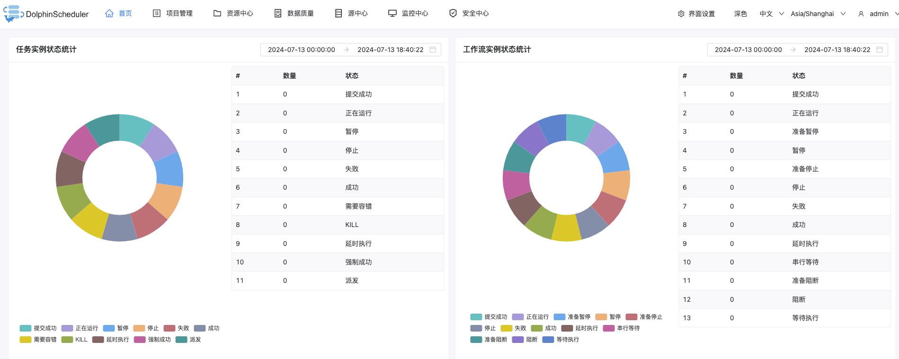
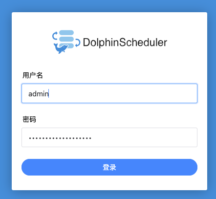

Standalone 仅适用于 DolphinScheduler 的快速体验。如果你是新手，想要体验 DolphinScheduler 的功能，推荐使用 Standalone 方式体检。如果你想体验更完整的功能，或者更大的任务量，推荐使用伪集群部署。如果你是在生产中使用，推荐使用集群部署或者kubernetes

需要注意的是在 Standalone 模式下仅建议使用 20 个以下的工作流，因为其采用内存式的 H2 Database, Zookeeper Testing Server，任务过多可能导致不稳定，并且如果重启或者停止 standalone-server 会导致内存中数据库里的数据清空。

## 1. 安装

### 1.1 下载

首先需要下载 JDK (1.8+)，安装并配置 JAVA_HOME 环境变量，并将其下的 bin 目录追加到 PATH 环境变量中。如果你的环境中已存在，可以跳过这步。然后在[下载页面](https://dolphinscheduler.apache.org/en-us/download/3.2.1)下载 DolphinScheduler 二进制包，截止到目前最新版本为 3.2.1。

### 1.2 解压缩

解压缩 `apache-dolphinscheduler-3.2.1-bin.tar.gz`到 `/opt` 文件夹下
```shell
(base) localhost:software wy$ tar -zxvf apache-dolphinscheduler-3.2.1-bin.tar.gz -C /opt/
```

为了防止没有权限执行执行如下命令授权：
```shell
chmod -R 755 apache-dolphinscheduler-3.2.1-bin
```

创建软连接，便于升级：
```shell
ln -s apache-dolphinscheduler-3.2.1-bin dolphinscheduler
```

## 2. 配置数据库

> 如果想快速体验 DolphinScheduler 的功能，可以跳过配置数据库这一步骤

Standalone server 使用 H2 数据库作为其元数据存储数据，这是为了上手简单，用户在启动服务器之前不需要启动数据库。但是如果用户想将元数据库存储在 MySQL 或 PostgreSQL 等其他数据库中，必须更改一些配置。我们这里以 MySQL 为例来说明如何配置外部数据库。

### 2.1 驱动

如果使用 MySQL 需要手动下载 [mysql-connector-java 驱动 (8.0.16)](https://downloads.mysql.com/archives/c-j/) 并移动到 DolphinScheduler 的每个模块的 libs 目录下，其中包括 api-server/libs 和 alert-server/libs 和 master-server/libs 和 worker-server/libs：
```shell
(base) localhost:mysql-connector-java-8.0.16 wy$ cp mysql-connector-java-8.0.16.jar /opt/dolphinscheduler/api-server/libs
(base) localhost:mysql-connector-java-8.0.16 wy$
(base) localhost:mysql-connector-java-8.0.16 wy$ cp mysql-connector-java-8.0.16.jar /opt/dolphinscheduler/alert-server/libs
(base) localhost:mysql-connector-java-8.0.16 wy$
(base) localhost:mysql-connector-java-8.0.16 wy$ cp mysql-connector-java-8.0.16.jar /opt/dolphinscheduler/master-server/libs
(base) localhost:mysql-connector-java-8.0.16 wy$
(base) localhost:mysql-connector-java-8.0.16 wy$ cp mysql-connector-java-8.0.16.jar /opt/dolphinscheduler/worker-server/libs
(base) localhost:mysql-connector-java-8.0.16 wy$
(base) localhost:mysql-connector-java-8.0.16 wy$ cp mysql-connector-java-8.0.16.jar /opt/dolphinscheduler/tools/libs
```

### 2.2 初始化数据库

由于 MySQL 5.6/5.7 和 MySQL 8 初始化数据库的命令不同，需要先查看一下 MySQL 的版本：
```sql
mysql> SELECT VERSION();
+------------+
| VERSION()  |
+------------+
| 5.7.20-log |
+------------+
1 row in set (0.03 sec)
```
在这为 5.7.20，需要按照官方文档 MySQL 5.6/5.7 的命令执行。登录 MySQL 数据库之后，首先创建需要使用到的数据库 `dolphinscheduler`：
```
mysql> CREATE DATABASE dolphinscheduler DEFAULT CHARACTER SET utf8 DEFAULT COLLATE utf8_general_ci;
Query OK, 1 row affected (0.05 sec)
```
添加需要使用到的用户名和密码，并赋予用户相应权限：
```sql
mysql> GRANT ALL PRIVILEGES ON dolphinscheduler.* TO 'dolphin_user'@'%' IDENTIFIED BY '123456';
mysql> GRANT ALL PRIVILEGES ON dolphinscheduler.* TO 'dolphin_user'@'localhost' IDENTIFIED BY '123456';
mysql> FLUSH PRIVILEGES;
```
> 在这创建的账号为 `dolphin_user`，密码为 `123456`

对于 MySQL 8 需要采用如下命令：
```sql
mysql> CREATE DATABASE dolphinscheduler DEFAULT CHARACTER SET utf8 DEFAULT COLLATE utf8_general_ci;

# 修改 {user} 和 {password} 为你希望的用户名和密码
mysql> CREATE USER '{user}'@'%' IDENTIFIED BY '{password}';
mysql> GRANT ALL PRIVILEGES ON dolphinscheduler.* TO '{user}'@'%';
mysql> CREATE USER '{user}'@'localhost' IDENTIFIED BY '{password}';
mysql> GRANT ALL PRIVILEGES ON dolphinscheduler.* TO '{user}'@'localhost';
mysql> FLUSH PRIVILEGES;
```

### 2.3 环境变量

然后修改 `./bin/env/dolphinscheduler_env.sh` 配置文件，将下面配置中的 username 和 password 改成你在上一步中设置的用户名 `dolphin_user` 和密码 `123456`：
```shell
# Dolphinscheduler MySQL
export DATABASE=mysql
export SPRING_PROFILES_ACTIVE=${DATABASE}
export SPRING_DATASOURCE_USERNAME={user}
export SPRING_DATASOURCE_PASSWORD={password}
```
> 如果没有的话，需要添加配置

完成上述步骤后，您已经为 DolphinScheduler 创建一个新数据库，现在你可以通过快速的 Shell 脚本来初始化数据库：
```
bash tools/bin/upgrade-schema.sh
```
执行上述初始化脚本，可以看到 `dolphinscheduler` 数据库下生成了很多表：



## 3. 运行

二进制压缩包中有 standalone 启动的脚本，解压后即可快速启动：
```shell
localhost:opt wy$ cd dolphinscheduler
localhost:dolphinscheduler wy$
localhost:dolphinscheduler wy$ ./bin/dolphinscheduler-daemon.sh start standalone-server
Begin start standalone-server......
starting standalone-server, logging to /opt/dolphinscheduler/standalone-server/logs
Overwrite standalone-server/conf/dolphinscheduler_env.sh using bin/env/dolphinscheduler_env.sh.
End start standalone-server.
```

## 4. 登录

浏览器访问地址 http://localhost:12345/dolphinscheduler/ui 即可登录系统 UI:



默认的用户名和密码是 admin/dolphinscheduler123，如下是登录成功之后的效果：


## 5. 启停服务

脚本 `./bin/dolphinscheduler-daemon.sh` 除了可以快捷启动 standalone 外，还能停止服务运行，全部命令如下
```shell
# 启动 Standalone Server 服务
./bin/dolphinscheduler-daemon.sh start standalone-server
# 停止 Standalone Server 服务
./bin/dolphinscheduler-daemon.sh stop standalone-server
# 查看 Standalone Server 状态
./bin/dolphinscheduler-daemon.sh status standalone-server
```
