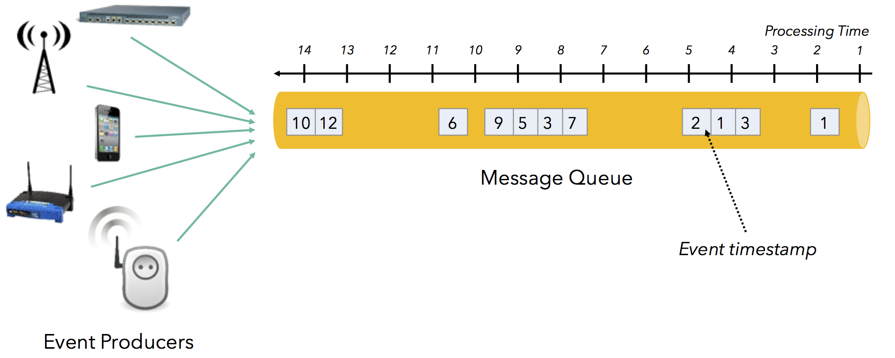
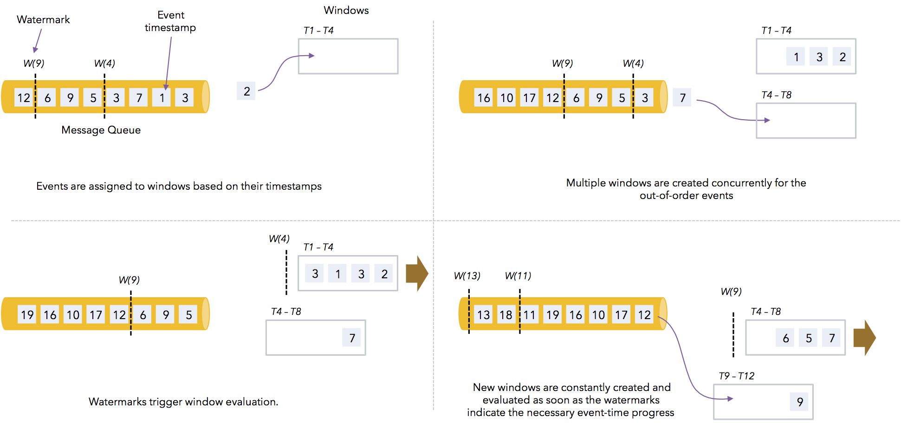
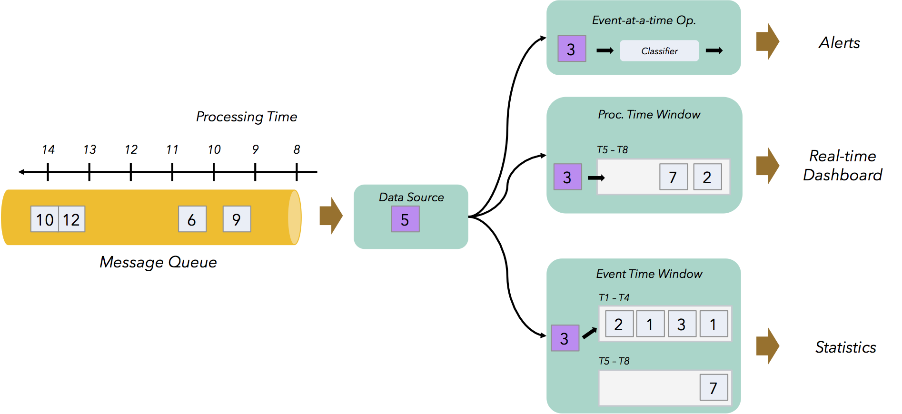
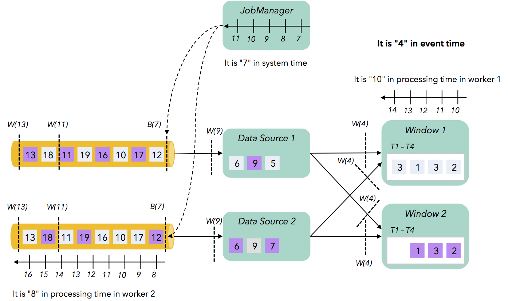

流数据处理正处于蓬勃发展中，可以提供更实时的数据以实现更好的数据洞察，同时从数据中进行分析的流程更加简化。在现实世界中数据生产是一个连续不断的过程(例如，Web服务器日志，移动应用程序中的用户活跃，数据库事务或者传感器读取的数据)。正如其他人所指出的，到目前为止，大部分数据架构都是建立在数据是有限的、静态的这样的基本假设之上。为了缩减连续数据生产和旧"批处理"系统局限性之间的这一根本差距，引入了复杂而脆弱(fragile)的端到端管道。现代流处理技术通过以现实世界事件产生的形式对数据进行建模和处理，从而减轻了对复杂解决方案的依赖。

以流的方式对数据建模并处理的想法并不新鲜。但是，新的流处理系统(包括 Apache Flink)与旧的流处理系统(包括开源和专有的)有本质的区别。使用 Flink 进行数据流处理比传统概念上快速(实时)分析要应用广泛得多，包括对历史数据的分析，以及支持新一类的应用程序（使用以前的旧技术很难或根本不能实现这些应用程序）。我们将详细研究一些应用程序，并展示 Flink 是如何以及为何能够有效地支持这些应用程序：
- 乱序数据上的准确结果。在大多数流处理场景中，事件的顺序非常重要，通常事件到达数据处理集群的顺序与它在现实世界中实际发生的时间不同。Flink 是第一个可以让开发人员可以控制事件时间（事情实际发生的时间）的开源系统，并可以在乱序流上获得准确的结果。
- 会话和非对齐窗口：对 Web 日志、机器日志以及其他数据进行分析需要能够在会话中将事件进行分组。会话是非对齐窗口的一个典型例子，例如，每个 key 的窗口开始和结束都不一样，这需要 Flink 提供的窗口和检查点之间的分离。
- 应用程序状态版本控制：在纯数据流体系结构（通常称为 Kappa 体系结构）中，流是事件的持久记录，应用程序使用从流中计算出的状态进行工作。在这样的体系结构中，Flink 的分布式快照可用于'版本化'应用程序状态：可以升级应用程序而不会丢失瞬态状态，应用程序状态可以回滚到以前的版本（例如，发现并纠正错误）或者应用程序的不同变体可以被分离出某个状态（例如，用于 A/B 测试）。

### 1. 乱序数据流和事件时间窗口

在讨论乱序数据流处理之前，我们需要定义顺序以及时间。流处理有两种时间概念：
- 事件时间：是指事件在现实世界中发生的时间，通常由事件发出的数据记录上的时间戳表示。在几乎所有的数据流中，事件都带有表示事件产生时间的时间戳：Web服务器日志，来自监视代理的事件，移动应用日志，传感器数据等。
- 处理时间：是指处理事件的算子所在机器上的本地时钟时间。

在许多流处理中，在应用程序(服务器日志，传感器，监视代理等)产生事件的时间与其到达消息队列中进行处理的时间有一定延迟。原因有很多：
- 在不同的网络路径上有不同的延迟
- 来自消费者的排队和背压影响
- 数据峰值速率
- 一些事件的生产者并不总是处于连接状态中(移动设备，传感器等)
- 一些发送爆发性事件的生产者

这样产生的影响是事件在队列中相对于事件时间通常是无序的。此外，事件产生的时间戳与其到达队列或流处理器时间的差异随着时间而发生变化。这通常被称为事件时间偏差，并被定义为 '处理时间 - 事件时间'。

Flink 允许用户定义基于事件时间的窗口，而不是处理时间。这样的窗口不会轻易被乱序事件和不同事件时间偏差而影响。Flink 使用事件时间时钟来追踪事件时间，并通过 Watermark 来实现。Watermark 是 Flink 数据源生成的一种特殊事件，可以粗略地评估事件时间。时间为 T 的 Watermark 表示事件时间在该流(或分区)上已经处理到时间 T，这意味着不会再有时间戳小于 T 的事件到达了。Flink 算子可以根据这个时钟跟踪事件时间。下图展示了 Flink 如何基于事件时间来计算窗口。观察到的会有多个窗口在同时运行（当出现乱序时），并根据事件时间戳把事件分配给对应的窗口。在 Watermark 到达时会触发窗口计算并更新事件时钟。

基于事件时间的管道会尽可能快的产生精确的结果(一旦事件时间到达指定时间)，但必要的时候尽可能的延迟一些时间，把相关事件尽可能的都包含进来。与使用批处理器周期性计算聚合相比，流式事件时间管道可以提前产生更精确的结果(因为批处理管道不能正确处理跨批次的乱序事件)。最后，流式作业简单而明确地描述了如何根据时间(窗口)对元素进行分组，如何及时评估必要的进度（Watermark），而不是像批处理其通过滚动接收文件、批量作业以及定期作业调度程序实现。

### 2. 整合事件时间和实时管道

事件时间管道会产生一定的延迟，因为需要等待所需的事件全部到达。在某些情况下，上述延迟太大以至于无法产生准确的实时结果。因为 Flink 是一个合适的流处理器，可以在几毫秒内处理完事件，所以很容易就可以在同一个程序中将低延迟的实时管道与事件时间管道结合起来。下面的例子展示了一个生产程序：
- 基于单个事件实现低延迟警报。如果发现某种类型的事件，则发送警报消息。
- 基于处理时间窗口的实时仪表板，每隔几秒就对事件进行聚合和计数。
- 根据事件时间准确统计。

整合事件时间和处理时间的另一种方式是定义具有提前输出结果以及最大延迟的事件时间窗口：
- 事件时间窗口可以自定义一个滞后于处理时间的最大延迟。例如，一个事件时间窗口将在事件时间 10：15h 关闭，可以自定义在处理时间内不晚于 10：20h 关闭。
- 事件时间窗口可以提前输出结果。例如，计算 15 分钟事件时间滑动窗口中的事件数量的程序，可以在按处理时间每分钟输出当前每个未触发窗口的计数。

### 3. Flink 如何度量时间

现在，我们深入了解 Flink 时间处理的机制，以及这些机制与旧式流式处理系统有什么不同之处。一般来说，时间使用时钟度量的。流式作业集群机器的内部时钟是最简单的时钟(称为挂钟)，时钟可以记录处理时间。为了追踪事件时间，我们需要一个时钟来度量不同机器上的同一时间。这可以通过 Flink 的 Watermark 机制来完成。Watermark 是一种特殊事件，表示指事件流中的时间(即事件流中的真实世界时间戳)到达了一个特定时间点(例如，10am)，并且从现在起不会有早于上午 10 点时间戳的事件到达。这些 Watermark 作为数据流的一部分与常规事件一起流转，Flink 算子一旦从所有上游算子/数据源接收到 10am 的 Watermark，就将其事件时间提至上午10点。需要注意的是，基于事件时钟追踪时间比挂钟粒度更粗，但更为正确，因为它在机器间保持一致。第三种类型的时钟(我们称之为系统时钟)被流处理系统用于内部记账，最重要的是能保证一致的语义("精确一次处理")。Flink 通过向数据流注入栅栏 Barriers 并生成一致性快照来跟踪作业的进度。Barriers 类似于 Watermark，都是流经数据流的事件。不同之处在于 Barriers 不是由真实世界的数据源产生的，而是根据 Flink Master 的挂钟度量的。类似地，Spark Streaming 基于 Spark 的接收器的挂钟调度微批次。Flink 的快照机制和 Spark 的微批处理机制都是系统时钟的例子，这是一种追踪计算时间(以及进度)的方法。如下展示了假设我们"冻结"计算下不同时钟度量的不同的时间:

从上面可以看出，作业由一个数据源和一个窗口算子组成，在两台机器上(worker 1 和 worker 2)上并行执行。事件中的数字表示时间戳，框的颜色表示进入不同的窗口中(灰色事件进入窗口1，紫色事件进入窗口2)。数据源从消息队列中读取事件，根据 key 进行分区，并将它们分发到正确的窗口算子实例中。这里的窗口是基于事件时间的时间窗口。我们看到，由于机器间时间不同步，不同机器(worker 1，worker 2 和 master)上在同一时刻的挂钟度量成了不同的时间(分别为 10、8 以及 7，假设时间从 0 开始)。

数据源发出 Watermark，目前时间戳为 4 的 Watermark 都已到达窗口算子。这意味着事件时间时钟度量为 4，而且该时间在并行计算中是一致的。最后，Master（JobManager）当前正在数据源注入 Barrier 来获取计算快照。这意味着系统时间度量为 7（这可能是第 7 个检查点，也可以是基于 Master 处理时间注入的时间戳）。所以，我们已经看到流处理场景中存在三个时钟：
- 事件时钟（粗略）度量事件流中的时间
- 系统时钟度量计算的进度，并在系统内部使用以在发生故障时提供一致的结果。这个时钟实际上是基于协调机器的挂钟。
- 机器的挂钟度量处理时间。

旧流式系统的一个常见缺陷是三个时钟都是相同的。用相同的时钟来度量现实世界中的时间，以及跟踪计算的进度。这会导致两个问题：
- 计算结果不正确：由于事件在现实世界中发生的顺序与其被摄取或处理的顺序不同，因此系统可能会将事件分组到错误的时间窗口中。
- 计算结果取决于当前时间，例如，流处理作业实际开始的那一天，以及机器度量的时间。
- 系统配置参数会影响程序的语义：当增加检查点间隔时，例如，为了增加吞吐量，windows 会缓冲更多元素。

旧流式系统的这些缺点使得它们很难用于需要准确（或至少可控准确）结果的应用程序以及需要处理历史和实时数据的应用程序。再加上早期流式系统的吞吐量相对较低，这给流技术带来了'不好的声誉'：人们认为只有批处理才能实现重量级而准确的处理，而流系统只能实现一些快速的近似结果，例如，作为 Lambda 架构的一部分。Flink 的一个新功能是完全分离了这三个时钟：
- 基于 Watermark 的事件时钟跟踪事件流时间，并允许用户根据事件时间定义窗口。当系统知道该窗口没有进一步的事件会到达时，这些窗口会关闭。例如，当系统知道流中的事件时间已经进展到至少 10:15h 时，从 10:00h 到 10:15h 的时间窗口将会关闭。
- 与事件时间时钟完全分离的系统时钟跟踪计算进度并为全局快照计时。此时钟不向用户 API 显示，但用于协调分布式一致性。
- 机器的挂钟（处理时间）向用户暴露，以支持处理时间窗口以及实现提早近似结果的事件时间窗口。

这种时钟和时间进度的分离使得 Flink 比旧的'实时'流系统具有更多的能力。

### 4. 结论

通过这篇文章，我们可以了解到：
- Flink 提供了基于事件时间触发的窗口算子，而不是基于机器的挂钟时间触发，所以即使在无序流或事件延迟时也能产生准确的结果。
- Flink 将事件时间算子与触发器结合起来可以获得提早结果和低延迟报警。
- Flink 将跟踪检查点进度的内部系统时钟与跟踪事件时间的时钟区分开。

原文:[How Apache Flink™ Enables New Streaming Applications, Part 1](https://www.ververica.com/blog/how-apache-flink-enables-new-streaming-applications-part-1)
