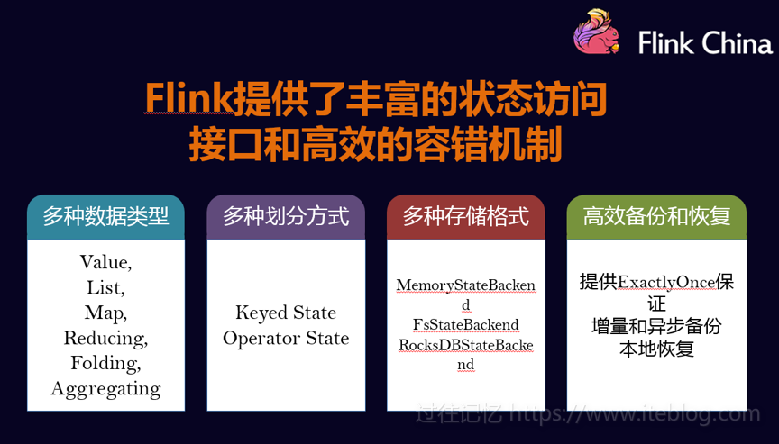
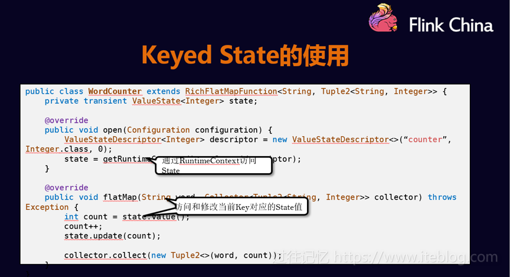
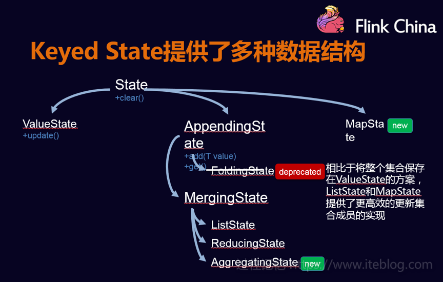
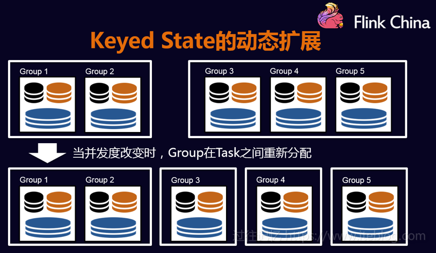
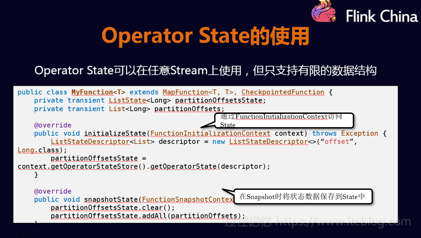
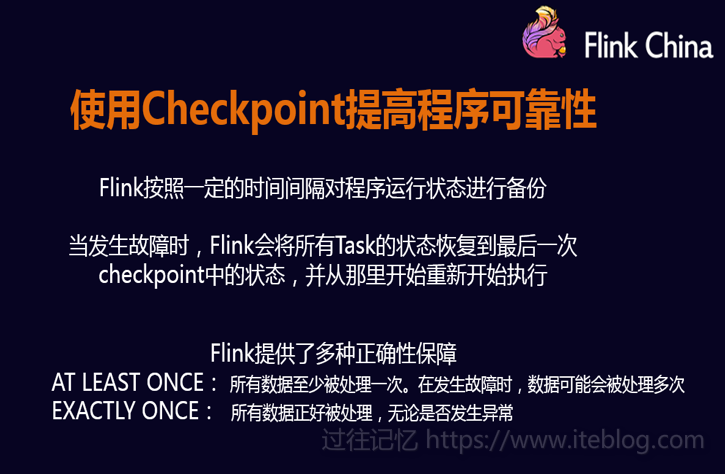
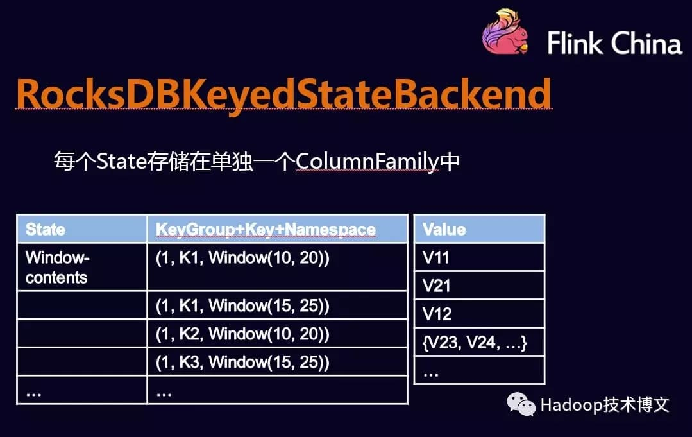
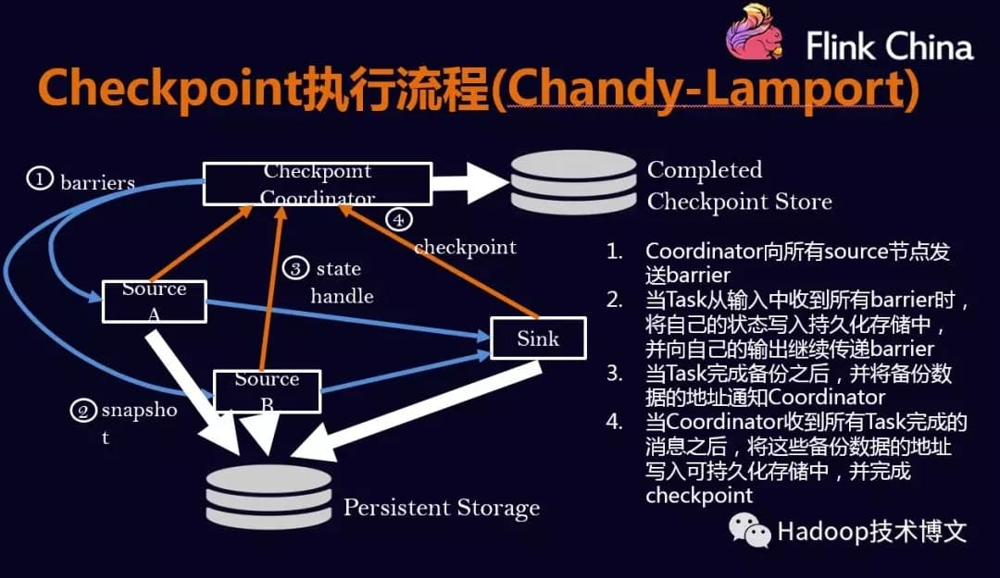
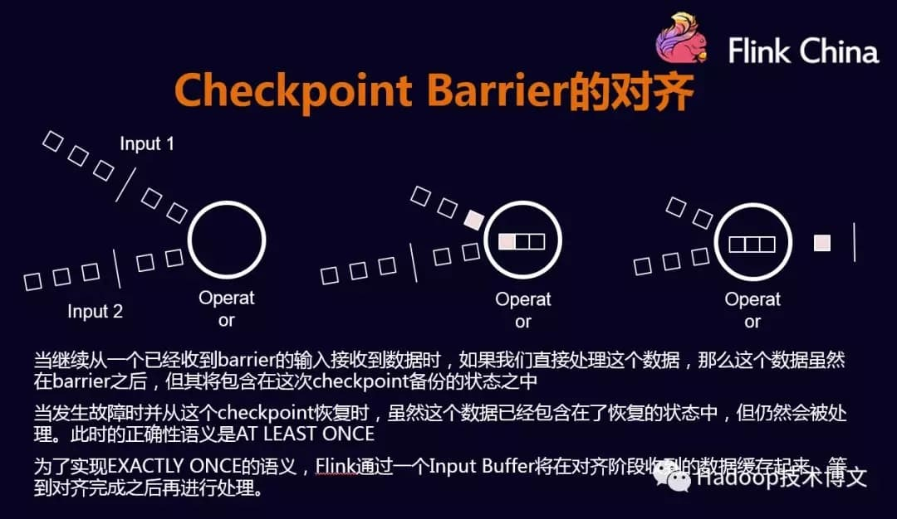
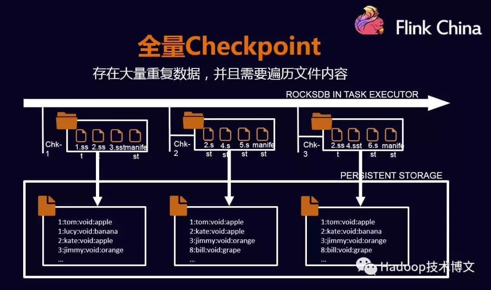

本文主要内容如下：
- 有状态的流数据处理；
- Flink中的状态接口；
- 状态管理和容错机制实现；

### 1. 有状态的流数据处理

#### 1.1 什么是有状态的计算

计算任务的结果不仅仅依赖于输入，还依赖于它的当前状态，其实大多数的计算都是有状态的计算。比如wordcount,给一些word,其计算它的count,这是一个很常见的业务场景。count做为输出，在计算的过程中要不断的把输入累加到count上去，那么count就是一个state。

#### 1.2 传统的流计算系统缺少对于程序状态的有效支持

- 状态数据的存储和访问;
- 状态数据的备份和恢复;
- 状态数据的划分和动态扩容;

在传统的批处理中，数据是划分为块分片去完成的，然后每一个Task去处理一个分片。当分片执行完成后，把输出聚合起来就是最终的结果。在这个过程当中，对于state的需求还是比较小的。

对于流计算而言，对State有非常高的要求，因为在流系统中输入是一个无限制的流，会运行很长一段时间，甚至运行几天或者几个月都不会停机。在这个过程当中，就需要将状态数据很好的管理起来。很不幸的是，在传统的流计算系统中，对状态管理支持并不是很完善。比如storm，没有任何程序状态的支持，一种可选的方案是storm+hbase这样的方式去实现，把状态数据存放在Hbase中，计算的时候再次从Hbase读取出来，做更新在写入进去。这样就会有如下几个问题：
- 流计算系统的任务和Hbase的数据存储有可能不在同一台机器上，导致性能会很差。这样经常会做远端的访问，走网络和存储；
- 备份和恢复是比较困难，因为Hbase是没有回滚的，要做到 Exactly-Onces 语义很困难。在分布式环境下，如果程序出现故障，只能重启Storm，那么Hbase的数据也就无法回滚到之前的状态。比如广告计费的这种场景，Storm+Hbase是是行不通的，出现的问题是钱可能就会多算，解决以上的办法是Storm+Mysql，通过Mysql的回滚解决一致性的问题。但是架构会变得非常复杂。性能也会很差，要commit确保数据的一致性。
- 对于storm而言状态数据的划分和动态扩容也是非常难做。一个很严重的问题是所有用户都会在Strom上重复的做这些工作，比如搜索，广告都要在做一遍，由此限制了部门的业务发展。

#### 1.3 Flink丰富的状态访问和高效的容错机制

Flink在最早设计的时候就意识到了这个问题，并提供了丰富的状态访问和容错机制。如下图所示：

### 2. Flink中的状态管理

按照数据的划分和扩张方式，Flink中大致分为2类：
- Keyed States
- Operator States

#### 2.1 Keyed States

Keyed States 的使用：

Flink也提供了Keyed States多种数据结构类型：

Keyed States的动态扩容：

#### 2.2 Operator State

##### 2.2.1 Operator States的使用：

Operator States的数据结构不像Keyed States丰富，现在只支持List。

##### 2.2.2 Operator States多种扩展方式

Operator States的动态扩展是非常灵活的，现提供了3种扩展，下面分别介绍：
- ListState:并发度在改变的时候，会将并发上的每个List都取出，然后把这些List合并到一个新的List,然后根据元素的个数在均匀分配给新的Task;
- UnionListState:相比于ListState更加灵活，把划分的方式交给用户去做，当改变并发的时候，会将原来的List拼接起来。然后不做划分，直接交给用户；
- BroadcastState:如大表和小表做Join时，小表可以直接广播给大表的分区，在每个并发上的数据都是完全一致的。做的更新也相同，当改变并发的时候，把这些数据COPY到新的Task即可
以上是Flink Operator States提供的3种扩展方式，用户可以根据自己的需求做选择。

##### 2.2.3 使用Checkpoint提高程序的可靠性

用户可以根据的程序里面的配置将checkpoint打开，给定一个时间间隔后，框架会按照时间间隔给程序的状态进行备份。当发生故障时，Flink会将所有Task的状态一起恢复到Checkpoint的状态。从哪个位置开始重新执行。

Flink也提供了多种正确性的保障，包括：
- AT LEAST ONCE;
- Exactly-once;

##### 2.2.4 备份为保存在State中的程序状态数据

Flink也提供了一套机制，允许把这些状态放到内存当中。做Checkpoint的时候，由Flink去完成恢复。

##### 2.2.5 从已停止作业的运行状态中恢复

当组件升级的时候，需要停止当前作业。这个时候需要从之前停止的作业当中恢复，Flink提供了2种机制恢复作业:
- Savepoint:是一种特殊的checkpoint，只不过不像checkpoint定期的从系统中去触发的，它是用户通过命令触发，存储格式和checkpoint也是不相同的，会将数据按照一个标准的格式存储，不管配置什么样，Flink都会从这个checkpoint恢复，是用来做版本升级一个非常好的工具；
- External Checkpoint：对已有checkpoint的一种扩展，就是说做完一次内部的一次Checkpoint后，还会在用户给定的一个目录中，多存储一份checkpoint的数据；

### 3. 状态管理和容错机制实现

下面介绍一下状态管理和容错机制实现方式。

#### 3.1 StateBackend

Flink提供了3种不同的StateBackend
- MemoryStateBackend
- FsStateBackend
- RockDBStateBackend

用户可以根据自己的需求选择，如果数据量较小，可以存放到 MemoryStateBackend 和 FsStateBackend 中，如果数据量较大，可以放到 RockDB 中。下面介绍 HeapKeyedStateBackend 和 RockDBKeyedStateBackend。

##### 3.1.1 HeapKeyedStateBackend

##### 3.1.2 RockDBKeyedStateBackend

#### 3.2 Checkpoint

##### 3.2.1 Checkpoint的执行流程

Checkpoint的执行流程是按照Chandy-Lamport算法实现的:

##### 3.2.2 Checkpoint Barrier的对齐

##### 3.2.3 全量Checkpoint
全量Checkpoint会在每个节点做备份数据时，只需要将数据都便利一遍，然后写到外部存储中，这种情况会影响备份性能。在此基础上做了优化。

##### 3.2.4 RockDB的增量Checkpoint

RockDB的数据会更新到内存，当内存满时，会写入到磁盘中。增量的机制会将新产生的文件COPY持久化中，而之前产生的文件就不需要COPY到持久化中去了。通过这种方式减少COPY的数据量，并提高性能。

原文：[Flink状态管理和容错机制介绍](https://flink-china.org/blog/flink-state-management.html)
