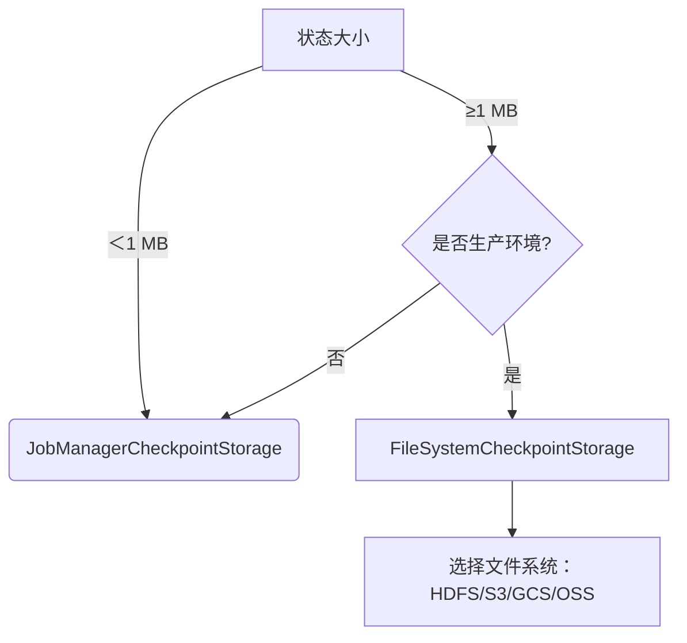

以下是一篇针对 Flink 开发者撰写的关于 `CheckpointStorage` 的博文，深入剖析 `JobManagerCheckpointStorage` 和 `FileSystemCheckpointStorage` 的设计、场景与实践：

---

### Flink CheckpointStorage 深度解析：JobManagerCheckpointStorage vs FileSystemCheckpointStorage  
**—— 生产环境中的状态持久化策略选择**

在 Apache Flink 的容错机制中，**Checkpoint** 是保障状态一致性和故障恢复的核心。而 `CheckpointStorage` 作为 Checkpoint 的物理存储抽象，直接决定了状态数据的存储位置、可靠性和性能表现。本文将聚焦两种常用实现：`JobManagerCheckpointStorage` 与 `FileSystemCheckpointStorage`，从原理到生产实践为您全面解析。

---

#### 一、CheckpointStorage 的核心作用
在 Flink 中，一次 Checkpoint 包含两类数据：
1. **元数据（Metadata）**：描述检查点信息的轻量数据（如指针、事务日志）
2. **状态数据（State Data）**：算子状态的真实快照（可能达 TB 级）

`CheckpointStorage` 负责定义这两类数据的存储位置和读写逻辑。其选择直接影响：
- **恢复速度**：状态加载效率
- **可靠性**：存储系统自身的容错能力
- **资源开销**：对 JobManager/TaskManager 的压力
- **成本**：存储介质费用

---

#### 二、JobManagerCheckpointStorage：轻量但受限的存储

##### 工作原理
- **状态数据**：存储在 **JobManager 的堆内存**中
- **元数据**：存储于 JobManager 的持久化存储（如 Zookeeper 或高可用 DB）

```java
StreamExecutionEnvironment env = StreamExecutionEnvironment.getExecutionEnvironment();
env.getCheckpointConfig().setCheckpointStorage(
    new JobManagerCheckpointStorage()
);
```

##### 适用场景
1. **本地开发/测试环境**：无需外部依赖，快速验证逻辑
2. **状态极小的作业**（< 1 MB）：如仅含计数器的简单任务
3. **短生命周期作业**：无需长期保存状态

##### 优点
- **零外部依赖**：无需配置 HDFS/S3 等存储系统
- **部署简单**：开箱即用，适合 PoC 验证
- **低延迟写入**：网络开销为零（内存直接写入）

##### 缺点
1. **容量严重受限**：状态大小受限于 JobManager 的可用堆内存
2. **可靠性低**：JobManager 崩溃会导致所有状态丢失
3. **不支持增量 Checkpoint**：每次全量快照，内存压力剧增
4. **影响 JobManager 稳定性**：大状态可能引发 OOM 导致集群管理瘫痪

> ⚠️ 生产警示：**切勿用于生产环境**（除非状态极小且可接受丢失）

---

#### 三、FileSystemCheckpointStorage：生产级存储的首选

##### 工作原理
- **状态数据**：存储到**分布式文件系统**（HDFS、S3、GCS、OSS 等）
- **元数据**：仍存于 JobManager 的持久化存储

```java
env.getCheckpointConfig().setCheckpointStorage(
    new FileSystemCheckpointStorage("hdfs:///flink/checkpoints")
);
```

##### 适用场景
1. **生产环境作业**：要求高可靠、大状态持久化
2. **需要增量 Checkpoint 的作业**：如使用 RocksDB 状态后端
3. **长期运行任务**：支持历史 Checkpoint 保留与版本回溯
4. **需要从保存点（Savepoint）恢复**的场景

##### 优点
- **高可靠性**：借助分布式文件系统的容错能力（如 HDFS 副本）
- **容量弹性**：存储空间与集群内存解耦，支持 TB/PB 级状态
- **支持增量 Checkpoint**：仅上传变更数据，大幅降低 I/O 开销
- **作业独立性**：JobManager 故障不影响已持久化的状态数据
- **成本可控**：对象存储（如 S3）提供低单价存储方案

##### 缺点
- **外部系统依赖**：需维护文件系统（权限、监控、扩容）
- **网络 I/O 开销**：状态上传受网络带宽影响
- **延迟敏感场景需调优**：高频 Checkpoint 可能受存储系统吞吐限制

---

#### 四、关键生产实践指南

##### 1. 容量规划与调优
- **FileSystem 选择**：
  - **HDFS**：低延迟首选，但需运维集群
  - **S3/OSS**：免运维，注意请求成本与最终一致性
- **路径隔离**：按作业/命名空间划分目录，避免冲突
- **保留策略**：通过 `CheckpointConfig` 控制最大保留数

##### 2. 增量 Checkpoint 的必须性
当使用 **RocksDB 状态后端**时，**必须启用增量 Checkpoint**：
```java
// 启用增量 Checkpoint（仅对 RocksDB 生效）
env.setStateBackend(new RocksDBStateBackend("hdfs:///checkpoints", true));
```
否则每次全量上传可能导致：
- 网络带宽打满
- Checkpoint 超时失败
- 存储空间暴涨

##### 3. 高可用（HA）配置
无论使用何种存储，**元数据高可用必不可少**：
```conf
# conf/flink-conf.yaml
high-availability: zookeeper
high-availability.storageDir: hdfs:///flink/ha/
```
确保 Zookeeper 或 DB 的 `storageDir` 指向可靠存储。

##### 4. 监控与告警
- **关键指标**：
  - `checkpoint_duration`：持续过高需优化状态大小或间隔
  - `checkpoint_failures`：立即告警
  - 存储系统空间使用率
- **日志追踪**：关注 `CheckpointCoordinator` 相关日志

##### 5. 性能调优技巧
- **异步快照**：确保所有算子实现 `CheckpointedFunction`
- **调整间隔**：权衡时效性与开销（通常 1~10 分钟）
- **超时设置**：`setCheckpointTimeout` 建议 > 2倍平均时长
- **最小间隔**：`setMinPauseBetweenCheckpoints` 防止重叠

---

#### 五、决策树：如何选择存储方案？


---

#### 六、其他注意事项
1. **与状态后端的协同**：
   - `HashMapStateBackend` + `FileSystemCheckpointStorage`：内存直写文件系统
   - `RocksDBStateBackend` + `FileSystemCheckpointStorage`：本地 SST 文件异步上传
2. **Savepoint 的存储分离**：Savepoint 可独立指定路径（如存到 NAS）
3. **云原生部署**：
   - Kubernetes 中优先使用 S3/OSS 避免 PVC 扩容问题
   - 利用 IAM 角色替代 AK/SK 提升安全性
4. **版本兼容性**：
   - Flink 1.15+ 后 `FileSystemCheckpointStorage` 成为默认选项
   - 旧版 `FsStateBackend` 已被标记为废弃

---

#### 结语
`FileSystemCheckpointStorage` 是生产环境的**事实标准**，其可靠性、扩展性与分布式存储生态的深度集成，使其成为大规模状态管理的基石。而 `JobManagerCheckpointStorage` 仅在极轻量场景中有其存在价值。**理解存储特性并合理配置，是构建稳定高效 Flink 应用的关键一步。** 下次部署作业前，不妨再审视一眼您的 Checkpoint 存储策略！
