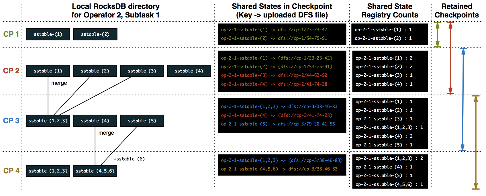

Apache Flink 是一个有状态的流处理框架。什么是流处理应用程序的状态呢？你可以理解状态为应用程序算子中的内存。状态在流计算很多复杂场景中非常重要，比如：
- 保存所有历史记录，用来寻找某种事件模式
- 保存最近一分钟的所有记录，对每分钟的记录进行聚合统计
- 保存当前的模型参数，用于进行模型训练

但是，有状态的流处理仅在状态可以容错的情况下才建议在生产环境中使用。这里的容错是指即使出现软件或机器故障，计算的最终结果也是准确的，不会出现丢失数据或重复计算的情况。Flink 的容错一直是一个功能强大的特性，可以最大限度地减少软件或机器故障对我们业务带来的影响，并可以保证 Flink 应用程序结果的  Exactly-Once 语义。

Flink 应用程序状态容错保障机制的核心是 Checkpoint。Flink 中的 Checkpoint 是周期性触发的全局异步快照，并发送到持久存储（通常是分布式文件系统）上。如果发生故障，Flink 会使用最近一个完成的快照来恢复应用程序。有些用户的作业状态达到 GB 甚至 TB 级别。这些用户报告说在如此大的状态下，创建 Checkpoint 通常比较耗费时间，也耗费资源，这就是我们为什么在 Flink 1.3 中引入增量 Checkpoint 的原因。

在增量 Checkpoint 之前，每个 Flink Checkpoint 都会包含应用程序的完整状态。每次都对完整状态进行 Checkpoint 是没有必要的，因为从一个 Checkpoint 到下一个 Checkpoint 的状态变化一般都不大，所以我们创建了增量 Checkpoint 功能。增量 Checkpoint 会维护每个 Checkpoint 之间的差异，并仅存储最后一个 Checkpoint 与当前状态之间的差异。

增量 Checkpoint 在状态非常大的情况下性能有很大的改进。有生产用户反馈对于 TB 级别的作业，使用增量 checkpoint 后能将 checkpoint 的整体时间从 3 分钟降到 30 秒。这是因为 Checkpoint 不需要每次都将完整状态传输到持久存储上。

### 2. 如何使用

目前只能在 RocksDB 状态后端上使用增量 Checkpoint，Flink 依赖 RocksDB 内部的备份机制来生成 Checkpoint 文件。总之，Flink 中的增量 Checkpoint 历史不会无限增长，并且 Flink 会自动删除旧的 Checkpoint。

如果要在您的应用程序中启用增量 Checkpoint，我建议您阅读 Apache Flink 文档有关 Checkpoint 的信息，但总而言之，您可以像以前一样正常启用 Checkpoint，只需要在构造函数中将第二个参数设置为 true 即可启用增量 Checkpoint：
```java
StreamExecutionEnvironment env = StreamExecutionEnvironment.getExecutionEnvironment();
env.setStateBackend(new RocksDBStateBackend(filebackend, true));
```
默认情况下，Flink 只会保留一个成功的 Checkpoint，如果你需要保留多个的话，可以通过下面的配置进行设置：
```java
state.checkpoints.num-retained
```
### 3. 如何工作

Flink 增量 Checkpoint 以 RocksDB 的 Checkpoint 为基础。RocksDB 是一种基于日志结构合并树（LSM）的 KV 存储，把所有的修改保存在内存的可变缓存中（称为 memtable）。所有对 memtable 中 key 的修改，会覆盖之前的 value，当 memtable 写满之后，RocksDB 会将其写入磁盘，按 Key 排序并进行轻度压缩。一旦 RocksDB 将 memtable 写入磁盘，就不可更改了，我们称为有序字符串表（sstable）。

RocksDB 的后台压缩线程会将 sstable 进行合并以删除可能的重复 Key。随着时间的推移，RocksDB 会删除原始 sstable，合并后的 sstable 包含来自所有其他 sstable 的所有信息。

在这个基础上，Flink 会跟踪 RocksDB 自上一个 Checkpoint 以来创建和删除了哪些 sstable 文件，并且由于 sstable 是不可变的，所以 Flink 使用 sstable 来确定状态变化。为此，Flink 调用 RocksDB 的 flush，强制将 memtable 的数据全部写到 sstable，并硬链到本地一个临时目录中。这个步骤是在同步阶段完成，其他剩下的部分都在异步阶段完成，不会阻塞正常的数据处理。

然后 Flink 将所有新的 sstable 复制到持久化存储（例如 HDFS、S3）以在新的 Checkpoint 中引用。Flink 不会将前一个 Checkpoint 中已经存在的 sstable 复制到持久化存储中，而是引用他们。任何新的 Checkpoint 都不会引用已经删除的文件，因为 RocksDB 中文件删除是由压缩完成的，压缩后会将原来的内容合并写成一个新的 sstable。这就是 Flink 增量 Checkpoint 能够切断 Checkpoint 历史的原因。

为了追踪 Checkpoint 间的差距，复制合并后的 sstable 是一个相对冗余的操作。Flink 以增量方式执行该过程，通常只会增加很小的开销，并且可以保持一个更短的 Checkpoint 历史，恢复时从更少的 Checkpoint 进行读取，因此我们认为这是值得的。

### 4. Example



以一个算子的子任务为例，它有一个 Keyed State，最多保留 2 个 Checkpoint。上图从左到右分别记录每次 Checkpoint 时本地的 RocksDB 状态文件、引用的持久化存储上的文件以及当前 Checkpoint 完成后文件的引用计数情况。

在 'CP 1' Checkpoint 时，本地 RocksDB 目录包含两个 sstable 文件，该 Checkpoint 会把这两个文件复制到持久化存储上，并使用与 Checkpoint 名称一样的目录名称。当 Checkpoint 完成时，Flink 会在共享状态注册表中创建两条记录并将它们的计数设置为 1。共享状态注册表中的 Key 由算子、子任务和原始 sstable 文件名共同组成，值是对应的文件路径。所以注册表还维护了一个从 Key 到文件路径的映射关系。

在 'CP 2' Checkpoint 时，RocksDB 创建了两个新的 sstable 文件，之前两个旧的文件仍然存在。该 Checkpoint 会将这两个新文件复制到持久化存储中，并引用之前的两个文件。当 Checkpoint 完成时，Flink 会将所有引用文件的计数加 1。

在 'CP 3' Checkpoint 时，RocksDB 将 sstable-(1)、sstable-(2) 以及 sstable-(3) 合并为 sstable-(1,2,3)，并删除这三个源文件。合并后的文件包含了与源文件相同的信息，并删除了所有重复条目。除了这个合并的文件，sstable-(4) 仍然存在，此外又多了一个新的 sstable-(5) 文件。Flink 将新的 sstable-(1,2,3) 和 sstable-(5) 文件复制到持久化存储中，并对 sstable-(4) 进行引用，并将引用计数加 1。由于 Checkpoint 最多只保留 2 个，因此需要删除旧的 'CP 1' Checkpoint。这会导致在 'CP 1' Checkpoint 中引用的文件 sstable-(1) 和 sstable-(2) 的引用计数减 1。

在 'CP 4' Checkpoint 时，RocksDB 将已经存在的 sstable-(4)、sstable-(5) 以及新生成的 sstable-(6) 合并为 sstable-(4,5,6)。Flink 将 sstable-(4,5,6) 复制到持久化存储中，并对 sstabe-(1,2,3) 和 sstable-(4,5,6) 进行引用，并将引用计数加 1。由于达到 Checkpoint 最大数量，因此删除 'CP-2' Checkpoint。由于 sstable-(1)、sstable-(2) 和 sstable-(3) 的引用计数现在已降至 0，Flink 会将它们从持久化存储中删除。

### 5. 竞争问题和并发Checkpoint

由于 Flink 可以并行执行多个 Checkpoint，有时在确认前一个的 Checkpoint 完成之前，新的 Checkpoint 就开始了。因此，您应该考虑使用哪一个 Checkpoint 作为新增量 Checkpoint 的基础。Flink 仅从 Checkpoint 协调器确认的 Checkpoint 引用状态，以防止无意中引用已删除的共享文件。

### 6. 从Checkpoint恢复以及性能

开启增量 Checkpoint 之后，不需要再进行其他额外的配置就可以在发生故障时从状态中恢复。如果发生故障，Flink 的 JobManager 会通知所有 Task 从上一个完成的 Checkpoint 中恢复，不管是全量 Checkpoint 还是增量 Checkpoint。每个 TaskManager 然后从分布式文件系统上的 Checkpoint 下载他们的状态。

尽管增量 Checkpoint 可以显着改善大状态下的 Checkpoint 时间，但增量 Checkpoint 也需要权衡考虑。总体而言，增量 Checkpoint 可以减少了正常操作期间的 Checkpoint 时间，但可能会导致更长的恢复时间，这具体取决于您的状态大小。如果集群故障特别严重并且 Flink TaskManager 必须从多个 Checkpoint 读取，那么恢复时间可能比使用非增量 Checkpoint 时更长。您也不能再删除旧的 Checkpoint，因为新的 Checkpoint 需要它们，并且 Checkpoint 之间的差异历史会随着时间的推移无限增长。您需要规划更大的分布式存储来维护 Checkpoint 以及从它读取的网络开销。

原文：[Managing Large State in Apache Flink: An Intro to Incremental Checkpointing](https://flink.apache.org/features/2018/01/30/incremental-checkpointing.html)
