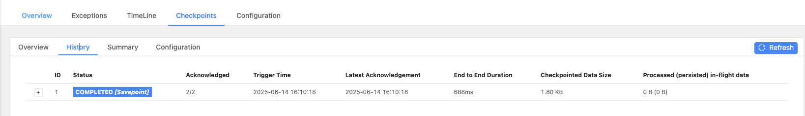
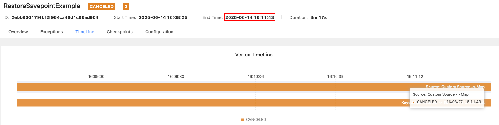
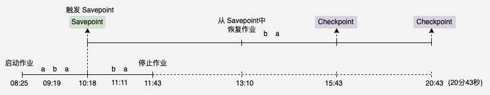

## 1. 什么选择 Savepoint

在实际项目中有许多种场景需要流处理程序把以前处理过的数据再重新处理一遍，比如：
- 零停机升级：更新业务逻辑时保留状态
- 状态迁移：跨集群/环境迁移作业（开发→测试→生产）
- 版本回滚：快速回退问题版本
- A/B测试：基于相同状态启动不同逻辑版本
- 资源调整：安全改变并行度（需状态重分布）

Apache Flink 的保存点 Savepoint 功能可以支持上面的所有场景，这样也是 Flink 和其它分布式开源流处理器显著不同的一点。下面我们会讲述如何使用 Savepoint 来恢复作业。

## 2. 恢复流程

### 2.1 手动触发 Savepoint

使用如下命令来触发 `Savepoint`，同时需要在命令行中指定 jobId 以及可选的 targetDirectory 两个参数，jobId 是需要触发 Savepoint 操作的作业Id，targetDirectory 是 Savepoint 数据的存储路径：
```
bin/flink savepoint :jobId [:targetDirectory]
```
> 如果你不指定 targetDirectory，则需要配置 `state.savepoints.dir` 目录，否则触发 Savepoint 失败。

### 2.2 从 Savepoint 恢复作业

可以使用如下 run 命令从 Savepoint 中恢复作业，其中 -s 参数指定了 Savepoint 数据的存储路径：
```
bin/flink run -s :savepointPath [:runArgs]
```

默认情况下，恢复操作会尝试将 `Savepoint` 下的所有状态映射回待恢复的新程序。如果我们在新程序中删除了某个算子，这时会出现任务不能恢复的情况，此时我们可以通过 `--allowNonRestoredState` （简写-n）参数跳过无法匹配的状态，让程序正常启动起来：
```
bin/flink run -s :savepointPath -n [:runArgs]
```

## 3. 最佳实践

如下示例从 Kafka 单词流中读取单词并计算每个单词的出现次数：
```java
final StreamExecutionEnvironment env = StreamExecutionEnvironment.getExecutionEnvironment();
env.setParallelism(1);

// 每300s一次Checkpoint 生产环境没有这么大为了演示效果
env.enableCheckpointing(300 * 1000);
env.getCheckpointConfig().setCheckpointingMode(CheckpointingMode.EXACTLY_ONCE);
// FileSystemCheckpointStorage
String checkpointPath = "hdfs://localhost:9000/flink/checkpoint";
env.getCheckpointConfig().setCheckpointStorage(new FileSystemCheckpointStorage(checkpointPath));

// 配置 Kafka Consumer
Properties props = new Properties();
props.put("bootstrap.servers", "localhost:9092");
props.put("group.id", "word-count");
props.put("key.deserializer", "org.apache.kafka.common.serialization.StringDeserializer");
props.put("value.deserializer", "org.apache.kafka.common.serialization.StringDeserializer");
// 关闭 Kafka 自动提交
props.setProperty("enable.auto.commit", "false");

String topic = "word";
FlinkKafkaConsumer<String> consumer = new FlinkKafkaConsumer<>(topic, new SimpleStringSchema(), props);
// Kafka Source
DataStream<String> source = env.addSource(consumer).uid("KafkaSource");

// 计算单词个数
SingleOutputStreamOperator<WordCount> result = source
        .map(new MapFunction<String, WordCount>() {
            @Override
            public WordCount map(String element) throws Exception {
                WordCount wordCount = gson.fromJson(element, WordCount.class);
                String word = wordCount.getWord();
                LOG.info("word: {}, frequency: {}", word, wordCount.getFrequency());
                return wordCount;
            }
        }).uid("Map")
        .keyBy(new KeySelector<WordCount, String>() {
            @Override
            public String getKey(WordCount element) throws Exception {
                return element.getWord();
            }
        })
        .sum("frequency").uid("Sum");

result.print().uid("Print");

env.execute("RestoreSavepointExample");
```

### 3.1 启动作业并触发 Savepoint

使用如下命令启动上述 `RestoreSavepointExample` 应用程序：
```shell
localhost:flink wy$ ./bin/flink run -d -c com.flink.example.stream.state.checkpoint.RestoreSavepointExample  /Users/wy/study/code/flink-example/flink-example-1.13/target/flink-example-1.13-1.0.jar
Job has been submitted with JobID 2ebb930179fbf2f964ca40d1c96ad904
```
> 生成的作业ID为 `2ebb930179fbf2f964ca40d1c96ad904`，后续生成 Savepoint 时还需要这个作业ID

作业启动之后 Kafka 消费位点定位到 groupId(`word-count`) 的消费位点 86 等待消费，在 09:19 分从 Kafka 中消费到三条数据：
```shell
2025-06-14 16:08:28,665 INFO  org.apache.kafka.clients.consumer.KafkaConsumer              [] - [Consumer clientId=consumer-word-count-2, groupId=word-count] Subscribed to partition(s): word-0
2025-06-14 16:08:28,678 INFO  org.apache.kafka.clients.Metadata                            [] - [Consumer clientId=consumer-word-count-2, groupId=word-count] Cluster ID: yODQH2wVQ7anIYvKZI4_iQ
2025-06-14 16:08:28,679 INFO  org.apache.kafka.clients.consumer.internals.AbstractCoordinator [] - [Consumer clientId=consumer-word-count-2, groupId=word-count] Discovered group coordinator 127.0.0.1:9092 (id: 2147483647 rack: null)
2025-06-14 16:08:28,687 INFO  org.apache.kafka.clients.consumer.internals.ConsumerCoordinator [] - [Consumer clientId=consumer-word-count-2, groupId=word-count] Setting offset for partition word-0 to the committed offset FetchPosition{offset=86, offsetEpoch=Optional.empty, currentLeader=LeaderAndEpoch{leader=127.0.0.1:9092 (id: 0 rack: null), epoch=2}}
2025-06-14 16:09:19,759 INFO  com.flink.example.stream.state.checkpoint.RestoreSavepointExample [] - word: a, frequency: 1
2025-06-14 16:09:19,776 INFO  com.flink.example.stream.state.checkpoint.RestoreSavepointExample [] - word: b, frequency: 1
2025-06-14 16:09:19,776 INFO  com.flink.example.stream.state.checkpoint.RestoreSavepointExample [] - word: a, frequency: 1
```
在消费完数据之后的 10:18，手动触发 Savepoint：
```
localhost:flink wy$ bin/flink savepoint 2ebb930179fbf2f964ca40d1c96ad904 hdfs://localhost:9000/flink/savepoint
Triggering savepoint for job 2ebb930179fbf2f964ca40d1c96ad904.
Waiting for response...
Savepoint completed. Path: hdfs://localhost:9000/flink/savepoint/savepoint-2ebb93-0418070f5f92
You can resume your program from this savepoint with the run command.
```
从 JobManager 日志中可以看到触发 Savepoint 同时会触发 Checkpoint：
```
2025-06-14 16:10:18,091 INFO  org.apache.flink.runtime.jobmaster.JobMaster                 [] - Triggering savepoint for job 2ebb930179fbf2f964ca40d1c96ad904.
2025-06-14 16:10:18,198 INFO  org.apache.flink.runtime.checkpoint.CheckpointCoordinator    [] - Triggering checkpoint 1 (type=SAVEPOINT) @ 1749888618097 for job 2ebb930179fbf2f964ca40d1c96ad904.
2025-06-14 16:10:19,036 INFO  org.apache.flink.runtime.checkpoint.CheckpointCoordinator    [] - Completed checkpoint 1 for job 2ebb930179fbf2f964ca40d1c96ad904 (1842 bytes in 936 ms).
```



11:11 继续从 Kafka 中消费到两条数据：
```
2025-06-14 16:11:11,874 INFO  com.flink.example.stream.state.checkpoint.RestoreSavepointExample [] - word: b, frequency: 1
2025-06-14 16:11:11,875 INFO  com.flink.example.stream.state.checkpoint.RestoreSavepointExample [] - word: a, frequency: 1
```

在 11:43 停止作业：



### 3.2 从 Savepoint 中恢复

从 Savepoint 中恢复 `RestoreSavepointExample` 作业：
```shell
localhost:flink wy$ bin/flink run -d -s hdfs://localhost:9000/flink/savepoint/savepoint-2ebb93-0418070f5f92 -c com.flink.example.stream.state.checkpoint.RestoreSavepointExample  /Users/wy/study/code/flink-example/flink-example-1.13/target/flink-example-1.13-1.0.jar
Job has been submitted with JobID 57bc93db4d82738f1a789e5c26778cf6
```
从如下日志中可以看到 `57bc93db4d82738f1a789e5c26778cf6` 作业是从路径为 `hdfs://localhost:9000/flink/savepoint/savepoint-2ebb93-0418070f5f92`  的 Savepoint 中恢复：
```java
2025-06-14 16:13:10,447 INFO  org.apache.flink.runtime.dispatcher.StandaloneDispatcher     [] - Submitting job 57bc93db4d82738f1a789e5c26778cf6 (RestoreSavepointExample).
...
2025-06-14 16:13:10,498 INFO  org.apache.flink.runtime.checkpoint.CheckpointCoordinator    [] - Starting job 57bc93db4d82738f1a789e5c26778cf6 from savepoint hdfs://localhost:9000/flink/savepoint/savepoint-2ebb93-0418070f5f92 ()
2025-06-14 16:13:10,594 INFO  org.apache.flink.runtime.checkpoint.CheckpointCoordinator    [] - Reset the checkpoint ID of job 57bc93db4d82738f1a789e5c26778cf6 to 2.
2025-06-14 16:13:10,594 INFO  org.apache.flink.runtime.checkpoint.CheckpointCoordinator    [] - Restoring job 57bc93db4d82738f1a789e5c26778cf6 from Savepoint 1 @ 0 for 57bc93db4d82738f1a789e5c26778cf6 located at hdfs://localhost:9000/flink/savepoint/savepoint-2ebb93-0418070f5f92.
```

作业从 Savepoint 中恢复，Kafka 消费位点 Offset 也需要从状态中恢复，重置到 88 消费位点，从 89 开始消费到两条数据：
```java
2025-06-14 16:13:11,496 INFO  org.apache.flink.streaming.connectors.kafka.FlinkKafkaConsumerBase [] - Consumer subtask 0 will start reading 1 partitions with offsets in restored state: {KafkaTopicPartition{topic='word', partition=0}=88}
...
2025-06-14 16:13:11,516 INFO  org.apache.kafka.clients.consumer.KafkaConsumer              [] - [Consumer clientId=consumer-word-count-2, groupId=word-count] Subscribed to partition(s): word-0
2025-06-14 16:13:11,518 INFO  org.apache.kafka.clients.consumer.KafkaConsumer              [] - [Consumer clientId=consumer-word-count-2, groupId=word-count] Seeking to offset 89 for partition word-0
2025-06-14 16:13:11,528 INFO  org.apache.kafka.clients.Metadata                            [] - [Consumer clientId=consumer-word-count-2, groupId=word-count] Cluster ID: yODQH2wVQ7anIYvKZI4_iQ
2025-06-14 16:13:11,581 INFO  com.flink.example.stream.state.checkpoint.RestoreSavepointExample [] - word: b, frequency: 1
2025-06-14 16:13:11,581 INFO  com.flink.example.stream.state.checkpoint.RestoreSavepointExample [] - word: a, frequency: 1
```

### 3.3 总结



当从 Savepoint 恢复作业时，Flink 首先加载 Savepoint 的静态快照，从 Savepoint 记录的 Offset 重新消费数据，处理 Savepoint 之后的所有新数据，重建完整的最新状态。最终的输出结果如下所示，与恢复之前的作业结果一致：
```
WordCount{word='b', frequency=2}
WordCount{word='a', frequency=3}
```
> 作业停止之后假设没有新数据。
