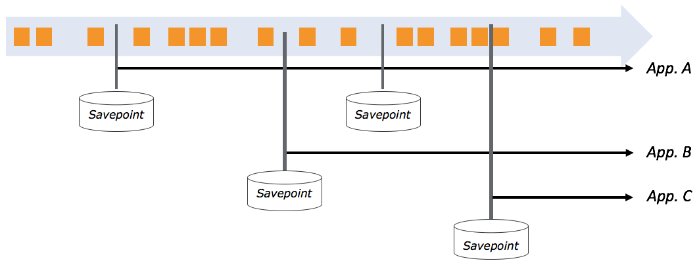

流处理通常被大家与`动态数据`关联起来，相应的系统差不多会在数据被创造出来的那一刻就立刻对其进行处理或响应。像延迟、吞吐量、水位线以及处理迟到的数据等等都是大家讨论得最多的流处理话题。可在实际项目中，却有许多种场景需要你的流处理程序把以前处理过的数据再重新处理一遍，比如：
- 为你的程序部署一个新版本，可能是有新功能、修复了 BUG、或者采用了更好的机器学习模型；
- 使用相同的源数据流对应用程序的不同版本进行 A/B 测试，两边都从同一个点开始测试，这样就不会牺牲之前的状态；
- 评估或开展将应用程序迁移到更新版本的处理框架上，或是一个不同的集群上；

Apache Flink 的保存点（Savepoint）功能可以支持上面的所有场景，这样也是 Flink 和其它分布式开源流处理器显著不同的一点。在本文中，我们会讲述如何使用保存点功能来重新处理数据，并一定程度地深入底层，讲述这个功能在 Flink 中是怎么实现的。

### 1. "重新处理"到底是什么意思？

为了保证大家对重新处理数据的理解是一致的，我们先讨论一个你可能需要重新处理数据的业务例子。想像一个社交媒体公司，她除了基本的发贴功能之外，还发布了一种付费的或者说是推广发贴的功能。公司的用户可以访问一个简单的、基于 Flink 实现的仪表板，显示他们所有文章（不管是普通的还是付费的）被大家查看、点击等等的次数。几个星期之后，从用户的反馈中了解到用户希望把普通的发贴数据和付费的发贴数据区别开来。要实现这个功能，就有必要返回到付费发贴功能最初发布的那个时刻，然后从那个时刻开始，把所有数据全都重新处理一遍。这一次要把付费贴和普通贴的展示和交互全都拆开来。如果要把从公司创立伊始产生的数据全都重新处理一遍，这就实在有点强人所难，所以能够从付费发贴功能发布的时候开始重新处理，同时还保留之前的计算结果，这个功能就很有必要了。所以当我们用到 "重新处理" 这个词时，我们的意思就是回到系统以前的、一致的状态（按开发者的定义，不一定非要是流的最早状态），然后从那个状态开始再处理一遍，可能也要在更改了你的 Flink 程序之后。Flink 为大家免费提供了上述重新处理功能，相应的功能就叫保存点。我们说"免费"，意思是只要你的程序是容错的，并且可以从错误中恢复，那你就可以在 Flink 中创建一个保存点并重新处理数据，花费的额外准备工作量几乎为零。

### 2. 简单说说保存点到底是什么

简而言之，一个 Flink 程序的保存点就是关于以下两点的全局一致的镜像：
- 所有数据源的位置；
- 所有并行算子的状态；

"全局一致" 意味着所有并行算子的状态都是在所有输入相同并且明确定义好的位置被 Checkpoint。如果你拥有应用程序过去某个时刻的保存点，那你就可以使用保存点重新开始启动一个新程序。新的程序将使用保存点保存下来的算子状态进行初始化，并且会从记录保存点时各个数据源的相应位置开始重新处理全部数据。因为 Flink 的保存点之间是相互完全独立的，所以每个应用程序都可以有多个保存点，这样我们就可以回溯到多个位置，然后从不同的保存点重新启动几个不同的应用程序（如下图所示）。这个功能对于产生不同分支，或者为它们打不同的版本是非常有用的。



我们应该注意，从保存点重新处理数据时，基于事件时间的处理对保持准确性至关重要。从本质上讲，重新处理意味着从过去到现在进行快速回放，也就是说，是从存储系统中快速读出数据，直到赶上当前的状态，然后再继续实时地处理新到达的数据。因为基于处理时间或者摄入时间处理的程序都是要依赖当前的系统时钟，那么如果当从保存点中启动程序时不使用事件时间，很可能导致不正确的结果。

### 3. 听起来不错，那我该做什么？

不用做很多！事实上，所有支持故障恢复的程序都是自动支持保存点的。因此，大多数进行有状态计算的程序已经满足了需要的条件。如果不满足，可以对它们进行快速更新，让它们具备：
- 启用检查点功能：实际上，我们不建议您在未启用检查点功能的情况下开发 Flink 应用程序。在您的 Flink 程序中添加检查点仅多一行代码。
- 可重置的数据源（例如，Apache Kafka、Amazon Kinesis 或者文件系统等）：数据源必须能够从您要重新处理的时间点开始重放数据。
- 所有状态都通过 Flink 托管状态接口保存：所有自定义算子状态都必须保留在 Flink 的容错状态数据结构中，这使其可以"重置"到先前的保存点。
- 合适的状态后端：Flink 提供了不同的状态后端来持久化检查点和保存点。默认情况下，保存点存储在 JobManager 中，但是您应该为应用程序配置合适的状态后端，比如 RocksDB。

如果你已经在运行一个容错的程序，那创建保存点以及从保存点重新启动程序都可以通过 Flink 几个简单的命令行命令执行：

#### 3.1 创建一个保存点

第一步，创建一个保存点。首先，获得所有运行中的 Flink 作业列表：
```
user$ flink list
------------Running/Restarting Jobs------------
10.10.2016 16:20:33 : job_id : Sample Job (RUNNING)
```

> 运行上面的命令时，你的真实作业ID会是一个包括字母和数字的字符串。

然后，用相应的作业 ID 创建一个保存点：
```
user$ flink savepoint job_id
```
现在你的保存点就已经可用了。

如果你准备马上根据你的保存点来重新启动作业，通常先要把现在正在运行的任务先停掉。你已经有了相应作业的ID，停掉它只需要几秒钟：
```
user$ flink cancel job_id
```

#### 3.2 从保存点重新启动作业

第二步：从一个保存点重新启动作业。当你更新完应用程序之后，你就可以从你的保存点重新启动作业：
```
user$ flink run -d -s hdfs://savepoints/1 directory/your-updated-application.jar
```

### 4. 如果我想升级我的程序，该怎样做？

如果你想从一个保存点重新启动一个修改过的应用程序，需要注意一些事项。我们可以区别下面这两种情况：
- 改变用户自定义函数的逻辑，比如，MapFunction；
- 改变程序的拓扑结构，也就是增加或减少算子等；

第一种情况很简单，不需要什么特别的准备。你可以根据你的需要去修改函数代码。但是，如果您从保存点启动一个修改过拓扑后的的应用程序，那么为了恢复算子的状态，那么保存点应用程序的算子必须与修改拓扑后的新应用程序的算子相匹配才可以。在这种情况下，您需要为原始应用程序和更新后的应用程序手动分配算子ID。因为如果没有算子ID，不可能更改应用程序的拓扑结构，所以最佳实践是无论什么情况下都要分配算子ID。以下代码段展示了如何为算子分配ID（uid）：
```
DataStream stream = env
 // Stateful source (e.g. Kafka) with ID
 .addSource(new StatefulSource())
 .uid("source-id")
 .shuffle()
 // The stateful mapper with ID
 .map(new StatefulMapper())
 .uid("mapper-id")

// Stateless sink (no specific ID required)
stream.print()
```

请查阅[文档](https://ci.apache.org/projects/flink/flink-docs-release-1.12/ops/upgrading.html)，了解更多关于升级程序和保存点的细节。

### 5. 关于保存点的最佳实践

为了充分利用上述 Flink 的重新处理功能，您可以定期触发创建保存点。我们建议您可以定时自动生成保存点（比如每天一次，每周一次，等等）以及每当你停止作业或发布新版本时，也最好先生成保存点。使用 Flink 的目的不同，创建保存点的最佳方法也不会相同，但总的来说，在构建你的程序时你应该花些时间考虑如何使用这些保存点。

### 6. 这些东西是怎么工作的呢？

保存点事实上只是 Flink 容错机制检查点的一个扩展。如果开启了检查点功能，Flink 就会周期性地为所有的算子状态生成一致的检查点。你可能会以为要生成一个一致的检查点，就必须暂停数据处理，认为 Flink 必须等到所有当前运行中的记录都处理完后才能进行，然后做个快照，快照生成之后再回去继续处理数据。事实并非如此！即使正在生成检查点，Flink 也会继续处理数据。两者之间的主要区别是：检查点是按一定的定期间隔自动生成的，而保存点是由用户显式触发的，并且不会像检查点那样过了一定的时间之后就会被删掉。

### 7. 总结

我们讨论了 Apache Flink 的保存点和数据重处理功能，因为我们相信这就是 Flink 与开源世界中其它流处理器之间的重要区别之一。而且最重要的是在容错的 Flink 程序中获得重处理功能几乎是不需要任何代价的，只需要很少的改动。

原文: [Savepoints: Turning Back Time](https://data-artisans.com/blog/turning-back-time-savepoints)
