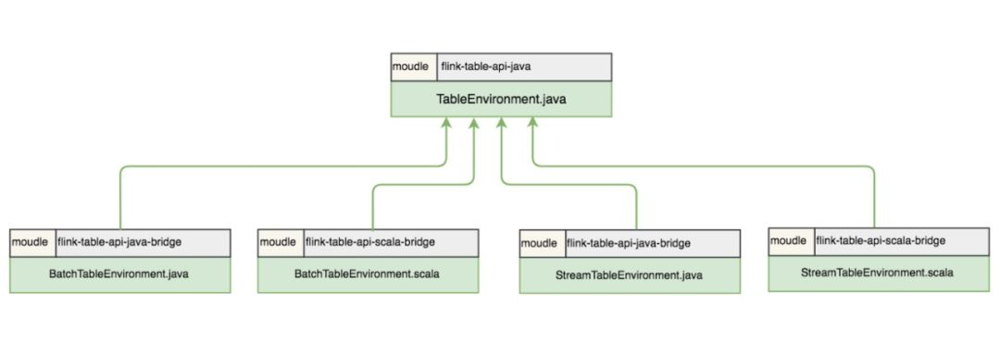
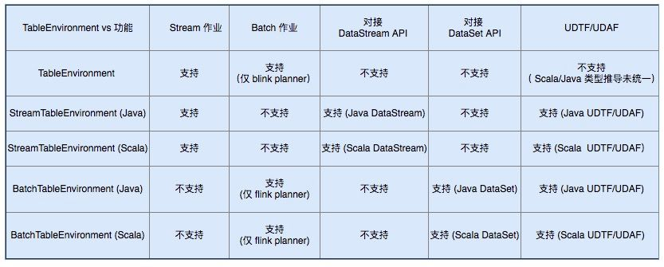
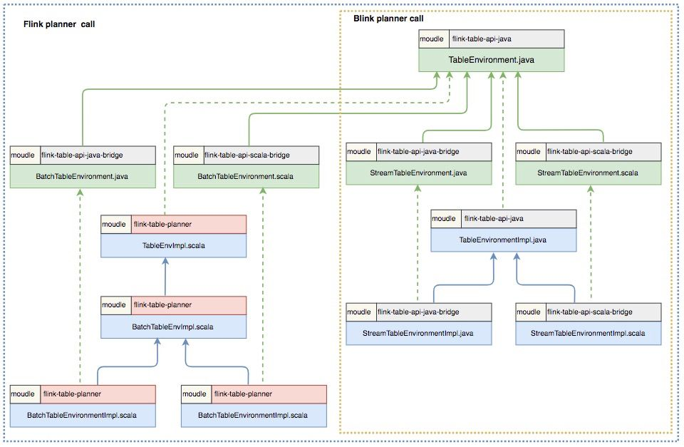

> Flink 版本 1.9

本文为 Flink SQL 系列文章的第二篇，前面对 [Flink 1.9 Table 新架构及 Planner](http://mp.weixin.qq.com/s?__biz=MzU3Mzg4OTMyNQ==&mid=2247484754&idx=1&sn=79e9a31b510d70d181c5406882652b8a&chksm=fd3b8b10ca4c0206daef4ee9fe462affff87ff752b73c9e3b9ae685b41a750e24f6bfb51de0e&scene=21#wechat_redirect) 的使用进行了详细说明，本文详细讲解 5 个 TableEnvironment 及其适用场景，并介绍 Flink 社区对 TableEnvironment 的未来规划。主要内容如下：
- TableEnvironment 简介
- 5 个 TableEnvironment 梳理
- 如何使用 TableEnvironment
- 社区未来规划

### 1. TableEnvironment 简介

TableEnvironment 是用来创建 Table & SQL 程序的上下文执行环境，也是 Table & SQL 程序的入口，Table & SQL 程序的所有功能都是围绕 TableEnvironment 这个核心类展开。TableEnvironment 的主要职能包括：对接外部系统，表及元数据的注册和检索，执行SQL语句，提供更详细的配置选项。

在 Flink 1.8 中，一共有 7 个 TableEnvironment，在最新的 Flink 1.9 中，社区进行了重构和优化，只保留了 5 个TableEnvironment。本文详细讲解 5 个 TableEnvironment 及其适用场景，并介绍 Flink 社区对 TableEnvironment 的未来规划。

### 2. TableEnvironment 梳理

Flink 1.9 中保留了 5 个 TableEnvironment，在实现上是 5 个面向用户的接口，在接口底层进行了不同的实现。5 个接口包括一个 TableEnvironment 接口，两个 BatchTableEnvironment 接口，两个 StreamTableEnvironment 接口，5 个接口文件完整路径如下：
- org/apache/flink/table/api/TableEnvironment.java
- org/apache/flink/table/api/java/BatchTableEnvironment.java
- org/apache/flink/table/api/scala/BatchTableEnvironment.scala
- org/apache/flink/table/api/java/StreamTableEnvironment.java
- org/apache/flink/table/api/scala/StreamTableEnvironment.scala

结合文件的路径，梳理这 5 个接口，我们会发现 TableEnvironment 是顶级接口，是所有 TableEnvironment 的基类 ，BatchTableEnvironment 和 StreamTableEnvironment 都提供了 Java 实现和 Scala 实现 ，分别有两个接口。



其中，TableEnvironment 作为统一的接口，其统一性体现在两个方面，一是对于所有基于 JVM 的语言(即 Scala API 和 Java API 之间没有区别)是统一的；二是对于 unbounded data （无界数据，即流数据） 和 bounded data （有界数据，即批数据）的处理是统一的。TableEnvironment 提供的是一个纯 Table 生态的上下文环境，适用于整个作业都使用 Table API & SQL 编写程序的场景。TableEnvironment 目前还不支持注册 UDTF 和 UDAF，用户有注册 UDTF 和 UDAF 的需求时，可以选择使用其他 TableEnvironment。

两个 StreamTableEnvironment 分别用于 Java 的流计算和 Scala 的流计算场景，流计算的对象分别是 Java 的 DataStream 和 Scala 的 DataStream。相比 TableEnvironment，StreamTableEnvironment 提供了 DataStream 和 Table 之间相互转换的接口，如果用户的程序除了使用 Table API & SQL 编写外，还需要使用到 DataStream API，则需要使用 StreamTableEnvironment。    

两个 BatchTableEnvironment 分别用于 Java 的批处理场景和 Scala 的批处理场景，批处理的对象分别是 Java 的 DataSet 和 Scala 的 DataSet。相比 TableEnvironment，BatchTableEnvironment 提供了 DataSet 和 Table 之间相互转换的接口，如果用户的程序除了使用 Table API & SQL 编写外，还需要使用到 DataSet API，则需要使用 BatchTableEnvironment。    

从这五个 TableEnvironment 支持的作业类型 ( Stream 作业和 Batch 作业)，支持的 API 类型（DataStream API 和 DataSet API)，以及对 UDTF/UDAF 的支持这 5 个方面进行对比，各个TableEnvironment 支持的功能可以归纳如下：



可能大家会疑惑为什么在 API 需要区分 Java 和 Scala 的两个 StreamTableEnvironment（或BatchTableEnvironment ），使用的 DataStream 也分为 Java DataStream 和 Scala DataStream。原因主要是 TableEnvironment 的 registerTableFunction 方法（用于注册UDTF）和 registerAggregateFunction 方法（用户注册UDAF）需要抽取泛型，而现有的 Java 泛型抽取和 Scala 的泛型抽取机制是不一样的，Java 的抽取是通过反射机制 实现，而 Scala 是通过 Scala macro 实现。此外，由于抽取泛型机制的不一致，作为统一入口的 TableEnvironment 现阶段也不支持注册 UDTF 和 UDAF。针对这个问题，社区已经在计划引入一套新的类型抽取机制来统一 Java 和 Scala 的类型抽取，实现 Java API 和 Scala API 的统一。



结合 Flink planner 和 Blink planner， 进一步梳理 TableEnvironment 的组织关系，我们可以注意到一些有趣的细节：
- 实现流批统一的 Blink planner 中由于没有了 DataSet 的概念，已经不再使用 BatchTableEnvironment，只会使用 TableEnvironment 和 StreamTableEnvironment，而 Flink planner（即 Old planner） 则支持 5 个 TableEnvironment。
- BatchTableEnvironment 的实现都放到了 Old planner (flink-table-palnner模块) 中，这个模块在社区的未来规划中是会被逐步删除的。

### 3. 如何使用 TableEnvironment

根据用户使用的 planner 和作业的类型，可以把各个 TableEnvironment 的应用场景分为 4 类,下面结合代码来说明在不同的场景下如何使用 TableEnvironment 。

#### 3.1 场景一

用户使用 Old planner，进行流计算的 Table 程序（使用 Table API 或 SQL 进行开发的程序 ）的开发。这种场景下，用户可以使用 StreamTableEnvironment 或 TableEnvironment ，两者的区别是 StreamTableEnvironment 额外提供了与 DataStream API 交互的接口。示例代码如下：
```java
// FLINK STREAMING QUERY USING JAVA
import org.apache.flink.streaming.api.environment.StreamExecutionEnvironment;
import org.apache.flink.table.api.EnvironmentSettings;
import org.apache.flink.table.api.java.StreamTableEnvironment;

EnvironmentSettings fsSettings = EnvironmentSettings.newInstance().useOldPlanner().inStreamingMode().build();
StreamExecutionEnvironment fsEnv = StreamExecutionEnvironment.getExecutionEnvironment();
StreamTableEnvironment fsTableEnv = StreamTableEnvironment.create(fsEnv, fsSettings);
// or TableEnvironment fsTableEnv = TableEnvironment.create(fsSettings);
```
```scala
// FLINK STREAMING QUERY USING SCALA
import org.apache.flink.streaming.api.scala.StreamExecutionEnvironment
import org.apache.flink.table.api.EnvironmentSettings
import org.apache.flink.table.api.scala.StreamTableEnvironment

val fsSettings = EnvironmentSettings.newInstance().useOldPlanner().inStreamingMode().build()
val fsEnv = StreamExecutionEnvironment.getExecutionEnvironment
val fsTableEnv = StreamTableEnvironment.create(fsEnv, fsSettings)
// or val fsTableEnv = TableEnvironment.create(fsSettings)
```

#### 3.2 场景二：

用户使用 Old planner，进行批处理的 Table 程序的开发。这种场景下，用户只能使用 BatchTableEnvironment，因为在使用 Old planner 时，批处理程序操作的数据是 DataSet，只有 BatchTableEnvironment 提供了面向 DataSet 的接口实现。示例代码如下：
```java
// FLINK BATCH QUERY USING JAVA
import org.apache.flink.api.java.ExecutionEnvironment;
import org.apache.flink.table.api.java.BatchTableEnvironment;

ExecutionEnvironment fbEnv = ExecutionEnvironment.getExecutionEnvironment();
BatchTableEnvironment fbTableEnv = BatchTableEnvironment.create(fbEnv);
```
```scala
// FLINK BATCH QUERY USING SCALA
import org.apache.flink.api.scala.ExecutionEnvironment
import org.apache.flink.table.api.scala.BatchTableEnvironment

val fbEnv = ExecutionEnvironment.getExecutionEnvironment
val fbTableEnv = BatchTableEnvironment.create(fbEnv)
```

#### 3.3 场景三

用户使用 Blink planner，进行流计算的 Table 程序的开发。这种场景下，用户可以使用 StreamTableEnvironment 或 TableEnvironment ，两者的区别是 StreamTableEnvironment 额外提供与 DataStream API 交互的接口。用户在 EnvironmentSettings 中声明使用 Blink planner ，将执行模式设置为 StreamingMode 即可。示例代码如下：
```java
// BLINK STREAMING QUERY USING JAVA
import org.apache.flink.streaming.api.environment.StreamExecutionEnvironment;
import org.apache.flink.table.api.EnvironmentSettings;
import org.apache.flink.table.api.java.StreamTableEnvironment;

StreamExecutionEnvironment bsEnv = StreamExecutionEnvironment.getExecutionEnvironment();
EnvironmentSettings bsSettings = EnvironmentSettings.newInstance().useBlinkPlanner().inStreamingMode().build();
StreamTableEnvironment bsTableEnv = StreamTableEnvironment.create(bsEnv, bsSettings);
// or TableEnvironment bsTableEnv = TableEnvironment.create(bsSettings);
```
```scala
// BLINK STREAMING QUERY USING SCALA
import org.apache.flink.streaming.api.scala.StreamExecutionEnvironment
import org.apache.flink.table.api.EnvironmentSettings
import org.apache.flink.table.api.scala.StreamTableEnvironment

val bsEnv = StreamExecutionEnvironment.getExecutionEnvironment
val bsSettings = EnvironmentSettings.newInstance().useBlinkPlanner().inStreamingMode().build()
val bsTableEnv = StreamTableEnvironment.create(bsEnv, bsSettings)
// or val bsTableEnv = TableEnvironment.create(bsSettings)
```

#### 3.4 场景四

用户使用 Blink planner，进行批处理的 Table 程序的开发。这种场景下，用户只能使用 TableEnvironment ，因为在使用 Blink planner 时，批处理程序操作的数据已经是 bounded DataStream，所以不能使用 BatchTableEnvironment 。用户在 EnvironmentSettings 中声明使用 Blink planner ，将执行模式设置为 BatchMode 即可。值得注意的是，TableEnvironment 接口的具体实现中已经支持了 StreamingMode 和 BatchMode 两种模式，而 StreamTableEnvironment 接口的具体实现中目前暂不支持 BatchMode 的配置，所以这种场景不能使用 StreamTableEnvironment。示例代码如下：
```java
// BLINK BATCH QUERY USING JAVA
import org.apache.flink.table.api.EnvironmentSettings;
import org.apache.flink.table.api.TableEnvironment;

EnvironmentSettings bbSettings = EnvironmentSettings.newInstance().useBlinkPlanner().inBatchMode().build();
TableEnvironment bbTableEnv = TableEnvironment.create(bbSettings);
```
```scala
// BLINK BATCH QUERY USING SCALA
import org.apache.flink.table.api.{EnvironmentSettings, TableEnvironment}

val bbSettings = EnvironmentSettings.newInstance().useBlinkPlanner().inBatchMode().build()
val bbTableEnv = TableEnvironment.create(bbSettings)
```
### 4. 社区未来规划

目前，社区正在推进 DataStream 的批处理能力，以实现流批技术栈的统一，届时 DataSet API 会退出历史的舞台，两个 BatchTableEnvironment 也将退出历史的舞台。同时社区也在努力推动 Java 和 Scala TableEnvironment 的统一。可以预见的是，Flink TableEnvironment 的未来架构会更加简洁。TableEnvironment 会是 Flink 推荐使用的入口类，同时能支持 Java API 和 Scala API，还能同时支持流计算作业和批处理作业。只有当需要与 DataStream 做转换时，才需要用到 StreamTableEnvironment。

原文：[Flink SQL 系列 | 5 个 TableEnvironment 我该用哪个？](https://mp.weixin.qq.com/s/UeoOYX1n6pnedHh8VcY8OQ)
