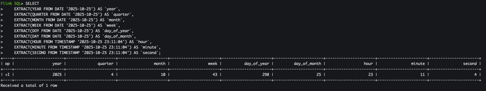
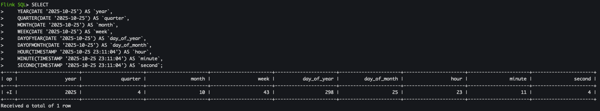

> Flink 版本：1.13.6

在实时数据处理中，时间是一个核心概念。Flink SQL 提供了一系列强大的日期和时间函数，帮助开发者进行时间相关的计算和转换。无论是用于窗口聚合、事件时间处理，还是简单的日期格式调整，这些函数都至关重要。

## 1. 当前时间函数

这些函数用于获取当前的系统时间：
- LOCALTIME: 以本地时区返回当前 SQL 时间，返回类型为 `time(0)`
- LOCALTIMESTAMP: 以本地时区返回当前 SQL 时间戳，返回类型为 `timestamp(3)`
- CURRENT_DATE: 以本地时区返回当前 SQL 日期，返回类型为 `DATE`
- CURRENT_TIME: 与 LOCALTIME 功能相同
- CURRENT_TIMESTAMP: 以本地时区返回当前 SQL 时间戳，返回类型为 `TIMESTAMP_LTZ(3)`
- NOW(): 与 CURRENT_TIMESTAMP 功能相同
- UNIX_TIMESTAMP(): 返回以秒为单位的当前 Unix 时间戳

> 需要注意的是 CURRENT_TIMESTAMP/CURRENT_TIME/LOCALTIME/CURRENT_DATE/NOW() 函数在 Flink 1.13.0 版本之前(version<=1.13.0)未考虑时区，不同时区下均默认返回 UTC 时区的值；Flink 1.13.0 版本之后这些函数在不同时区下返回来的值是会发生变化的。

### 1.1 LOCALTIME/CURRENT_TIME

> LOCALTIME 与 LOCAL_TIME 相同语义(同义词)

以本地时区返回当前 SQL 时间：
```sql
-- 示例1：Asia/Shanghai 时区
Flink SQL> SET 'table.local-time-zone' = 'Asia/Shanghai';
[INFO] Session property has been set.

Flink SQL> SELECT LOCALTIME, CURRENT_TIME;
+----+-----------+--------------+
| op | LOCALTIME | CURRENT_TIME |
+----+-----------+--------------+
| +I |  15:34:03 |     15:34:03 |
+----+-----------+--------------+
Received a total of 1 row

-- 示例2：UTC 时区
Flink SQL> SET 'table.local-time-zone' = 'UTC';
[INFO] Session property has been set.

Flink SQL> SELECT LOCALTIME, CURRENT_TIME;
+----+-----------+--------------+
| op | LOCALTIME | CURRENT_TIME |
+----+-----------+--------------+
| +I |  07:34:17 |     07:34:17 |
+----+-----------+--------------+
Received a total of 1 row
```
LOCALTIME/CURRENT_TIME 函数返回类型为 `time(0)`：
```sql
Flink SQL> CREATE VIEW view1 AS SELECT LOCALTIME, CURRENT_TIME;
[INFO] Execute statement succeed.

Flink SQL> DESC view1;
+--------------+---------+-------+-----+--------+-----------+
|         name |    type |  null | key | extras | watermark |
+--------------+---------+-------+-----+--------+-----------+
|    LOCALTIME | TIME(0) | false |     |        |           |
| CURRENT_TIME | TIME(0) | false |     |        |           |
+--------------+---------+-------+-----+--------+-----------+
2 rows in set
```
需要注意的是在流模式下对每个记录进行计算。但是在批处理模式下，只在查询开始时计算一次，并对每一行使用相同的计算结果。

### 1.2 LOCALTIMESTAMP

以本地时区返回当前 SQL 时间：
```sql
-- 示例1：Asia/Shanghai 时区
Flink SQL> SET 'table.local-time-zone' = 'Asia/Shanghai';
[INFO] Session property has been set.

Flink SQL> SELECT LOCALTIMESTAMP;
+----+-------------------------+
| op |          LOCALTIMESTAMP |
+----+-------------------------+
| +I | 2025-10-26 15:40:25.425 |
+----+-------------------------+
Received a total of 1 row

-- 示例2：UTC 时区
Flink SQL> SET 'table.local-time-zone' = 'UTC';
[INFO] Session property has been set.

Flink SQL> SELECT LOCALTIMESTAMP;
+----+-------------------------+
| op |          LOCALTIMESTAMP |
+----+-------------------------+
| +I | 2025-10-26 07:40:36.112 |
+----+-------------------------+
Received a total of 1 row
```
返回类型为 `timestamp(3)`：
```sql
Flink SQL> CREATE VIEW view2 AS SELECT LOCALTIMESTAMP;
[INFO] Execute statement succeed.

Flink SQL> DESC view2;
+----------------+--------------+-------+-----+--------+-----------+
|           name |         type |  null | key | extras | watermark |
+----------------+--------------+-------+-----+--------+-----------+
| LOCALTIMESTAMP | TIMESTAMP(3) | false |     |        |           |
+----------------+--------------+-------+-----+--------+-----------+
1 row in set
```
需要注意的是在流模式下对每个记录进行计算。但是在批处理模式下，只在查询开始时计算一次，并对每一行使用相同的计算结果。

### 1.3 CURRENT_DATE

以本地时区返回当前 SQL 日期：
```sql
Flink SQL> SELECT CURRENT_DATE;
+----+--------------+
| op | CURRENT_DATE |
+----+--------------+
| +I |   2025-10-25 |
+----+--------------+
Received a total of 1 row
```
返回类型为 `DATE`：
```sql
Flink SQL> CREATE VIEW view3 AS SELECT CURRENT_DATE;
[INFO] Execute statement succeed.

Flink SQL> DESC view3;
+--------------+------+-------+-----+--------+-----------+
|         name | type |  null | key | extras | watermark |
+--------------+------+-------+-----+--------+-----------+
| CURRENT_DATE | DATE | false |     |        |           |
+--------------+------+-------+-----+--------+-----------+
1 row in set
```
需要注意的是在流模式下对每个记录进行计算。但是在批处理模式下，只在查询开始时计算一次，并对每一行使用相同的计算结果。

### 1.4 CURRENT_TIMESTAMP/NOW()

> 与 LOCALTIMESTAMP 一样均是返回当前 SQL 时间戳，但是 CURRENT_TIMESTAMP 返回带时区的时间戳。
> CURRENT_TIMESTAMP 与 NOW() 相同语义(同义词)

以本地时区返回当前 SQL 时间：
```sql
-- 示例1：Asia/Shanghai 时区
Flink SQL> SET 'table.local-time-zone' = 'Asia/Shanghai';
[INFO] Session property has been set.

Flink SQL> SELECT CURRENT_TIMESTAMP;
+----+-------------------------+
| op |       CURRENT_TIMESTAMP |
+----+-------------------------+
| +I | 2025-10-26 15:42:42.761 |
+----+-------------------------+
Received a total of 1 row

-- 示例2：UTC 时区
Flink SQL> SET 'table.local-time-zone' = 'UTC';
[INFO] Session property has been set.

Flink SQL> SELECT CURRENT_TIMESTAMP;
+----+-------------------------+
| op |       CURRENT_TIMESTAMP |
+----+-------------------------+
| +I | 2025-10-26 07:42:51.728 |
+----+-------------------------+
Received a total of 1 row
```
返回类型为 `TIMESTAMP_LTZ(3)`：
```sql
Flink SQL> CREATE VIEW view4 AS SELECT CURRENT_TIMESTAMP;
[INFO] Execute statement succeed.

Flink SQL> DESC view4;
+-------------------+------------------+-------+-----+--------+-----------+
|              name |             type |  null | key | extras | watermark |
+-------------------+------------------+-------+-----+--------+-----------+
| CURRENT_TIMESTAMP | TIMESTAMP_LTZ(3) | false |     |        |           |
+-------------------+------------------+-------+-----+--------+-----------+
1 row in set
```
需要注意的是在流模式下对每个记录进行计算。但是在批处理模式下，只在查询开始时计算一次，并对每一行使用相同的计算结果。

### 1.5 CURRENT_ROW_TIMESTAMP()

以本地时区返回当前 SQL 时间：
```sql
-- 示例1：Asia/Shanghai 时区
Flink SQL> SET 'table.local-time-zone' = 'Asia/Shanghai';
[INFO] Session property has been set.

Flink SQL> SELECT CURRENT_ROW_TIMESTAMP();
+----+-------------------------+
| op |                  EXPR$0 |
+----+-------------------------+
| +I | 2025-10-26 15:43:44.495 |
+----+-------------------------+
Received a total of 1 row

-- 示例2：UTC 时区
Flink SQL> SET 'table.local-time-zone' = 'UTC';
[INFO] Session property has been set.

Flink SQL> SELECT CURRENT_ROW_TIMESTAMP();
+----+-------------------------+
| op |                  EXPR$0 |
+----+-------------------------+
| +I | 2025-10-26 07:43:52.815 |
+----+-------------------------+
Received a total of 1 row
```
返回类型为 `TIMESTAMP_LTZ(3)`：
```sql
Flink SQL> CREATE VIEW view5 AS SELECT CURRENT_ROW_TIMESTAMP();
[INFO] Execute statement succeed.

Flink SQL> DESC view5;
+--------+------------------+-------+-----+--------+-----------+
|   name |             type |  null | key | extras | watermark |
+--------+------------------+-------+-----+--------+-----------+
| EXPR$0 | TIMESTAMP_LTZ(3) | false |     |        |           |
+--------+------------------+-------+-----+--------+-----------+
1 row in set
```
与 CURRENT_TIMESTAMP 一样均是返回当前 SQL 时间戳，但是 `CURRENT_ROW_TIMESTAMP()` 无论在批处理模式还是流模式下，都会对每个记录进行计算。

> 批处理模式下不再是在查询开始时计算一次。

### 1.6 UNIX_TIMESTAMP()

返回以秒为单位的当前 Unix 时间戳:
```sql
Flink SQL> SELECT UNIX_TIMESTAMP();
+----+----------------------+
| op |               EXPR$0 |
+----+----------------------+
| +I |           1761458277 |
+----+----------------------+
Received a total of 1 row
```

## 2. 时间属性提取函数

提供了一个通用的 `EXTRACT(timeintervalunit FROM temporal)` 方法从日期、时间或时间戳中提取特定部分，例如年、月、日、小时等：
```sql
SELECT
    EXTRACT(YEAR FROM DATE '2025-10-25') AS `year`,
    EXTRACT(QUARTER FROM DATE '2025-10-25') AS `quarter`,
    EXTRACT(MONTH FROM DATE '2025-10-25') AS `month`,
    EXTRACT(WEEK FROM DATE '2025-10-25') AS `week`,
    EXTRACT(DOY FROM DATE '2025-10-25') AS `day_of_year`,
    EXTRACT(DAY FROM DATE '2025-10-25') AS `day_of_month`,
    EXTRACT(HOUR FROM TIMESTAMP '2025-10-25 23:11:04') AS `hour`,
    EXTRACT(MINUTE FROM TIMESTAMP '2025-10-25 23:11:04') AS `minute`,
    EXTRACT(SECOND FROM TIMESTAMP '2025-10-25 23:11:04') AS `second`;
```



除此之外还提供了一些简写模式常用提取方法：
- YEAR(date): 提取年份，等价于 `EXTRACT(YEAR FROM date)`
- QUARTER(date): 提取季度(1-4之间的数值)，等价于 `EXTRACT(QUARTER FROM date)`
- MONTH(date): 提取月份(1-12之间的数值)，等价于 `EXTRACT(MONTH FROM date)`
- WEEK(date): 提取周数(1-53之间的数值)，等价于 `EXTRACT(WEEK FROM date)`
- DAYOFYEAR(date): 提取一年中的第几天(1-366之间的数值)，等价于 `EXTRACT(DOY FROM date)`
- DAYOFMONTH(date): 提取一月中的第几天(1-31之间的数值)，等价于 `EXTRACT(DAY FROM date)`
- HOUR(timestamp): 提取小时(0-23之间的数值)，等价于 `EXTRACT(HOUR FROM timestamp)`
- MINUTE(timestamp): 提取分钟(0-59之间的数值)，等价于 `EXTRACT(MINUTE FROM timestamp)`
- SECOND(timestamp): 提取秒(0-59之间的数值)，等价于 `EXTRACT(SECOND FROM timestamp)`

示例如下所示：
```sql
SELECT
    YEAR(DATE '2025-10-25') AS `year`,
    QUARTER(DATE '2025-10-25') AS `quarter`,
    MONTH(DATE '2025-10-25') AS `month`,
    WEEK(DATE '2025-10-25') AS `week`,
    DAYOFYEAR(DATE '2025-10-25') AS `day_of_year`,
    DAYOFMONTH(DATE '2025-10-25') AS `day_of_month`,
    HOUR(TIMESTAMP '2025-10-25 23:11:04') AS `hour`,
    MINUTE(TIMESTAMP '2025-10-25 23:11:04') AS `minute`,
    SECOND(TIMESTAMP '2025-10-25 23:11:04') AS `second`;
```



## 3. 日期时间格式化与解析

常用格式符号:
- yyyy: 四位年份
- MM: 两位月份
- dd: 两位日期
- HH: 24小时制的小时
- mm: 分钟
- ss: 秒

### 3.1 DATE_FORMAT

将日期时间字符串转换为指定格式的字符串:
```sql
DATE_FORMAT(timestamp, string)
```
- 第一个参数是待格式化的日期时间，数据类型必须是合法的时间类型，可以是：TIMESTAMP、TIMESTAMP_LTZ，也可以是隐式转换为时间类型的字符串
- 第二个是格式化的格式

```sql
-- 示例1：TIMESTAMP 类型
Flink SQL> SELECT DATE_FORMAT(TO_TIMESTAMP('2025-10-26 09:39:38'), 'HH:mm:ss');
+----+--------------------------------+
| op |                         EXPR$0 |
+----+--------------------------------+
| +I |                       09:39:38 |
+----+--------------------------------+
Received a total of 1 row

-- 示例2：TIMESTAMP_LTZ 类型 不同时区下结果不一致
-- Asia/Shanghai 时区下 1761442778000 为 2025-10-26 09:39:38
Flink SQL> SELECT DATE_FORMAT(TO_TIMESTAMP_LTZ(1761442778000, 3), 'HH:mm:ss');
+----+--------------------------------+
| op |                         EXPR$0 |
+----+--------------------------------+
| +I |                       09:39:38 |
+----+--------------------------------+
Received a total of 1 row

-- 示例3：隐式转换为时间类型的字符串
Flink SQL> SELECT DATE_FORMAT('2025-10-26 09:39:38', 'HH:mm:ss');
+----+--------------------------------+
| op |                         EXPR$0 |
+----+--------------------------------+
| +I |                       09:39:38 |
+----+--------------------------------+
Received a total of 1 row
```

### 3.2 TO_DATE

将指定格式的日期字符串转换为日期:
```sql
TO_DATE(string1[, string2])
```
- 第一个参数是待格式化的日期时间字符串
- 第二个是格式化的格式，如果不指定默认为 `yyyy-MM-dd`

```sql
-- 示例1
Flink SQL> SELECT TO_DATE('2025-10-26');
+----+------------+
| op |     EXPR$0 |
+----+------------+
| +I | 2025-10-26 |
+----+------------+
Received a total of 1 row

-- 示例2
Flink SQL> SELECT TO_DATE('20251026');
+----+------------+
| op |     EXPR$0 |
+----+------------+
| +I |     (NULL) |
+----+------------+
Received a total of 1 row

-- 示例3
Flink SQL> SELECT TO_DATE('20251026', 'yyyyMMdd');
+----+------------+
| op |     EXPR$0 |
+----+------------+
| +I | 2025-10-26 |
+----+------------+
Received a total of 1 row

-- 示例4
Flink SQL> SELECT TO_DATE('2025-10-26 09:39:38');
+----+------------+
| op |     EXPR$0 |
+----+------------+
| +I | 2025-10-26 |
+----+------------+
Received a total of 1 row
```

### 3.3 TO_TIMESTAMP

将指定格式的字符串解析为 `TIMESTAMP(3)` 类型的时间戳：
```sql
TO_TIMESTAMP(string1[, string2])
```
- 第一个参数是待格式化的日期时间字符串
- 第二个是格式化的格式，如果不指定默认为 `yyyy-MM-dd HH:mm:ss`

```sql
-- 示例1
Flink SQL> SELECT TO_TIMESTAMP('2025-10-26 09:39:38');
+----+-------------------------+
| op |                  EXPR$0 |
+----+-------------------------+
| +I | 2025-10-26 09:39:38.000 |
+----+-------------------------+
Received a total of 1 row

-- 示例2
Flink SQL> SELECT TO_TIMESTAMP('2025-10-26 09:39:38', 'yyyy-MM-dd HH:mm:ss');
+----+-------------------------+
| op |                  EXPR$0 |
+----+-------------------------+
| +I | 2025-10-26 09:39:38.000 |
+----+-------------------------+
Received a total of 1 row

-- 示例3
Flink SQL> SELECT TO_TIMESTAMP('2025-10-26');
+----+-------------------------+
| op |                  EXPR$0 |
+----+-------------------------+
| +I | 2025-10-26 00:00:00.000 |
+----+-------------------------+
Received a total of 1 row

-- 示例4
Flink SQL> SELECT TO_TIMESTAMP('20251026');
+----+-------------------------+
| op |                  EXPR$0 |
+----+-------------------------+
| +I |                  (NULL) |
+----+-------------------------+
Received a total of 1 row

-- 示例5
Flink SQL> SELECT TO_TIMESTAMP('20251026', 'yyyyMMdd');
+----+-------------------------+
| op |                  EXPR$0 |
+----+-------------------------+
| +I | 2025-10-26 00:00:00.000 |
+----+-------------------------+
Received a total of 1 row
```

### 3.4 TO_TIMESTAMP_LTZ

以本地时区将 Unix 秒级或毫秒级时间戳转换为 `TIMESTAMP_LTZ(3)` 类型的时间：
```sql
TO_TIMESTAMP_LTZ(numeric, precision)
```
- 第一个参数是 Long 值的时间戳，Unix 秒级或毫秒级时间戳
- 第二个参数是精度，有效精度可以为 0 或 3：0 表示秒级，3表示毫秒级

如下所示是将有效精度为 3 的毫秒级时间戳转换为 `TIMESTAMP_LTZ` 类型的时间：
```sql
-- 示例1：Asia/Shanghai 时区
Flink SQL> SET 'table.local-time-zone' = 'Asia/Shanghai';
[INFO] Session property has been set.

Flink SQL> SELECT TO_TIMESTAMP_LTZ(1761442778618, 3);
+----+-------------------------+
| op |                  EXPR$0 |
+----+-------------------------+
| +I | 2025-10-26 09:39:38.618 |
+----+-------------------------+
Received a total of 1 row

-- 示例2：UTC 时区
Flink SQL> SET 'table.local-time-zone' = 'UTC';
[INFO] Session property has been set.

Flink SQL> SELECT TO_TIMESTAMP_LTZ(1761442778618, 3);
+----+-------------------------+
| op |                  EXPR$0 |
+----+-------------------------+
| +I | 2025-10-26 01:39:38.618 |
+----+-------------------------+
Received a total of 1 row
```
> 需要注意的是不同时区下返回的 TIMESTAMP_LTZ 时间是不一样的

如下所示是将有效精度为 0 的秒级时间戳转换为 `TIMESTAMP_LTZ` 类型的时间：
```sql
-- 示例1：Asia/Shanghai 时区
Flink SQL> SET 'table.local-time-zone' = 'Asia/Shanghai';
[INFO] Session property has been set.

Flink SQL> SELECT TO_TIMESTAMP_LTZ(1761442778, 0);
+----+-------------------------+
| op |                  EXPR$0 |
+----+-------------------------+
| +I | 2025-10-26 09:39:38.000 |
+----+-------------------------+
Received a total of 1 row

-- 示例2：UTC 时区
Flink SQL> SET 'table.local-time-zone' = 'UTC';
[INFO] Session property has been set.

Flink SQL> SELECT TO_TIMESTAMP_LTZ(1761442778, 0);
+----+-------------------------+
| op |                  EXPR$0 |
+----+-------------------------+
| +I | 2025-10-26 01:39:38.000 |
+----+-------------------------+
Received a total of 1 row
```
### 3.5 UNIX_TIMESTAMP

以本地时区将指定格式的日期时间字符串转换的 Unix 秒级时间戳:
```sql
UNIX_TIMESTAMP(string1[, string2])
```
- 第一个参数是日期时间字符串
- 第二个参数是指定转换格式，默认为 `yyyy-MM-dd HH:mm:ss`

```sql
-- 示例1：UTC 时区
Flink SQL> SET 'table.local-time-zone' = 'UTC';
[INFO] Session property has been set.

Flink SQL> SELECT UNIX_TIMESTAMP('2025-10-26 09:39:38', 'yyyy-MM-dd HH:mm:ss');
+----+----------------------+
| op |               EXPR$0 |
+----+----------------------+
| +I |           1761471578 |
+----+----------------------+
Received a total of 1 row

-- 示例2：Asia/Shanghai 时区
Flink SQL> SET 'table.local-time-zone' = 'Asia/Shanghai';
[INFO] Session property has been set.

Flink SQL> SELECT UNIX_TIMESTAMP('2025-10-26 09:39:38', 'yyyy-MM-dd HH:mm:ss');
+----+----------------------+
| op |               EXPR$0 |
+----+----------------------+
| +I |           1761442778 |
+----+----------------------+
Received a total of 1 row
```

### 3.6 FROM_UNIXTIME

以本地时区将 Unix 秒级时间戳转换为指定格式的日期时间字符串:
```sql
FROM_UNIXTIME(numeric[, string])
```
- 第一个参数是一个时间戳值，表示从UTC '1970-01-01 00:00:00' 开始的秒数，例如由 `UNIX_TIMESTAMP()` 函数产生的时间戳
- 第二个参数是转换日期时间字符串的格式，默认为 `yyyy-MM-dd HH:mm:ss`

```sql
-- 示例1：UTC 时区
Flink SQL> SET 'table.local-time-zone' = 'UTC';
[INFO] Session property has been set.

Flink SQL> SELECT FROM_UNIXTIME(1761442778);
+----+--------------------------------+
| op |                         EXPR$0 |
+----+--------------------------------+
| +I |            2025-10-26 01:39:38 |
+----+--------------------------------+
Received a total of 1 row

Flink SQL> SELECT FROM_UNIXTIME(1761442778, 'yyyy-MM-dd HH:mm:ss');
+----+--------------------------------+
| op |                         EXPR$0 |
+----+--------------------------------+
| +I |            2025-10-26 01:39:38 |
+----+--------------------------------+
Received a total of 1 row

-- 示例2：Asia/Shanghai 时区
Flink SQL> SET 'table.local-time-zone' = 'Asia/Shanghai';
[INFO] Session property has been set.

Flink SQL> SELECT FROM_UNIXTIME(1761442778);
+----+--------------------------------+
| op |                         EXPR$0 |
+----+--------------------------------+
| +I |            2025-10-26 09:39:38 |
+----+--------------------------------+
Received a total of 1 row

Flink SQL> SELECT FROM_UNIXTIME(1761442778, 'yyyy-MM-dd HH:mm:ss');
+----+--------------------------------+
| op |                         EXPR$0 |
+----+--------------------------------+
| +I |            2025-10-26 09:39:38 |
+----+--------------------------------+
Received a total of 1 row
```
> 从上面可以看到对于 1761442778 在不同时区下日期时间字符串时不一样的，在 UTC 时区是 `2025-10-26 01:39:38`，在 Asia/Shanghai 时区是 `2025-10-26 09:39:38`

### 3.7 CONVERT_TZ

将日期时间字符串从一个时区转换到另一个时区：
```sql
CONVERT_TZ(string1, string2, string3)
```
- 第一个参数是日期时间字符串，默认格式为 `yyyy-MM-dd HH:mm:ss`
- 第二三个参数是时区标识。时区的格式可以是缩写(如 'UTC')、全名（如`Asia/Shanghai`）或自定义ID（如`GMT-08:00`）

如下示例所示将 `Asia/Shanghai` 时区的 `2025-10-26 09:39:38` 转换为 `UTC` 时区：
```sql
-- 示例1
Flink SQL> SELECT CONVERT_TZ('2025-10-26 09:39:38', 'Asia/Shanghai', 'UTC');
+----+--------------------------------+
| op |                         EXPR$0 |
+----+--------------------------------+
| +I |            2025-10-26 01:39:38 |
+----+--------------------------------+
Received a total of 1 row
```

## 4. 日期时间计算函数

### 4.1 TIMESTAMPADD

以指定的时间单位对时间进行精确的增减操作：
```
TIMESTAMPADD(timeintervalunit, interval, timepoint)
```
- 间隔的单位由第一个参数给出，该参数可以为：SECOND、MINUTE、HOUR、DAY、MONTH 或 YEAR。
- 第二个参数是时间间隔
- 第三个参数 timepoint 数据类型必须是合法的时间类型，可以是：TIMESTAMP、TIMESTAMP_LTZ、DATE

```sql
-- 示例1：TIMESTAMP 类型 不同时区下结果一致
Flink SQL> SELECT TIMESTAMPADD(HOUR, 8, TO_TIMESTAMP('2025-10-26 01:39:38'));
+----+-------------------------+
| op |                  EXPR$0 |
+----+-------------------------+
| +I | 2025-10-26 09:39:38.000 |
+----+-------------------------+
Received a total of 1 row

-- 示例2：TIMESTAMP_LTZ 类型 不同时区下结果不一致
-- Asia/Shanghai 时区下 1761413978000 为 2025-10-26 01:39:38
Flink SQL> SET 'table.local-time-zone' = 'Asia/Shanghai';
[INFO] Session property has been set.

Flink SQL> SELECT TIMESTAMPADD(HOUR, 8, TO_TIMESTAMP_LTZ(1761413978000, 3));
+----+-------------------------+
| op |                  EXPR$0 |
+----+-------------------------+
| +I | 2025-10-26 09:39:38.000 |
+----+-------------------------+
Received a total of 1 row

-- 示例3：DATE 类型
Flink SQL> SELECT TIMESTAMPADD(DAY, 1, TO_DATE('2025-10-24'));
+----+------------+
| op |     EXPR$0 |
+----+------------+
| +I | 2025-10-25 |
+----+------------+
Received a total of 1 row
```

### 4.2 TIMESTAMPDIFF

返回 timepoint1 和 timepoint2 之间的以 timepointunit 为单位时间差(timepoint2 - timepoint1 的差值，如果 timepoint2 > timepoint1，返回正数；如果 timestamp2 < timestamp1，返回负数)：
```
TIMESTAMPDIFF(timepointunit, timepoint1, timepoint2)
```
- 间隔的单位由第一个参数给出，该参数可以为：SECOND、MINUTE、HOUR、DAY、MONTH 或 YEAR。
- 第二、三个参数 timepoint1, timepoint2 数据类型必须是合法的时间类型，可以是：TIMESTAMP、TIMESTAMP_LTZ、DATE

如下所示计算 `2025-10-26 01:39:38` 和 `2025-10-26 09:39:38` 之间的时间差：
```sql
-- 示例1：TIMESTAMP 类型
Flink SQL> SELECT TIMESTAMPDIFF(HOUR, TO_TIMESTAMP('2025-10-26 01:39:38'), TO_TIMESTAMP('2025-10-26 09:39:38'));
+----+-------------+
| op |      EXPR$0 |
+----+-------------+
| +I |           8 |
+----+-------------+
Received a total of 1 row

-- 示例2：TIMESTAMP_LTZ 类型
Flink SQL> SELECT TIMESTAMPDIFF(HOUR, TO_TIMESTAMP_LTZ(1761413978000, 3), TO_TIMESTAMP_LTZ(1761442778618, 3));
+----+-------------+
| op |      EXPR$0 |
+----+-------------+
| +I |           8 |
+----+-------------+
Received a total of 1 row

-- 示例3：DATE 类型
Flink SQL> SELECT TIMESTAMPDIFF(DAY, TO_DATE('2025-10-24'), TO_DATE('2025-10-26 09:39:38'));
+----+-------------+
| op |      EXPR$0 |
+----+-------------+
| +I |           2 |
+----+-------------+
Received a total of 1 row
```
