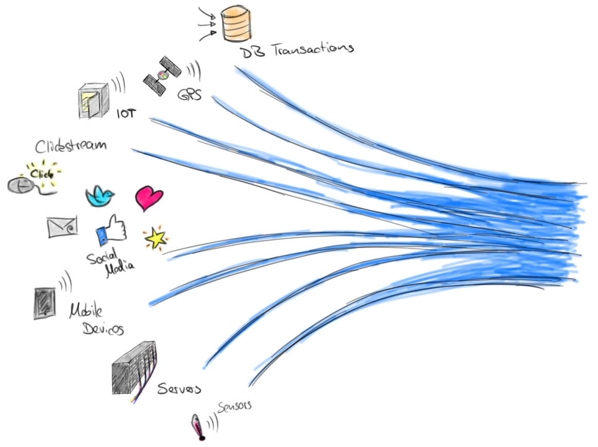
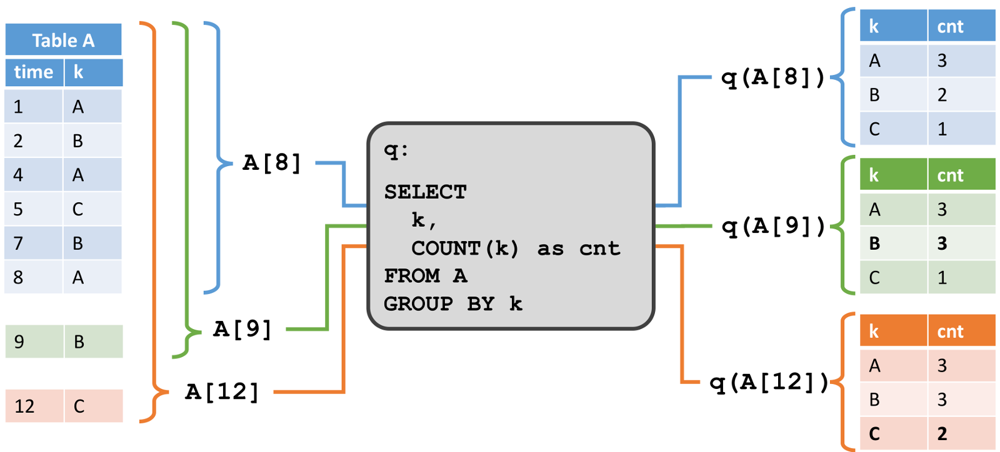
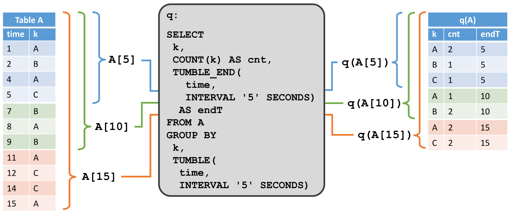
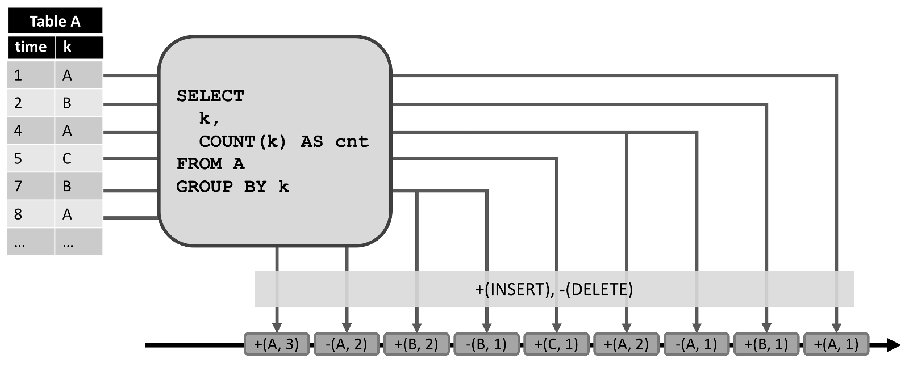
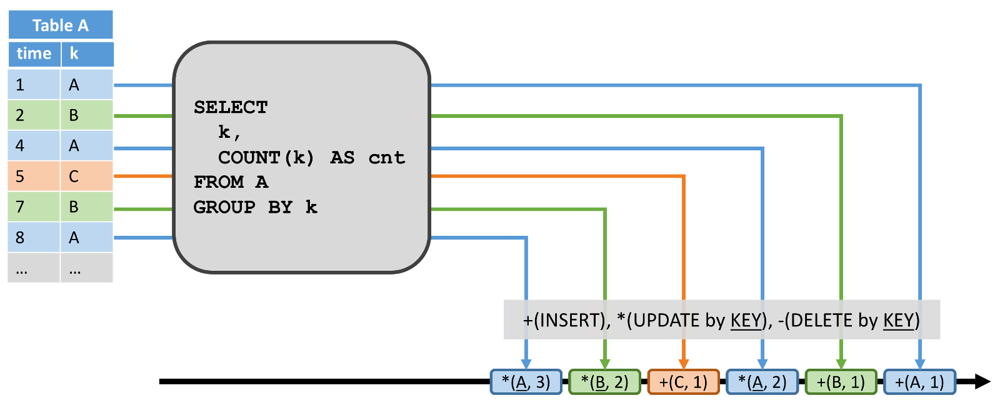

> 原文发布时间：2017年

越来越多的公司采用流处理，并将现有的批处理应用程序迁移到流处理，或者采用流处理实现的解决方案。其中许多应用程序专注于流数据分析，分析的数据流来自各种数据源，例如，数据库事务、点击、传感器测量或 IoT 设备等。



Apache Flink 非常适合流分析应用程序，因为它支持事件时间语义、有状态的 Exactly-Once 处理语义，并同时实现了高吞吐量和低延迟。由于这些特性，Flink 能够近乎实时地从大量输入流中计算出准确以及确定性的结果，并能在出现故障时提供 Exactly-Once 处理语义。

Flink 用于流处理的核心 API ，即 DataStream API，非常具有表现力，并为许多常见操作提供了原语。在其他特性中，还提供了高度可定制的窗口逻辑、具有不同性能特征的不同状态原语、用于注册和响应定时器的钩子，以及高效的异步请求外部系统的工具。另一方面，许多流分析应用程序遵循类似的模式，不再需要 DataStream API 层次的表达。使用领域特定语言以更自然、更简洁的方式来表达。众所周知，SQL 是数据分析的事实标准。对于流分析，SQL 能够让更多的人在数据流应用程序上花费更短的时间。然而，目前还没有一个开源流处理器能提供令人满意的 SQL 支持。

### 1. 为什么流中的 SQL 很重要

SQL 是数据分析使用最广泛的语言，原因有很多：
- SQL 是声明式的：你只需要指定你想要的东西，不用指定如何去计算。
- SQL 可以进行有效的优化：优化器能够找出一个有效的计划来计算你的结果。
- SQL 可以进行有效的评估：处理引擎能够准确的知道要计算什么，以及如何有效的计算。
- 最后，每个人都知道 SQL 并且许多工具都再使用 SQL。

因此，使用 SQL 处理和分析数据流能够使更多用户来使用流处理技术。此外，由于 SQL 的声明式特性以及自动优化的潜力，可以大大减少定义高效流分析应用的时间和精力。

然而，SQL（以及关系数据模型和代数）在设计时并没有考虑到流数据。关系是（多）集合而不是无限的元组序列。在执行 SQL 查询时，传统的数据库系统和查询引擎可以读取以及处理完整的数据集，并产生固定大小的结果。相比之下，数据流持续提供新记录，以便数据随着时间的推移而到达。因此，流查询必须不断地处理到达的数据并永远都不可能'完成'。

话虽如此，使用 SQL 处理流并非不可能。一些关系型数据库系统具有物化视图的功能，这类似于对数据流上的 SQL 查询进行评估。物化视图定义为一个 SQL 查询，就像常规（虚拟）视图一样。但是，查询的结果实际上存储在内存或磁盘上，因此在查询时不需要即时计算视图。为了防止物化视图中的数据过时，数据库系统需要在视图的基本关系（在其定义查询中引用的表）被修改时来更新视图。如果我们将视图的基本关系的变更视为修改流（或更改日志流），那么很明显，物化视图的维护和流上的 SQL 就有些相关了。

### 2. Flink 的关系API：Table API 和SQL

从 1.1.0 版本（2016年8月发布）开始，Flink 提供了两个语义相当的关系 API，语言内嵌的 Table API（用于 Java 和 Scala）以及标准 SQL。这两种 API 被设计用来在线流处理和历史批处理数据的统一，这意味着无论输入的是静态批数据还是流数据，查询都会产生完全相同的结果。出于多种原因，用于流和批处理的统一 API 非常重要。首先，用户只需要学习一种 API 即可处理静态和流数据。此外，用户可以使用同一个查询来分析批和流数据，也就可以在同一个查询中关联分析历史和实时数据。目前，我们还没有实现批处理和流语义的完全统一，但是社区正在朝着这个目标发展。

如下代码片段展示了两个等价的 Table API 和 SQL 查询，在温度传感器数据流上计算一个简单的窗口聚合。SQL 查询的语法基于 Apache Calcite 的分组窗口函数语法，并在 Flink 1.3.0 版本中得到支持：

```
val env = StreamExecutionEnvironment.getExecutionEnvironment
env.setStreamTimeCharacteristic(TimeCharacteristic.EventTime)

val tEnv = TableEnvironment.getTableEnvironment(env)

// define a table source to read sensor data (sensorId, time, room, temp)
val sensorTable = ??? // can be a CSV file, Kafka topic, database, or ...
// register the table source
tEnv.registerTableSource("sensors", sensorTable)

// Table API
val tapiResult: Table = tEnv.scan("sensors")   // scan sensors table
 .window(Tumble over 1.hour on 'rowtime as 'w) // define 1-hour window
 .groupBy('w, 'room)                           // group by window and room
 .select('room, 'w.end, 'temp.avg as 'avgTemp) // compute average temperature

// SQL
val sqlResult: Table = tEnv.sql("""
 |SELECT room, TUMBLE_END(rowtime, INTERVAL '1' HOUR), AVG(temp) AS avgTemp
 |FROM sensors
 |GROUP BY TUMBLE(rowtime, INTERVAL '1' HOUR), room
 |""".stripMargin)
```

如您所见，这两个 API 与 Flink 的主要 DataStream 和 DataSet API 紧密集成。Table 可以从 DataSet 或 DataStream 生成，也可以转换为 DataSet 或 DataStream。因此，可以很容易地扫描外部表数据源（例如数据库或 Parquet 文件），然后使用 Table API 查询进行一些预处理，将结果转换为 DataSet 并在其上运行 Gelly 图算法。上面例子中定义的查询也可以通过改变执行环境来处理批处理数据。

在内部，两个 API 都可以转换成相同的逻辑表示，并由 Apache Calcite 进行优化，并编译成 DataStream 或 DataSet 程序。事实上，优化和编译阶段并不知道该查询是使用 Table API 还是 SQL 定义的。如果您对优化过程细节比较感兴趣，可以阅读我们去年发布的[博客文章](http://flink.apache.org/news/2016/05/24/stream-sql.html)。由于 Table API 和 SQL 在语义上是等价的，只是在语法上有所不同，因此在本文谈论 SQL 时，我们总是同时提及这两个 API。

在 1.2.0 版本，Flink 关系 API 在数据流上仅支持有限的关系算子，包括投影、过滤器和窗口聚合。所支持的算子都有一个共同点，即不会去更新已输出的结果记录。这对于投影、过滤器等一次只操作一条记录的算子来说，这显然不是问题。但是，会影响收集和处理多条记录的算子，例如，窗口聚合。由于输出的结果无法更新，因此在 Flink 1.2.0 中结果输出后才到达的输入记录必须被丢弃。

对于将数据发送到存储系统（例如 Kafka Topic、消息队列以及仅支持追加操作且不支持更新或删除的文件）的应用程序，当前版本的限制是可以接受的。遵循这种模式的常见用例，比如，连续 ETL 和流归档应用程序，它们将流进行持久化存档或为进一步的在线（流）分析或以后的离线分析准备数据。由于无法更新之前输出的结果，因此这些类型的应用程序必须确保输出的结果是正确的，并且将来不需要修改。下图说明了此类型的应用程序：


虽然仅支持追加的查询对某些类型的应用程序和存储系统很有用，但仍有许多流分析用例需要更新结果。包括不能丢弃迟到记录、需要（长时间运行的）窗口聚合的早期结果或需要非窗口聚合的流应用程序。在这每种情况下，之前输出的结果记录都需要更新。结果更新查询通常将其结果物化存储到外部数据库或键值存储上，以便外部应用程序可以访问和查询。实现此模式的应用程序，比如，仪表板、报告应用程序等，需要能及时访问持续更新的结果。下图说明了此类型的应用程序：


### 3. 动态表的持续查询

支持更新之前输出结果的查询是 Flink 关系 API 的下一个重要步骤。这个功能非常重要，因为极大地增加了 API 以及支持的用例范围。此外，许多新支持的用例使用 DataStream API 可能很难实现。因此，当添加对结果更新查询的支持时，我们必须保留之前流和批处理输入的统一语义。我们通过动态表（Dynamic Tables）的概念来实现。动态表是一个持续更新，并且能够像常规的静态表一样查询的表。但是，批处理表查询完成后返回一个静态表作为结果，然而动态表上的查询会一直持续运行，并产生一个根据输入表修改而不断更新的表。因此，结果表也是一个动态表。这个概念与上面我们讨论的物化视图比较类似。

假设我们可以在动态表上运行查询并产生一个新的动态表，那么带来的下一个问题是，流和动态表如何相互关联？答案是流可以转换成动态表，动态表可以转换成流。下图展示了在流上处理关系查询的概念模型：


首先，将流转换为动态表。使用连续查询来查询动态表，这会产生一个新的动态表。最后，结果表被转换回流。需要注意的是，这只是逻辑模型，并不是查询的实际执行方式。事实上，一个连续查询在内部会被转换为一个常规的 DataStream 程序。

在下文中，我们描述了该模型的不同步骤：
- 在流上定义动态表
- 查询动态表
- 输出动态表

### 3.1 在流上定义动态表

在动态表上评估 SQL 查询的第一步是在流上定义动态表。这意味着我们必须指定流中的记录如何修改动态表。流必须携带一种记录：具有可以映射到表关系 Schema 的 Schema。在流上定义动态表有两种模式：Append 模式和 Update 模式。

在 Append 模式下，每个流记录都是对动态表的插入修改。因此，流的所有记录都追加到动态表中，使其不断增长并且大小无限制。下图说明了 Append 模式：


在 Update 模式下，流中的记录可以转换为对动态表的插入、更新或者删除修改（Append 模式实际上是一种特殊的 Update 模式）。当在流中通过 Update 模式定义一个动态表时，我们可以在表中指定一个唯一 Key 属性。在这种情况下，更新和删除操作都会与 Key 属性一起执行。Update 模式如下图所示：


#### 3.2 查询动态表

一旦我们定义了一个动态表，我们就可以在上面运行查询。由于动态表随着时间发生变化，我们必须定义查询动态表的含义。假设我们在指定时间点生成了一个动态表的快照。这个快照我们可以视为一个常规静态批处理表。我们将动态表 A 在时间点 t 的快照表示为 A[t]。我们可以使用任何 SQL 查询来查询快照。查询结果会生成一个常规静态表。我们将在时间点 t 动态表 A 上查询 q 的结果表示为 q(A[t])。如果我们重复计算一个动态表快照的查询结果，我们会得到许多随时间变化的静态结果表，从而有效地构成了一个动态表。我们在动态表上定义查询的语义如下。

动态表 A 上的查询 q 生成动态表 R，在时间点 t 的结果等价于在 A[t] 上应用 q 的结果，即 R[t] = q(A[t])。这个定义意味着对批处理表和流表上的 q 运行相同的查询会产生相同的结果。下面，我们将展示两个示例来说明动态表查询的语义。

在下图中，我们看到左侧的动态输入表 A（Append 模式）。在时间点 t=8，A 由 6 行数据（标记为蓝色）组成。在时间点 t=9 和 t=12，分别有一行数据追加到 A（分别用绿色和橙色标记）。我们在表 A 上运行一个简单查询，如图中间所示。这个查询根据属性 k 分组，并统计每组的记录数。在右侧，我们可以看到在时间点 t=8（蓝色）、t=9（绿色）以及 t=12（橙色）时查询 q 的结果。在每个时间点 t，结果表相当于在时间 t 对动态表 A 的一个批量查询：



此示例中的查询是一个简单的分组（不是窗口）聚合查询。因此，结果表的大小取决于输入表的不同分组 Key 的个数。此外，值得注意的是，查询会不断更新之前已经输出的结果行，而不仅仅是添加新行。

第二个示例展示了一个类似的查询，但是有一个很重要的差异。除了对 Key 属性 k 进行分组之外，该查询还将记录分组到每 5 秒的滚动窗口中，这意味着每 5 秒钟为每个 k 计算一次总数。再一次，我们使用 Calcite 的[分组窗口函数](https://calcite.apache.org/docs/reference.html#grouped-window-functions)来指定这个查询。在图的左侧，我们看到输入表 A，以及在 Append 模式下随着时间而改变。在右侧，我们看到结果表，以及随着时间而发生的改变：



与第一个示例的结果不同的是，结果表随着时间而增长，即每五秒计算新的结果行（假设输入表在过去 5 秒内收到更多记录）。非窗口查询（大部分）更新结果表的行，而窗口聚合查询仅将新行追加到结果表。

虽然这篇博文重点关注动态表上 SQL 查询语义，不关注如何有效地处理这样的查询，但我们想指出，无论何时更新输入表，都不可能从头开始计算查询的完整结果表。相反，查询被编译成一个流程序，该程序根据其输入的变化不断更新其结果。这意味着并非所有有效的 SQL 查询可以得到支持，只有那些可以连续、增量和高效计算的查询可以得到支持。

#### 3.3 输出动态表

查询一个动态表会产生另一个动态表，来表示查询的结果。根据查询以及输入表，结果表会像常规数据库表一样通过插入、更新和删除操作来不断的修改。它可能是一个不断被更新的单行表，可能是一个没有更新修改的仅插入表，或者是介于两者之间。

传统数据库系统在发生故障或者生成副本时，使用日志来重建表。有一些不同的日志记录技术，例如，UNDO、REDO 以及 UNDO/REDO 日志记录。简而言之，UNDO 日志记录被修改元素之前的值来回滚不完整的事务，REDO 日志记录被修改元素的新值来重做已完成事务的丢失变更，而 UNDO/REDO 日志则记录被修改元素的旧值和新值，用于撤消未完成的事务以及重做已完成事务的丢失变更。基于这些日志记录技术，动态表可以转换为两种类型的变更日志流，REDO 流和 REDO+UNDO 流。

通过将表上的修改转换为流消息，可以将动态表转换为 REDO+UNDO 流。插入修改生成一个带有新行的插入消息输出，删除修改生成一个带有旧行的删除消息输出，更新修改生成一个带有旧行的删除消息以及一个带有新行的插入消息发输出，如下图所示：



左边展示了一个动态表，并以 Append 模式维护，并作为中间查询的输入表。查询结果转换为 REDO+UNDO 流，如底部所示。输入表的第一条记录 (1, A) 导致结果表中出现一条新记录，因此插入消息 +(A, 1) 到流中。k = 'A' 的第二条输入记录 (4, A) 导致结果表中的 (A, 1) 记录发生更新，因此产生一条删除消息 -(A, 1) 以及一条插入消息 +(A , 2)。所有下游算子或 Sink 都需要能够正确处理这两种类型的消息。

在两种情况下，动态表会转换成 REDO 流：要么是仅追加表（即只有插入修改），要么具有唯一 Key 属性。动态表上的每次插入修改都会产生一条新行的插入消息到 REDO 流。由于 REDO 流的限制，只有具有唯一 Key 的表才能进行更新和删除修改。如果一个 Key 从 Keyed 动态表中删除，要么是因为行被删除，要么是因为行的 Key 属性被修改，带有删除 Key 的删除消息发送到 REDO 流。更新修改产生一个带有更新(即新行)的更新消息。由于删除和更新修改是针对唯一 Key 定义的，因此下游算子需要能够通过 Key 访问先前的值。下图展示了如何将上述相同查询的结果表转换为 REDO 流：



(1, A) 行插入到动态表中从而导致产生一条 +(A, 1) 的插入消息。(4, A) 行产生更新操作从而导致产生一条 *(A, 2) 的更新消息。

REDO 流的常见用例是将查询结果写入仅追加的存储系统中，例如，滚动文件或 Kafka Topic 或者写入支持 Keyed 访问的数据存储，例如 ，Cassandra、关系型 DBMS 或压缩 Kafka Topic。

#### 3.4 切换到动态表发生的变化

在 1.2 版本中，Flink 关系 API 的所有流算子，例如，过滤器、投影或者分组窗口聚合，只支持输出新行，不能更新以前输出的结果。相比之下，动态表能够处理更新和删除修改。现在您可能会问自己，当前版本的处理模型与新的动态表模型有何关联？API 的语义是否会完全改变，我们是否需要从头开始重新实现 API 以实现我们所需的语义？

这些问题的答案都很简单。当前处理模型只是动态表模型的一个子集。使用我们在这篇文章中介绍的术语，当前模型将流转换为 Append 模式的动态表，即无限增长的表。由于所有算子只接受插入更改并在其结果表上产生插入更改（即，输出新行），所有支持的查询都会产生动态追加表，使用仅追加表的 REDO 模型将其转换回 DataStreams。因此，当前模型的语义被新的动态表模型完全覆盖和保留。

### 4. 结论与展望

近几个月来，Flink 社区的许多成员一直在讨论和贡献关系API。 到目前为止，我们取得了很大的进步。 虽然大多数工作都专注于以附加模式处理流，但是日程上的下一步是处理动态表以支持更新其结果的查询。 如果您对使用SQL处理流程的想法感到兴奋，并希望为此做出贡献，请提供反馈，加入邮件列表中的讨论或获取JIRA 问题。

Flink 关系 API 非常适合即时流分析应用程序，并在多种生产环境中使用。在这篇博文中，我们讨论了 Table API 和 SQL 的未来。这项工作会使更多的人来使用 Flink 和流处理。此外，查询历史和实时数据的统一语义以及查询和维护动态表的概念将支持并显着简化许多用例以及应用程序的实现。由于这篇文章关注的是流和动态表上关系查询语义，我们没有讨论查询如何执行的细节，包括撤回的内部实现、延迟事件的处理、对早期结果的支持以及边界空间要求。我们计划后面会发布有关此主题的博客文章。

原文: http://flink.apache.org/news/2017/04/04/dynamic-tables.html
