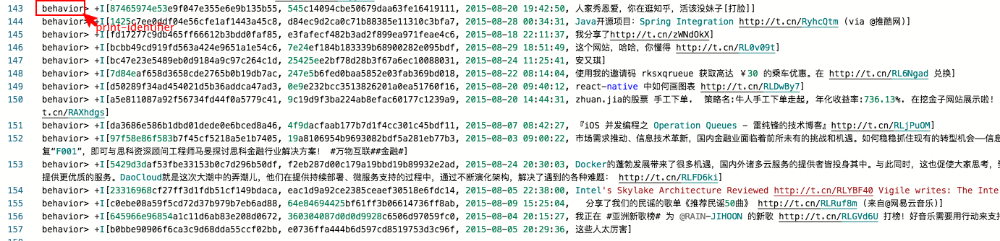

> Flink 版本：1.13

### 1. 简介

Print Connector 可以将每一行数据输出到标准输出流以及标准错误流中。它是专门为如下场景设计的：
- 在流式作业中进行简单测试。
- 在生产环境进行调试。

Print Connector 只能作为 Sink 输出表，不能作为 Source 输入表。Print Connector 会有如下四种可能的输出格式：

| Print | 条件1 | 条件2 |
| :------------- | :------------- | :------------- |
| PRINT_IDENTIFIER:taskId> output | 设置 print-identifier 参数选项 |	parallelism > 1 |
| PRINT_IDENTIFIER> output | 设置 print-identifier 参数选项 |	parallelism == 1 |
| taskId> output | 未设置 print-identifier 参数选项 | parallelism > 1 |
| output | 未设置 print-identifier 参数选项 | parallelism == 1 |

如下图所示，print-identifier 参数选项设置为 'behavior'，并且 parallelism = 1：



### 2. 创建 Print 表

使用如下语句指定 connector 参数选项为 'print'：
```sql
CREATE TABLE behavior_print_table (
  uid STRING COMMENT '用户Id',
  wid STRING COMMENT '微博Id',
  time STRING COMMENT '发微博时间',
  content STRING COMMENT '微博内容'
) WITH (
  'connector' = 'print',
  'print-identifier' = 'behavior',
  'sink.parallelism' = 1
);
```
或者，也可以使用 LIKE 子句基于现有的 Schema 来创建：
```sql
CREATE TABLE behavior_print_table WITH ('connector' = 'print')
LIKE behavior_table (EXCLUDING ALL)
```

### 3. Connector 参数选项

| 选项 | 是否必填 | 默认值 | 类型 | 说明 |
| :------------- | :------------- | :------------- | :------------- | :------------- |
| connector | 必填 | 无 | String | 指定要使用的 Connector：'Print' |
| print-identifier | 可选 | 无 | String | 作为输出内容的前缀标示 Print |
| standard-error | 可选 | false | Boolean | 如果打印到标准错误流而不是标准输出流，设置为 true |
| sink.parallelism | 可选 | 无 | Integer | 定义 Print sink 算子的并行度。默认情况下，并行度由框架决定，并与上游链算子有相同的并行度 |

原文：[Print SQL Connector](https://ci.apache.org/projects/flink/flink-docs-release-1.13/docs/connectors/table/print/)
