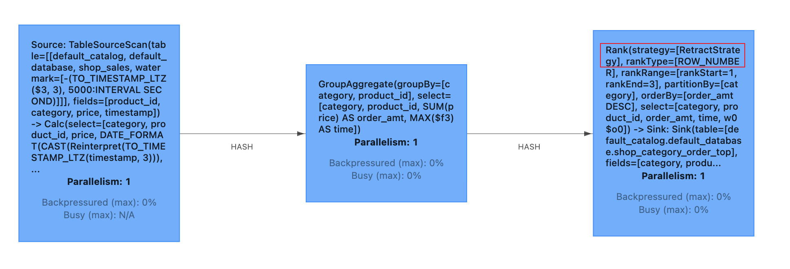
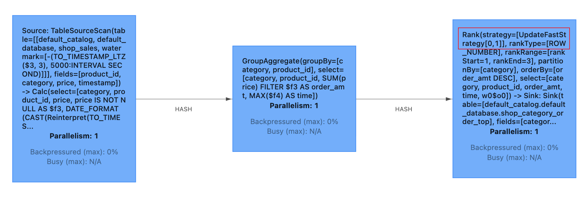
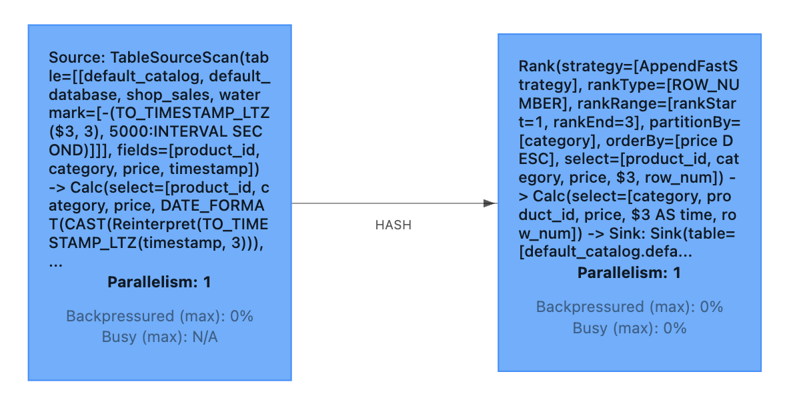

## 1. 简介

TopN 是统计报表和大屏非常常见的功能，主要用来实时计算排行榜，对实时数据中某个指标的前 N 个最值的筛选。流式的 TopN 不同于批处理的 TopN，它的特点是持续的在内存中按照某个统计指标（如出现次数）计算 TopN 排行榜，然后当排行榜发生变化时，发出更新后的排行榜。

TopN 用于对指定分组的元素进行排序，通过 TopN 可以获取指定分组中的前N个元素或者后N个元素。

## 2. 语法

Flink SQL 可以基于 OVER 窗口子句以及筛选条件灵活地完成 TopN 的功能。通过 OVER 窗口 PARTITION BY 子句的功能，Flink 还支持分组 TopN。TopN 语句的语法如下:
```sql
SELECT *
FROM (
  SELECT *,
    ROW_NUMBER() OVER ([PARTITION BY col1[, col2..]]
      ORDER BY col1 [asc|desc][, col2 [asc|desc]...]) AS rownum
  FROM T
)
WHERE rownum <= N [AND conditions]
```
参数说明：
- `ROW_NUMBER()`：根据分区内的行顺序，为每一行分配一个惟一的行号，行号计算从1开始。目前，Over 窗口函数中只支持 ROW_NUMBER。未来还会支持 RANK()和 DENSE_RANK()。
- `PARTITION BY col1[, col2..]`：分区列，每个分区都有一个 TopN 结果。
- `ORDER BY col1 [asc|desc][, col2 [asc|desc]...]`：指定排序的列和每列的排序方向，不同列上排序方向可以不同。
- `WHERE rownum <= N`：需要 rownum <= N 才能让 Flink 识别该查询是 TopN 查询。N 表示将保留最小或最大的 N 条记录。
- `[AND conditions]`：在 where 子句中可以自由添加其他条件，但其他条件只能使用 AND 连接与 `rownum <= N` 进行组合。

如上语法所示，TopN 需要两层查询：
- 第一层子查询中，使用 ROW_NUMBER() 开窗函数来为每条数据标上排名，排名的计算根据 PARTITION BY 和 ORDER BY 来指定分区列和排序列，也就是说每一条数据会计算其所属分区，并根据排序列排序得到的排名。
- 第二层外层查询中，对排名进行过滤，只取出排名小于 N 的。例如 N=10，那么就是取 Top 10 的数据。如果没有指定 PARTITION BY 那么就是一个全局 TopN 的计算，所以 ROW_NUMBER 在使用上更为灵活。

在执行过程中，Flink SQL 会对输入的数据流根据排序键进行排序。如果某个分区的前 N 条记录发生了改变，则会将改变的那几条数据以更新流的形式发给下游。

## 3. 算法

当 TopN 的输入是非更新流（例如Source），TopN 只有 AppendFastRank 算法。当 TopN 的输入是更新流时（例如经过了 AGG 或 JOIN 计算），TopN 有 2 种算法，性能从高到低分别是：UpdateFastRank 和 RetractRank。算法名字会显示在拓扑图的节点名字上。

### 3.1 RetractRank

第一种，RetractRank，对输入没有任何要求。State 中需要存放所有输入数据，其性能也是最差的。

假设有一张商品上架表，包含商品ID、商品类目、商品下单金额以及商品上架时间：
```sql
CREATE TABLE shop_sales (
  product_id BIGINT COMMENT '商品Id',
  category STRING COMMENT '商品类目',
  price BIGINT COMMENT '商品下单金额',
  `timestamp` BIGINT COMMENT '商品上架时间',
  ts_ltz AS TO_TIMESTAMP_LTZ(`timestamp`, 3), -- 事件时间
  WATERMARK FOR ts_ltz AS ts_ltz - INTERVAL '5' SECOND -- 在 ts_ltz 上定义watermark，ts_ltz 成为事件时间列
) WITH (
  'connector' = 'kafka',
  'topic' = 'shop_sales',
  'properties.bootstrap.servers' = 'localhost:9092',
  'properties.group.id' = 'shop_sales',
  'scan.startup.mode' = 'latest-offset',
  'format' = 'json',
  'json.ignore-parse-errors' = 'false',
  'json.fail-on-missing-field' = 'true'
))
```

要求输出每个商品类目下下单金额最高的3个商品以及排名：
```sql
INSERT INTO shop_category_order_top
SELECT category, product_id, order_amt, `time`, row_num
FROM (
  SELECT
    category, product_id, order_amt, `time`,
    ROW_NUMBER() OVER (PARTITION BY category ORDER BY order_amt DESC) AS row_num
  FROM (
      SELECT
          category, product_id, SUM(price) AS order_amt,
          MAX(DATE_FORMAT(ts_ltz, 'yyyy-MM-dd HH:mm:ss')) AS `time`
      FROM shop_sales
      GROUP BY category, product_id
  ) AS a1
) AS b1
WHERE row_num <= 3
```



> 如果您要获取到优化 Plan，则您需要在使用 ORDER BY SUM DESC 时，添加 SUM 为正数的过滤条件，确保 order_amt 为正数。

假设输入数据为：

| product_id | category | price | timestamp | 备注 |
| :------------- | :------------- | :------------- | :------------- | :------------- |
| 1001 | 图书 | 40  | 1665360300000 | 2022-10-10 08:05:00 |
| 2001 | 生鲜 | 80  | 1665360360000 | 2022-10-10 08:06:00 |
| 1002 | 图书 | 30  | 1665360420000 | 2022-10-10 08:07:00 |
| 2002 | 生鲜 | 80  | 1665360480000 | 2022-10-10 08:08:00 |
| 2003 | 生鲜 | 150 | 1665360540000 | 2022-10-10 08:09:00 |
| 1003 | 图书 | 100 | 1665360470000 | 2022-10-10 08:05:50 |
| 2004 | 生鲜 | 70  | 1665360660000 | 2022-10-10 08:11:00 |
| 2005 | 生鲜 | 20  | 1665360720000 | 2022-10-10 08:12:00 |
| 1004 | 图书 | 10  | 1665360780000 | 2022-10-10 08:13:00 |
| 2006 | 生鲜 | 120 | 1665360840000 | 2022-10-10 08:14:00 |
| 1005 | 图书 | 20  | 1665360900000 | 2022-10-10 08:15:00 |
| 1006 | 图书 | 60  | 1665360896000 | 2022-10-10 08:14:56 |
| 1007 | 图书 | 90  | 1665361080000 | 2022-10-10 08:18:00 |

实际效果如下所示：
```java
// 对应第1条输入记录: [1001:40]
+I[图书, 1001, 40, 2022-10-10 08:05:00, 1]
// 2 [2001:80]
+I[生鲜, 2001, 80, 2022-10-10 08:06:00, 1]
// 3 [1001:40, 1002:30]
+I[图书, 1002, 30, 2022-10-10 08:07:00, 2]
// 4 [2001:80, 2002:80]
+I[生鲜, 2002, 80, 2022-10-10 08:08:00, 2]
// 5 [2003:150, 2001:80, 2002:80]
-U[生鲜, 2001, 80, 2022-10-10 08:06:00, 1]
+U[生鲜, 2003, 150, 2022-10-10 08:09:00, 1]
-U[生鲜, 2002, 80, 2022-10-10 08:08:00, 2]
+U[生鲜, 2001, 80, 2022-10-10 08:06:00, 2]
+I[生鲜, 2002, 80, 2022-10-10 08:08:00, 3]
// 6 [1003:100, 1001:40, 1002:30]
-U[图书, 1001, 40, 2022-10-10 08:05:00, 1]
+U[图书, 1003, 100, 2022-10-10 08:05:50, 1]
-U[图书, 1002, 30, 2022-10-10 08:07:00, 2]
+U[图书, 1001, 40, 2022-10-10 08:05:00, 2]
+I[图书, 1002, 30, 2022-10-10 08:07:00, 3]
// 10 [2003:150, 2006:120, 2001:80]
-U[生鲜, 2001, 80, 2022-10-10 08:06:00, 2]
+U[生鲜, 2006, 120, 2022-10-10 08:14:00, 2]
-U[生鲜, 2002, 80, 2022-10-10 08:08:00, 3]
+U[生鲜, 2001, 80, 2022-10-10 08:06:00, 3]
// 12 [1003:100, 1006:60, 1001:40]
-U[图书, 1001, 40, 2022-10-10 08:05:00, 2]
+U[图书, 1006, 60, 2022-10-10 08:14:56, 2]
-U[图书, 1002, 30, 2022-10-10 08:07:00, 3]
+U[图书, 1001, 40, 2022-10-10 08:05:00, 3]
// 13 [1003:100, 1007:90, 1006:60]
-U[图书, 1006, 60, 2022-10-10 08:14:56, 2]
+U[图书, 1007, 90, 2022-10-10 08:18:00, 2]
-U[图书, 1001, 40, 2022-10-10 08:05:00, 3]
+U[图书, 1006, 60, 2022-10-10 08:14:56, 3]
```
> 完整示例代码：[RetractTopSQLExample](https://github.com/sjf0115/flink-example/blob/main/flink-example-1.13/src/main/java/com/flink/example/sql/funciton/top/RetractTopSQLExample.java)

### 3.2 UpdateFastRank

第二种，UpdateFastRank，要求输入是 Update 更新流，同时要求具备如下 3 个条件：
- 输入流为更新流，但不能包含 `DELETE（D）`、`UPDATE_BEFORE（UB）`类型的消息，否则会影响排序字段的单调性。
- 输入流有 Primary Key 信息，例如上游做了 GROUP BY 聚合操作。
- Order-by 排序字段的更新是单调的，且单调方向与 Order-by 排序方向相反。例如，`ORDER BY COUNT/COUNT_DISTINCT/SUM（正数）DESC`。

第一种 RetractRank 可以上述条件下优化为 UpdateFastRank，上述示例需要在使用 ORDER BY SUM DESC 时，添加 SUM 为正数的过滤条件，确保 order_amt 为正数即可：
```sql
INSERT INTO shop_category_order_top
SELECT category, product_id, order_amt, `time`, row_num
FROM (
  SELECT
    category, product_id, order_amt, `time`,
    ROW_NUMBER() OVER (PARTITION BY category ORDER BY order_amt DESC) AS row_num
  FROM (
      SELECT
          category, product_id, SUM(price) FILTER(WHERE price >= 0) AS order_amt,
          MAX(DATE_FORMAT(ts_ltz, 'yyyy-MM-dd HH:mm:ss')) AS `time`
      FROM shop_sales
      WHERE price >= 0
      GROUP BY category, product_id
  ) AS a1
) AS b1
WHERE row_num <= 3
```
> 如上示例中的 shop_sales 表为非更新流，对应的 GROUP 分组聚合的结果不会包含 DELETE（D）、UPDATE_BEFORE（UB）消息，所以对应的聚合结果字段才能保持单调性。

上述示例中，`Group By category, product_id` 会产生以 `category, product_id` 为 Key 的更新流。在 TopN 算子中，上游产生的 Upsert Key(`category, product_id`) 包含 Over 中 Partition Key(`category`)；Sum 函数的入参都是正数（`WHERE price >= 0`），所以 Sum 的结果将是单调递增的，从而字段 price 是单调递增，与排序方向相反。因此这个 Query 就可以被翻译成 UpdateFastRank。



实际效果如下所示：
```java
// 对应第1条输入记录: [1001:40]
+I[图书, 1001, 40, 2022-10-10 08:05:00, 1]
// 2 [2001:80]
+I[生鲜, 2001, 80, 2022-10-10 08:06:00, 1]
// 3 [1001:40, 1002:30]
+I[图书, 1002, 30, 2022-10-10 08:07:00, 2]
// 4 [2001:80, 2002:80]
+I[生鲜, 2002, 80, 2022-10-10 08:08:00, 2]
// 5 [2003:150, 2001:80, 2002:80]
-U[生鲜, 2001, 80, 2022-10-10 08:06:00, 1]
+U[生鲜, 2003, 150, 2022-10-10 08:09:00, 1]
-U[生鲜, 2002, 80, 2022-10-10 08:08:00, 2]
+U[生鲜, 2001, 80, 2022-10-10 08:06:00, 2]
+I[生鲜, 2002, 80, 2022-10-10 08:08:00, 3]
// 6 [1003:100, 1001:40, 1002:30]
-U[图书, 1001, 40, 2022-10-10 08:05:00, 1]
+U[图书, 1003, 100, 2022-10-10 08:05:50, 1]
-U[图书, 1002, 30, 2022-10-10 08:07:00, 2]
+U[图书, 1001, 40, 2022-10-10 08:05:00, 2]
+I[图书, 1002, 30, 2022-10-10 08:07:00, 3]
// 10 [2003:150, 2006:120, 2001:80]
-U[生鲜, 2001, 80, 2022-10-10 08:06:00, 2]
+U[生鲜, 2006, 120, 2022-10-10 08:14:00, 2]
-U[生鲜, 2002, 80, 2022-10-10 08:08:00, 3]
+U[生鲜, 2001, 80, 2022-10-10 08:06:00, 3]
// 12 [1003:100, 1006:60, 1001:40]
-U[图书, 1001, 40, 2022-10-10 08:05:00, 2]
+U[图书, 1006, 60, 2022-10-10 08:14:56, 2]
-U[图书, 1002, 30, 2022-10-10 08:07:00, 3]
+U[图书, 1001, 40, 2022-10-10 08:05:00, 3]
// 13 [1003:100, 1007:90, 1006:60]
-U[图书, 1006, 60, 2022-10-10 08:14:56, 2]
+U[图书, 1007, 90, 2022-10-10 08:18:00, 2]
-U[图书, 1001, 40, 2022-10-10 08:05:00, 3]
+U[图书, 1006, 60, 2022-10-10 08:14:56, 3]
```

> 完整示例代码：[UpdateFastTopSQLExample](https://github.com/sjf0115/flink-example/blob/main/flink-example-1.13/src/main/java/com/flink/example/sql/funciton/top/UpdateFastTopSQLExample.java)

### 3.3 AppendFastRank

第三种 AppendFastRank，要求输入是 Append 消息，专为仅追加（append-only）数据流设计，假设数据一旦产生就不会修改。此时 TopN 算子中 State 仅需要为每个 Key 存放满足要求的 N 条数据。

假设有一张商品上架表，包含商品ID、商品类目、商品价格以及商品上架时间：
```sql
CREATE TABLE shop_sales (
  product_id BIGINT COMMENT '商品Id',
  category STRING COMMENT '商品类目',
  price BIGINT COMMENT '商品价格',
  `timestamp` BIGINT COMMENT '商品上架时间',
  ts_ltz AS TO_TIMESTAMP_LTZ(`timestamp`, 3), -- 事件时间
  WATERMARK FOR ts_ltz AS ts_ltz - INTERVAL '5' SECOND -- 在 ts_ltz 上定义watermark，ts_ltz 成为事件时间列
) WITH (
  'connector' = 'kafka',
  'topic' = 'shop_sales',
  'properties.bootstrap.servers' = 'localhost:9092',
  'properties.group.id' = 'shop_sales',
  'scan.startup.mode' = 'latest-offset',
  'format' = 'json',
  'json.ignore-parse-errors' = 'false',
  'json.fail-on-missing-field' = 'true'
))
```

要求输出每个商品类目下价格最高的3个商品以及排名：
```sql
SELECT category, product_id, price, `time`, row_num
FROM (
  SELECT
    category, product_id, price, DATE_FORMAT(ts_ltz, 'yyyy-MM-dd HH:mm:ss') AS `time`,
    ROW_NUMBER() OVER (PARTITION BY category ORDER BY price DESC) AS row_num
  FROM shop_sales
)
WHERE row_num <= 3
```

> shop_sales 是 Append 流




假设输入数据跟上面示例一样，实际效果如下所示：
```java
// 对应第1条输入记录: [1001:40]
+I[图书, 1001, 40, 2022-10-10 08:05:00, 1]
// 2 [2001:80]
+I[生鲜, 2001, 80, 2022-10-10 08:06:00, 1]
// 3 [1001:40, 1002:30]
+I[图书, 1002, 30, 2022-10-10 08:07:00, 2]
// 4 [2001:80, 2002:80]
+I[生鲜, 2002, 80, 2022-10-10 08:08:00, 2]
// 5 [2003:150, 2001:80, 2002:80]
-U[生鲜, 2001, 80, 2022-10-10 08:06:00, 1]
+U[生鲜, 2003, 150, 2022-10-10 08:09:00, 1]
-U[生鲜, 2002, 80, 2022-10-10 08:08:00, 2]
+U[生鲜, 2001, 80, 2022-10-10 08:06:00, 2]
+I[生鲜, 2002, 80, 2022-10-10 08:08:00, 3]
// 6 [1003:100, 1001:40, 1002:30]
-U[图书, 1001, 40, 2022-10-10 08:05:00, 1]
+U[图书, 1003, 100, 2022-10-10 08:05:50, 1]
-U[图书, 1002, 30, 2022-10-10 08:07:00, 2]
+U[图书, 1001, 40, 2022-10-10 08:05:00, 2]
+I[图书, 1002, 30, 2022-10-10 08:07:00, 3]
// 10 [2003:150, 2006:120, 2001:80]
-U[生鲜, 2001, 80, 2022-10-10 08:06:00, 2]
+U[生鲜, 2006, 120, 2022-10-10 08:14:00, 2]
-U[生鲜, 2002, 80, 2022-10-10 08:08:00, 3]
+U[生鲜, 2001, 80, 2022-10-10 08:06:00, 3]
// 12 [1003:100, 1006:60, 1001:40]
-U[图书, 1001, 40, 2022-10-10 08:05:00, 2]
+U[图书, 1006, 60, 2022-10-10 08:14:56, 2]
-U[图书, 1002, 30, 2022-10-10 08:07:00, 3]
+U[图书, 1001, 40, 2022-10-10 08:05:00, 3]
// 13 [1003:100, 1007:90, 1006:60]
-U[图书, 1006, 60, 2022-10-10 08:14:56, 2]
+U[图书, 1007, 90, 2022-10-10 08:18:00, 2]
-U[图书, 1001, 40, 2022-10-10 08:05:00, 3]
+U[图书, 1006, 60, 2022-10-10 08:14:56, 3]
```

> 完整示例代码：[AppendFastTopSQLExample](https://github.com/sjf0115/flink-example/blob/main/flink-example-1.13/src/main/java/com/flink/example/sql/funciton/top/AppendFastTopSQLExample.java)

## 4. 无排名优化

根据 TopN 的语法，rownum 字段会作为结果表的主键字段之一写入结果表，这可能会导致大量记录写入结果表。例如，当排名第 9 的记录更新上升为第 1 名时，从排名第 1 到第 9 的所有记录都将作为更新消息输出到结果表中。如果结果表接收到太多的数据，有可能会成为 SQL 作业的瓶颈。

我们提出了一种无排名优化方法，就是在 TopN 查询的外部 SELECT 子句中省略 rownum 字段，即结果表中不保存 rownum 排名。这也是一种合理的方法，因为 TopN 的数据量通常不会很大，因此消费者可以自己快速地对记录进行排序。如果没有 rownum 字段，在上面的例子中，只需要将更改的记录(原排名第 9，更新后排名上升到第 1 的数据)发送到下游，而不用把排名第 1 到第 9 的数据全发送下去，这可以大大减少对结果表的 IO。

下面的例子展示了如何以这种方式优化上面的 TopN 例子:
```sql
-- 忽略 row_num 字段
SELECT category, product_id, price, `time`
FROM (
  SELECT
    category, product_id, price, DATE_FORMAT(ts_ltz, 'yyyy-MM-dd HH:mm:ss') AS `time`,
    ROW_NUMBER() OVER (PARTITION BY category ORDER BY price DESC) AS row_num
  FROM shop_sales
)
WHERE row_num <= 3
```

在将上述查询输出到外部存储时需要特别小心，外部存储结果表必须与 Top-N 查询有相同的 UNIQUE KEY。如果定义有误，会直接导致 TopN 结果的不正确。在无 rownum 场景中，UNIQUE KEY 应为 TopN 上游 GROUP BY 节点的 KEY 列表。在上面的示例查询中，如果 product_id 是查询的 UNIQUE KEY，那么外部表也应该有 product_id 作为 UNIQUE KEY。

如果使用无排名方法优化之后，输出如下信息：
```java
// 对应第1条输入记录: [1001:40]
+I[图书, 1001, 40, 2022-10-10 08:05:00]
// 2 [2001:80]
+I[生鲜, 2001, 80, 2022-10-10 08:06:00]
// 3 [1001:40, 1002:30]
+I[图书, 1002, 30, 2022-10-10 08:07:00]
// 4 [2001:80, 2002:80]
+I[生鲜, 2002, 80, 2022-10-10 08:08:00]
// 5 [2003:150, 2001:80, 2002:80]
+I[生鲜, 2003, 150, 2022-10-10 08:09:00]
// 6 [1003:100, 1001:40, 1002:30]
+I[图书, 1003, 100, 2022-10-10 08:05:50]
// 10 [2003:150, 2006:120, 2001:80]
-D[生鲜, 2002, 80, 2022-10-10 08:08:00]
+I[生鲜, 2006, 120, 2022-10-10 08:14:00]
// 12 [1003:100, 1006:60, 1001:40]
-D[图书, 1002, 30, 2022-10-10 08:07:00]
+I[图书, 1006, 60, 2022-10-10 08:14:56]
// 13 [1003:100, 1007:90, 1006:60]
-D[图书, 1001, 40, 2022-10-10 08:05:00]
+I[图书, 1007, 90, 2022-10-10 08:18:00]
```
从上面可以看出采用无排名优化之后从有排名输出的 26 条记录降低到 12 条记录。同样是第 6 条输入数据 1003，无排名优化之后只是输出1条记录(原先需要输出6条记录)。

> 完整示例代码：[TopWithoutRankSQLExample](https://github.com/sjf0115/flink-example/blob/main/flink-example-1.13/src/main/java/com/flink/example/sql/funciton/top/TopWithoutRankSQLExample.java)

参考：
- [Top-N](https://nightlies.apache.org/flink/flink-docs-release-1.13/docs/dev/table/sql/queries/topn/)
