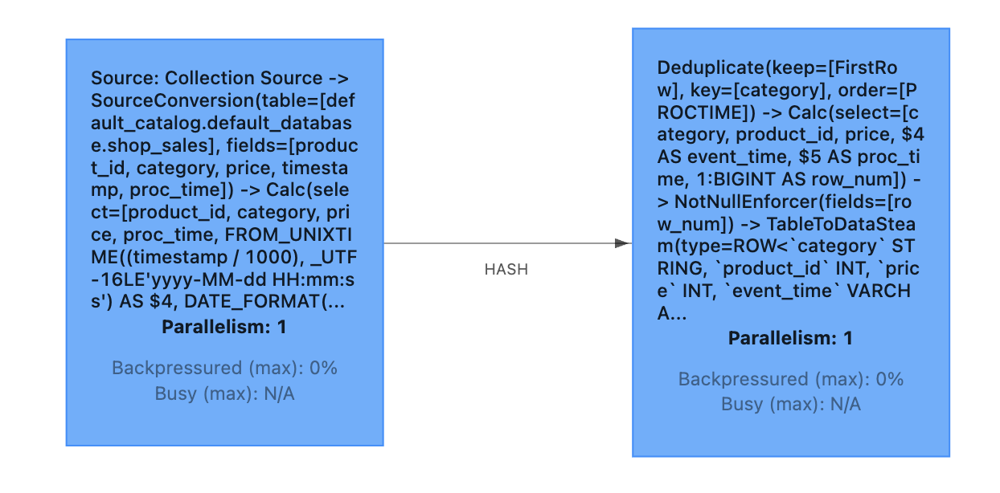
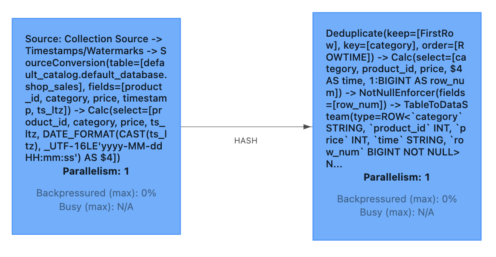
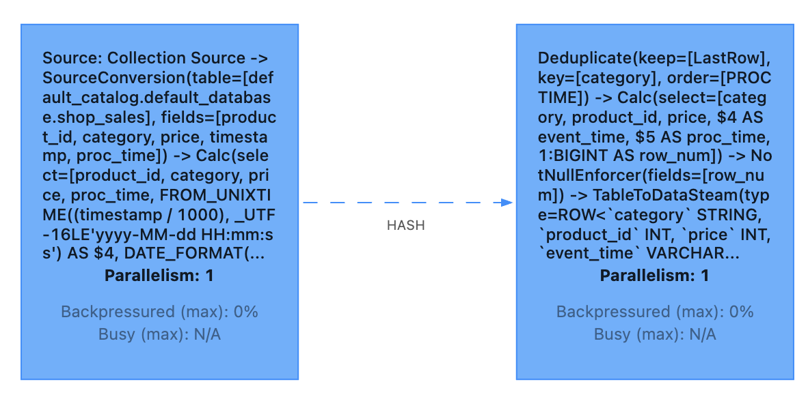
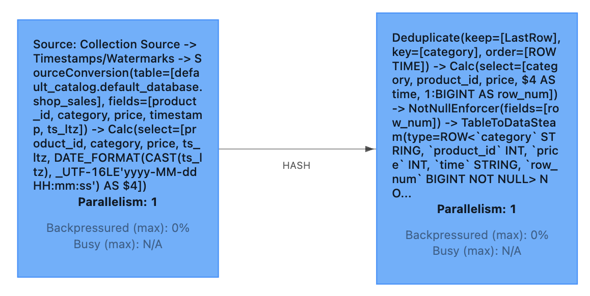
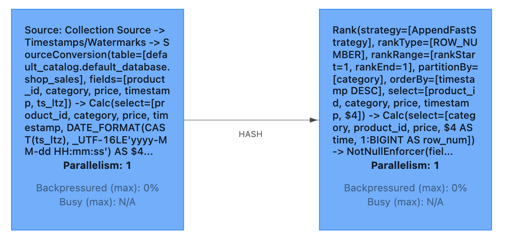

## 1. 简介

Deduplication 其实就是去重，删除在一组指定列上重复的行，只保留第一行或者最后一行。在某些情况下，上游 ETL 作业并不能保证端到端的 Exactly-Once 语义。在故障恢复时，可能会导致 Sink 中出现重复的记录。然而，重复记录会影响下游分析作业的正确性，例如 SUM, COUNT，因此在进一步分析之前需要删除重复数据。

## 2. 语法

由于 SQL 上没有直接支持去重的语法，还要灵活地保留第一行或者保留最后一行。因此我们使用了 SQL 的 ROW_NUMBER OVER WINDOW 功能来实现去重语法：
```sql
SELECT *
FROM (
   SELECT *,
    ROW_NUMBER() OVER (PARTITION BY col1[, col2..]
     ORDER BY timeAttributeCol [asc|desc]) AS rownum
   FROM table_name
)
WHERE rownum = 1
```
参数说明：
- `ROW_NUMBER()`：根据分区内的行顺序，为每一行分配一个惟一的行号，行号计算从1开始。
- `PARTITION BY col1[, col2..]`：分区列，即去重 KEYS。
- `ORDER BY timeAttributeCol [asc|desc])`：指定排序列，必须是一个时间属性的字段（即 Proctime 或 Rowtime）。可以指定顺序（Keep FirstRow）或者倒序 （Keep LastRow）。
- `WHERE rownum = 1`：仅支持rownum=1或rownum<=1。

从上面语法可以看出，Deduplication 去重本质上是一种特殊的 TopN，限定 rownum = 1 的场景。Deduplication 通常应用于按照主键去重或者按照主键保留最新快照数据的场景。注意，Deduplication 的输入数据流只能为 Append-only 流，不能是 Retract 流。

## 3. 去重策略

Deduplication 去重对排名进行过滤，只取第一条（rownum = 1），从而达到了去重的目的。根据排序字段的方向不同，有保留第一行（Deduplicate Keep FirstRow）和保留最后一行（Deduplicate Keep LastRow）2种去重策略。

### 3.1 保留第一行

如果排序字段方向是 `ASC`（正序方向），即对应只保留第一行（Deduplicate Keep FirstRow）策略。保留第一行的去重策略就是保留 KEY 下第一条出现的数据，之后该 KEY 下出现的数据会被丢弃。因为状态中只存储了 KEY 数据，所以性能较优。

#### 3.1.1 基于处理时间升序

假设有一张商品上架表，包含商品ID、商品类目、商品价格以及商品上架时间：

| product_id | category | price | timestamp | 备注 |
| :------------- | :------------- | :------------- | :------------- | :------------- |
| 1001 | 图书 | 40  | 1665360300000 | 2022-10-10 08:05:00 |
| 2001 | 生鲜 | 80  | 1665360360000 | 2022-10-10 08:06:00 |
| 1002 | 图书 | 30  | 1665360420000 | 2022-10-10 08:07:00 |
| 2002 | 生鲜 | 80  | 1665360480000 | 2022-10-10 08:08:00 |
| 2003 | 生鲜 | 150 | 1665360540000 | 2022-10-10 08:09:00 |
| 1003 | 图书 | 100 | 1665360290000 | 2022-10-10 08:04:50 |
| 2004 | 生鲜 | 70  | 1665360660000 | 2022-10-10 08:11:00 |
| 2005 | 生鲜 | 20  | 1665360720000 | 2022-10-10 08:12:00 |
| 1004 | 图书 | 10  | 1665360780000 | 2022-10-10 08:13:00 |
| 2006 | 生鲜 | 120 | 1665360840000 | 2022-10-10 08:14:00 |
| 1005 | 图书 | 20  | 1665360900000 | 2022-10-10 08:15:00 |
| 1006 | 图书 | 60  | 1665360896000 | 2022-10-10 08:14:56 |
| 1007 | 图书 | 90  | 1665361080000 | 2022-10-10 08:18:00 |

要求输出每个商品类目按照系统时间上架的第一个商品：
```sql
SELECT category, product_id, price, event_time, proc_time, row_num
FROM (
  SELECT
    category, product_id, price,  +
    FROM_UNIXTIME(`timestamp`/1000, 'yyyy-MM-dd HH:mm:ss') AS event_time,
    DATE_FORMAT(proc_time, 'yyyy-MM-dd HH:mm:ss') AS proc_time,
    ROW_NUMBER() OVER (PARTITION BY category ORDER BY proc_time ASC) AS row_num
  FROM shop_sales
)
WHERE row_num = 1
```
> 以上示例是将 shop_sales 表按照商品类目 category 字段进行去重，并按照系统时间保留第一条数据。proc_time 在这里是源表 shop_sales 中的一个具有 Processing Time 属性的字段。



实际效果如下所示：
```java
+I[图书, 1001, 40, 2022-10-10 08:05:00, 2025-09-21 13:05:27, 1]
+I[生鲜, 2001, 80, 2022-10-10 08:06:00, 2025-09-21 13:05:27, 1]
```

> 完整代码示例：[DeduplicationFirstProcessingTimeAscExample](https://github.com/sjf0115/flink-example/blob/main/flink-example-1.13/src/main/java/com/flink/example/sql/query/deduplication/DeduplicationFirstProcessingTimeAscExample.java)

总结：`ORDER BY 处理时间 关键字 ASC` 输出结果为 Append-only 流，因为只要当前分区键下有新的输入数据，新数据的处理时间一定会比旧数据的处理时间大，数据就不会更新了。

#### 3.1.2 基于事件时间升序

还是上述商品上架表，要求输出每个商品类目按照实际事件时间上架的第一个商品：
```sql
SELECT category, product_id, price, `time`, row_num
FROM (
  SELECT
    category, product_id, price, DATE_FORMAT(ts_ltz, 'yyyy-MM-dd HH:mm:ss') AS `time`,
    ROW_NUMBER() OVER (PARTITION BY category ORDER BY ts_ltz ASC) AS row_num
  FROM shop_sales
)
WHERE row_num = 1
```
> 以上示例是将 shop_sales 表按照商品类目 category 字段进行去重，并按照事件时间保留第一条数据。ts_ltz 在这里是源表 shop_sales 中的一个具有 EventTime 属性的字段。



实际效果如下所示：
```java
+I[图书, 1001, 40, 2022-10-10 00:05:00, 1]
+I[生鲜, 2001, 80, 2022-10-10 00:06:00, 1]
-U[图书, 1001, 40, 2022-10-10 00:05:00, 1]
+U[图书, 1003, 100, 2022-10-10 00:04:50, 1]
```

> 完整代码示例：[DeduplicationFirstEventTimeAscExample](https://github.com/sjf0115/flink-example/blob/main/flink-example-1.13/src/main/java/com/flink/example/sql/query/deduplication/DeduplicationFirstEventTimeAscExample.java)

总结：`ORDER BY 事件时间 关键字 ASC` 输出结果为 Retract 流，因为当前分区键下，后续可能会输入比旧数据的事件时间还小的新数据。

### 3.2 保留最后一行

如果排序字段方向是 `DESC`（倒序方向），即对应保留最后一行（Deduplicate Keep LastRow）策略。保留末行的去重策略就是保留 KEY 下最后一条出现的数据。

#### 3.2.1 基于处理时间降序

还是上述商品上架表，要求输出每个商品类目按照系统时间上架的最后一个商品：
```sql
SELECT category, product_id, price, event_time, proc_time, row_num
FROM (
  SELECT
    category, product_id, price,
    FROM_UNIXTIME(`timestamp`/1000, 'yyyy-MM-dd HH:mm:ss') AS event_time,
    DATE_FORMAT(proc_time, 'yyyy-MM-dd HH:mm:ss') AS proc_time,
    ROW_NUMBER() OVER (PARTITION BY category ORDER BY proc_time DESC) AS row_num
  FROM shop_sales
)
WHERE row_num = 1
```
> 以上示例是将 shop_sales 表按照商品类目 category 字段进行去重，并按照系统时间保留最后一条数据。proc_time 在这里是源表 shop_sales 中的一个具有 Processing Time 属性的字段。



实际效果如下所示：
```java
+I[图书, 1001, 40, 2022-10-10 08:05:00, 2025-09-21 13:10:06, 1]
+I[生鲜, 2001, 80, 2022-10-10 08:06:00, 2025-09-21 13:10:06, 1]
-U[图书, 1001, 40, 2022-10-10 08:05:00, 2025-09-21 13:10:06, 1]
+U[图书, 1002, 30, 2022-10-10 08:07:00, 2025-09-21 13:10:06, 1]
-U[生鲜, 2001, 80, 2022-10-10 08:06:00, 2025-09-21 13:10:06, 1]
+U[生鲜, 2002, 80, 2022-10-10 08:08:00, 2025-09-21 13:10:06, 1]
-U[生鲜, 2002, 80, 2022-10-10 08:08:00, 2025-09-21 13:10:06, 1]
+U[生鲜, 2003, 150, 2022-10-10 08:09:00, 2025-09-21 13:10:06, 1]
-U[图书, 1002, 30, 2022-10-10 08:07:00, 2025-09-21 13:10:06, 1]
+U[图书, 1003, 100, 2022-10-10 08:04:50, 2025-09-21 13:10:06, 1]
-U[生鲜, 2003, 150, 2022-10-10 08:09:00, 2025-09-21 13:10:06, 1]
+U[生鲜, 2004, 70, 2022-10-10 08:11:00, 2025-09-21 13:10:06, 1]
-U[生鲜, 2004, 70, 2022-10-10 08:11:00, 2025-09-21 13:10:06, 1]
+U[生鲜, 2005, 20, 2022-10-10 08:12:00, 2025-09-21 13:10:06, 1]
-U[图书, 1003, 100, 2022-10-10 08:04:50, 2025-09-21 13:10:06, 1]
+U[图书, 1004, 10, 2022-10-10 08:13:00, 2025-09-21 13:10:06, 1]
-U[生鲜, 2005, 20, 2022-10-10 08:12:00, 2025-09-21 13:10:06, 1]
+U[生鲜, 2006, 120, 2022-10-10 08:14:00, 2025-09-21 13:10:06, 1]
-U[图书, 1004, 10, 2022-10-10 08:13:00, 2025-09-21 13:10:06, 1]
+U[图书, 1005, 20, 2022-10-10 08:15:00, 2025-09-21 13:10:06, 1]
-U[图书, 1005, 20, 2022-10-10 08:15:00, 2025-09-21 13:10:06, 1]
+U[图书, 1006, 60, 2022-10-10 08:14:56, 2025-09-21 13:10:06, 1]
-U[图书, 1006, 60, 2022-10-10 08:14:56, 2025-09-21 13:10:06, 1]
+U[图书, 1007, 90, 2022-10-10 08:18:00, 2025-09-21 13:10:06, 1]
```

> 完整代码示例：[DeduplicationLastProcessingTimeDescExample](https://github.com/sjf0115/flink-example/blob/main/flink-example-1.13/src/main/java/com/flink/example/sql/query/deduplication/DeduplicationLastProcessingTimeDescExample.java)

总结：`ORDER BY 处理时间 关键字 DESC` 输出结果为 Retract 流，因为只要当前分区键下有新的输入数据，新数据的处理时间一定会比旧数据的处理时间大，数据一定会被更新。

#### 3.2.2 基于事件时间降序

还是上述商品上架表，要求输出每个商品类目按照实际事件时间上架的最后一个商品：
```sql
SELECT category, product_id, price, `time`, row_num
FROM (
  SELECT
    category, product_id, price, DATE_FORMAT(ts_ltz, 'yyyy-MM-dd HH:mm:ss') AS `time`,
    ROW_NUMBER() OVER (PARTITION BY category ORDER BY ts_ltz DESC) AS row_num
  FROM shop_sales
)
WHERE row_num = 1
```
> 以上示例是将 shop_sales 表按照商品类目 category 字段进行去重，并按照事件时间保留最后一条数据。ts_ltz 在这里是源表 shop_sales 中的一个具有 EventTime 属性的字段。



实际效果如下所示：
```java
+I[图书, 1001, 40, 2022-10-10 00:05:00, 1]
+I[生鲜, 2001, 80, 2022-10-10 00:06:00, 1]
-U[图书, 1001, 40, 2022-10-10 00:05:00, 1]
+U[图书, 1002, 30, 2022-10-10 00:07:00, 1]
-U[生鲜, 2001, 80, 2022-10-10 00:06:00, 1]
+U[生鲜, 2002, 80, 2022-10-10 00:08:00, 1]
-U[生鲜, 2002, 80, 2022-10-10 00:08:00, 1]
+U[生鲜, 2003, 150, 2022-10-10 00:09:00, 1]
-U[生鲜, 2003, 150, 2022-10-10 00:09:00, 1]
+U[生鲜, 2004, 70, 2022-10-10 00:11:00, 1]
-U[生鲜, 2004, 70, 2022-10-10 00:11:00, 1]
+U[生鲜, 2005, 20, 2022-10-10 00:12:00, 1]
-U[图书, 1002, 30, 2022-10-10 00:07:00, 1]
+U[图书, 1004, 10, 2022-10-10 00:13:00, 1]
-U[生鲜, 2005, 20, 2022-10-10 00:12:00, 1]
+U[生鲜, 2006, 120, 2022-10-10 00:14:00, 1]
-U[图书, 1004, 10, 2022-10-10 00:13:00, 1]
+U[图书, 1005, 20, 2022-10-10 00:15:00, 1]
-U[图书, 1005, 20, 2022-10-10 00:15:00, 1]
+U[图书, 1007, 90, 2022-10-10 00:18:00, 1]
```

> 完整代码示例：[DeduplicationLastEventTimeDescExample](https://github.com/sjf0115/flink-example/blob/main/flink-example-1.13/src/main/java/com/flink/example/sql/query/deduplication/DeduplicationLastEventTimeDescExample.java)

总结：`ORDER BY 事件时间 关键字 DESC` 输出结果为 Retract 流，因为当前分区键下，后续可能会输入比旧数据的事件时间还大的新数据。

## 4. 注意

Deduplication 的特殊之处在于，排序字段必须是时间属性列，不能是其他非时间属性的普通列。在 rownum = 1 时，如果是时间属性列 planner 会将 SQL 作业翻译成 Deduplication 算子，但是如果排序字段是普通列 planner 会将 SQL 作业翻译成 TopN 算子；这两者最终的执行算子是不一样的，Deduplication 相比 TopN 算子专门做了对应的优化，性能会有很大提升。

将基于事件时间降序示例中的排序字段改为 `timestamp`：
```sql
SELECT category, product_id, price, `time`, row_num
FROM (
  SELECT
    category, product_id, price, DATE_FORMAT(`timestamp`, 'yyyy-MM-dd HH:mm:ss') AS `time`,
    ROW_NUMBER() OVER (PARTITION BY category ORDER BY `timestamp` DESC) AS row_num
  FROM shop_sales
)
WHERE row_num = 1
```
> 以上示例是将 shop_sales 表按照商品类目 category 字段进行去重，并按照事件时间保留最后一条数据。`timestamp` 在这里是源表 shop_sales 中的一个 BIGING 类型的时间字段(非时间属性字段)。



可以看到 planner 会将 SQL 作业翻译成 TopN 算子来执行。实际执行效果如下所示：
```java
+I[图书, 1001, 40, 2022-10-10 00:05:00, 1]
+I[生鲜, 2001, 80, 2022-10-10 00:06:00, 1]
-D[图书, 1001, 40, 2022-10-10 00:05:00, 1]
+I[图书, 1002, 30, 2022-10-10 00:07:00, 1]
-D[生鲜, 2001, 80, 2022-10-10 00:06:00, 1]
+I[生鲜, 2002, 80, 2022-10-10 00:08:00, 1]
-D[生鲜, 2002, 80, 2022-10-10 00:08:00, 1]
+I[生鲜, 2003, 150, 2022-10-10 00:09:00, 1]
-D[生鲜, 2003, 150, 2022-10-10 00:09:00, 1]
+I[生鲜, 2004, 70, 2022-10-10 00:11:00, 1]
-D[生鲜, 2004, 70, 2022-10-10 00:11:00, 1]
+I[生鲜, 2005, 20, 2022-10-10 00:12:00, 1]
-D[图书, 1002, 30, 2022-10-10 00:07:00, 1]
+I[图书, 1004, 10, 2022-10-10 00:13:00, 1]
-D[生鲜, 2005, 20, 2022-10-10 00:12:00, 1]
+I[生鲜, 2006, 120, 2022-10-10 00:14:00, 1]
-D[图书, 1004, 10, 2022-10-10 00:13:00, 1]
+I[图书, 1005, 20, 2022-10-10 00:15:00, 1]
-D[图书, 1005, 20, 2022-10-10 00:15:00, 1]
+I[图书, 1007, 90, 2022-10-10 00:18:00, 1]
```

> 完整代码示例：[TopLastEventTimeDescExample](https://github.com/sjf0115/flink-example/blob/main/flink-example-1.13/src/main/java/com/flink/example/sql/query/deduplication/TopLastEventTimeDescExample.java)

此外，如果排序字段是 Proctime 列，Flink 就会按照系统时间去重，其每次运行的结果是不确定的；如果排序字段是 Rowtime 列，Flink 就会按照业务时间去重，其每次运行的结果是确定的。
