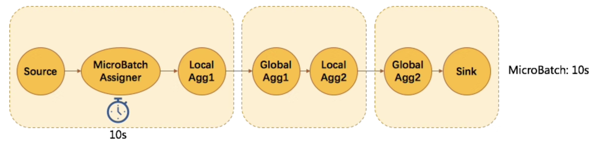

之前我们在 Flink SQL 中支持了 [MiniBatch](https://smartsi.blog.csdn.net/article/details/127201264), 在支持高吞吐场景发挥了重要作用。今年我们在 Flink SQL 性能优化中一项重要的改进就是升级了微批模型，我们称之为 MicroBatch，也叫 MiniBatch2.0。

在设计和实现 Flink 的流计算算子时，我们一般会把“面向状态编程”作为第一准则。因为在流计算中，为了保证状态（State）的一致性，需要将状态数据存储在状态后端（StateBackend），由框架来做分布式快照。而目前主要使用的 RocksDB, Niagara 状态后端都会在每次 read 和 write 操作时发生序列化和反序列化操作，甚至是磁盘的 I/O 操作。因此状态的相关操作通常都会成为整个任务的性能瓶颈，状态的数据结构设计以及对状态的每一次访问都需要特别注意。

微批的核心思想就是缓存一小批数据，在访问状态状态时，多个同 key 的数据就只需要发生一次状态的操作。当批次内数据的 key 重复率较大时，能显著降低对状态的访问频次，从而大幅提高吞吐。MicroBatch 和 MiniBatch 的核心机制是一样的，就是攒批，然后触发计算。只是攒批策略不太一样。我们先讲解触发计算时是如何节省状态访问频次的。

## 1. 微批计算

MicroBatch 的一个典型应用场景就是 Group Aggregate。例如简单的求和例子：
```sql
SELECT key, SUM(value) FROM T GROUP BY key
```


如上图所示，当未开启 MicroBatch 时，Aggregate 的处理模式是每来一条数据，查询一次状态，进行聚合计算，然后写入一次状态。当有 N 条数据时，需要操作 2*N 次状态。


当开启 MicroBatch 时，对于缓存下来的 N 条数据一起触发，同 key 的数据只会读写状态一次。例如上图缓存的 4 条 A 的记录，只会对状态读写各一次。所以当数据的 key 的重复率越大，攒批的大小越大，那么对状态的访问会越少，得到的吞吐量越高。

## 2. 攒批策略

攒批策略一般分成两个维度，一个是**延时**，一个是**内存**。延时即控制多久攒一次批，这也是用来权衡吞吐和延迟的重要参数。内存即为了避免瞬间 TPS 太大导致内存无法存下缓存的数据，避免造成 Full GC 和 OOM。下面会分别介绍旧版 MiniBatch 和 新版 MicroBatch 在这两个维度上的区别。

### 2.1 MiniBatch 攒批策略

MiniBatch 攒批策略的延时维度是通过在每个聚合节点注册单独的定时器来实现，时间分配策略采用简单的均分。比如有4个 aggregate 节点，用户配置 10s 的 MiniBatch，那么每个节点会分配2.5s，例如下图所示：


但是这种策略有以下几个问题：
- 用户能容忍 10s 的延时，但是真正用来攒批的只有2.5秒，攒批效率低。拓扑越复杂，差异越明显。
- 由于上下游的定时器的触发是纯异步的，可能导致上游触发微批的时候，下游也正好触发微批，而处理微批时会一段时间不消费网络数据，导致上游很容易被反压。
- 计时器会引入额外的线程，增加了线程调度和抢锁上的开销。

MiniBatch 攒批策略在内存维度是通过统计输入条数，当输入的条数超过用户配置的 `blink.miniBatch.size` 时，就会触发批次以防止 OOM。但是 size 参数并不是很好评估，一方面当 size 配的过大，可能会失去保护内存的作用；而当 size 配的太小，又会导致攒批效率降低。

### 2.2 MicroBatch 攒批策略

MicroBatch 的提出就是为了解决 MiniBatch 遇到的上述问题。MicroBatch 引入了 watermark 来控制聚合节点的定时触发功能，用 watermark 作为特殊事件插入数据流中将数据流切分成相等时间间隔的一个个批次。实现原理如下所示：



MicroBatch 会在数据源之后插入一个 MicroBatchAssigner 的节点，用来定时发送 watermark，其间隔是用户配置的延时参数，如10s。那么每隔10s，不管数据源有没有数据，都会发一个当前系统时间戳的 watermark 下去。一个节点的当前 watermark 取自所有 channel 的最小 watermark 值，所以当聚合节点的 watermark 值前进时，也就意味着攒齐了上游的一个批次，我们就可以触发这个批次了。处理完这个批次后，需要将当前 watermark 广播给下游所有 task。当下游 task 收齐上游 watermark 时，也会触发批次。这样批次的触发会从上游到下游逐级触发。

这里将 watermark 作为划分批次的特殊事件是很有意思的一点。Watermark 是一个非常强大的工具，一般我们用来衡量业务时间的进度，解决业务时间乱序的问题。但其实换一个维度，它也可以用来衡量全局系统时间的进度，从而非常巧妙地解决数据划批的问题。

因此与 MiniBatch 策略相比，MicroBatch 具有以下优点：
- 相同延时下，MicroBatch 的攒批效率更高，能攒更多的数据。
- 由于 MicroBatch 的批次触发是靠事件的，当上游触发时，下游不会同时触发，所以不像 MiniBatch 那么容易引起反压。
- 解决数据抖动问题（下一小节分析）

我们利用一个 DAU 作业进行了性能测试对比，在相同的 allowLatency（6秒）配置的情况下，MicroBatch 能得到更高的吞吐，而且还能得到与 MiniBatch 相同的端到端延迟！


另外，仍然是上述的性能测试对比，可以发现运行稳定后 MicroBatch 的队列使用率平均值在 50% 以下，而 MiniBatch 基本是一直处于队列满载下。说明 MicroBatch 比 MiniBatch 更加稳定，更不容易引起反压。


MicroBatch 在内存维度目前仍然与 MiniBatch 一样，使用 size 参数来控制条数。但是将来会基于内存管理，将缓存的数据存于管理好的内存块中（BytesHashMap），从而减少 Java 对象的空间成本，减少 GC 的压力和防止 OOM。

## 3. 防止数据抖动

所谓数据抖动问题是指，两层 AGG 时，第一层 AGG 发出的更新消息会拆成两条独立的消息被下游消费，分别是 retract 消息和 accumulate 消息。而当第二层 AGG 消费这两条消息时也会发出两条消息。从前端看到就是数据会有抖动的现象。例如下面的例子，统计买家数，这里做了两层打散，第一层先做 UV 统计，第二级做SUM。
```sql
SELECT day, SUM(cnt) total
FROM (
  SELECT day, MOD(buy_id, 1024), COUNT(DISTINCT buy_id) as cnt
  FROM T GROUP BY day, MOD(buy_id, 1024)
)
GROUP BY day
```
当第一层 count distinct 的结果从 100 上升到 101 时，它会发出 -100, +101 的两条消息。当第二层的 SUM 会依次收到这两条消息并处理，假设此时 SUM 值是 900，那么在处理 -100 时，会先发出 800 的结果值，然后处理 +101 时，再发出 901 的结果值。从用户端的感受就是买家数从 900 降到了 800 又上升到了 901，我们称之为数据抖动。而理论上买家数只应该只增不减的，所以我们也一直在思考如何解决这个问题。

数据抖动的本质原因是 retract 和 accumulate 消息是一个事务中的两个操作，但是这两个操作的中间结果被用户看到了，也就是传统数据库 ACID 中的隔离性(I) 中最弱的 READ UNCOMMITTED 的事务保障。要从根本上解决这个问题的思路是，**如何原子地处理 retract & accumulate 的消息**。如上文所述的 MicroBatch 策略，借助 watermark 划批，watermark 不会插在 retract & accumulate 中间，那么 **watermark 就是事务的天然分界**。按照 watermark 来处理批次可以达到原子处理 retract & accumulate 的目的。从而解决抖动问题。

## 4. 适用场景与使用方式

MicroBatch 是使用一定的延迟来换取大量吞吐的策略，如果用户有超低延迟的要求的话，不建议开启微批处理。MicroBatch 目前对于无限流的聚合、Join 都有显著的性能提升，所以建议开启。如果遇到了上述的数据抖动问题，也建议开启。

MicroBatch默认关闭，开启方式：
```sql
# 攒批的间隔时间，使用 microbatch 策略时需要加上该配置，且建议和 blink.miniBatch.allowLatencyMs 保持一致
blink.microBatch.allowLatencyMs=5000
# 使用 microbatch 时需要保留以下两个 minibatch 配置
blink.miniBatch.allowLatencyMs=5000
# 防止OOM，每个批次最多缓存多少条数据
blink.miniBatch.size=20000
```
## 5. 后续优化

MicroBatch 目前只支持无限流的聚合和 Join，暂不支持 Window Aggregate。所以后续 Window Aggregate 会重点支持 MicroBatch 策略，以提升吞吐性能。另一方面，MicroBatch 的内存会考虑使用二进制的数据结构管理起来，提升内存的利用率和减轻 GC 的影响。

原文:[Flink SQL 核心解密 —— 提升吞吐的利器 MicroBatch](https://developer.aliyun.com/article/675100)
