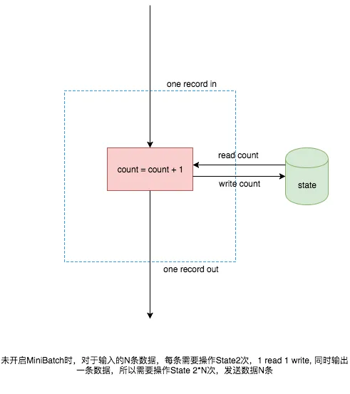
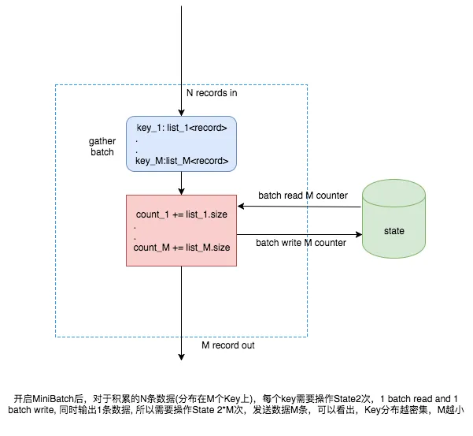
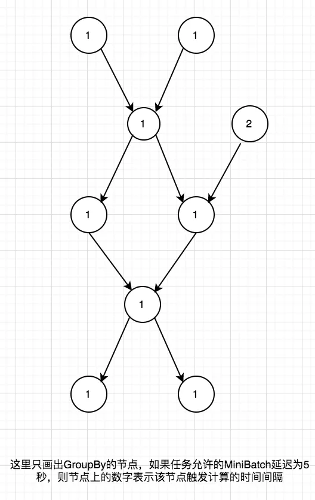

在 Blink 的流式任务中，State 相关的操作通常都会成为整个任务的性能瓶颈。实时计算部-查询和优化团队开发了 MiniBatch 功能，大幅降低了 State 操作的开销，在今年的双11中，几乎所有适用的任务都启用了 MiniBatch 功能。

## 1. 典型场景-无限流上的 GroupBy

在 Blink-SQL 中，通常会使用无限流的 GroupBy 来完成去重或者聚合计算，一个简单的例子如下：
```sql
SELECT a, count(b) FROM dual GROUP BY a
```
标准实现的计算方式如下所示：



MiniBatch 实现的计算方式如下所示：



## 2. StateBackend 的 Batch 操作

从上图可知，开启 MiniBatch 之后要求 State 能支持 Batch 读写，目前默认的 RocksDBStateBackend 暂时不支持，Batch 的读写实际是循环读写，而 NiagaraStateBackend 则支持真正的 Batch 读写。

## 3. 用户的参数设置以及实现方案

目前用户在使用 Bayes 提交 Blink-SQL 任务时，可以设置以下两种触发逻辑
- 表示整个job允许的延迟(必须参数)：blink.miniBatch.allowLatencyMs=5000
- 单个batch的size(可选参数)：blink.miniBatch.size=1000

由于最终的 SQL 任务是一个 DAG，需要在 GroupBy 节点上分配时间使得整个任务的在攒数据上的延迟不超过该值，目前时间分配的策略是简单地做均分，一个可能的例子如下



## 4. 适用场景

当前 MiniBatch 支持 Blink-SQL 中的无限流 GroupBy 和无限流 Proctime Over Window。如果 Blink-SQL 任务有热 Key，则非常适合启用 MiniBatch 优化, 一些任务启用了 MiniBatch，可以看出往下游发送的数据比原有少了约2个数量级

## 5. 优化模型及后续

- 从上可以看出现有的时间分配策略只是给了可行但不是最优的方案，Key 的分布更密集的节点不一定分配到了更多的时间。
- 完整 MiniBatch 的优化需要通过 Key 的分布，source 节点输入速率， 节点处理能力等信息来计算每个节点的时间分配，在后续的版本中会结合 HotUpdate 功能做到动态调整，最大化发挥出 MiniBatch 的威力。

原文：[Flink SQL 功能解密系列 —— 解决热点问题的大杀器MiniBatch](https://developer.aliyun.com/article/448853)
