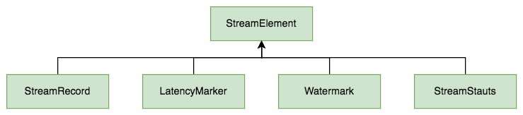

Flink 中所有在算子之间传递的数据，不管是用户的业务数据，还是系统内部的控制信号，在底层都被统一抽象为 **StreamElement（数据流元素）**。理解 StreamElement 的设计，是理解 Flink 运行时数据流转机制的基础。

## 1. 整体设计

### 1.1 类层次结构

StreamElement 是一个抽象基类，共有 4 种子类型：

```
                    StreamElement（抽象基类）
                          │
         ┌────────────────┼────────────────┐────────────────┐
         │                │                │                │
    StreamRecord      Watermark      LatencyMarker     StreamStatus
    （数据记录）      （水位线）       （延迟标记）       （流状态）
      用户数据         时间推进          延迟度量         空闲/活跃
```

四种类型各司其职：

| 类型 | 职责 | 面向对象 |
|------|------|----------|
| StreamRecord | 承载用户的业务数据 | 用户 + 框架 |
| Watermark | 推进事件时间，触发窗口计算 | 框架内部 |
| LatencyMarker | 度量端到端处理延迟 | 框架内部（监控） |
| StreamStatus | 标记数据源空闲/活跃状态 | 框架内部 |



### 1.2 StreamElement 源码

StreamElement 抽象类本身非常轻量，仅提供类型判断和类型转换方法：
```java
public abstract class StreamElement {
    // 是否是 Watermark
    public final boolean isWatermark() {
        return getClass() == Watermark.class;
    }
    // 是否是数据流状态 StreamStatus
    public final boolean isStreamStatus() {
        return getClass() == StreamStatus.class;
    }
    // 是否是数据记录 StreamRecord
    public final boolean isRecord() {
        return getClass() == StreamRecord.class;
    }
    // 是否是延迟标记 LatencyMarker
    public final boolean isLatencyMarker() {
        return getClass() == LatencyMarker.class;
    }
    // 转换为数据记录 StreamRecord
    public final <E> StreamRecord<E> asRecord() {
        return (StreamRecord<E>) this;
    }
    // 转换为 Watermark
    public final Watermark asWatermark() {
        return (Watermark) this;
    }
    // 转换为数据流状态 StreamStatus
    public final StreamStatus asStreamStatus() {
        return (StreamStatus) this;
    }
    // 转换为延迟标记 LatencyMarker
    public final LatencyMarker asLatencyMarker() {
        return (LatencyMarker) this;
    }
}
```

在执行层面上，4 种数据流元素都被序列化成二进制数据，形成混合的数据流，在算子中将混合数据流中的数据流元素反序列化出来，根据其类型分别进行处理。

下面我们逐一深入分析每种数据流元素。

---

## 2. 数据记录 StreamRecord

### 2.1 核心设计

StreamRecord 是四种元素中唯一面向用户数据的类型——用户在 DataStream 上处理的每一条数据，在运行时都被封装为 StreamRecord。它本质上是一个 **数据值 + 可选时间戳** 的轻量封装：
```java
public final class StreamRecord<T> extends StreamElement {
    /** 实际的数据值 */
    private T value;
    /** 时间戳（毫秒） */
    private long timestamp;
    /** 标记是否设置了时间戳 */
    private boolean hasTimestamp;

    // 不带时间戳的构造器（ProcessingTime 语义下使用）
    public StreamRecord(T value) {
        this.value = value;
    }

    // 带时间戳的构造器（EventTime 语义下使用）
    public StreamRecord(T value, long timestamp) {
        this.value = value;
        this.timestamp = timestamp;
        this.hasTimestamp = true;
    }
}
```
> org.apache.flink.streaming.runtime.streamrecord

设计要点：
- **泛型参数 `<T>`**：与 DataStream 的元素类型一致
- **`hasTimestamp` 标志位**：在 ProcessingTime 模式下数据不携带事件时间戳，此时 `hasTimestamp = false`
- **`final` 类**：不允许继承，保证序列化/反序列化的确定性

### 2.2 访问方法

```java
// 获取数据值
public T getValue() {
    return value;
}

// 获取时间戳 - 如果没有时间戳则返回 Long.MIN_VALUE
public long getTimestamp() {
    if (hasTimestamp) {
        return timestamp;
    } else {
        return Long.MIN_VALUE;
    }
}

// 是否带有时间戳
public boolean hasTimestamp() {
    return hasTimestamp;
}
```

> 注意 `getTimestamp()` 在无时间戳时返回 `Long.MIN_VALUE` 而非抛异常（源码中有注释掉的抛异常逻辑），这是为了避免在 ProcessingTime 场景下频繁触发异常的性能考虑。

### 2.3 工具方法

StreamRecord 还提供了一组实用的操作方法，主要用于框架内部算子链中高效复用对象：
```java
// ====== 值替换（原地复用对象，避免频繁 new） ======

// 替换数据记录的值 可以改变数据类型
public <X> StreamRecord<X> replace(X element) {
    this.value = (T) element;
    return (StreamRecord<X>) this;
}
// 替换数据记录的值和时间戳
public <X> StreamRecord<X> replace(X value, long timestamp) {
    this.timestamp = timestamp;
    this.value = (T) value;
    this.hasTimestamp = true;
    return (StreamRecord<X>) this;
}

// ====== 复制方法（跨算子传递时使用） ======

// 创建副本：仅复制时间戳字段，数据值用新传入的值
public StreamRecord<T> copy(T valueCopy) {
    StreamRecord<T> copy = new StreamRecord<>(valueCopy);
    copy.timestamp = this.timestamp;
    copy.hasTimestamp = this.hasTimestamp;
    return copy;
}
// 将此数据记录复制到新的数据记录中 仅复制时间戳字段 记录值用新传递的值覆盖
public void copyTo(T valueCopy, StreamRecord<T> target) {
    target.value = valueCopy;
    target.timestamp = this.timestamp;
    target.hasTimestamp = this.hasTimestamp;
}

// ====== 时间戳操作 ======

// 为数据记录设置时间戳
public void setTimestamp(long timestamp) {
    this.timestamp = timestamp;
    this.hasTimestamp = true;
}
// 擦除数据记录中的时间戳
public void eraseTimestamp() {
    this.hasTimestamp = false;
}
```

## 3. Watermark

### 3.1 核心设计

Watermark 是一种特殊的记录类型，是 Flink 事件时间处理的核心机制。它是一种 **单调递增** 的时间戳，告诉下游算子：**所有时间戳小于等于该 Watermark 的数据都已经到达**。算子可以据此触发窗口计算、清理过期状态等。具体可以详细阅读[Flink Watermark 机制](https://smartsi.blog.csdn.net/article/details/126689246)。Watermark 内部只包含一个时间戳：
```java
public final class Watermark extends StreamElement {

    /** 表示事件时间结束的 Watermark（Source 关闭时发送） */
    public static final Watermark MAX_WATERMARK = new Watermark(Long.MAX_VALUE);

    /** 初始 Watermark（未产生任何真实 Watermark 之前的占位值） */
    public static final Watermark UNINITIALIZED = new Watermark(Long.MIN_VALUE);

    /** Watermark 时间戳（毫秒） */
    private final long timestamp;

    public Watermark(long timestamp) {
        this.timestamp = timestamp;
    }

    public long getTimestamp() {
        return timestamp;
    }
}
```
> org.apache.flink.streaming.api.watermark

### 3.2 两个重要常量

| 常量 | 值 | 含义 |
|------|-----|------|
| `MAX_WATERMARK` | `Long.MAX_VALUE` | Source 永久关闭时发出，表示不会再有任何数据到来 |
| `UNINITIALIZED` | `Long.MIN_VALUE` | 算子启动初期尚未收到任何 Watermark 时的初始值 |

> **注意区分**：`MAX_WATERMARK` 表示 Source **永久关闭**，而 `StreamStatus.IDLE` 表示 Source **暂时无数据**。前者不可逆，后者可以恢复为 ACTIVE。

### 3.3 不可变性

Watermark 对象一旦创建，`timestamp` 即不可修改（`final` 字段）。这种**不可变设计**使得 Watermark 在多线程环境下无需同步即可安全传递，同时在序列化复制时可以直接复用原对象引用。

---

## 4. 延迟标记 LatencyMarker

### 4.1 核心设计

LatencyMarker 是一种用于**度量端到端处理延迟**的特殊元素。它在 Source 算子中周期性创建，随数据流一起向下游传播，最终在 Sink 算子中被捕获。通过比较 Sink 收到 LatencyMarker 的时间与 LatencyMarker 中记录的创建时间，即可估算数据从 Source 到 Sink 的传输延迟。

延迟标记 LatencyMarker 中包含一个在 Source 算子中周期性地生产的时间戳、算子 Id 以及 Source 算子所在的 Task 下标：
```java
public final class LatencyMarker extends StreamElement {
    /** 标记创建时的时间戳 */
    private final long markedTime;
    /** 创建该标记的 Source 算子 ID */
    private final OperatorID operatorId;
    /** Source 算子的子任务下标 */
    private final int subtaskIndex;

    // 构造器
    public LatencyMarker(long markedTime, OperatorID operatorId, int subtaskIndex) {
        this.markedTime = markedTime;
        this.operatorId = operatorId;
        this.subtaskIndex = subtaskIndex;
    }

    public long getMarkedTime() {
        return markedTime;
    }

    public OperatorID getOperatorId() {
        return operatorId;
    }

    public int getSubtaskIndex() {
        return subtaskIndex;
    }
}
```
> org.apache.flink.streaming.runtime.streamrecord

### 4.2 字段说明

| 字段 | 类型 | 说明 |
|------|------|------|
| `markedTime` | `long` | 标记创建时刻的系统时间（处理时间） |
| `operatorId` | `OperatorID` | 标识是哪个 Source 算子生产的标记 |
| `subtaskIndex` | `int` | 标识是 Source 算子的第几个并行实例 |

> LatencyMarker 只是近似评估延迟——因为它不会像真正的数据一样被算子缓存处理（比如不会参与窗口聚合）。中间算子收到 LatencyMarker 后直接转发给下游，所以它度量的是**传输链路延迟**而非**完整处理延迟**。

## 5. 数据流状态 StreamStatus

### 5.1 核心设计

StreamStatus 用于通知下游 Task：**当前数据源是否暂时进入空闲状态**。典型场景是 Kafka Consumer 的某些分区暂时没有数据时，对应的 Source 子任务会发出 `IDLE` 状态，避免阻塞整个作业的 Watermark 推进。StreamStatus 内部只包含一个状态值 status：
```java
public final class StreamStatus extends StreamElement {

    public static final int IDLE_STATUS = -1;
    public static final int ACTIVE_STATUS = 0;

    public static final StreamStatus IDLE = new StreamStatus(IDLE_STATUS);
    public static final StreamStatus ACTIVE = new StreamStatus(ACTIVE_STATUS);

    public final int status;

    public StreamStatus(int status) {
        if (status != IDLE_STATUS && status != ACTIVE_STATUS) {
            throw new IllegalArgumentException(
                "Invalid status value for StreamStatus; "
                + "allowed values are " + ACTIVE_STATUS + " (for ACTIVE) and "
                + IDLE_STATUS + " (for IDLE).");
        }
        this.status = status;
    }

    public boolean isIdle() {
        return this.status == IDLE_STATUS;
    }

    public boolean isActive() {
        return !isIdle();
    }
}
```
> org.apache.flink.streaming.runtime.streamstatus

### 5.2 两种状态

| 状态 | 值 | 含义 |
|------|------|------|
| `ACTIVE`（活跃） | 0 | 数据源正常产出数据和 Watermark |
| `IDLE`（空闲） | -1 | 数据源暂时无数据，下游不应等待此源的 Watermark |

### 5.3 状态传播规则

StreamStatus 的传播遵循如下规则：

**Source 端**：
- 当 Source（如 Kafka Consumer）检测到分配的分区暂时无数据时，发出 `IDLE`
- 当恢复数据产出时，发出 `ACTIVE`
- Source 发出 `IDLE` 后保证不再发送任何 StreamRecord 和 Watermark，直到发出 `ACTIVE`

**下游 Task**：
- 当**所有输入通道**都变为 IDLE 时，自身才变为 IDLE 并向下游传播
- 只要有**任意一个输入通道**为 ACTIVE，自身就保持 ACTIVE

### 5.4 对 Watermark 推进的影响

StreamStatus 最重要的作用是配合 `StatusWatermarkValve` 处理多并行度下的 Watermark 推进：
```
Source-0 (ACTIVE, WM=100) ──┐
                             ├──▶ 下游 Task
Source-1 (IDLE)       ───────┘    Min WM = 100（忽略 IDLE 通道）
```

如果没有 StreamStatus 机制，Source-1 的 Watermark 一直停留在初始值，会导致下游 Watermark 永远无法推进，窗口永远无法触发。

> **注意**：`StreamStatus.IDLE` 表示暂时无数据（可恢复），`Watermark.MAX_WATERMARK` 表示永久关闭（不可恢复），两者用途完全不同。

## 6. 序列化机制 StreamElementSerializer

### 6.1 设计思路

四种 StreamElement 共享同一个序列化器 `StreamElementSerializer`。由于它们需要在同一条物理通道中混合传输，序列化时使用 **Tag 标记 + Payload** 的方式来区分类型：

```java
public final class StreamElementSerializer<T> extends TypeSerializer<StreamElement> {

    private static final int TAG_REC_WITH_TIMESTAMP    = 0;  // 带时间戳的数据记录
    private static final int TAG_REC_WITHOUT_TIMESTAMP = 1;  // 不带时间戳的数据记录
    private static final int TAG_WATERMARK             = 2;  // Watermark
    private static final int TAG_LATENCY_MARKER        = 3;  // 延迟标记
    private static final int TAG_STREAM_STATUS         = 4;  // 流状态

    private final TypeSerializer<T> typeSerializer;  // 用户数据的序列化器
    ...
}
```
> org.apache.flink.streaming.runtime.streamrecord.StreamElementSerializer

### 6.2 序列化格式

```java
public void serialize(StreamElement value, DataOutputView target) throws IOException {
    if (value.isRecord()) {
        StreamRecord<T> record = value.asRecord();
        if (record.hasTimestamp()) {
            target.write(TAG_REC_WITH_TIMESTAMP);     // 1 字节 Tag
            target.writeLong(record.getTimestamp());  // 8 字节时间戳
        } else {
            target.write(TAG_REC_WITHOUT_TIMESTAMP);  // 1 字节 Tag
        }
        typeSerializer.serialize(record.getValue(), target);  // N 字节数据
    } else if (value.isWatermark()) {
        target.write(TAG_WATERMARK);                  // 1 字节 Tag
        target.writeLong(value.asWatermark().getTimestamp()); // 8 字节时间戳
    } else if (value.isStreamStatus()) {
        target.write(TAG_STREAM_STATUS);              // 1 字节 Tag
        target.writeInt(value.asStreamStatus().getStatus()); // 4 字节状态值
    } else if (value.isLatencyMarker()) {
        target.write(TAG_LATENCY_MARKER);             // 1 字节 Tag
        target.writeLong(value.asLatencyMarker().getMarkedTime());           // 8 字节
        target.writeLong(value.asLatencyMarker().getOperatorId().getLowerPart()); // 8 字节
        target.writeLong(value.asLatencyMarker().getOperatorId().getUpperPart()); // 8 字节
        target.writeInt(value.asLatencyMarker().getSubtaskIndex());          // 4 字节
    }
}
```

每种类型的二进制布局如下：

| 类型 | Tag | Payload | 总开销 |
|------|-----|---------|--------|
| StreamRecord（有时间戳） | 0 | timestamp(8B) + value(NB) | 9 + N 字节 |
| StreamRecord（无时间戳） | 1 | value(NB) | 1 + N 字节 |
| Watermark | 2 | timestamp(8B) | 9 字节 |
| LatencyMarker | 3 | markedTime(8B) + operatorId(16B) + subtaskIndex(4B) | 29 字节 |
| StreamStatus | 4 | status(4B) | 5 字节 |

### 6.3 反序列化

```java
public StreamElement deserialize(DataInputView source) throws IOException {
    int tag = source.readByte();
    if (tag == TAG_REC_WITH_TIMESTAMP) {
        long timestamp = source.readLong();
        return new StreamRecord<T>(typeSerializer.deserialize(source), timestamp);
    } else if (tag == TAG_REC_WITHOUT_TIMESTAMP) {
        return new StreamRecord<T>(typeSerializer.deserialize(source));
    } else if (tag == TAG_WATERMARK) {
        return new Watermark(source.readLong());
    } else if (tag == TAG_STREAM_STATUS) {
        return new StreamStatus(source.readInt());
    } else if (tag == TAG_LATENCY_MARKER) {
        return new LatencyMarker(
                source.readLong(),
                new OperatorID(source.readLong(), source.readLong()),
                source.readInt());
    } else {
        throw new IOException("Corrupt stream, found tag: " + tag);
    }
}
```

### 6.4 不可变元素的复制优化

在 `copy()` 方法中，框架针对不可变元素做了优化——Watermark、StreamStatus、LatencyMarker 由于所有字段都是 `final`，复制时直接返回原对象引用，零拷贝：
```java
public StreamElement copy(StreamElement from) {
    if (from.isRecord()) {
        StreamRecord<T> fromRecord = from.asRecord();
        // StreamRecord 是可变的，需要深拷贝
        return fromRecord.copy(typeSerializer.copy(fromRecord.getValue()));
    } else if (from.isWatermark() || from.isStreamStatus() || from.isLatencyMarker()) {
        // 不可变对象，直接复用引用
        return from;
    } else {
        throw new RuntimeException();
    }
}
```

---

## 7. 总结

| 维度 | StreamRecord | Watermark | LatencyMarker | StreamStatus |
|------|-------------|-----------|---------------|-------------|
| **作用** | 承载业务数据 | 推进事件时间 | 度量处理延迟 | 标记源空闲/活跃 |
| **所在包** | `runtime.streamrecord` | `api.watermark` | `runtime.streamrecord` | `runtime.streamstatus` |
| **可变性** | 可变 | 不可变 | 不可变 | 不可变 |
| **序列化 Tag** | 0 / 1 | 2 | 3 | 4 |
| **生命周期** | 从 Source 到 Sink | 从 Source 向下游传播 | 从 Source 到 Sink | 从 Source 向下游传播 |
| **用户可见性** | 高（直接操作） | 中（配置生成策略） | 低（仅监控指标） | 低（框架自动处理） |

四种 StreamElement 共同构成了 Flink 数据流的完整语义：
- **StreamRecord** 承载「数据」
- **Watermark** 定义「时间」
- **LatencyMarker** 度量「性能」
- **StreamStatus** 管理「状态」

它们在物理通道中混合传输、在逻辑层面各司其职，支撑起 Flink 高效、精确的流处理引擎。
