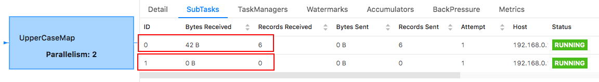
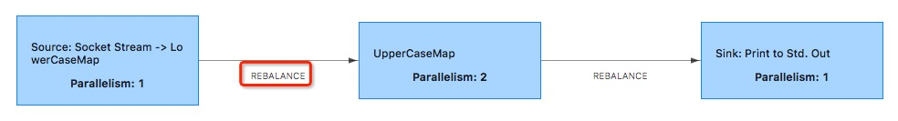
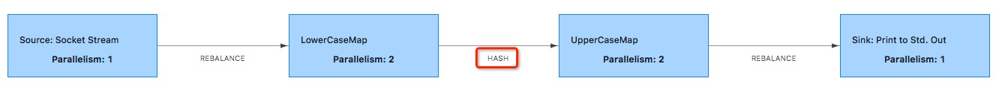

任务之间的数据交换策略决定了数据会分发到下游算子的哪个实例上，在 Flink 中有八种不同的策略，也称为分区器：
- GlobalPartitioner
- ForwardPartitioner
- BroadcastPartitioner
- ShufflePartitioner
- RebalancePartitioner
- RescalePartitioner
- KeyGroupStreamPartitioner
- CustomPartitionerWrapper


我们可以看到所有的 Partitioner 都继承了 StreamPartitioner 类。StreamPartitioner 继承自 ChannelSelector 接口。这里的 Channel 概念与 Netty 不同，只是 Flink 对于数据写入实例的简单抽象，我们可以直接认为它就是下游算子的并发实例（即物理分区）。所有 StreamPartitioner 的子类都要实现 selectChannel() 方法，用来选择发送到哪个实例。下面我们分别看看 Flink 提供的 8 种 Partitioner。

### 1. GlobalPartitioner

#### 1.1 作用

GlobalPartitioner 分区器会将上游所有元素都发送到下游的第一个算子实例上(SubTask Id = 0)：


#### 1.2 源码

我们可以看到 selectChannel 方法中始终返回 0，表示只发送给下游算子 SubTask Id = 0 的子任务上。
```java
@Internal
public class GlobalPartitioner<T> extends StreamPartitioner<T> {
    private static final long serialVersionUID = 1L;
    @Override
    public int selectChannel(SerializationDelegate<StreamRecord<T>> record) {
        // 返回0表示只发送给下游算子SubTask Id=0的子任务上
        return 0;
    }

    @Override
    public StreamPartitioner<T> copy() {
        return this;
    }

    @Override
    public SubtaskStateMapper getDownstreamSubtaskStateMapper() {
        return SubtaskStateMapper.FIRST;
    }

    @Override
    public String toString() {
        return "GLOBAL";
    }
}
```

#### 1.3 如何使用

如下所示，调用 global() 方法即可：
```java
DataStream<String> result = env.socketTextStream("localhost", 9100, "\n")
    .map(str -> str.toLowerCase()).name("LowerCaseMap").setParallelism(2)
    .global()
    .map(str -> str.toUpperCase()).name("UpperCaseMap").setParallelism(2);
```
> 完成代码请查阅:[GlobalPartitionerExample](https://github.com/sjf0115/data-example/blob/master/flink-example/src/main/java/com/flink/example/stream/partitioner/GlobalPartitionerExample.java)

我们可以看到 LowerCaseMap 和 UpperCaseMap 算子之间的 GLOBAL 标示，表示我们使用的 GlobalPartitioner：


如下所示，LowerCaseMap 算子两个子任务分别接受到3个元素，经过处理之后均发送到 UpperCaseMap 算子的第一个子任务上：




### 2. ForwardPartitioner

#### 2.1 作用

仅将元素转发到本地运行的下游算子第一个实例：


与 GlobalPartitioner 实现相同，但它只会将数据输出到本地运行的下游算子的第一个实例，而非全局。

#### 2.2 源码

```java
@Internal
public class ForwardPartitioner<T> extends StreamPartitioner<T> {
	private static final long serialVersionUID = 1L;

	@Override
	public int selectChannel(SerializationDelegate<StreamRecord<T>> record) {
		return 0;
	}

	public StreamPartitioner<T> copy() {
		return this;
	}

	@Override
	public String toString() {
		return "FORWARD";
	}

	@Override
	public SubtaskStateMapper getDownstreamSubtaskStateMapper() {
		return SubtaskStateMapper.ROUND_ROBIN;
	}
}
```

#### 2.3 如何使用

如下所示，调用 forward() 方法即可：
```java
// ForwardPartitioner
DataStream<String> result = env.socketTextStream("localhost", 9100, "\n")
        .map(str -> str.toLowerCase()).name("LowerCaseMap").setParallelism(3)
        .forward()
        .map(str -> str.toUpperCase()).name("UpperCaseMap").setParallelism(3).disableChaining();
```
> 完成代码请查阅:[ForwardPartitionerExample](https://github.com/sjf0115/data-example/blob/master/flink-example/src/main/java/com/flink/example/stream/partitioner/ForwardPartitionerExample.java)

我们可以看到 LowerCaseMap 和 UpperCaseMap 算子之间的 FORWARD 标示，表示我们使用的 ForwardPartitioner：


> 在代码中特意使用了 disableChaining() 方法，目的是不让 LowerCaseMap 和 UpperCaseMap 算子 Chain 一起，更好的观察两个算子之间的分区方式。

在没有指定 Partitioner 时，如果上下游算子的并行度相同，默认就会采用 ForwardPartitioner，否则会采用下面要讲解的的 RebalancePartitioner：
```java
// If no partitioner was specified and the parallelism of upstream and downstream
// operator matches use forward partitioning, use rebalance otherwise.
if (partitioner == null
        && upstreamNode.getParallelism() == downstreamNode.getParallelism()) {
    partitioner = new ForwardPartitioner<Object>();
} else if (partitioner == null) {
    partitioner = new RebalancePartitioner<Object>();
}
```
需要注意的是在使用 ForwardPartitioner 时，必须保证上下游算子的并行度一致，否则就会抛出如下异常：
```java
if (partitioner instanceof ForwardPartitioner) {
    if (upstreamNode.getParallelism() != downstreamNode.getParallelism()) {
        throw new UnsupportedOperationException(
                "Forward partitioning does not allow "
                        + "change of parallelism. Upstream operation: "
                        + upstreamNode
                        + " parallelism: "
                        + upstreamNode.getParallelism()
                        + ", downstream operation: "
                        + downstreamNode
                        + " parallelism: "
                        + downstreamNode.getParallelism()
                        + " You must use another partitioning strategy, such as broadcast, rebalance, shuffle or global.");
    }
}
```

### 3. BroadcastPartitioner

#### 3.1 作用

上游算子实例广播发送到下游所有的算子实例上：


#### 3.2 源码

BroadcastPartitioner 策略是直接发送到下游的所有 Task 上，所以不需要通过下面的 selectChannel 方法选择发送的通道：
```java
@Internal
public class BroadcastPartitioner<T> extends StreamPartitioner<T> {
	private static final long serialVersionUID = 1L;

	/**
	 * Note: Broadcast mode could be handled directly for all the output channels
	 * in record writer, so it is no need to select channels via this method.
	 */
	@Override
	public int selectChannel(SerializationDelegate<StreamRecord<T>> record) {
		throw new UnsupportedOperationException("Broadcast partitioner does not support select channels.");
	}

	@Override
	public SubtaskStateMapper getUpstreamSubtaskStateMapper() {
		return SubtaskStateMapper.DISCARD_EXTRA_STATE;
	}

	@Override
	public SubtaskStateMapper getDownstreamSubtaskStateMapper() {
		return SubtaskStateMapper.ROUND_ROBIN;
	}

	@Override
	public boolean isBroadcast() {
		return true;
	}

	@Override
	public StreamPartitioner<T> copy() {
		return this;
	}

	@Override
	public String toString() {
		return "BROADCAST";
	}
}
```

#### 3.3 如何使用

如下所示，调用 broadcast() 方法即可：
```java
DataStream<String> result = env.socketTextStream("localhost", 9100, "\n")
  .map(str -> str.toLowerCase()).name("LowerCaseMap").setParallelism(2)
  .broadcast()
  .map(str -> str.toUpperCase()).name("UpperCaseMap").setParallelism(2);
```
> 完成代码请查阅:[BroadcastPartitionerExample](https://github.com/sjf0115/data-example/blob/master/flink-example/src/main/java/com/flink/example/stream/partitioner/BroadcastPartitionerExample.java)

我们可以看到 LowerCaseMap 和 UpperCaseMap 算子之间的 BROADCAST 标示，表示我们使用的 BroadcastPartitioner：


### 4. ShufflePartitioner

#### 4.1 作用

上游算子实例每次都随机选择一个下游算子实例进行发送：


#### 4.2 源码

ShufflePartitioner 使用 java.util.Random 随机函数将数据随机输出到下游算子的一个实例。由于 Random 生成的随机数符合均匀分布，所以可以认为是输出均匀分布：
```java
@Internal
public class ShufflePartitioner<T> extends StreamPartitioner<T> {
	private static final long serialVersionUID = 1L;

	private Random random = new Random();

	@Override
	public int selectChannel(SerializationDelegate<StreamRecord<T>> record) {
		return random.nextInt(numberOfChannels);
	}

	@Override
	public SubtaskStateMapper getDownstreamSubtaskStateMapper() {
		return SubtaskStateMapper.ROUND_ROBIN;
	}

	@Override
	public StreamPartitioner<T> copy() {
		return new ShufflePartitioner<T>();
	}

	@Override
	public String toString() {
		return "SHUFFLE";
	}
}
```

#### 4.3 如何使用

如下所示，调用 shuffle() 方法即可：
```java
DataStream<String> result = env.socketTextStream("localhost", 9100, "\n")
  .map(str -> str.toLowerCase()).name("LowerCaseMap").setParallelism(2)
  .shuffle()
  .map(str -> str.toUpperCase()).name("UpperCaseMap").setParallelism(2);
```
> 完成代码请查阅:[ShufflePartitionerExample](https://github.com/sjf0115/data-example/blob/master/flink-example/src/main/java/com/flink/example/stream/partitioner/ShufflePartitionerExample.java)

我们可以看到 LowerCaseMap 和 UpperCaseMap 算子之间的 SHUFFLE 标示，表示我们使用的 ShufflePartitioner：


### 5. RebalancePartitioner

#### 5.1 作用

RebalancePartitioner 会先利用 ThreadLocalRandom.current().nextInt 随机数函数生成一个随机数，以选择第一个要发送的下游算子实例。然后以轮询（round-robin）的方式从该实例开始循环输出。该方式能保证下游的负载均衡，所以常用来处理有倾斜的数据流：


#### 5.2 源码

在 setup 方法中初始化第一个发送的 channel id，返回 [0,numberOfChannels) 一个随机数。确定第一个要发送的下游算子实例之后，循环依次发送到下游的 Task，比如：nextChannelToSendTo 初始值为0，numberOfChannels(下游算子的实例个数，并行度)值为 2，那么第一次发送到 ID = 1 的 Task，第二次发送到 ID = 0 的 Task，第三次发送到 ID = 1 的 Task上，依次类推：
```java
@Internal
public class RebalancePartitioner<T> extends StreamPartitioner<T> {
	private static final long serialVersionUID = 1L;

	private int nextChannelToSendTo;

	@Override
	public void setup(int numberOfChannels) {
		super.setup(numberOfChannels);

		nextChannelToSendTo = ThreadLocalRandom.current().nextInt(numberOfChannels);
	}

	@Override
	public int selectChannel(SerializationDelegate<StreamRecord<T>> record) {
		nextChannelToSendTo = (nextChannelToSendTo + 1) % numberOfChannels;
		return nextChannelToSendTo;
	}

	@Override
	public SubtaskStateMapper getDownstreamSubtaskStateMapper() {
		return SubtaskStateMapper.ROUND_ROBIN;
	}

	public StreamPartitioner<T> copy() {
		return this;
	}

	@Override
	public String toString() {
		return "REBALANCE";
	}
}
```
#### 5.3 如何使用

如下所示，调用 rebalance() 方法即可：
```java
DataStream<String> result = env.socketTextStream("localhost", 9100, "\n")
    .map(str -> str.toLowerCase()).name("LowerCaseMap").setParallelism(1)
    .rebalance()
    .map(str -> str.toUpperCase()).name("UpperCaseMap").setParallelism(2);
```
> 完成代码请查阅:[RebalancePartitionerExample](https://github.com/sjf0115/data-example/blob/master/flink-example/src/main/java/com/flink/example/stream/partitioner/RebalancePartitionerExample.java)

我们可以看到 LowerCaseMap 和 UpperCaseMap 算子之间的 REBALANCE 标示，表示我们使用的 RebalancePartitioner：



### 6. RescalePartitioner

#### 6.1 作用

基于上下游算子的并行度，将元素循环的分配到下游算子的某几个实例上。如果想使上游算子的每个并行实例均匀分散到下游算子的某几个实例来达到负载均衡，但又不希望使用 rebalance 这种方式达到整体的负载均衡，那么 Rescale 这种方式很有用。这种方式仅需要本地数据传输，不需要通过网络传输数据，具体取决于我们的配置，例如，TaskManager的 Slot 数。

上游算子实例具体发送到哪几个下游算子实例，取决于上游算子和下游算子两者的并行度。例如，如果上游算子并行度为 2，而下游算子并行度为 4，那么其中一个上游算子实例将元素发送到其中两个下游算子实例，而另一个上游算子实例则发送到另外两个下游算子实例。相反，如果下游算子并行度为 2，而上游算子并行度为 4，那么两个上游算子实例将发送到其中一个下游算子实例，而其他两个上游算子则发送到另一个下游算子实例：


RebalancePartitioner 和 RescalePartitioner 有什么不同呢？我们还是以上游算子并行度为 2，而下游算子并行度为 4 为例，当使用 RebalancePartitioner时，上游每个实例会轮询发给下游的 4 个实例。但是当使用 RescalePartitioner 时，上游每个实例只需轮询发给下游 2 个实例。因为 Channel 个数变少了，Subpartition 的 Buffer 填充速度能变快，能提高网络效率。当上游的数据比较均匀时，且上下游的并发数成比例时，可以使用 RescalePartitioner 替换 RebalancePartitioner。

#### 6.2 源码

初始化 channel 为 -1，循环依次发送到下游的 SubTask：
```java
@Internal
public class RescalePartitioner<T> extends StreamPartitioner<T> {
	private static final long serialVersionUID = 1L;

	private int nextChannelToSendTo = -1;

	@Override
	public int selectChannel(SerializationDelegate<StreamRecord<T>> record) {
		if (++nextChannelToSendTo >= numberOfChannels) {
			nextChannelToSendTo = 0;
		}
		return nextChannelToSendTo;
	}

	@Override
	public SubtaskStateMapper getDownstreamSubtaskStateMapper() {
		return SubtaskStateMapper.ROUND_ROBIN;
	}

	public StreamPartitioner<T> copy() {
		return this;
	}

	@Override
	public String toString() {
		return "RESCALE";
	}
}
```

#### 6.3 如何使用

如下所示，调用 rescale() 方法即可：
```java
DataStream<String> result = env.socketTextStream("localhost", 9100, "\n")
  .map(str -> str.toLowerCase()).name("LowerCaseMap").setParallelism(1)
  .rescale()
  .map(str -> str.toUpperCase()).name("UpperCaseMap").setParallelism(2);
```
> 完成代码请查阅:[RescalePartitionerExample](https://github.com/sjf0115/data-example/blob/master/flink-example/src/main/java/com/flink/example/stream/partitioner/RescalePartitionerExample.java)

我们可以看到 LowerCaseMap 和 UpperCaseMap 算子之间的 RESCALE 标示，表示我们使用的 RescalePartitioner：


### 7. KeyGroupStreamPartitioner

#### 7.1 作用

使用 keyBy 函数指定分组 key，将具有相同 key 的元素发送到相同的下游算子实例上：


#### 7.2 源码

具体输出到下游算子哪个实例上，取决于 KeyGroupRangeAssignment.assignKeyToParallelOperator 方法：
```java
@Internal
public class KeyGroupStreamPartitioner<T, K> extends StreamPartitioner<T> implements ConfigurableStreamPartitioner {
	private static final long serialVersionUID = 1L;

	private final KeySelector<T, K> keySelector;

	private int maxParallelism;

	public KeyGroupStreamPartitioner(KeySelector<T, K> keySelector, int maxParallelism) {
		Preconditions.checkArgument(maxParallelism > 0, "Number of key-groups must be > 0!");
		this.keySelector = Preconditions.checkNotNull(keySelector);
		this.maxParallelism = maxParallelism;
	}

	public int getMaxParallelism() {
		return maxParallelism;
	}

	@Override
	public int selectChannel(SerializationDelegate<StreamRecord<T>> record) {
		K key;
		try {
			key = keySelector.getKey(record.getInstance().getValue());
		} catch (Exception e) {
			throw new RuntimeException("Could not extract key from " + record.getInstance().getValue(), e);
		}
		return KeyGroupRangeAssignment.assignKeyToParallelOperator(key, maxParallelism, numberOfChannels);
	}

	@Override
	public SubtaskStateMapper getDownstreamSubtaskStateMapper() {
		return SubtaskStateMapper.RANGE;
	}

	@Override
	public StreamPartitioner<T> copy() {
		return this;
	}

	@Override
	public String toString() {
		return "HASH";
	}

	@Override
	public void configure(int maxParallelism) {
		KeyGroupRangeAssignment.checkParallelismPreconditions(maxParallelism);
		this.maxParallelism = maxParallelism;
	}

	@Override
	public boolean equals(Object o) {
		if (this == o) {
			return true;
		}
		if (o == null || getClass() != o.getClass()) {
			return false;
		}
		if (!super.equals(o)) {
			return false;
		}
		final KeyGroupStreamPartitioner<?, ?> that = (KeyGroupStreamPartitioner<?, ?>) o;
		return maxParallelism == that.maxParallelism &&
			keySelector.equals(that.keySelector);
	}

	@Override
	public int hashCode() {
		return Objects.hash(super.hashCode(), keySelector, maxParallelism);
	}
}
```
我们具体看看如何根据输入的 Key 判断输出到哪个算子实例上：
```java
public static int assignKeyToParallelOperator(Object key, int maxParallelism, int parallelism) {
	Preconditions.checkNotNull(key, "Assigned key must not be null!");
	return computeOperatorIndexForKeyGroup(maxParallelism, parallelism, assignToKeyGroup(key, maxParallelism));
}

public static int assignToKeyGroup(Object key, int maxParallelism) {
	Preconditions.checkNotNull(key, "Assigned key must not be null!");
	return computeKeyGroupForKeyHash(key.hashCode(), maxParallelism);
}

public static int computeKeyGroupForKeyHash(int keyHash, int maxParallelism) {
	return MathUtils.murmurHash(keyHash) % maxParallelism;
}

public static int computeOperatorIndexForKeyGroup(int maxParallelism, int parallelism, int keyGroupId) {
	return keyGroupId * parallelism / maxParallelism;
}
```
通过上面代码，我们知道需要在 key 上进行两重哈希得到 key 对应的哈希值，第一重是 Java 自带的 hashCode()，第二重则是 MurmurHash。然后将哈希值对 最大并行度 取模，在乘以算子并行度，并除以最大并行度，得到最终的算子实例Id：
```java
SubTaskId = (MathUtils.murmurHash(key.hashCode()) % maxParallelism) * parallelism / maxParallelism
```

#### 7.3 如何使用

如下所示，调用 keyBy 方法指定分区 Key 即可：
```java
DataStream<String> result = env.socketTextStream("localhost", 9100, "\n")
  .map(str -> str.toLowerCase()).name("LowerCaseMap").setParallelism(2)
  .keyBy(str -> str)
  .map(str -> str.toUpperCase()).name("UpperCaseMap").setParallelism(2);
```
> 完成代码请查阅:[KeyGroupStreamPartitionerExample](https://github.com/sjf0115/data-example/blob/master/flink-example/src/main/java/com/flink/example/stream/partitioner/KeyGroupStreamPartitionerExample.java)

我们可以看到 LowerCaseMap 和 UpperCaseMap 算子之间的 HASH 标示，表示我们使用的 KeyGroupStreamPartitioner：



### 8. CustomPartitionerWrapper

#### 8.1 作用

自定义实现元素要发送到相对应的下游算子实例上。

#### 8.2 源码

在 CustomPartitionerWrapper 构造器中传入我们自定义的 Partitioner 和 KeySelector 方法。通过自定义的 Partitioner 的 partition 方法选择要发送的实例：
```java
public class CustomPartitionerWrapper<K, T> extends StreamPartitioner<T> {
	private static final long serialVersionUID = 1L;

	Partitioner<K> partitioner;
	KeySelector<T, K> keySelector;

	public CustomPartitionerWrapper(Partitioner<K> partitioner, KeySelector<T, K> keySelector) {
		this.partitioner = partitioner;
		this.keySelector = keySelector;
	}

	@Override
	public int selectChannel(SerializationDelegate<StreamRecord<T>> record) {
		K key;
		try {
			key = keySelector.getKey(record.getInstance().getValue());
		} catch (Exception e) {
			throw new RuntimeException("Could not extract key from " + record.getInstance(), e);
		}

		return partitioner.partition(key, numberOfChannels);
	}

	@Override
	public SubtaskStateMapper getDownstreamSubtaskStateMapper() {
		// fully rely on filtering downstream
		// note that custom partitioners are not officially supported - the user has to force rescaling
		// in that case, we assume that the custom partitioner is deterministic
		return SubtaskStateMapper.FULL;
	}

	@Override
	public StreamPartitioner<T> copy() {
		return this;
	}

	@Override
	public String toString() {
		return "CUSTOM";
	}
}
```

#### 8.3 如何使用

如下所示，调用 partitionCustom 方法指定我们自定义的 MyCustomPartitioner 即可：
```java
DataStream<String> result = env.socketTextStream("localhost", 9100, "\n")
    .map(str -> str.toLowerCase()).name("LowerCaseMap").setParallelism(3)
    .partitionCustom(new MyCustomPartitioner(), new KeySelector<String, String>() {
        @Override
        public String getKey(String value) throws Exception {
            return value;
        }
    })
    .map(str -> str.toUpperCase()).name("UpperCaseMap").setParallelism(3);

private static class MyCustomPartitioner implements Partitioner<String> {
    @Override
    public int partition(String key, int numPartitions) {
        // 全部大写分发到 0 实例
        if (StringUtils.isAllUpperCase(key)) {
            return 0;
        }
        // 其他分发到 1 实例
        return 1;
    }
}
```
> 完成代码请查阅:[CustomPartitionerExample](https://github.com/sjf0115/data-example/blob/master/flink-example/src/main/java/com/flink/example/stream/partitioner/CustomPartitionerExample.java)

通过 Partitioner 接口的 partition 方法，可以实现自定义的将数据输出到下游指定实例中。我们可以看到 LowerCaseMap 和 UpperCaseMap 算子之间的 CUSTOM 标示，表示我们使用的 CustomPartitionerWrapper：


欢迎关注我的公众号和博客：


推荐订阅：

