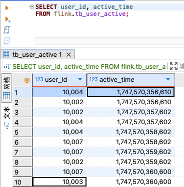

在实时计算场景中，将处理结果写入关系型数据库是常见需求。本文基于 Flink 1.13.5 版本，详细介绍如何使用 JDBC Connector 将 DataStream 数据实时写入 ClickHouse 数据库，剖析 JdbcSink 工具类的各个组件帮助开发者全面掌握 JDBC 数据写入的核心机制，最后提供最佳实践。

> JDBC Connector 连接器提供一个 Sink 接收器来将数据写入 JDBC 数据库。在这使用 JDBC Connector 连接器实现将数据写入 ClickHouse 数据库。

## 1. 依赖

要使用 JDBC Connector 连接器，需要将如下依赖项添加到项目中：
```xml
<dependency>
    <groupId>org.apache.flink</groupId>
    <artifactId>flink-connector-jdbc_2.11</artifactId>
    <version>1.13.5</version>
</dependency>
```
除此之外还需要添加 ClickHouse 的 JDBC 驱动程序：
```xml
<dependency>
  <groupId>com.clickhouse</groupId>
  <artifactId>clickhouse-jdbc</artifactId>
  <version>0.7.2</version>
</dependency>
```
如果不添加上述 ClickHouse 驱动程序会抛出如下异常信息：
```java
Caused by: java.io.IOException: unable to open JDBC writer
	at org.apache.flink.connector.jdbc.internal.AbstractJdbcOutputFormat.open(AbstractJdbcOutputFormat.java:56)
	at org.apache.flink.connector.jdbc.internal.JdbcBatchingOutputFormat.open(JdbcBatchingOutputFormat.java:115)
	at org.apache.flink.connector.jdbc.internal.GenericJdbcSinkFunction.open(GenericJdbcSinkFunction.java:49)
	at org.apache.flink.api.common.functions.util.FunctionUtils.openFunction(FunctionUtils.java:34)
	at org.apache.flink.streaming.api.operators.AbstractUdfStreamOperator.open(AbstractUdfStreamOperator.java:102)
	at org.apache.flink.streaming.api.operators.StreamSink.open(StreamSink.java:46)
	at org.apache.flink.streaming.runtime.tasks.OperatorChain.initializeStateAndOpenOperators(OperatorChain.java:442)
	at org.apache.flink.streaming.runtime.tasks.StreamTask.restoreGates(StreamTask.java:585)
	at org.apache.flink.streaming.runtime.tasks.StreamTaskActionExecutor$SynchronizedStreamTaskActionExecutor.call(StreamTaskActionExecutor.java:100)
	at org.apache.flink.streaming.runtime.tasks.StreamTask.executeRestore(StreamTask.java:565)
	at org.apache.flink.streaming.runtime.tasks.StreamTask.runWithCleanUpOnFail(StreamTask.java:650)
	at org.apache.flink.streaming.runtime.tasks.StreamTask.restore(StreamTask.java:540)
	at org.apache.flink.runtime.taskmanager.Task.doRun(Task.java:759)
	at org.apache.flink.runtime.taskmanager.Task.run(Task.java:566)
	at java.lang.Thread.run(Thread.java:748)
Caused by: java.lang.ClassNotFoundException: com.clickhouse.jdbc.ClickHouseDriver
	at java.net.URLClassLoader.findClass(URLClassLoader.java:381)
	at java.lang.ClassLoader.loadClass(ClassLoader.java:424)
	at org.apache.flink.util.FlinkUserCodeClassLoader.loadClassWithoutExceptionHandling(FlinkUserCodeClassLoader.java:64)
	at org.apache.flink.util.ChildFirstClassLoader.loadClassWithoutExceptionHandling(ChildFirstClassLoader.java:74)
	at org.apache.flink.util.FlinkUserCodeClassLoader.loadClass(FlinkUserCodeClassLoader.java:48)
	at java.lang.ClassLoader.loadClass(ClassLoader.java:357)
	at org.apache.flink.runtime.execution.librarycache.FlinkUserCodeClassLoaders$SafetyNetWrapperClassLoader.loadClass(FlinkUserCodeClassLoaders.java:172)
	at java.lang.Class.forName0(Native Method)
	at java.lang.Class.forName(Class.java:348)
	at org.apache.flink.connector.jdbc.internal.connection.SimpleJdbcConnectionProvider.loadDriver(SimpleJdbcConnectionProvider.java:90)
	at org.apache.flink.connector.jdbc.internal.connection.SimpleJdbcConnectionProvider.getLoadedDriver(SimpleJdbcConnectionProvider.java:100)
	at org.apache.flink.connector.jdbc.internal.connection.SimpleJdbcConnectionProvider.getOrEstablishConnection(SimpleJdbcConnectionProvider.java:117)
	at org.apache.flink.connector.jdbc.internal.AbstractJdbcOutputFormat.open(AbstractJdbcOutputFormat.java:54)
	... 14 more
```

## 2. 创建 ClickHouse 表

在这为了演示，创建一个 `tb_user_active` 表用来存储 Flink 实时写入到 ClickHouse 的用户活跃数据，记录每个用户的最后活跃时间：
```sql
CREATE TABLE tb_user_active (
    `user_id` UInt64,
    `active_time` UInt64
)
ENGINE = MergeTree
ORDER BY active_time;
```

## 3. 剖析 JdbcSink 核心组件

可以通过如下语句创建一个 JDBC Sink：
```java
JdbcSink.sink(
    dmlSQL,                            // 必填
    statementBuilder,                  // 必填   	
    executionOptions,                  // 可选
    connectionOptions                  // 必填
);
```
JdbcSink 核心组件包括4部分:
- dmlSQL：SQL DML 语句参数是必填的，定义了写入数据库的 SQL 语句结构。
- statementBuilder: JDBC 语句构建器是可选的，定义了如何将流数据对象转换为 PreparedStatement 参数。
- executionOptions: JDBC 执行控制参数是可选的，定义了如何批量写入数据库，例如攒够多少条记录或者等待多长时间之后触发批次的写入。
- connectionOptions: JDBC 数据库连接参数，定义了如何连接到数据库。

### 3.1 SQL DML 语句

JdbcSink 的第一个参数便是如何将数据写入 MySQL 的 DML 语句，定义了写入数据库的 SQL 语句结构，支持预编译占位符（?），如下所示：
```sql
insert into tb_user_active (user_id, active_time) values (?, ?)
```
需要注意的是 JDBC Sink 只提供了 `At-Least-Once` 语义保证。但是，可以通过编写 upsert SQL 语句或幂等 SQL 更新，可以有效地实现 `Exactly-Once`。后面会详细介绍如何实现 upsert 写入。

### 3.2 JDBC 语句构建器

第二步是使用 JdbcStatementBuilder 来构造 JDBC Statement 构建器，将流数据对象转换为 PreparedStatement 参数(处理 Java 与 SQL 的类型转换)，如下所示用用户ID以及活跃时间来更新 statement：
```java
JdbcStatementBuilder<SimpleUserBehavior> statementBuilder = new JdbcStatementBuilder<SimpleUserBehavior>() {
    @Override
    public void accept(PreparedStatement statement, SimpleUserBehavior behavior) throws SQLException {
        Long userId = behavior.getUserId();
        Long timestamp = behavior.getTimestamp();
        statement.setLong(1, userId);
        statement.setLong(2, timestamp);
    }
};
```
你也可以选择 Lambda 表达式的方式来创建 JdbcStatementBuilder：
```java
JdbcStatementBuilder<SimpleUserBehavior> statementBuilder = (statement, behavior) -> {
    statement.setLong(1, behavior.getUserId());
    statement.setLong(2, behavior.getTimestamp());
};
```
> 需要注意的是按 SQL 占位符顺序设置参数。

### 3.3 JDBC 执行控制参数

第一步配置的 SQL DML 语句是分批次执行的，例如攒够多少条记录或者等待多长时间之后触发批次的写入。可以选择使用如下示例进行配置：
```java
JdbcExecutionOptions executionOptions = JdbcExecutionOptions.builder()
    .withBatchSize(5000) // 根据数据库承受能力调整
    .withBatchIntervalMs(1000) // 不超过checkpoint间隔
    .withMaxRetries(5) // 网络不稳定时增加重试
    .build();
```
JdbcExecutionOptions 构建器支持三个核心参数：
- batchSize：批次大小，即缓存多少条记录之后才会触发写出操作，默认值是 5000；即需要攒够 5000 条记录才会触发写出动作；通过 `withBathSize` 方法设置自定义的批次大小。
- batchIntervalMs：批次间隔时间，即缓存多久之后才会触发写出操作；默认值为 0，即没有时间限制，一直等到 buffer 满了或者作业结束才能触发写出动作；可以通过 `withBatchIntervalMs` 方法设置自定义的批次间隔。
- maxRetries：最大失败重试次数，默认值为 3；可以通过 `withMaxRetries` 方法来设置。

需要注意的是 SQL DML 语句什么时候执行，取决于如下条件。只要满足以下条件之一，JDBC 批次处理就会执行：
- 批次间隔时间到达配置的间隔时间
- 批次大小到达配置的记录条数
- Flink Checkpoint 启动

### 3.4 JDBC 连接参数

使用 JdbcConnectionOptions 配置数据库的连接：
```java
JdbcConnectionOptions connectionOptions = new JdbcConnectionOptions
    .JdbcConnectionOptionsBuilder()
    .withUrl("jdbc:clickhouse://localhost:8123/flink")
    .withDriverName("com.clickhouse.jdbc.ClickHouseDriver")
    .withUsername("default")
    .withConnectionCheckTimeoutSeconds(60) // 连接检查超时
    .build();
```
JdbcConnectionOptions 连接参数构建器支持如下 5 个核心参数：
- url：JDBC 连接URL，通过 `withUrl` 方法配置；
- driverName：驱动程序，通过 `withDriverName` 方法配置；在这为 MySQL 选择的是 `com.clickhouse.jdbc.ClickHouseDriver`；
- username：用户名，通过 `withUsername` 方法配置；
- password：密码，通过 `withPassword` 方法配置；
- connectionCheckTimeoutSeconds：设置重试之间的最大超时时间，默认为60秒。通过 `withConnectionCheckTimeoutSeconds` 方法配置；

## 4. 实战

在这我们通过 JdbcSink 将用户活跃行为实时写入到 ClickHouse 来记录用户的每一次活跃行为:
```java
final StreamExecutionEnvironment env = StreamExecutionEnvironment.getExecutionEnvironment();

// 随机生成
RandomGenerator<SimpleUserBehavior> randomGenerator = new RandomGenerator<SimpleUserBehavior>() {
    @Override
    public SimpleUserBehavior next() {
        return new SimpleUserBehavior(
                random.nextLong(10001, 10007),
                System.currentTimeMillis()
        );
    }
};
DataGeneratorSource<SimpleUserBehavior> generatorSource = new DataGeneratorSource<>(randomGenerator, 1L, 10L);
DataStream<SimpleUserBehavior> source = env.addSource(generatorSource, "DataGeneratorSource")
        .returns(Types.POJO(SimpleUserBehavior.class)).setParallelism(2);

// 输出到控制台
source.map(behavior -> behavior.getUserId() + "," + behavior.getTimestamp()).print().setParallelism(2);

// 1. SQL 语句
String dmlSQL = "insert into tb_user_active (user_id, active_time) values (?, ?)";

// 2. JDBC 执行参数构建器
JdbcStatementBuilder<SimpleUserBehavior> statementBuilder = new JdbcStatementBuilder<SimpleUserBehavior>() {
    @Override
    public void accept(PreparedStatement statement, SimpleUserBehavior behavior) throws SQLException {
        Long userId = behavior.getUserId();
        Long timestamp = behavior.getTimestamp();
        statement.setLong(1, userId);
        statement.setLong(2, timestamp);
    }
};

// 3. 执行控制参数
JdbcExecutionOptions executionOptions = JdbcExecutionOptions.builder()
        .withBatchSize(5)
        .withBatchIntervalMs(1000)
        .withMaxRetries(5)
        .build();

// 4. 连接配置
JdbcConnectionOptions connectionOptions = new JdbcConnectionOptions
        .JdbcConnectionOptionsBuilder()
        .withUrl("jdbc:clickhouse://localhost:8123/flink")
        .withDriverName("com.clickhouse.jdbc.ClickHouseDriver")
        .withUsername("default")
        .withConnectionCheckTimeoutSeconds(60) // 连接检查超时
        .build();

source.addSink(JdbcSink.sink(dmlSQL, statementBuilder, executionOptions, connectionOptions)).setParallelism(2);


env.execute("JdbcClickHouseExample");
```
运行上述程序你会看到如下类似的输出:
```
1> 10002,1747570356610
2> 10004,1747570356610
1> 10004,1747570357602
2> 10002,1747570357602
2> 10004,1747570358602
1> 10007,1747570358602
1> 10007,1747570359602
2> 10002,1747570359602
1> 10003,1747570360600
2> 10007,1747570360600
```
查看 ClickHouse 表中的数据如下所示:



> 完整代码[JdbcClickHouseExample](https://github.com/sjf0115/flink-example/blob/main/flink-example-1.13/src/main/java/com/flink/example/stream/sink/clickhouse/JdbcClickHouseExample.java)
