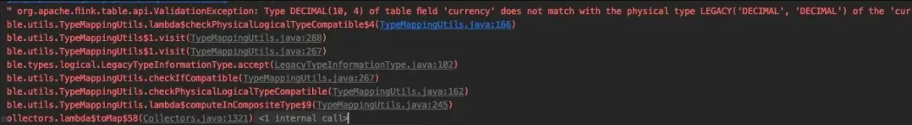
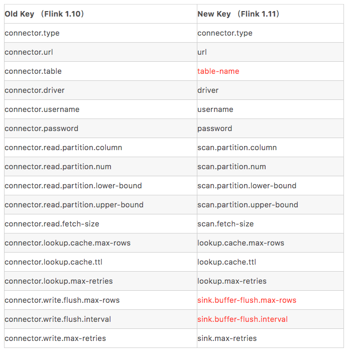
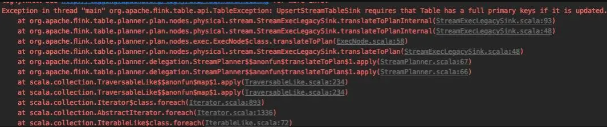
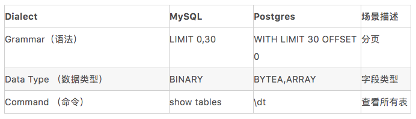
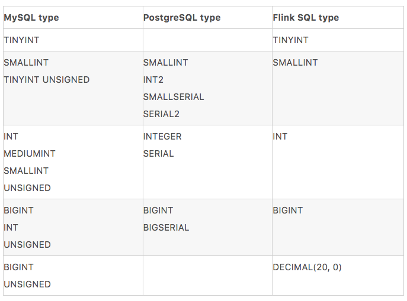

Flink 1.11 引入了 CDC，在此基础上， JDBC Connector 也发生比较大的变化，本文由 Apache Flink Contributor，阿里巴巴高级开发工程师徐榜江（雪尽）分享，主要介绍 Flink 1.11 JDBC Connector 的最佳实践。大纲如下：
- JDBC connector
- JDBC Catalog
- JDBC Dialect
- Demo

### 1. JDBC-Connector 的重构

JDBC Connector 在 Flink 1.11 版本发生了比较大的变化，我们先从以下几个 Feature 来具体了解一下 Flink 社区在这个版本上对 JDBC 所做的改进。

- [FLINK-15782 ：Rework JDBC Sinks](https://issues.apache.org/jira/browse/FLINK-15782) 重写 JDBC Sink

这个 issue 主要为 DataStream API 新增了 JdbcSink，对于使用 DataStream 编程的用户会更加方便地把数据写入到 JDBC；并且规范了一些命名规则，以前命名使用的是 JDBC 加上连接器名称，目前命名规范为 Jdbc+ 连接器名称

- [FLINK-17537：Refactor flink-jdbc connector structure](https://issues.apache.org/jira/browse/FLINK-17537) 重构 flink-jdbc 连接器的结构

这个 issue 将 flink-jdbc 包名重命名为 flink-connector-jdbc，与 Flink 的其他 connector 统一，将所有接口和类从 org.apache.flink.java.io.jdbc（旧包）规范为新包路径 org.apache.flink.connector.jdbc（新包），通过这种重命名用户在对底层源代码的阅读上面会更加容易的理解和统一。

- [FLIP-95: New TableSource and TableSink interfaces](https://cwiki.apache.org/confluence/display/FLINK/FLIP-95%3A+New+TableSource+and+TableSink+interfaces) 新的 TableSource 和 TableSink 接口

由于早期数据类型系统并不是很完善，导致了比较多的 Connector 在使用上会经常报数据类型相关的异常，例如 DECIMAL 精度类型，在以往的 Flink 1.10 版本中有可能出现下图问题：



基于 FLIP-95 新的 TableSource 和 TableSink 在精度支持方面做了重构，目前数据精度方面的支持已经很完善了。

- [FLIP-122：New Connector Property Keys for New Factory](https://cwiki.apache.org/confluence/display/FLINK/FLIP-122%3A+New+Connector+Property+Keys+for+New+Factory) 新的连接器参数

在 Flink 1.11 版本中，我们对 DDL 的 WITH 参数相对于 1.10 版本做了简化，从用户视角看上就是简化和规范了参数，如表格所示：



大家可以看到表格中有 3 个标红的地方，这个是相对于 1.10 有发生变化比较多的地方。这次 FLIP 希望进一步简化连接器属性，以便使属性更加简洁和可读，并更好地与 FLIP-107 协作。如果需要了解更多的 Connector 参数可以进一步参考官方文档和 FLIP-122 中提到的改变，这样有助于从旧版本迁移到新版本并了解参数的变化。

- [FLIP-87：Primary key Constraints in Table API](https://cwiki.apache.org/confluence/display/FLINK/FLIP+87%3A+Primary+key+constraints+in+Table+API) Table API 接口中的主键约束问题

Flink 1.10 存在某些 Query 无法推断出主键导致无法进行 Upsert 更新操作（如下图所示错误）。所以在 FLIP-87 中为 Flink SQL 引入的 Primary Key 约束。Flink 的主键约束遵循 SQL 标准，主键约束分为 PRIMARY KEY NOT ENFORCED 和 PRIMARY KEY ENFORCED， ENFORCED 表示是否对数据进行校验。我们常见数据库的主键约束属于 PRIMARY KEY ENFORCED，会对数据进行校验。因为 Flink 并不持有数据，因此 Flink 支持的主键模式是 PRIMARY KEY NOT ENFORCED,  这意味着 Flink 不会校验数据，而是由用户确保主键的完整性。例如 HBase 里面对应的主键应该是 RowKey，在 MySQL 中对应的主键是在用户数据库的表中对应的主键。



### 2. JDBC Catalog

目前 Flink 支持 Catalog 主要有 JDBC Catalog 和 Hive Catalog 。在关系数据库中的表，如果要在 Flink 中使用，用户需要手动写表的 DDL，一旦表的 Schema 发生改变，用户需要手动修改， 这是比较繁琐的事情。JDBC Catalog 提供了接口用于连接到各种关系型数据库，使得 Flink 能够自动检索表，不用用户手动输入和修改。目前 JDBC Catalog 内置目前实现了 Postgres Catalog。Postgres catalog 是一个 read-only （只读）的 Catalog，只支持读取 Postgres 表，支持的功能比较有限。下面代码展示了目前 Postgres catalog 支持的 6 个功能：数据库是否存在、数据库列表、获取数据库、根据数据库名获取表列表、获得表、表是否存在。
```
// The supported methods by Postgres Catalog.
PostgresCatalog.databaseExists(String databaseName)
PostgresCatalog.listDatabases()
PostgresCatalog.getDatabase(String databaseName)
PostgresCatalog.listTables(String databaseName)
PostgresCatalog.getTable(ObjectPath tablePath)
PostgresCatalog.tableExists(ObjectPath tablePath)
```
如果需要支持其他 DB (如 MySQL)，需要用户根据 FLIP-93 的 JdbcCatalog 接口实现对应不同的 JDBC Catalog。

### 3. JDBC Dialect

#### 3.1 什么是 Dialect？

Dialect (方言)对各个数据库来说，Dialect 体现各个数据库的特性，比如语法、数据类型等。如果需要查看详细的差异，可以点击这里[6]查看详细差异。下面通过对比 MySQL 和 Postgres 的一些常见场景举例：



在数据类型上面，Flink SQL 的数据类型目前映射规则如下：



Flink 目前支持三种 Dialect: Derby、MySQL、PostgreSQL，Derby 主要用于测试，更多的类型映射可以点击下方链接前往官方文档查看。

> https://ci.apache.org/projects/flink/flink-docs-release-1.11/zh/dev/table/connectors/jdbc.html#data-type-mapping

#### 3.2 如何保证 Dialect Upsert 的幂等性？

如果定义了主键，JDBC 写入时是能够保证 Upsert 语义的， 如果 DB 不支持 Upsert 语法，则会退化成 DELETE + INSERT 语义。Upsert query 是原子执行的，可以保证幂等性。这个在官方文档中也详细描述了更新失败或者存在故障时候如何做出的处理，下面的表格是不同的 DB 对应不同的 Upsert 语法：

| Database | Upsert Grammar |
| :------------- | :------------- |
| MySQL       | INSERT .. ON DUPLICATE KEY UPDATE ..       |
| PostgreSQL | INSERT .. ON CONFLICT .. DO UPDATE SET .. |

#### 3.3 如何自定义 Dialect？

目前如果要实现自定义 Dialect (比如 SQL Server、Oracle 等), 需要用户自己实现对应 Dialect 修改源码并重新打包 flink-connector-jdbc。社区正在讨论提供一种插件化 dialect 的机制, 让用户可以不用修改源码打包就能实现自定义 Dialect，这个机制需要把 Dialect 接口暴露给用户。目前的 Dialect 接口不够清晰，没有考虑 DataStream API 的使用场景，也没有考虑到 一些复杂的 SQL 场景，所以这个接口目前不太稳定(后续版本会修改) 。

社区目前之所以没有把这个 API 开放给用户，是从用户使用的体验角度考虑，希望把这种顶级 API 设计得尽量稳定、简洁后再开放出来给用户使用，避免用户在后续 Flink 版本的迭代中多次修改代码。目前社区已经有相应的计划去做了，大家可以留意 FLINK-16833[7] 提出的 JDBCDialect 插件化设计。

#### 3.4 实践 Demo

大家看完上述 Flink 1.11 在 JDBC 所做的改动后，大家可以尝试下面这个关于商品表 CDC 同步和 ETL 的小案例，有助于理解 JDBC Catalog 和 CDC 的同步机制。

环境与版本：Flink 1.11.1、Docker、Kafka 1.11.1、MySQL Driver 5.1.48、PostgreSQL Driver 42.2.14

流程如下：
- Flink standalone 环境准备并在提供的地址下载好对应的安装包和 connector jar。
- 测试数据准备，通过拉起容器运行已经打包好的镜像。其中 Kafka 中的 changelog 数据是通过 debezium connector 抓取的 MySQL orders 表 的 binlog。
- 通过 SQL Client 编写 SQL 作业，分别创建 Flink 订单表，维表，用户表，产品表，并创建 Function UDF。从 PG Catalog 获取结果表信息之后，把作业提交至集群执行运行。
- 测试 CDC 数据同步和维表 join，通过新增订单、修改订单、删除订单、维表数据更新等一系列操作验证 CDC 在 Flink 上如何运行以及写入结果表。

> https://github.com/leonardBang/flink-sql-etl

### 4. 总结

本文从 JDBC Connector 的重构、数据精度、主键约束、命名规范等方面详细介绍，分享了社区目前实现的 Postgres Catalog 功能点；介绍了 Flink 如何实现 JDBC Dialect 的统一以及目前社区对 Dialect 做的一些计划；最后的实践 Demo 环节演示了通过 SQL Client 进行维表 JOIN 和 ETL 操作以及解答了大家在实际生产中所遇到的问题，希望对大家进一步了解 Flink CDC 新功能有所帮助。

原文：[Flink JDBC Connector：Flink 与数据库集成最佳实践](https://mp.weixin.qq.com/s/guHl9hnNgD22sBseiGDZ2g)
